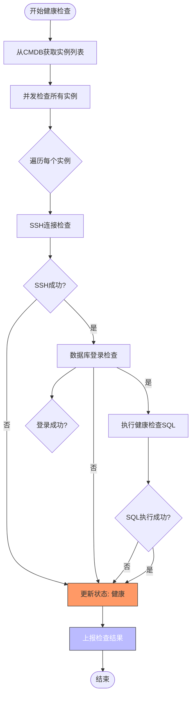
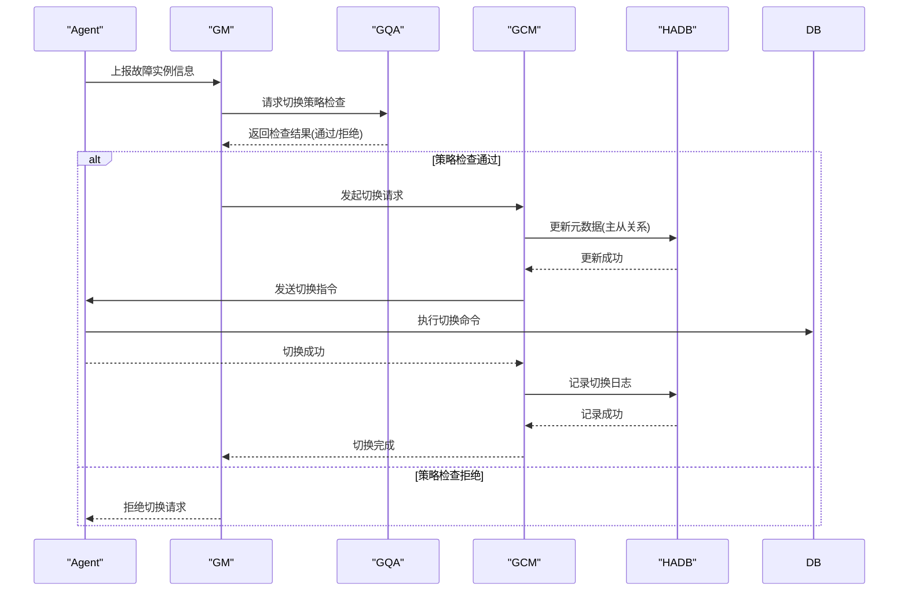
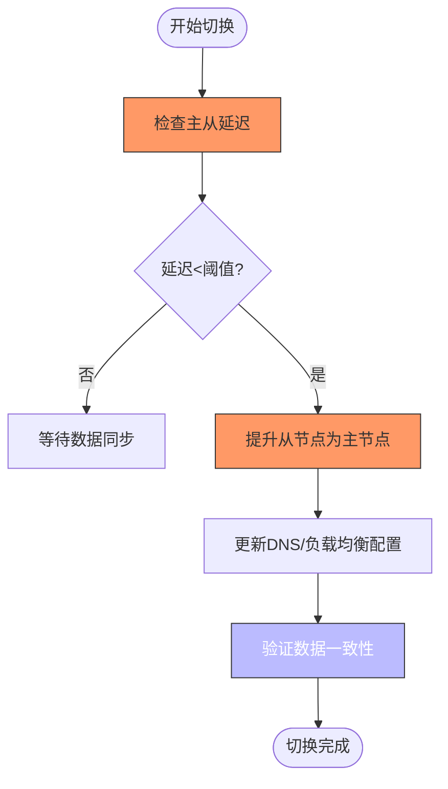

# 故障转移机制

<cite>
**本文档引用文件**   
- [dbha.go](file://dbm-services/common/dbha/ha-module/dbha.go)
- [monitor_agent.go](file://dbm-services/common/dbha/ha-module/agent/monitor_agent.go)
- [gm.go](file://dbm-services/common/dbha/ha-module/gm/gm.go)
- [config.go](file://dbm-services/common/dbha/ha-module/config/config.go)
- [connection.go](file://dbm-services/common/dbha/ha-module/agent/connection.go)
- [failover_drill_unit.py](file://dbm-ui/backend/db_periodic_task/local_tasks/redis_failover_drill/failover_drill_unit.py)
- [failover_drill_unit.py](file://dbm-ui/backend/db_periodic_task/local_tasks/mysql_failover_drill/failover_drill_unit.py)
- [global_msg.py](file://dbm-ui/backend/db_services/redis/autofix/global_msg.py)
- [watcher.py](file://dbm-ui/backend/db_services/redis/autofix/watcher.py)
</cite>

## 目录
1. [引言](#引言)
2. [架构概述](#架构概述)
3. [核心组件分析](#核心组件分析)
4. [健康检查与故障检测](#健康检查与故障检测)
5. [自动切换流程](#自动切换流程)
6. [脑裂预防机制](#脑裂预防机制)
7. [配置更新与广播](#配置更新与广播)
8. [服务降级策略](#服务降级策略)
9. [故障场景模拟](#故障场景模拟)
10. [性能优化](#性能优化)
11. [数据一致性保证](#数据一致性保证)

## 引言
故障转移机制是蓝鲸数据库管理系统（DBM）中的关键高可用性解决方案，旨在确保数据库服务在发生故障时能够快速、可靠地切换到备用节点，从而最大限度地减少服务中断时间。该机制通过DBHA（Database High Availability）组件实现，采用Go语言重构，解决了原有Perl版本存在的部署复杂、扩展性差等问题。DBHA支持多种数据库类型，包括MySQL、Redis等，并提供机器级别的切换能力。本文档将深入探讨DBHA的健康检查策略、故障检测算法、自动切换流程以及脑裂预防机制，结合代码示例说明心跳检测、超时判定、leader重新选举和配置更新广播的实现细节。

## 架构概述
DBHA系统采用分布式架构，主要由Agent和GM（Global Manager）两个核心组件构成，通过HADB服务进行元数据管理和状态同步。Agent部署在各个城市的数据中心，负责探测本地所有数据库实例的健康状态，并将探测结果上报给跨城的GM。GM作为决策中心，接收来自所有Agent的探测信息，进行汇总分析，并在检测到故障时执行切换决策。这种架构设计实现了组件自身的高可用性，支持动态扩缩容，能够适应大规模数据库环境的管理需求。

```mermaid
graph TD
subgraph "数据中心A"
A_Agent[Agent]
A_DB[(数据库实例)]
end
subgraph "数据中心B"
B_Agent[Agent]
B_DB[(数据库实例)]
end
subgraph "管理中心"
GM[GM]
HADB[(HADB服务)]
end
A_Agent --> |上报探测信息| GM
B_Agent --> |上报探测信息| GM
GM --> |执行切换指令| A_Agent
GM --> |执行切换指令| B_Agent
GM < --> |元数据同步| HADB
A_Agent < --> |健康检查| A_DB
B_Agent < --> |健康检查| B_DB
style A_Agent fill:#f9f,stroke:#333
style B_Agent fill:#f9f,stroke:#333
style GM fill:#bbf,stroke:#333,color:#fff
style HADB fill:#f96,stroke:#333
```

**图示来源**
- [dbha.go](file://dbm-services/common/dbha/ha-module/dbha.go#L74-L97)
- [monitor_agent.go](file://dbm-services/common/dbha/ha-module/agent/monitor_agent.go#L129-L134)
- [gm.go](file://dbm-services/common/dbha/ha-module/gm/gm.go#L73-L120)

## 核心组件分析
DBHA的核心组件包括Agent、GM及其内部的GDM、GMM、GQA和GCM模块。Agent作为探测代理，周期性地对配置的数据库实例进行健康检查，检查内容包括数据库连接、SQL执行、主从同步状态等。当检测到异常时，Agent会将故障信息上报给GM。GM则由多个功能模块组成：GDM（Global Detection Manager）负责接收和缓存来自Agent的探测信息；GMM（Global Maintenance Manager）负责对故障实例进行二次确认；GQA（Global Quality Assurance）负责执行切换频率限制和策略检查，防止因网络抖动等原因导致的频繁切换；GCM（Global Control Manager）负责最终的切换执行和配置更新。

**组件来源**
- [dbha.go](file://dbm-services/common/dbha/ha-module/dbha.go#L74-L97)
- [gm.go](file://dbm-services/common/dbha/ha-module/gm/gm.go#L50-L69)

## 健康检查与故障检测
健康检查与故障检测是故障转移机制的基础。Agent通过配置的探测周期（fetch_interval）从CMDB获取需要监控的数据库实例列表，并使用多线程并发地对这些实例进行健康检查。检查过程包括SSH连接验证、数据库登录验证、SQL语句执行等。Agent会根据检查结果更新实例状态，并将异常状态上报给GM。为了防止误报，GM的GMM模块会对上报的故障实例进行二次确认，只有在二次确认也失败的情况下，才会认为实例确实发生故障。此外，系统还支持屏蔽配置，可以临时忽略某些实例的探测，避免在维护期间产生误告警。



**图示来源**
- [monitor_agent.go](file://dbm-services/common/dbha/ha-module/agent/monitor_agent.go#L101-L125)
- [monitor_agent.go](file://dbm-services/common/dbha/ha-module/agent/monitor_agent.go#L152-L185)

## 自动切换流程
自动切换流程是故障转移机制的核心。当GM确认数据库实例发生故障后，会启动自动切换流程。首先，GQA模块会检查切换策略，包括单个IDC在一分钟内的切换阈值、所有主机的总切换次数限制等，以防止因网络震荡导致的“雪崩”式切换。策略检查通过后，GCM模块会执行具体的切换操作，这通常涉及更新数据库的主从关系、修改DNS记录或负载均衡配置，将流量引导到新的主节点。切换完成后，系统会通过HADB服务记录切换日志，并触发自愈流程，确保故障节点在恢复后能够正确地重新加入集群。



**图示来源**
- [gm.go](file://dbm-services/common/dbha/ha-module/gm/gm.go#L73-L120)
- [failover_drill_unit.py](file://dbm-ui/backend/db_periodic_task/local_tasks/redis_failover_drill/failover_drill_unit.py#L81-L84)

## 脑裂预防机制
脑裂（Split-Brain）是分布式系统中一个严重的问题，指集群中的节点因网络分区而分裂成多个独立的子集，每个子集都认为自己是主节点，从而导致数据不一致。DBHA通过多种机制来预防脑裂。首先，系统依赖于HADB这个中心化的元数据存储，所有切换决策和状态变更都必须经过HADB的确认，这确保了全局状态的一致性。其次，GQA模块的切换频率限制策略可以有效防止短时间内大量节点同时发起切换请求。此外，系统在执行切换前会进行严格的二次确认，确保故障是真实存在的，而不是短暂的网络抖动。最后，通过配置合理的超时时间和重试策略，系统能够在网络恢复后快速收敛到一致状态。

**脑裂预防来源**
- [config.go](file://dbm-services/common/dbha/ha-module/config/config.go#L119-L125)
- [gm.go](file://dbm-services/common/dbha/ha-module/gm/gm.go#L94-L107)

## 配置更新与广播
配置更新与广播是确保集群状态一致的关键环节。当发生故障切换后，新的主节点信息需要及时通知到所有相关组件。DBHA通过HADB服务作为配置中心，将新的主节点IP、端口等信息写入HADB。Agent会定期从HADB拉取最新的配置信息，并将其应用到本地的数据库实例中。同时，系统会通过消息队列或API调用的方式，将配置变更广播给依赖该数据库的服务，如应用服务器、监控系统等，确保它们能够及时更新连接信息，避免连接到已失效的主节点。这种集中式配置管理的方式简化了配置同步的复杂性，提高了系统的可靠性和可维护性。

**配置更新来源**
- [monitor_agent.go](file://dbm-services/common/dbha/ha-module/agent/monitor_agent.go#L234-L308)
- [gm.go](file://dbm-services/common/dbha/ha-module/gm/gm.go#L175-L182)

## 服务降级策略
在极端情况下，如网络大面积中断或HADB服务不可用，故障转移机制可能无法正常工作。此时，系统会启动服务降级策略，以保证核心业务的可用性。降级策略可能包括：暂时关闭自动切换功能，转为手动干预；降低健康检查的频率，减少系统开销；或者在应用层面实现读写分离，优先保证读服务的可用性。这些策略旨在在系统部分功能失效时，最大限度地维持业务的连续性，为运维人员争取故障排查和恢复的时间。

**服务降级来源**
- [failover_drill_unit.py](file://dbm-ui/backend/db_periodic_task/local_tasks/redis_failover_drill/failover_drill_unit.py#L117-L118)
- [failover_drill_unit.py](file://dbm-ui/backend/db_periodic_task/local_tasks/mysql_failover_drill/failover_drill_unit.py#L70-L72)

## 故障场景模拟
为了验证故障转移机制的可靠性和有效性，系统提供了故障场景模拟功能。通过定期执行容灾演练，可以主动触发故障转移流程，检验整个系统的响应速度和正确性。演练过程通常包括：申请演练资源、上架演练集群、触发DBHA切换、等待自愈流程完成等步骤。系统会记录演练的每个环节，包括切换开始时间、切换成功状态、自愈结果等，并生成详细的演练报告。这不仅有助于发现潜在的配置问题或性能瓶颈，也为应急预案的制定和优化提供了数据支持。


**图示来源**
- [failover_drill_unit.py](file://dbm-ui/backend/db_periodic_task/local_tasks/mysql_failover_drill/failover_drill_unit.py#L54-L62)
- [failover_drill_unit.py](file://dbm-ui/backend/db_periodic_task/local_tasks/redis_failover_drill/failover_drill_unit.py#L81-L84)

## 性能优化
DBHA在设计上充分考虑了性能优化。Agent采用多线程并发探测，通过MaxConcurrency参数控制最大并发数，默认为64，可以根据实例数量和服务器性能进行调整，以平衡探测速度和系统负载。GM内部的各个模块（GDM、GMM、GQA、GCM）通过Go channel进行通信，实现了高效的异步处理。此外，系统对频繁访问的数据（如IDC信息、切换记录）进行了缓存，减少了对后端服务（如CMDB、HADB）的直接调用次数，降低了延迟。心跳上报和配置拉取也采用了合理的间隔时间，避免了不必要的网络开销。

**性能优化来源**
- [config.go](file://dbm-services/common/dbha/ha-module/config/config.go#L74)
- [monitor_agent.go](file://dbm-services/common/dbha/ha-module/agent/monitor_agent.go#L104-L105)

## 数据一致性保证
数据一致性是故障转移过程中最重要的考量因素之一。在切换主节点之前，系统会通过GCM模块检查主从节点之间的数据同步延迟。对于MySQL，会检查`Seconds_Behind_Master`的值；对于Redis，会检查复制偏移量。只有当延迟在可接受的阈值内（由`allowed_slave_delay_max`等配置项定义）时，才会执行切换，以确保切换后丢失的数据量最小。切换完成后，系统会启动数据校验流程，对比新旧主节点的数据，确保切换过程没有造成数据损坏或丢失。此外，通过分布式锁机制（如Redis的分布式锁），可以防止多个组件同时修改同一份配置，从而保证了元数据的一致性。



**图示来源**
- [config.go](file://dbm-services/common/dbha/ha-module/config/config.go#L129-L133)
- [global_msg.py](file://dbm-ui/backend/db_services/redis/autofix/global_msg.py#L27-L30)