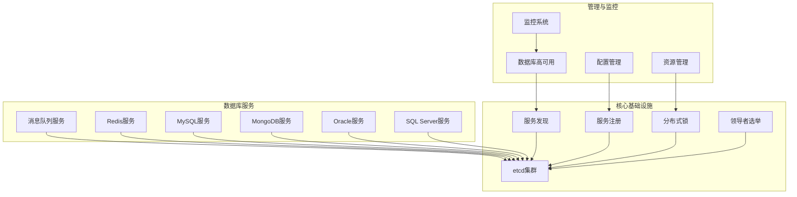
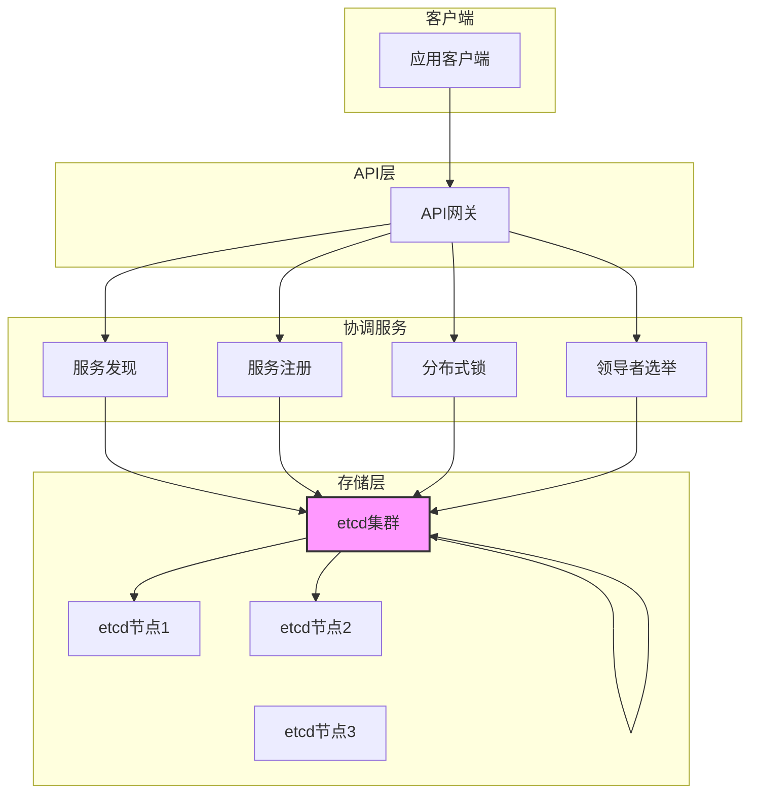
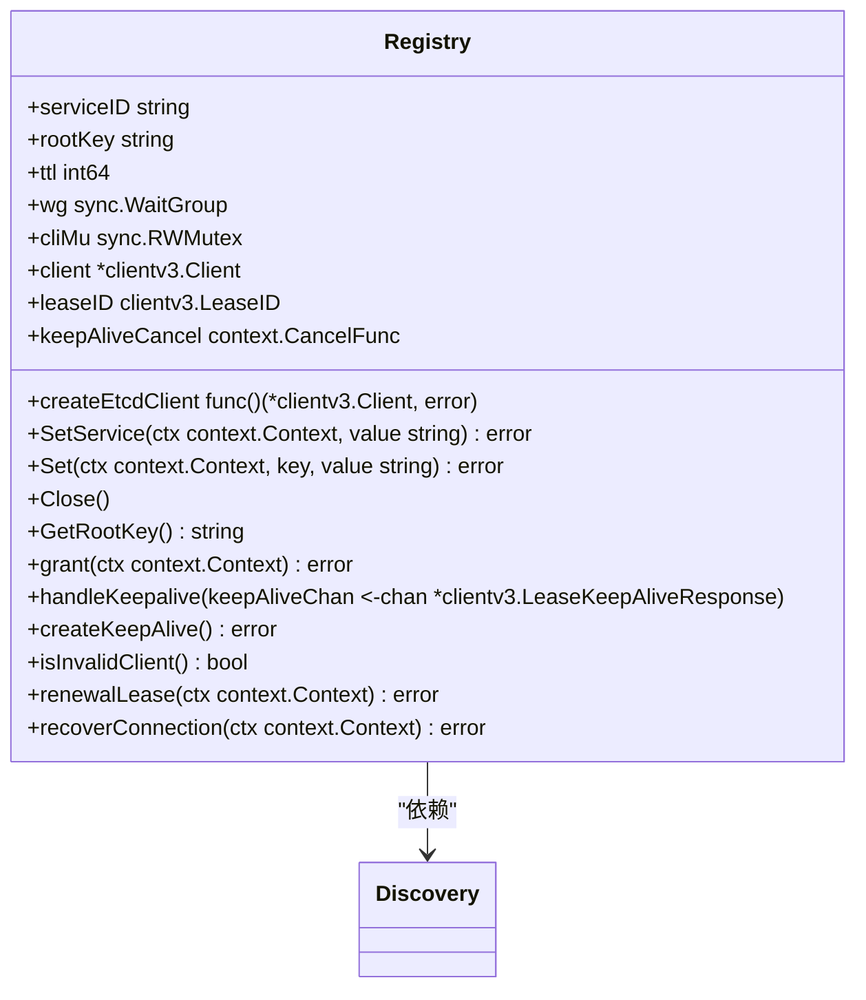
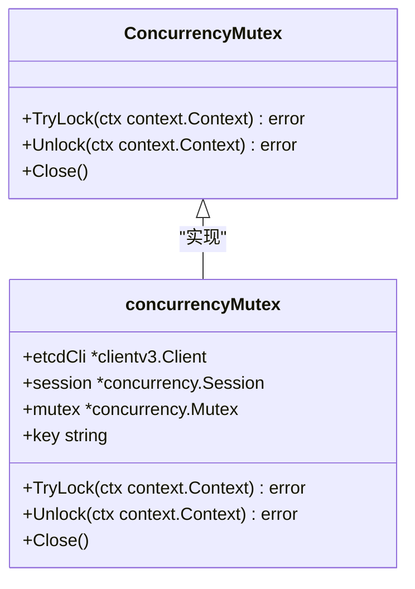
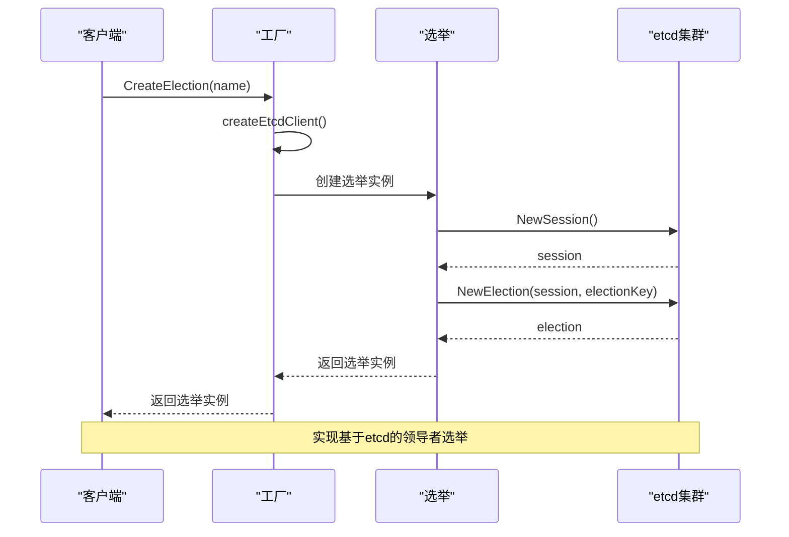
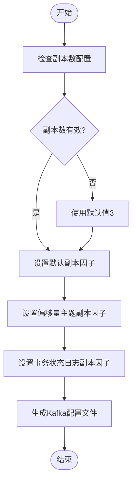
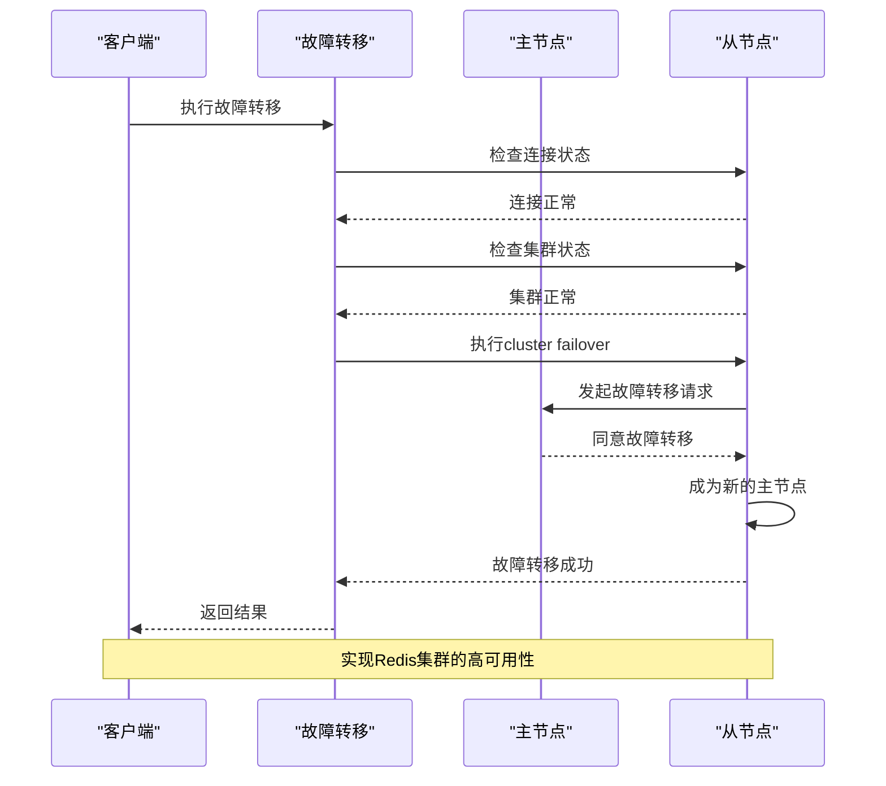
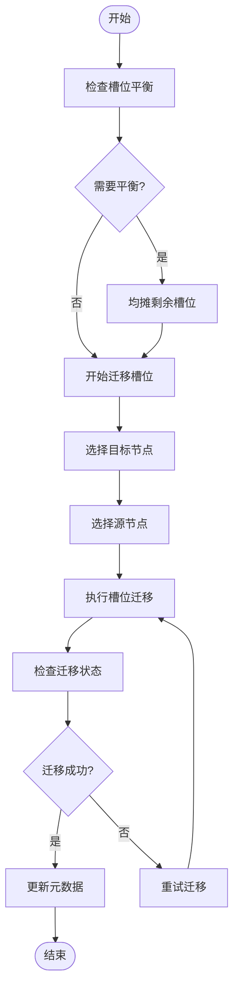
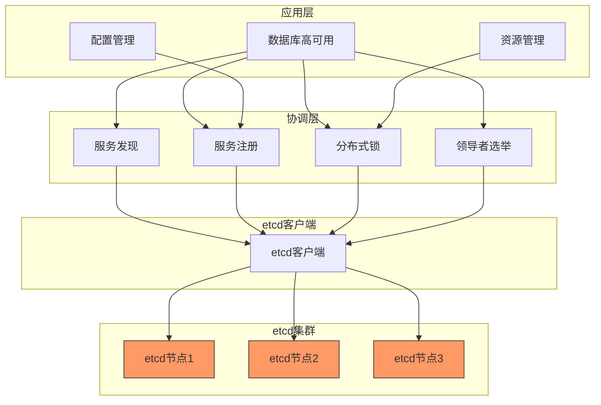

# 数据复制方案

<cite>
**本文档引用的文件**   
- [discovery.go](file://dbm-services/common/dbha-v2/pkg/discovery/discovery.go)
- [factory.go](file://dbm-services/common/dbha-v2/pkg/discovery/factory.go)
- [concurrency_mutex.go](file://dbm-services/common/dbha-v2/pkg/discovery/concurrency_mutex.go)
- [registry.go](file://dbm-services/common/dbha-v2/pkg/discovery/registry.go)
- [install_kafka.go](file://dbm-services/bigdata/db-tools/dbactuator/pkg/components/kafka/install_kafka.go)
- [redis_cluster_failover.go](file://dbm-services/redis/db-tools/dbactuator/pkg/atomjobs/atomredis/redis_cluster_failover.go)
- [redis_migrate_slots.go](file://dbm-services/redis/db-tools/dbactuator/pkg/atomjobs/atomredis/redis_migrate_slots.go)
- [install_vm.go](file://dbm-services/bigdata/db-tools/dbactuator/pkg/components/victoriametrics/install_vm.go)
- [check_affinity.py](file://dbm-ui/backend/db_periodic_task/local_tasks/db_meta/db_meta_check/redis_cluster_check/check_affinity.py)
- [pt-table-checksum](file://dbm-services/mysql/db-tools/mysql-table-checksum/pt-table-checksum)
- [pt-table-sync](file://dbm-services/mysql/db-tools/mysql-table-checksum/pt-table-sync)
</cite>

## 目录
1. [引言](#引言)
2. [项目结构](#项目结构)
3. [核心组件](#核心组件)
4. [架构概述](#架构概述)
5. [详细组件分析](#详细组件分析)
6. [依赖分析](#依赖分析)
7. [性能考虑](#性能考虑)
8. [故障排除指南](#故障排除指南)
9. [结论](#结论)

## 引言
本文档详细描述了蓝鲸数据库管理系统中的数据复制方案。该系统实现了多副本存储、同步/异步复制模式、数据版本控制和冲突解决策略。通过etcd实现的分布式一致性算法，系统确保了数据的高可用性和强一致性。文档涵盖了基于Raft类似算法的实现细节，包括日志复制、快照机制和状态机应用，以及复制延迟优化、网络分区处理、数据校验和恢复流程。

## 项目结构
该数据库管理系统采用微服务架构，包含多个独立的服务模块，每个模块负责特定的数据库技术栈。系统核心是基于etcd的分布式协调服务，用于实现数据复制和一致性保证。



**图表来源**
- [discovery.go](file://dbm-services/common/dbha-v2/pkg/discovery/discovery.go)
- [factory.go](file://dbm-services/common/dbha-v2/pkg/discovery/factory.go)

**本节来源**
- [discovery.go](file://dbm-services/common/dbha-v2/pkg/discovery/discovery.go)
- [factory.go](file://dbm-services/common/dbha-v2/pkg/discovery/factory.go)

## 核心组件
系统的核心组件包括基于etcd的服务发现、注册、分布式锁和领导者选举机制。这些组件共同构成了分布式一致性基础，支持多副本数据存储和同步。系统实现了配置数据的多副本存储机制，通过etcd集群确保数据的高可用性。复制模式支持同步和异步两种方式，根据业务需求进行配置。数据版本控制通过etcd的版本号机制实现，确保数据的一致性和可追溯性。

**本节来源**
- [discovery.go](file://dbm-services/common/dbha-v2/pkg/discovery/discovery.go)
- [factory.go](file://dbm-services/common/dbha-v2/pkg/discovery/factory.go)
- [concurrency_mutex.go](file://dbm-services/common/dbha-v2/pkg/discovery/concurrency_mutex.go)
- [registry.go](file://dbm-services/common/dbha-v2/pkg/discovery/registry.go)

## 架构概述
系统采用基于etcd的分布式一致性架构，实现了Raft算法的变体。etcd作为核心的分布式键值存储，提供了强一致性的数据复制能力。系统通过服务发现和注册机制，实现了动态的节点管理。分布式锁和领导者选举机制确保了在分布式环境下的协调一致性。



**图表来源**
- [discovery.go](file://dbm-services/common/dbha-v2/pkg/discovery/discovery.go)
- [factory.go](file://dbm-services/common/dbha-v2/pkg/discovery/factory.go)

## 详细组件分析

### 服务发现与注册组件分析
系统实现了基于etcd的服务发现和注册机制，这是数据复制和一致性保证的基础。服务发现组件允许系统动态地发现和监控其他服务实例的状态，而服务注册组件则负责将服务实例的信息注册到etcd集群中。

#### 服务发现类图
```mermaid
classDiagram
class Discovery {
+quit chan struct{}
+cliMu sync.RWMutex
+client *clientv3.Client
+createEtcdClient func() (*clientv3.Client, error)
+wg sync.WaitGroup
+Watch(ctx context.Context, key string) (chan *WatchEvent, error)
+WatchWithPrefix(ctx context.Context, key string) (chan *WatchEvent, error)
+Get(ctx context.Context, key string) ([]byte, error)
+GetWithPrefix(ctx context.Context, key string) (map[string][]byte, error)
+Close()
+watchCommon(ctx context.Context, key string, opts ...clientv3.OpOption) (chan *WatchEvent, error)
}
class WatchEvent {
+EventType WatchedEventType
+Key string
+Value []byte
}
class WatchedEventType {
+WatchedEventPut
+WatchedEventDelete
+WatchedEventUnknown
}
Discovery --> WatchEvent : "产生"
Discovery --> WatchedEventType : "使用"
```

**图表来源**
- [discovery.go](file://dbm-services/common/dbha-v2/pkg/discovery/discovery.go)

#### 服务注册类图


**图表来源**
- [registry.go](file://dbm-services/common/dbha-v2/pkg/discovery/registry.go)

### 分布式锁与选举组件分析
系统实现了分布式锁和领导者选举机制，这是实现数据一致性的关键组件。分布式锁确保了在分布式环境下的互斥访问，而领导者选举机制则用于确定集群中的主节点。

#### 分布式锁类图


**图表来源**
- [concurrency_mutex.go](file://dbm-services/common/dbha-v2/pkg/discovery/concurrency_mutex.go)

#### 领导者选举序列图


**图表来源**
- [factory.go](file://dbm-services/common/dbha-v2/pkg/discovery/factory.go)

### 数据复制与同步组件分析
系统实现了多种数据复制和同步机制，包括Kafka的副本复制、Redis集群的槽位迁移和MySQL的表数据校验。

#### Kafka复制配置流程图


**图表来源**
- [install_kafka.go](file://dbm-services/bigdata/db-tools/dbactuator/pkg/components/kafka/install_kafka.go)

#### Redis集群故障转移序列图


**图表来源**
- [redis_cluster_failover.go](file://dbm-services/redis/db-tools/dbactuator/pkg/atomjobs/atomredis/redis_cluster_failover.go)

#### Redis槽位迁移流程图


**图表来源**
- [redis_migrate_slots.go](file://dbm-services/redis/db-tools/dbactuator/pkg/atomjobs/atomredis/redis_migrate_slots.go)

**本节来源**
- [install_kafka.go](file://dbm-services/bigdata/db-tools/dbactuator/pkg/components/kafka/install_kafka.go)
- [redis_cluster_failover.go](file://dbm-services/redis/db-tools/dbactuator/pkg/atomjobs/atomredis/redis_cluster_failover.go)
- [redis_migrate_slots.go](file://dbm-services/redis/db-tools/dbactuator/pkg/atomjobs/atomredis/redis_migrate_slots.go)
- [install_vm.go](file://dbm-services/bigdata/db-tools/dbactuator/pkg/components/victoriametrics/install_vm.go)

## 依赖分析
系统依赖于etcd作为核心的分布式协调服务，所有数据复制和一致性功能都建立在etcd的基础之上。etcd提供了Raft一致性算法的实现，确保了数据的强一致性。系统通过Go语言的etcd客户端库与etcd集群进行交互，实现了服务发现、注册、分布式锁和领导者选举等功能。



**图表来源**
- [discovery.go](file://dbm-services/common/dbha-v2/pkg/discovery/discovery.go)
- [factory.go](file://dbm-services/common/dbha-v2/pkg/discovery/factory.go)
- [concurrency_mutex.go](file://dbm-services/common/dbha-v2/pkg/discovery/concurrency_mutex.go)
- [registry.go](file://dbm-services/common/dbha-v2/pkg/discovery/registry.go)

**本节来源**
- [discovery.go](file://dbm-services/common/dbha-v2/pkg/discovery/discovery.go)
- [factory.go](file://dbm-services/common/dbha-v2/pkg/discovery/factory.go)
- [concurrency_mutex.go](file://dbm-services/common/dbha-v2/pkg/discovery/concurrency_mutex.go)
- [registry.go](file://dbm-services/common/dbha-v2/pkg/discovery/registry.go)

## 性能考虑
系统在设计时充分考虑了性能因素。etcd集群的性能直接影响整个系统的响应速度和吞吐量。为了优化复制延迟，系统采用了批量操作和异步处理机制。在网络分区处理方面，系统遵循CAP理论，在网络分区发生时优先保证一致性。数据校验通过定期的完整性检查和校验和验证来实现，确保数据的准确性和可靠性。

**本节来源**
- [discovery.go](file://dbm-services/common/dbha-v2/pkg/discovery/discovery.go)
- [registry.go](file://dbm-services/common/dbha-v2/pkg/discovery/registry.go)

## 故障排除指南
当遇到数据复制问题时，应首先检查etcd集群的健康状态。使用etcdctl工具可以查看集群成员、领导状态和健康状况。对于服务发现问题，检查相关服务是否正确注册到etcd。分布式锁问题通常与网络延迟或etcd性能瓶颈有关，需要监控etcd的响应时间和资源使用情况。

**本节来源**
- [discovery.go](file://dbm-services/common/dbha-v2/pkg/discovery/discovery.go)
- [registry.go](file://dbm-services/common/dbha-v2/pkg/discovery/registry.go)
- [concurrency_mutex.go](file://dbm-services/common/dbha-v2/pkg/discovery/concurrency_mutex.go)

## 结论
本文档详细描述了蓝鲸数据库管理系统的数据复制方案。系统基于etcd实现了强一致性的分布式协调服务，支持多副本存储、同步/异步复制模式、数据版本控制和冲突解决策略。通过服务发现、注册、分布式锁和领导者选举等机制，系统确保了数据的高可用性和一致性。未来可以进一步优化复制性能，增加更多的监控指标，提高系统的可观测性。