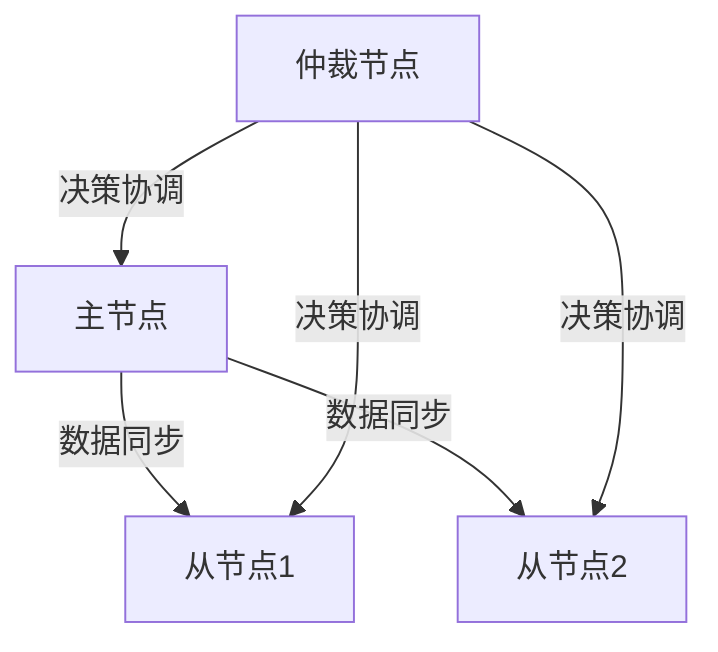
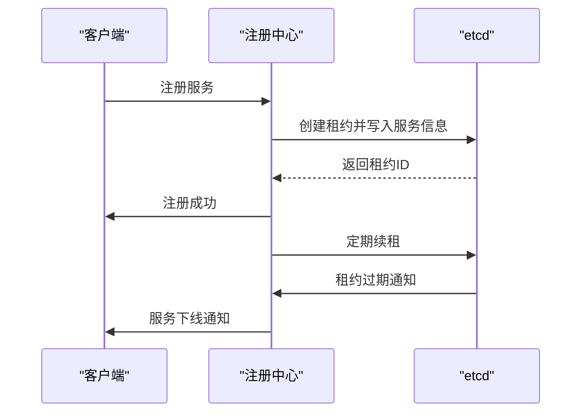
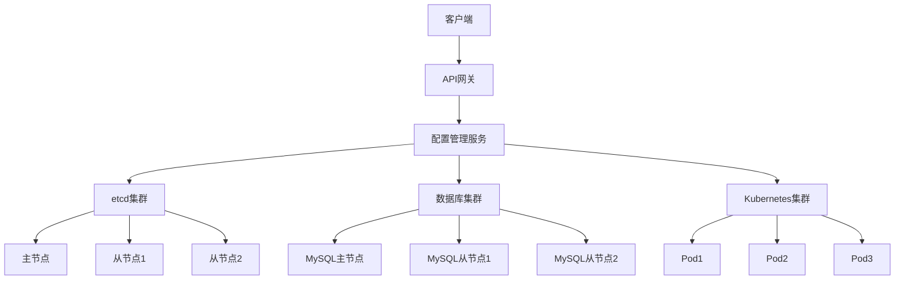
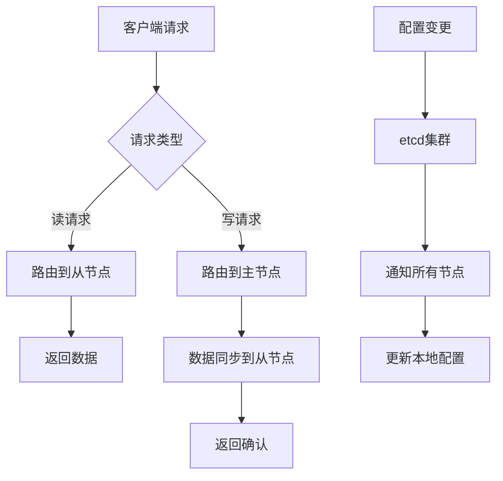
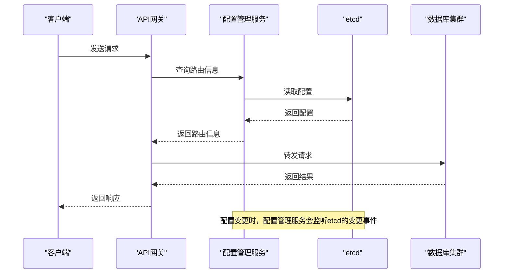

# 高可用架构设计

<cite>
**本文档引用文件**   
- [cluster_suite_test.go](file://dbm-services/k8s-dbs/metadata/api/controller/testsuite/cluster_suite_test.go)
- [cluster_provider.go](file://dbm-services/k8s-dbs/metadata/provider/cluster_provider.go)
- [factory.go](file://dbm-services/common/dbha-v2/pkg/discovery/factory.go)
- [apply_base.go](file://dbm-services/common/db-resource/internal/svr/apply/apply_base.go)
- [affinity_test.go](file://dbm-services/common/db-resource/internal/svr/apply_affinitytest/affinity_test.go)
- [config.yaml](file://dbm-services/common/db-config/conf/config.yaml)
- [cluster.yaml](file://dbm-services/common/dbha-v2/etc/cluster.yaml)
- [values.yaml](file://helm-charts/bk-dbm/charts/k8s-dbs/values.yaml)
- [registry.go](file://dbm-services/common/dbha-v2/pkg/discovery/registry.go)
- [registry_test.go](file://dbm-services/common/dbha-v2/pkg/discovery/registry_test.go)
</cite>

## 目录
1. [引言](#引言)
2. [集群拓扑结构与节点角色](#集群拓扑结构与节点角色)
3. [服务发现机制](#服务发现机制)
4. [一致性协议实现](#一致性协议实现)
5. [Kubernetes调度策略](#kubernetes调度策略)
6. [跨可用区部署方案](#跨可用区部署方案)
7. [核心机制实现](#核心机制实现)
8. [架构图](#架构图)
9. [数据流图](#数据流图)
10. [组件交互图](#组件交互图)

## 引言
本文档详细描述了数据库管理系统（DBM）的高可用架构设计，重点关注配置管理服务的集群拓扑结构、节点角色划分、服务发现机制和一致性协议实现。文档结合代码说明了基于Kubernetes的Pod调度策略、反亲和性配置和跨可用区部署方案，并提供了架构图、数据流图和组件交互图来解释服务注册与发现、leader选举、配置同步等核心机制的实现细节。

## 集群拓扑结构与节点角色
系统采用分布式架构，支持多种数据库集群的高可用部署。集群拓扑结构通过配置文件定义，支持MySQL、tenDB等多种数据库类型。

### 节点角色划分
集群中的节点根据其功能划分为不同的角色：
- **主节点（Master）**：负责处理写操作和数据同步
- **从节点（Slave）**：负责处理读操作，提供数据冗余
- **仲裁节点**：在特定场景下用于决策和协调



**图来源**
- [cluster.yaml](file://dbm-services/common/dbha-v2/etc/cluster.yaml#L3-L22)

**本节来源**
- [cluster.yaml](file://dbm-services/common/dbha-v2/etc/cluster.yaml#L1-L122)

## 服务发现机制
系统采用etcd作为服务发现和配置管理的核心组件，通过注册中心实现服务的动态发现和健康检查。

### 服务注册与发现
服务注册与发现机制通过`discovery`包实现，主要包含以下组件：
- **Registry**：负责服务注册和租约管理
- **Discovery**：负责服务发现和监听
- **Client**：提供与etcd交互的接口



**图来源**
- [factory.go](file://dbm-services/common/dbha-v2/pkg/discovery/factory.go#L34-L98)
- [registry.go](file://dbm-services/common/dbha-v2/pkg/discovery/registry.go#L34-L87)

**本节来源**
- [factory.go](file://dbm-services/common/dbha-v2/pkg/discovery/factory.go#L34-L98)
- [registry.go](file://dbm-services/common/dbha-v2/pkg/discovery/registry.go#L34-L87)

## 一致性协议实现
系统采用etcd的Raft一致性算法来保证分布式系统的一致性，通过leader选举和数据同步机制确保数据的可靠性和一致性。

### Leader选举
Leader选举通过`concurrency.Election`实现，确保在分布式环境中只有一个leader节点负责决策和协调。

```go
func (c Client) CreateElection(name string) (ConcurrencyElection, error) {
    etcdCli, err := c.createEtcdClient()
    if err != nil {
        return nil, err
    }

    session, err := concurrency.NewSession(etcdCli)
    if err != nil {
        return nil, gerrors.NewE(gerrors.EtcdFailure, err)
    }

    electionKey := c.opts.registryRootKeyPrefix + "/election/leader/" + name

    election := &concurrencyElection{
        etcdCli:  etcdCli,
        session:  session,
        election: concurrency.NewElection(session, electionKey),
        key:      c.opts.serviceID,
    }

    return election, nil
}
```

**本节来源**
- [factory.go](file://dbm-services/common/dbha-v2/pkg/discovery/factory.go#L123-L145)

## Kubernetes调度策略
系统基于Kubernetes实现容器化部署，通过Pod调度策略确保服务的高可用性和资源优化。

### 反亲和性配置
反亲和性配置通过`affinity`字段实现，支持多种亲和性策略，包括：
- **同园区亲和性（SAME_SUBZONE）**：确保Pod部署在同一园区
- **跨园区亲和性（CROS_SUBZONE）**：确保Pod跨园区部署
- **无亲和性（NONE）**：不考虑亲和性

```yaml
affinity:
  nodeAffinity:
    requiredDuringSchedulingIgnoredDuringExecution:
      nodeSelectorTerms:
      - matchExpressions:
        - key: topology.kubernetes.io/zone
          operator: In
          values:
          - zone1
          - zone2
```

**本节来源**
- [values.yaml](file://helm-charts/bk-dbm/charts/k8s-dbs/values.yaml#L35-L36)
- [apply_base.go](file://dbm-services/common/db-resource/internal/svr/apply/apply_base.go#L270-L291)

## 跨可用区部署方案
系统支持跨可用区部署，通过合理的资源分配和调度策略确保服务的高可用性和容灾能力。

### 跨可用区部署策略
跨可用区部署策略通过以下方式实现：
- **资源规格描述**：通过`Spec`和`DiskSpec`描述资源需求
- **地域区间**：通过`LocationSpec`指定部署的地域
- **容忍度**：通过`Tolerance`参数控制资源分布的均匀性

```go
type ObjectDetail struct {
    BkCloudId    int
    GroupMark    string
    Count        int
    Affinity     string
    Tolerance    float64
    CurrentHosts []CurrentResource
    Spec         meta.Spec
    LocationSpec meta.LocationSpec
}
```

**本节来源**
- [apply_base.go](file://dbm-services/common/db-resource/internal/svr/apply/apply_base.go#L300-L337)

## 核心机制实现
系统通过多种核心机制实现高可用性，包括服务注册与发现、leader选举、配置同步等。

### 服务注册与发现
服务注册与发现机制通过`Registry`和`Discovery`组件实现，确保服务的动态发现和健康检查。

```go
func (r *Registry) grant(ctx context.Context) error {
    r.cliMu.Lock()
    defer r.cliMu.Unlock()

    cli, err := r.createEtcdClient()
    if err != nil {
        return err
    }

    r.client = cli

    leaseResp, err := r.client.Grant(ctx, r.ttl)
    if err != nil {
        return gerrors.NewE(gerrors.EtcdFailure, err)
    }
    r.leaseID = leaseResp.ID

    logger.Debug("registry start keepalive, leaseID: %d", r.leaseID)

    _, err = r.client.Put(ctx, r.rootKey, "", clientv3.WithLease(r.leaseID))
    if err != nil {
        r.client.Close()
        return gerrors.NewE(gerrors.EtcdFailure, err)
    }

    return r.createKeepAlive()
}
```

**本节来源**
- [registry.go](file://dbm-services/common/dbha-v2/pkg/discovery/registry.go#L53-L78)

### 配置同步
配置同步机制通过etcd的watch功能实现，确保配置的实时同步和一致性。

```go
func (d *Discovery) GetWithPrefix(ctx context.Context, prefix string) (map[string]string, error) {
    resp, err := d.createEtcdClient().Get(ctx, prefix, clientv3.WithPrefix())
    if err != nil {
        return nil, gerrors.NewE(gerrors.EtcdFailure, err)
    }

    kvs := make(map[string]string)
    for _, kv := range resp.Kvs {
        kvs[string(kv.Key)] = string(kv.Value)
    }

    return kvs, nil
}
```

**本节来源**
- [factory.go](file://dbm-services/common/dbha-v2/pkg/discovery/factory.go#L97-L145)

## 架构图


**图来源**
- [cluster.yaml](file://dbm-services/common/dbha-v2/etc/cluster.yaml#L1-L122)
- [values.yaml](file://helm-charts/bk-dbm/charts/k8s-dbs/values.yaml#L1-L164)

## 数据流图


**图来源**
- [factory.go](file://dbm-services/common/dbha-v2/pkg/discovery/factory.go#L34-L98)
- [registry.go](file://dbm-services/common/dbha-v2/pkg/discovery/registry.go#L34-L87)

## 组件交互图


**图来源**
- [cluster.yaml](file://dbm-services/common/dbha-v2/etc/cluster.yaml#L1-L122)
- [factory.go](file://dbm-services/common/dbha-v2/pkg/discovery/factory.go#L34-L98)