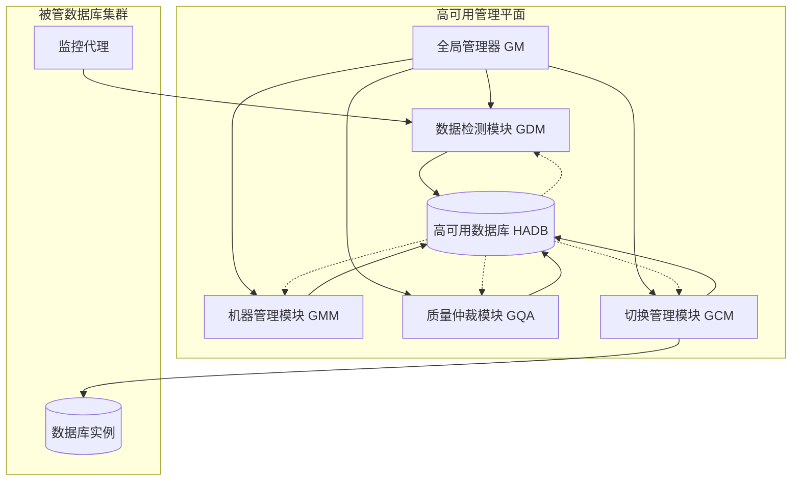
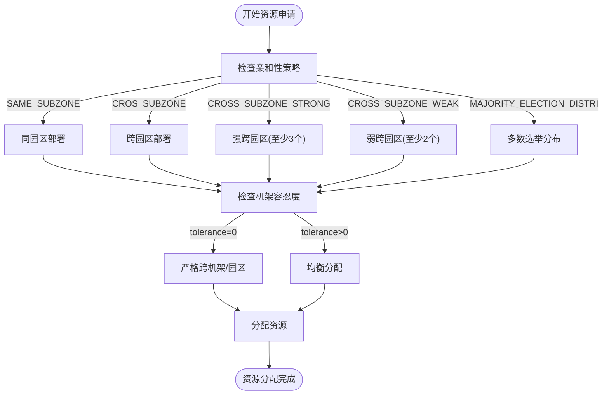
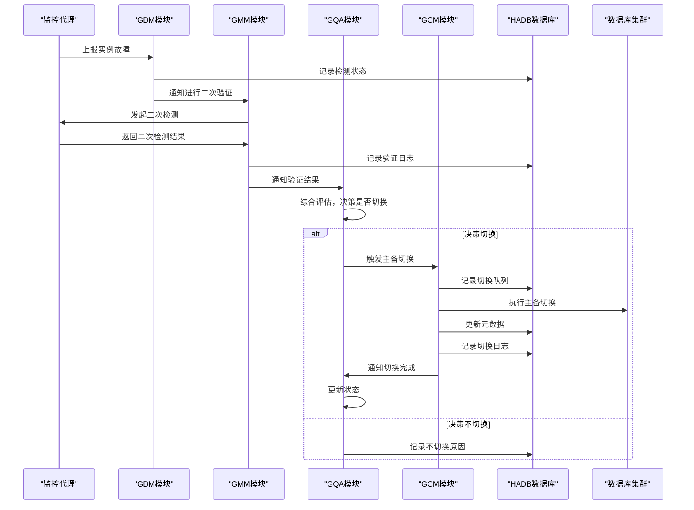
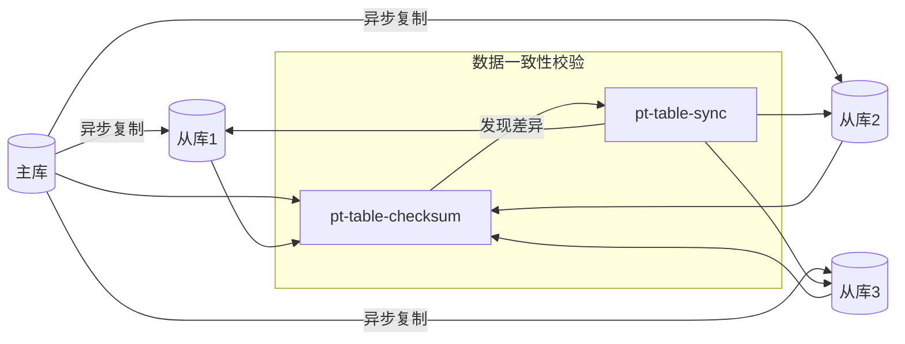
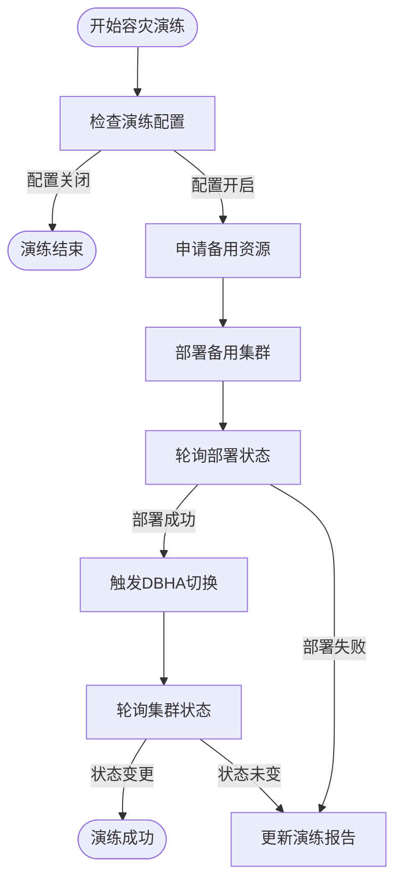
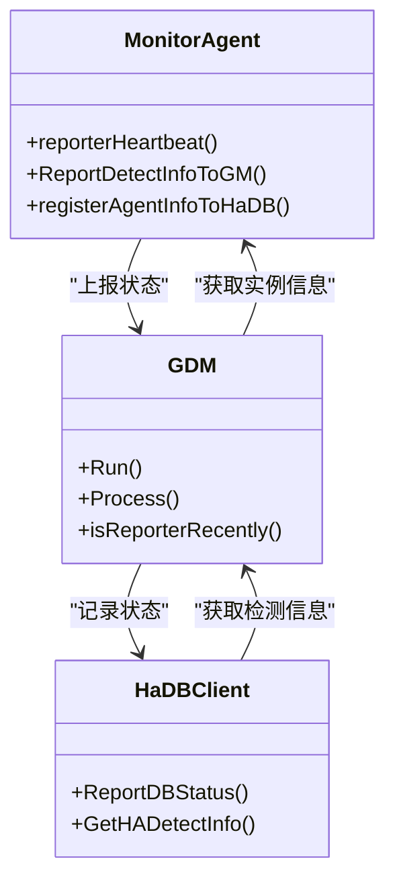
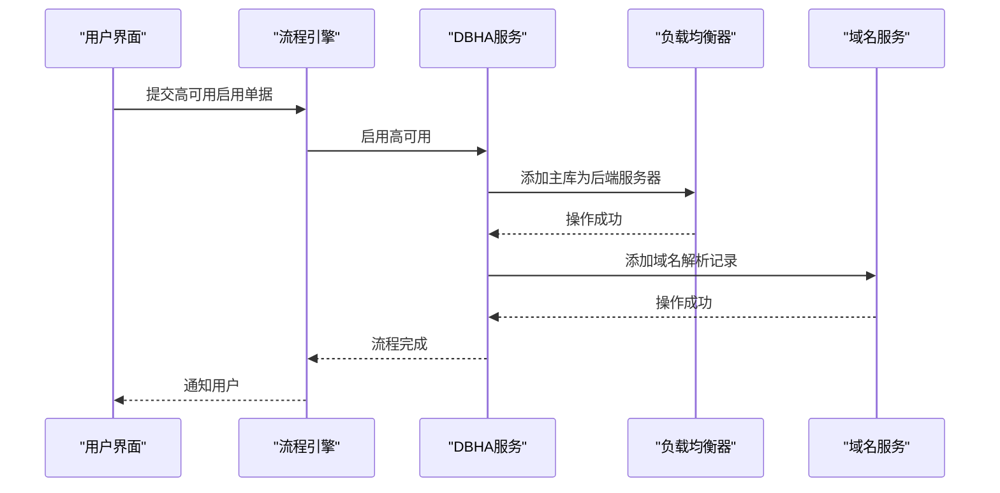
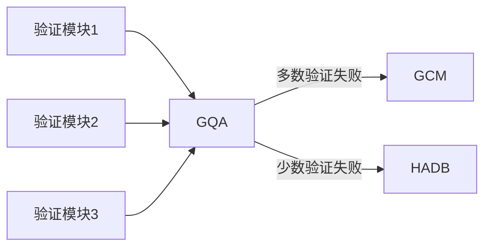
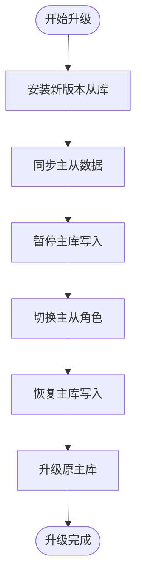

# 高可用部署

<cite>
**本文档引用的文件**   
- [apply_core.go](file://dbm-services/common/db-resource/internal/svr/apply/apply_core.go)
- [apply_base.go](file://dbm-services/common/db-resource/internal/svr/apply/apply_base.go)
- [gmm.go](file://dbm-services/common/dbha/ha-module/gm/gmm.go)
- [gm.go](file://dbm-services/common/dbha/ha-module/gm/gm.go)
- [hadb.go](file://dbm-services/common/dbha/ha-module/client/hadb.go)
- [failover_drill_unit.py](file://dbm-ui/backend/db_periodic_task/local_tasks/mysql_failover_drill/failover_drill_unit.py)
- [mysql_ha_enable_flow.py](file://dbm-ui/backend/flow/engine/bamboo/scene/mysql/mysql_ha_enable_flow.py)
- [mysql_ha_upgrade.py](file://dbm-ui/backend/flow/engine/bamboo/scene/mysql/mysql_ha_upgrade.py)
- [mysql_rollback_data_flow.py](file://dbm-ui/backend/flow/engine/bamboo/scene/mysql/mysql_rollback_data_flow.py)
- [spider_cluster_rollback_flow.py](file://dbm-ui/backend/flow/engine/bamboo/scene/spider/spider_cluster_rollback_flow.py)
- [redis_cluster_data_copy.py](file://dbm-ui/backend/flow/engine/bamboo/scene/redis/redis_cluster_data_copy.py)
- [dbha_apis.py](file://dbm-ui/backend/db_meta/api/dbha/apis.py)
- [failover_status_check.py](file://dbm-ui/backend/flow/plugins/components/collections/common/failover_status_check.py)
- [install_haproxy.go](file://dbm-services/bigdata/db-tools/dbactuator/pkg/components/hdfs/install_haproxy.go)
- [options.go](file://dbm-services/common/dbha-v2/pkg/discovery/options.go)
- [registry.go](file://dbm-services/common/dbha-v2/pkg/discovery/registry.go)
- [discovery_test.go](file://dbm-services/common/dbha-v2/pkg/discovery/discovery_test.go)
- [factory.go](file://dbm-services/common/dbha-v2/pkg/discovery/factory.go)
- [service_info.go](file://dbm-services/common/dbha-v2/pkg/discovery/service_info.go)
- [service.go](file://dbm-services/common/dbha-v2/internal/admin/service.go)
- [cluster_service_suite_test.go](file://dbm-services/k8s-dbs/metadata/dbaccess/testsuite/cluster_service_suite_test.go)
- [cluster_provider.go](file://dbm-services/k8s-dbs/core/provider/cluster_provider.go)
- [addon_provider.go](file://dbm-services/k8s-dbs/core/provider/addon_provider.go)
- [values.yaml](file://helm-charts/bk-dbm/values.yaml)
</cite>

## 目录
1. [引言](#引言)
2. [集群部署架构](#集群部署架构)
3. [负载均衡与故障转移](#负载均衡与故障转移)
4. [数据复制与容灾](#数据复制与容灾)
5. [服务健康检查与自动恢复](#服务健康检查与自动恢复)
6. [脑裂预防机制](#脑裂预防机制)
7. [多数据中心与跨区域部署](#多数据中心与跨区域部署)
8. [服务升级策略](#服务升级策略)
9. [性能调优建议](#性能调优建议)
10. [生产环境最佳实践](#生产环境最佳实践)
11. [监控指标](#监控指标)

## 引言
本文档详细阐述了蓝鲸数据库管理系统（BlueKing-DBM）的高可用部署方案。该系统通过先进的集群架构、智能的负载均衡、自动化的故障转移和数据复制机制，确保数据库服务的高可用性和业务连续性。文档深入分析了配置管理服务的实现细节，包括健康检查、自动恢复、脑裂预防等关键特性，并提供了多数据中心部署、跨区域容灾、服务升级和性能调优的全面指导。

## 集群部署架构
蓝鲸DBM采用分布式微服务架构，核心高可用组件（dbha）由多个协同工作的模块组成，形成一个完整的高可用管理平面。



**架构说明**:
- **全局管理器 (GM)**: 系统的核心协调者，负责启动和管理所有子模块。
- **数据检测模块 (GDM)**: 负责从各个监控代理收集数据库实例的健康状态。
- **机器管理模块 (GMM)**: 对GDM上报的状态进行二次验证，防止误报。
- **质量仲裁模块 (GQA)**: 综合评估故障情况，决定是否触发主备切换。
- **切换管理模块 (GCM)**: 执行最终的主备切换操作，并更新元数据。
- **高可用数据库 (HADB)**: 存储所有高可用相关的状态、日志和配置信息，是各模块间通信的中心枢纽。

**Diagram sources**
- [gmm.go](file://dbm-services/common/dbha/ha-module/gm/gmm.go)
- [gm.go](file://dbm-services/common/dbha/ha-module/gm/gm.go)
- [hadb.go](file://dbm-services/common/dbha/ha-module/client/hadb.go)

**Section sources**
- [gmm.go](file://dbm-services/common/dbha/ha-module/gm/gmm.go#L1-L167)
- [gm.go](file://dbm-services/common/dbha/ha-module/gm/gm.go#L1-L208)

## 负载均衡与故障转移
系统通过智能的资源分配策略和自动化的故障转移流程，确保服务的负载均衡和高可用性。

### 资源分配与亲和性策略
在部署新集群或进行扩容时，系统通过`db-resource`服务进行资源分配，支持多种亲和性策略以满足不同的高可用需求。



**关键策略**:
- **同园区部署 (SAME_SUBZONE)**: 所有实例部署在同一园区内，但可通过设置`tolerance=0`来强制跨机架，提高单点故障的容忍度。
- **跨园区部署 (CROS_SUBZONE)**: 实例分布在不同园区，提供更高的容灾能力。`tolerance`参数控制每个园区的最大实例数。
- **强/弱跨园区 (CROSS_SUBZONE_STRONG/WEAK)**: 分别要求至少3个和2个园区，提供更高级别的容灾保障。
- **多数选举分布 (MAJORITY_ELECTION_DISTRI)**: 确保没有超过半数的实例位于同一园区，有效预防脑裂。

**Section sources**
- [apply_core.go](file://dbm-services/common/db-resource/internal/svr/apply/apply_core.go#L1-L800)
- [apply_base.go](file://dbm-services/common/db-resource/internal/svr/apply/apply_base.go#L1-L480)

### 故障转移流程
当系统检测到主库故障时，会自动触发故障转移流程，确保服务快速恢复。



**流程说明**:
1.  **故障检测**: 监控代理检测到主库异常，上报给GDM。
2.  **状态记录**: GDM将检测状态记录到HADB。
3.  **二次验证**: GDM通知GMM，GMM发起二次验证，避免网络抖动导致的误判。
4.  **决策仲裁**: GMM将验证结果上报给GQA，GQA进行综合评估，决定是否执行切换。
5.  **执行切换**: GQA通知GCM执行切换，GCM负责更新数据库元数据（如主从关系）和外部服务（如域名、负载均衡）。
6.  **日志记录**: 整个流程的每一步都在HADB中留下详细日志，便于审计和排查。

**Diagram sources**
- [gmm.go](file://dbm-services/common/dbha/ha-module/gm/gmm.go#L63-L167)
- [gm.go](file://dbm-services/common/dbha/ha-module/gm/gm.go#L72-L121)
- [hadb.go](file://dbm-services/common/dbha/ha-module/client/hadb.go#L227-L269)

## 数据复制与容灾
系统通过多种机制确保数据的可靠复制和跨区域容灾能力。

### 数据复制方案
对于MySQL等支持主从复制的数据库，系统利用`pt-table-checksum`和`pt-table-sync`工具确保主从数据的一致性。



**工作流程**:
1.  **定期校验**: `pt-table-checksum`工具在主库上为每个表计算校验和，并将结果复制到从库。
2.  **差异比对**: 在从库上执行校验，比较主从的校验和。
3.  **数据同步**: 如果发现差异，`pt-table-sync`工具会生成并执行SQL语句，将从库的数据同步到与主库一致。

**Section sources**
- [mysql-table-checksum](file://dbm-services/mysql/db-tools/mysql-table-checksum/pt-table-checksum#L10378-L11949)

### 跨区域容灾演练
系统支持定期的容灾演练，验证跨区域部署的切换能力。



**代码实现**:
```python
def apply_ha_resource():
    # 申请高可用资源
    pass

def tendbcluster_cluster_apply():
    # 上架集群
    pass

def create_run_failover_drill_ticket():
    # 触发DBHA切换
    pass
```

**Section sources**
- [failover_drill_unit.py](file://dbm-ui/backend/db_periodic_task/local_tasks/mysql_failover_drill/failover_drill_unit.py#L114-L155)

## 服务健康检查与自动恢复
系统的健康检查和自动恢复机制是高可用性的核心保障。

### 健康检查实现
健康检查由监控代理（Agent）和GDM模块协同完成。



**关键方法**:
- `MonitorAgent.reporterHeartbeat()`: 代理向HADB上报心跳。
- `HaDBClient.ReportDBStatus()`: 将检测到的实例状态上报到HADB。
- `GDM.Process()`: 处理从代理获取的检测信息。

**Section sources**
- [gmm.go](file://dbm-services/common/dbha/ha-module/gm/gmm.go#L63-L167)
- [hadb.go](file://dbm-services/common/dbha/ha-module/client/hadb.go#L147-L192)

### 自动恢复流程
当故障转移完成后，系统会自动恢复服务，并通过负载均衡将流量切换到新的主库。



**代码实现**:
```go
ClbKwargs(
    clb_op_type=DnsOpType.CLB_ENABLE_RS.value,
    clb_ip=ce.entry,
    clb_op_exec_port=cluster["proxy_port"],
    exec_ip=cluster["proxy_ip_list"],
)
```

**Section sources**
- [mysql_ha_enable_flow.py](file://dbm-ui/backend/flow/engine/bamboo/scene/mysql/mysql_ha_enable_flow.py#L123-L133)

## 脑裂预防机制
系统通过多数派选举和严格的决策流程来预防脑裂。

### 多数派选举策略
通过`MAJORITY_ELECTION_DISTRI`亲和性策略，确保集群的多数实例分布在不同的故障域。

```mermaid
graph TD
subgraph "数据中心A"
A1[实例1]
A2[实例2]
end
subgraph "数据中心B"
B1[实例3]
B2[实例4]
end
subgraph "数据中心C"
C1[实例5]
end
A1 --> |主| A2
B1 --> |从| B2
C1 --> |从|
style A1 fill:#f9f,stroke:#333
```

**策略说明**:
- 集群共有5个实例。
- 即使数据中心A和B同时发生故障，剩余的实例5（占多数）仍能形成一个多数派，避免出现两个主库。

**Section sources**
- [apply_base.go](file://dbm-services/common/db-resource/internal/svr/apply/apply_base.go#L281-L285)

### 决策仲裁机制
GQA模块作为“质量仲裁者”，只有在获得足够多的验证信息后才会决策切换，防止因局部网络问题导致的误判。



**Section sources**
- [gmm.go](file://dbm-services/common/dbha/ha-module/gm/gmm.go#L63-L167)

## 多数据中心与跨区域部署
系统支持灵活的多数据中心和跨区域部署方案。

### 部署模式
- **同城双活**: 两个数据中心部署在同一个城市，通过高速网络互联，实现低延迟的主备切换。
- **异地灾备**: 主数据中心和灾备数据中心位于不同城市，提供最高级别的容灾能力。

**配置示例**:
```yaml
# values.yaml
db-resource:
  enabled: true
  envs:
    cloudVendor: "tencent"
    # ... 其他云厂商配置
```

**Section sources**
- [values.yaml](file://helm-charts/bk-dbm/values.yaml#L430-L455)

## 服务升级策略
系统支持滚动升级和蓝绿部署，确保服务升级过程中的高可用性。

### MySQL服务升级流程


**代码实现**:
```python
def build_install_slave_sub_pipeline():
    # 构建安装从库子流程
    pass

def build_sync_data_sub_pipelines():
    # 构建数据同步子流程
    pass
```

**Section sources**
- [mysql_ha_upgrade.py](file://dbm-ui/backend/flow/engine/bamboo/scene/mysql/mysql_ha_upgrade.py#L310-L340)

## 性能调优建议
为确保高可用系统的高性能，建议进行以下调优：

1.  **HADB数据库优化**: HADB是高可用系统的核心，应确保其数据库性能。建议使用SSD存储，并根据业务量调整连接池大小。
2.  **监控代理调优**: 合理设置监控代理的检测频率，避免过于频繁的检测对数据库造成压力。
3.  **网络优化**: 确保各模块间（特别是GDM与数据库实例之间）的网络延迟尽可能低。
4.  **资源预留**: 为GCM等关键模块预留充足的CPU和内存资源，确保在故障发生时能快速响应。

## 生产环境最佳实践
1.  **定期演练**: 定期执行容灾演练，验证故障转移流程的有效性。
2.  **监控告警**: 建立完善的监控告警体系，对HADB状态、模块心跳、切换日志等关键指标进行监控。
3.  **配置管理**: 使用Helm等工具进行配置管理，确保部署的一致性和可追溯性。
4.  **权限控制**: 严格控制对高可用系统的操作权限，避免误操作。
5.  **日志审计**: 定期审计HADB中的操作日志，确保所有切换操作都是合规的。

## 监控指标
以下是关键的监控指标列表：

| 指标名称 | 采集方式 | 告警阈值 | 说明 |
| :--- | :--- | :--- | :--- |
| `ha_module_heartbeat` | 模块上报 | 心跳丢失>3次 | 监控GDM、GMM、GQA、GCM模块的心跳 |
| `db_instance_status` | GDM检测 | 状态为`DOWN` | 监控数据库实例的健康状态 |
| `switch_queue_count` | HADB查询 | >0 | 监控待处理的切换请求队列 |
| `hadb_api_latency` | API调用 | >1s | 监控HADB API的响应延迟 |
| `agent_report_interval` | 代理上报 | >2倍配置值 | 监控代理上报的及时性 |

**Section sources**
- [failover_status_check.py](file://dbm-ui/backend/flow/plugins/components/collections/common/failover_status_check.py#L93-L118)
- [hadb.go](file://dbm-services/common/dbha/ha-module/client/hadb.go#L399-L423)