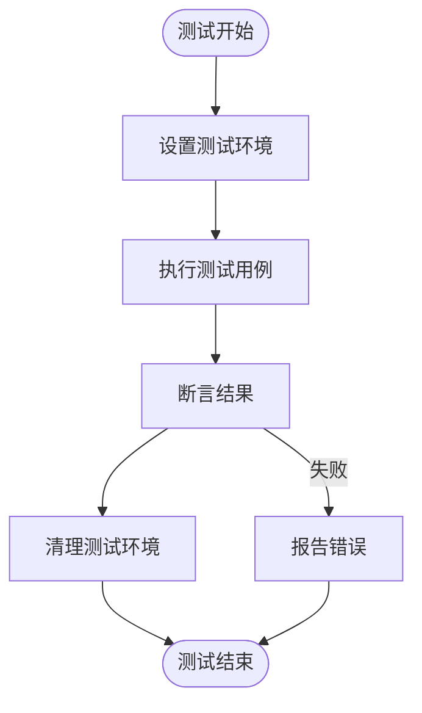
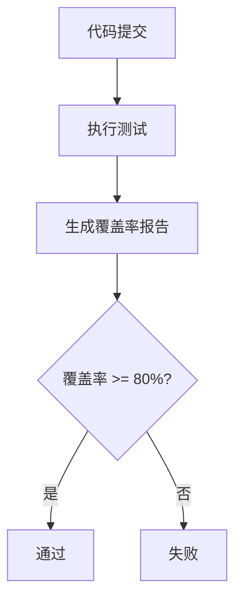

# 测试策略

<cite>
**本文档引用的文件**
- [dbactuator.go](file://dbm-services/bigdata/db-tools/dbactuator/pkg/rollback/rollback_test.go)
- [config_item_test.go](file://dbm-services/common/db-config/internal/service/simpleconfig/config_item_test.go)
- [test_handler.py](file://dbm-ui/backend/tests/db_meta/api/cluster/tendbha/test_handler.py)
- [conftest.py](file://dbm-ui/backend/tests/conftest.py)
- [pytest.sh](file://dbm-ui/bin/pytest.sh)
- [code_quality.sh](file://dbm-ui/scripts/ci/code_quality.sh)
- [AI单元测试开发规范.md](file://dbm-ui/backend/tests/AI单元测试开发规范.md)
- [单元测试开发规范.md](file://dbm-ui/backend/tests/单元测试开发规范.md)
- [run_tests.sh](file://dbm-services/mysql/db-simulation/app/syntax/run_tests.sh)
- [dbsimulation.go](file://dbm-services/mysql/db-simulation/handler/dbsimulation.go)
</cite>

## 目录
1. [测试金字塔概述](#测试金字塔概述)
2. [后端服务单元测试](#后端服务单元测试)
3. [前端服务单元测试](#前端服务单元测试)
4. [集成测试](#集成测试)
5. [端到端测试](#端到端测试)
6. [测试覆盖率目标](#测试覆盖率目标)
7. [CI/CD中的测试执行流程](#cicd中的测试执行流程)

## 测试金字塔概述

本项目采用测试金字塔策略，包含三个主要层次：单元测试、集成测试和端到端测试。测试金字塔的底部是数量最多的单元测试，中间是集成测试，顶部是数量最少的端到端测试。这种分层策略确保了代码质量的同时，也保证了测试效率。

单元测试主要针对Go后端服务和Python/Django前端服务的handler和service层进行，确保每个独立的功能模块都能正确工作。集成测试验证不同模块之间的交互是否符合预期，而端到端测试则模拟真实用户场景，验证整个系统的功能完整性。

**Section sources**
- [AI单元测试开发规范.md](file://dbm-ui/backend/tests/AI单元测试开发规范.md)
- [单元测试开发规范.md](file://dbm-ui/backend/tests/单元测试开发规范.md)

## 后端服务单元测试

后端服务主要使用Go语言开发，单元测试采用Go内置的testing包。测试主要集中在handler和service层，确保业务逻辑的正确性。测试文件通常以`_test.go`结尾，与被测试的源文件位于同一目录下。

对于handler层的测试，主要验证HTTP请求的处理逻辑，包括参数验证、错误处理和响应格式。service层的测试则关注业务逻辑的正确性，包括数据处理、算法实现和外部服务调用的模拟。

测试中使用`testing`包的`Test`函数进行断言，通过`go test`命令执行测试。对于需要外部依赖的测试，使用Go的mock框架来模拟外部服务，确保测试的独立性和可重复性。



**Diagram sources**
- [config_item_test.go](file://dbm-services/common/db-config/internal/service/simpleconfig/config_item_test.go)

**Section sources**
- [config_item_test.go](file://dbm-services/common/db-config/internal/service/simpleconfig/config_item_test.go)
- [rollback_test.go](file://dbm-services/bigdata/db-tools/dbactuator/pkg/rollback/rollback_test.go)

## 前端服务单元测试

前端服务使用Python/Django框架开发，单元测试采用pytest框架。测试主要集中在handler和service层，确保API接口和业务逻辑的正确性。测试文件遵循`test_*.py`的命名规范，位于`backend/tests`目录下。

### 测试框架与工具

项目使用pytest作为主要的测试框架，配合pytest-django插件支持Django应用的测试。测试覆盖率通过pytest-cov插件进行测量，确保代码的测试覆盖率达到预期目标。

```python
import pytest

# 标记测试需要数据库访问
pytestmark = pytest.mark.django_db
```

### 测试数据管理

测试数据管理遵循以下原则：
- 真实数据优先：尽量使用真实数据库记录
- 正确清理：按外键关系逆序删除数据
- 隔离独立：每个测试互不影响
- Mock最小化：只Mock外部服务（CC、DNS、Job等）

全局测试数据ID范围定义在`backend/tests/conftest.py`中，包括集群ID、主机ID、城市ID等，确保测试数据的一致性和可预测性。

### Mock使用规范

Mock主要用于模拟外部依赖，如CC、DNS、Job等服务。遵循最小化原则，只Mock必要的外部依赖，避免Mock数据库查询等内部逻辑。

```python
@patch("backend.components.CCApi", CCApiMock())
@patch("backend.db_services.ipchooser.query.resource.ResourceQueryHelper.search_cc_cloud")
@patch("backend.flow.utils.dns_manage.DnsManage.get_domain")
def test_example(self, mock_dns, mock_cc_cloud):
    mock_cc_cloud.return_value = {"0": {"bk_cloud_name": "Default Area"}}
    mock_dns.return_value = [{"target": "1.1.1.1", "port": 10000}]
    ...
```

**Diagram sources**
- [test_handler.py](file://dbm-ui/backend/tests/db_meta/api/cluster/tendbha/test_handler.py)

**Section sources**
- [test_handler.py](file://dbm-ui/backend/tests/db_meta/api/cluster/tendbha/test_handler.py)
- [conftest.py](file://dbm-ui/backend/tests/conftest.py)
- [AI单元测试开发规范.md](file://dbm-ui/backend/tests/AI单元测试开发规范.md)

## 集成测试

集成测试验证不同模块之间的交互是否符合预期。对于后端服务，集成测试主要验证handler层与service层、数据库之间的交互。对于前端服务，集成测试主要验证API接口与数据库、外部服务之间的交互。

集成测试使用与单元测试相同的测试框架，但会启动完整的应用环境，包括数据库和外部服务的模拟。测试用例设计时，重点关注模块间的接口定义和数据传递。

集成测试的范围包括：
- API接口的完整调用链
- 数据库事务处理
- 外部服务调用的集成
- 错误处理和异常恢复

**Section sources**
- [code_quality.sh](file://dbm-ui/scripts/ci/code_quality.sh)
- [run_tests.sh](file://dbm-services/mysql/db-simulation/app/syntax/run_tests.sh)

## 端到端测试

端到端测试模拟真实用户场景，验证整个系统的功能完整性。测试从用户界面开始，经过API接口，最终到达数据库，验证整个流程的正确性。

端到端测试使用自动化测试工具，模拟用户操作，验证系统响应。测试用例设计时，重点关注用户工作流和业务场景的完整性。

**Section sources**
- [code_quality.sh](file://dbm-ui/scripts/ci/code_quality.sh)

## 测试覆盖率目标

项目的测试覆盖率目标为80%以上。测试覆盖率通过pytest-cov插件进行测量，生成详细的覆盖率报告。覆盖率报告包括：
- 行覆盖率：执行的代码行数占总代码行数的比例
- 分支覆盖率：执行的分支数占总分支数的比例
- 函数覆盖率：执行的函数数占总函数数的比例

测试覆盖率的测量和报告集成在CI/CD流程中，每次代码提交都会自动执行测试并生成覆盖率报告。如果覆盖率低于目标值，CI/CD流程将失败，阻止代码合并。



**Diagram sources**
- [code_quality.sh](file://dbm-ui/scripts/ci/code_quality.sh)

**Section sources**
- [code_quality.sh](file://dbm-ui/scripts/ci/code_quality.sh)
- [pytest.ini](file://dbm-ui/pytest.ini)

## CI/CD中的测试执行流程

CI/CD中的测试执行流程定义在`scripts/ci/`目录下，主要包括以下步骤：

1. **准备服务**：启动测试所需的服务，包括数据库、缓存等
2. **安装依赖**：安装项目依赖的Python包和Go模块
3. **代码质量检查**：执行代码格式检查、静态分析等
4. **执行测试**：运行单元测试、集成测试和端到端测试
5. **生成报告**：生成测试覆盖率报告和测试结果报告

测试执行脚本`code_quality.sh`中包含了详细的测试执行逻辑，包括测试命令、覆盖率测量和结果分析。测试结果通过标准输出和退出码返回，CI/CD系统根据测试结果决定是否继续后续流程。

```bash
#!/bin/bash
# 单元测试
source "${VENV_DIR}/bin/activate"
DBM_DIR="./dbm-ui"

cd $DBM_DIR
TEST_LOGS=$(pytest --cov)

# 解析测试结果
TEST_RESULT=$(echo "$TEST_LOGS" | tail -n 1)
TEST_COVERAGE=$(echo "$TEST_LOGS" | grep "^TOTAL" | sed 's/.*[[:space:]]\([0-9]*%\)$/\1/')
TEST_FAILURE=$(echo $TEST_RESULT  | sed -n 's/.* \([0-9]*\).* failed.*/\1/p')
TEST_ERROR=$(echo $TEST_RESULT  | sed -n 's/.* \([0-9]*\).* errors.*/\1/p')

# 检查测试是否通过
if [[ $TEST_FAILURE -ne 0 || $TEST_ERROR -ne 0 ]]; then
  echo -e "\033[1;31m $TEST_LOGS  \033[0m"
  exit 1
fi
```

**Section sources**
- [bk_ci.sh](file://dbm-ui/scripts/ci/bk_ci.sh)
- [code_quality.sh](file://dbm-ui/scripts/ci/code_quality.sh)
- [pytest.sh](file://dbm-ui/bin/pytest.sh)