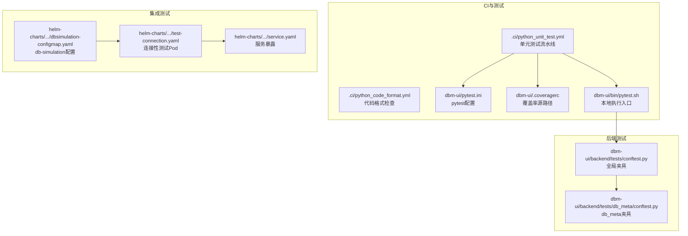
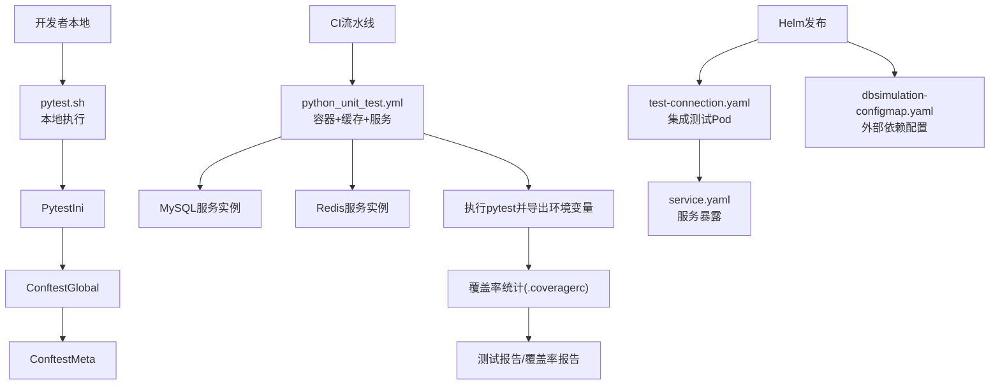
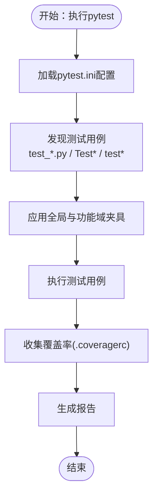
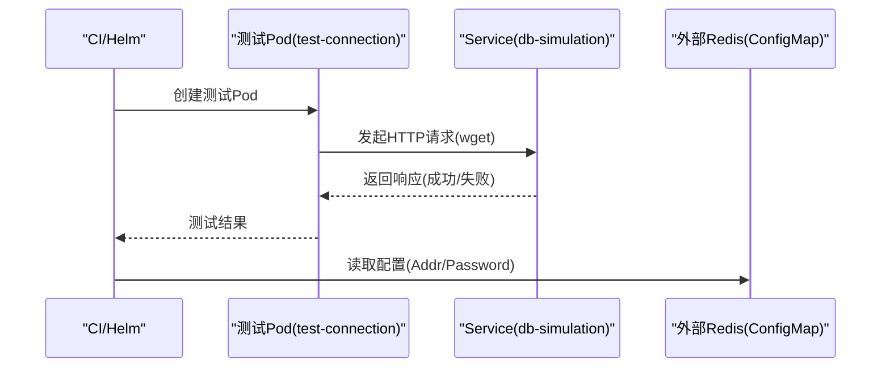
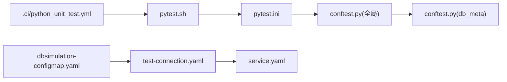

# 测试策略

<cite>
**本文引用的文件**
- [.ci/python_unit_test.yml](file://.ci/python_unit_test.yml)
- [.ci/python_code_format.yml](file://.ci/python_code_format.yml)
- [dbm-ui/pytest.ini](file://dbm-ui/pytest.ini)
- [dbm-ui/bin/pytest.sh](file://dbm-ui/bin/pytest.sh)
- [dbm-ui/.coveragerc](file://dbm-ui/.coveragerc)
- [dbm-ui/backend/tests/conftest.py](file://dbm-ui/backend/tests/conftest.py)
- [dbm-ui/backend/tests/db_meta/conftest.py](file://dbm-ui/backend/tests/db_meta/conftest.py)
- [helm-charts/bk-dbm/charts/db-simulation/templates/tests/test-connection.yaml](file://helm-charts/bk-dbm/charts/db-simulation/templates/tests/test-connection.yaml)
- [helm-charts/bk-dbm/charts/db-simulation/templates/service.yaml](file://helm-charts/bk-dbm/charts/db-simulation/templates/service.yaml)
- [helm-charts/bk-dbm/templates/configmaps/dbsimulation-configmap.yaml](file://helm-charts/bk-dbm/templates/configmaps/dbsimulation-configmap.yaml)
</cite>

## 目录
1. [引言](#引言)
2. [项目结构](#项目结构)
3. [核心组件](#核心组件)
4. [架构总览](#架构总览)
5. [详细组件分析](#详细组件分析)
6. [依赖分析](#依赖分析)
7. [性能考虑](#性能考虑)
8. [故障排查指南](#故障排查指南)
9. [结论](#结论)
10. [附录](#附录)

## 引言
本测试策略文档面向DBM（蓝鲸数据库管理平台）项目，系统化阐述单元测试、集成测试、端到端测试与性能测试的实施方法，覆盖测试框架选择、测试用例设计、测试数据准备、测试覆盖率要求、测试环境配置、持续集成设置、测试自动化与报告生成、缺陷跟踪流程，以及性能测试、压力测试与安全测试的实施方案。目标是建立可落地的质量保证体系，确保各模块在开发、集成与运行阶段的稳定性与可靠性。

## 项目结构
DBM项目由后端Django应用（dbm-ui）、多语言微服务（dbm-services）与Kubernetes Helm发布包（helm-charts）构成。测试相关的关键位置包括：
- 后端Python测试：pytest配置、覆盖率配置、全局与功能域测试夹具（fixtures）
- 持续集成：.ci流水线定义，包含Python代码格式检查与单元测试
- 集成测试：Helm Chart中针对db-simulation的连接性测试模板
- 性能与资源：Helm Values中的db-simulation资源配置项

**图表来源**
- [.ci/python_unit_test.yml:1-57](file://.ci/python_unit_test.yml#L1-L57)
- [.ci/python_code_format.yml:1-38](file://.ci/python_code_format.yml#L1-L38)
- [dbm-ui/pytest.ini:1-21](file://dbm-ui/pytest.ini#L1-L21)
- [dbm-ui/.coveragerc:1-3](file://dbm-ui/.coveragerc#L1-L3)
- [dbm-ui/bin/pytest.sh:1-8](file://dbm-ui/bin/pytest.sh#L1-L8)
- [dbm-ui/backend/tests/conftest.py:1-148](file://dbm-ui/backend/tests/conftest.py#L1-L148)
- [dbm-ui/backend/tests/db_meta/conftest.py:1-61](file://dbm-ui/backend/tests/db_meta/conftest.py#L1-L61)
- [helm-charts/bk-dbm/charts/db-simulation/templates/tests/test-connection.yaml:1-15](file://helm-charts/bk-dbm/charts/db-simulation/templates/tests/test-connection.yaml#L1-L15)
- [helm-charts/bk-dbm/charts/db-simulation/templates/service.yaml:1-15](file://helm-charts/bk-dbm/charts/db-simulation/templates/service.yaml#L1-L15)
- [helm-charts/bk-dbm/templates/configmaps/dbsimulation-configmap.yaml:58-76](file://helm-charts/bk-dbm/templates/configmaps/dbsimulation-configmap.yaml#L58-L76)

**章节来源**
- [.ci/python_unit_test.yml:1-57](file://.ci/python_unit_test.yml#L1-L57)
- [.ci/python_code_format.yml:1-38](file://.ci/python_code_format.yml#L1-L38)
- [dbm-ui/pytest.ini:1-21](file://dbm-ui/pytest.ini#L1-L21)
- [dbm-ui/.coveragerc:1-3](file://dbm-ui/.coveragerc#L1-L3)
- [dbm-ui/bin/pytest.sh:1-8](file://dbm-ui/bin/pytest.sh#L1-L8)
- [dbm-ui/backend/tests/conftest.py:1-148](file://dbm-ui/backend/tests/conftest.py#L1-L148)
- [dbm-ui/backend/tests/db_meta/conftest.py:1-61](file://dbm-ui/backend/tests/db_meta/conftest.py#L1-L61)
- [helm-charts/bk-dbm/charts/db-simulation/templates/tests/test-connection.yaml:1-15](file://helm-charts/bk-dbm/charts/db-simulation/templates/tests/test-connection.yaml#L1-L15)
- [helm-charts/bk-dbm/charts/db-simulation/templates/service.yaml:1-15](file://helm-charts/bk-dbm/charts/db-simulation/templates/service.yaml#L1-L15)
- [helm-charts/bk-dbm/templates/configmaps/dbsimulation-configmap.yaml:58-76](file://helm-charts/bk-dbm/templates/configmaps/dbsimulation-configmap.yaml#L58-L76)

## 核心组件
- 测试框架与工具链
  - Python后端：pytest作为测试框架；pytest.ini定义发现规则、标记与默认参数；.coveragerc定义覆盖率统计源路径；bin/pytest.sh提供本地一键执行入口
  - CI流水线：.ci/python_unit_test.yml定义Python单元测试阶段，使用容器镜像、缓存、MySQL与Redis服务实例，统一导出环境变量并执行测试脚本
  - 代码质量：.ci/python_code_format.yml对flake8与black进行检查，保障代码风格一致性
- 测试夹具（Fixtures）
  - 全局夹具：初始化城市、规格、模块、应用缓存、包等基础数据，支持跨模块复用
  - 功能域夹具：db_meta模块提供机器、代理机、存储机等实体的创建与清理
- 集成测试与端到端测试
  - Helm Chart中通过测试Pod与Service进行连通性验证；ConfigMap提供db-simulation外部依赖（如Redis）配置
- 性能与资源
  - Helm Values中存在db-simulation与tdbctl相关资源限制字段，可用于性能压测时的资源约束与观测

**章节来源**
- [dbm-ui/pytest.ini:1-21](file://dbm-ui/pytest.ini#L1-L21)
- [dbm-ui/.coveragerc:1-3](file://dbm-ui/.coveragerc#L1-L3)
- [dbm-ui/bin/pytest.sh:1-8](file://dbm-ui/bin/pytest.sh#L1-L8)
- [.ci/python_unit_test.yml:1-57](file://.ci/python_unit_test.yml#L1-L57)
- [.ci/python_code_format.yml:1-38](file://.ci/python_code_format.yml#L1-L38)
- [dbm-ui/backend/tests/conftest.py:1-148](file://dbm-ui/backend/tests/conftest.py#L1-L148)
- [dbm-ui/backend/tests/db_meta/conftest.py:1-61](file://dbm-ui/backend/tests/db_meta/conftest.py#L1-L61)
- [helm-charts/bk-dbm/charts/db-simulation/templates/tests/test-connection.yaml:1-15](file://helm-charts/bk-dbm/charts/db-simulation/templates/tests/test-connection.yaml#L1-L15)
- [helm-charts/bk-dbm/charts/db-simulation/templates/service.yaml:1-15](file://helm-charts/bk-dbm/charts/db-simulation/templates/service.yaml#L1-L15)
- [helm-charts/bk-dbm/templates/configmaps/dbsimulation-configmap.yaml:58-76](file://helm-charts/bk-dbm/templates/configmaps/dbsimulation-configmap.yaml#L58-L76)

## 架构总览
下图展示测试体系在CI与本地的交互关系，以及测试数据与外部依赖的注入方式：

**图表来源**
- [dbm-ui/bin/pytest.sh:1-8](file://dbm-ui/bin/pytest.sh#L1-L8)
- [dbm-ui/pytest.ini:1-21](file://dbm-ui/pytest.ini#L1-L21)
- [dbm-ui/backend/tests/conftest.py:1-148](file://dbm-ui/backend/tests/conftest.py#L1-L148)
- [dbm-ui/backend/tests/db_meta/conftest.py:1-61](file://dbm-ui/backend/tests/db_meta/conftest.py#L1-L61)
- [.ci/python_unit_test.yml:1-57](file://.ci/python_unit_test.yml#L1-L57)
- [dbm-ui/.coveragerc:1-3](file://dbm-ui/.coveragerc#L1-L3)
- [helm-charts/bk-dbm/charts/db-simulation/templates/tests/test-connection.yaml:1-15](file://helm-charts/bk-dbm/charts/db-simulation/templates/tests/test-connection.yaml#L1-L15)
- [helm-charts/bk-dbm/charts/db-simulation/templates/service.yaml:1-15](file://helm-charts/bk-dbm/charts/db-simulation/templates/service.yaml#L1-L15)
- [helm-charts/bk-dbm/templates/configmaps/dbsimulation-configmap.yaml:58-76](file://helm-charts/bk-dbm/templates/configmaps/dbsimulation-configmap.yaml#L58-L76)

## 详细组件分析

### 单元测试策略
- 测试框架与发现规则
  - 使用pytest，按pytest.ini配置自动发现以test_开头的文件、Test*类与test*函数，排除常见目录
  - 支持自定义标记（如saas），便于分层执行
- 夹具设计
  - 全局夹具负责业务域基础数据初始化与清理，减少重复setup/teardown
  - 功能域夹具聚焦具体模型或接口，确保测试隔离与可维护性
- 本地与CI执行
  - 本地通过bin/pytest.sh一键执行；CI通过python_unit_test.yml在容器中拉起MySQL/Redis服务并导出环境变量后执行
- 覆盖率
  - .coveragerc限定覆盖率统计范围为backend/，建议结合CI生成HTML报告用于质量门禁

**图表来源**
- [dbm-ui/pytest.ini:1-21](file://dbm-ui/pytest.ini#L1-L21)
- [dbm-ui/.coveragerc:1-3](file://dbm-ui/.coveragerc#L1-L3)
- [dbm-ui/bin/pytest.sh:1-8](file://dbm-ui/bin/pytest.sh#L1-L8)
- [dbm-ui/backend/tests/conftest.py:1-148](file://dbm-ui/backend/tests/conftest.py#L1-L148)
- [dbm-ui/backend/tests/db_meta/conftest.py:1-61](file://dbm-ui/backend/tests/db_meta/conftest.py#L1-L61)

**章节来源**
- [dbm-ui/pytest.ini:1-21](file://dbm-ui/pytest.ini#L1-L21)
- [dbm-ui/.coveragerc:1-3](file://dbm-ui/.coveragerc#L1-L3)
- [dbm-ui/bin/pytest.sh:1-8](file://dbm-ui/bin/pytest.sh#L1-L8)
- [dbm-ui/backend/tests/conftest.py:1-148](file://dbm-ui/backend/tests/conftest.py#L1-L148)
- [dbm-ui/backend/tests/db_meta/conftest.py:1-61](file://dbm-ui/backend/tests/db_meta/conftest.py#L1-L61)

### 集成测试策略
- 测试Pod与服务
  - 通过test-connection.yaml创建一次性Pod，使用wget访问db-simulation服务端口，验证网络连通性
  - service.yaml暴露服务端口，供测试Pod访问
- 外部依赖配置
  - ConfigMap中提供db-simulation所需的外部Redis地址与密码等配置，确保测试环境一致性
- 执行时机
  - 可在Helm安装后作为测试钩子运行，或在CI中统一触发

**图表来源**
- [helm-charts/bk-dbm/charts/db-simulation/templates/tests/test-connection.yaml:1-15](file://helm-charts/bk-dbm/charts/db-simulation/templates/tests/test-connection.yaml#L1-L15)
- [helm-charts/bk-dbm/charts/db-simulation/templates/service.yaml:1-15](file://helm-charts/bk-dbm/charts/db-simulation/templates/service.yaml#L1-L15)
- [helm-charts/bk-dbm/templates/configmaps/dbsimulation-configmap.yaml:58-76](file://helm-charts/bk-dbm/templates/configmaps/dbsimulation-configmap.yaml#L58-L76)

**章节来源**
- [helm-charts/bk-dbm/charts/db-simulation/templates/tests/test-connection.yaml:1-15](file://helm-charts/bk-dbm/charts/db-simulation/templates/tests/test-connection.yaml#L1-L15)
- [helm-charts/bk-dbm/charts/db-simulation/templates/service.yaml:1-15](file://helm-charts/bk-dbm/charts/db-simulation/templates/service.yaml#L1-L15)
- [helm-charts/bk-dbm/templates/configmaps/dbsimulation-configmap.yaml:58-76](file://helm-charts/bk-dbm/templates/configmaps/dbsimulation-configmap.yaml#L58-L76)

### 端到端测试策略
- 建议以场景化用例为主，覆盖关键业务路径（如集群创建、备份、切换等）
- 与集成测试联动：先用test-connection验证连通性，再调用后端API完成完整流程
- 数据准备：基于夹具快速构建最小可用测试数据集，避免跨环境差异
- 报告与回放：将E2E步骤拆解为子测试，便于定位失败节点

[本节为通用实践说明，不直接分析具体文件，故无“章节来源”]

### 性能测试与压力测试策略
- 资源与配置
  - 利用Helm Values中的db-simulation与tdbctl资源字段，设定CPU/Memory限制与请求，支撑压测基线
- 场景设计
  - 并发请求、批量操作、长事务、高QPS写入/查询等
- 观测指标
  - 结合服务端指标（CPU/内存/连接数/队列长度）与客户端延迟分布
- 执行方式
  - 在CI中增加专用压测Job，或在预发布环境独立执行

**章节来源**
- [helm-charts/bk-dbm/templates/configmaps/dbsimulation-configmap.yaml:58-76](file://helm-charts/bk-dbm/templates/configmaps/dbsimulation-configmap.yaml#L58-L76)

### 安全测试策略
- 代码安全
  - 通过flake8与black规范静态检查，减少常见问题
- 运行时安全
  - 对外接口鉴权与授权校验、敏感信息脱敏、输入校验与参数化查询
- 渗透与扫描
  - 建议在预发布环境引入自动化漏洞扫描与API安全测试

**章节来源**
- [.ci/python_code_format.yml:1-38](file://.ci/python_code_format.yml#L1-L38)

## 依赖分析
- 测试框架耦合
  - pytest.ini与conftest.py强耦合，前者决定发现与过滤，后者提供数据与上下文
- CI与本地一致性
  - CI通过容器镜像与服务实例模拟真实环境，本地可通过pytest.sh保持一致执行路径
- Helm测试依赖
  - 集成测试依赖Service暴露与ConfigMap提供的外部依赖配置

**图表来源**
- [dbm-ui/pytest.ini:1-21](file://dbm-ui/pytest.ini#L1-L21)
- [dbm-ui/backend/tests/conftest.py:1-148](file://dbm-ui/backend/tests/conftest.py#L1-L148)
- [dbm-ui/backend/tests/db_meta/conftest.py:1-61](file://dbm-ui/backend/tests/db_meta/conftest.py#L1-L61)
- [.ci/python_unit_test.yml:1-57](file://.ci/python_unit_test.yml#L1-L57)
- [dbm-ui/bin/pytest.sh:1-8](file://dbm-ui/bin/pytest.sh#L1-L8)
- [helm-charts/bk-dbm/charts/db-simulation/templates/tests/test-connection.yaml:1-15](file://helm-charts/bk-dbm/charts/db-simulation/templates/tests/test-connection.yaml#L1-L15)
- [helm-charts/bk-dbm/charts/db-simulation/templates/service.yaml:1-15](file://helm-charts/bk-dbm/charts/db-simulation/templates/service.yaml#L1-L15)
- [helm-charts/bk-dbm/templates/configmaps/dbsimulation-configmap.yaml:58-76](file://helm-charts/bk-dbm/templates/configmaps/dbsimulation-configmap.yaml#L58-L76)

**章节来源**
- [dbm-ui/pytest.ini:1-21](file://dbm-ui/pytest.ini#L1-L21)
- [dbm-ui/backend/tests/conftest.py:1-148](file://dbm-ui/backend/tests/conftest.py#L1-L148)
- [dbm-ui/backend/tests/db_meta/conftest.py:1-61](file://dbm-ui/backend/tests/db_meta/conftest.py#L1-L61)
- [.ci/python_unit_test.yml:1-57](file://.ci/python_unit_test.yml#L1-L57)
- [dbm-ui/bin/pytest.sh:1-8](file://dbm-ui/bin/pytest.sh#L1-L8)
- [helm-charts/bk-dbm/charts/db-simulation/templates/tests/test-connection.yaml:1-15](file://helm-charts/bk-dbm/charts/db-simulation/templates/tests/test-connection.yaml#L1-L15)
- [helm-charts/bk-dbm/charts/db-simulation/templates/service.yaml:1-15](file://helm-charts/bk-dbm/charts/db-simulation/templates/service.yaml#L1-L15)
- [helm-charts/bk-dbm/templates/configmaps/dbsimulation-configmap.yaml:58-76](file://helm-charts/bk-dbm/templates/configmaps/dbsimulation-configmap.yaml#L58-L76)

## 性能考虑
- 测试并发与资源
  - 使用夹具批量创建测试数据，避免单测中频繁I/O
  - 在CI中为测试Job分配足够资源，避免竞态导致的误判
- 指标采集
  - 将数据库连接池、队列长度、慢查询等纳入监控，辅助定位瓶颈
- 压测基线
  - 通过Helm Values中的资源字段设定压测边界，确保结果可比对

[本节为通用指导，不直接分析具体文件，故无“章节来源”]

## 故障排查指南
- 单元测试失败
  - 检查pytest.ini发现规则是否匹配当前文件命名
  - 确认conftest.py夹具是否正确初始化所需数据
  - 使用--tb=short或--vv定位异常堆栈
- CI执行异常
  - 核对python_unit_test.yml中服务实例的镜像版本与端口映射
  - 检查环境变量导出（DB_HOST、REDIS_*、BROKER_URL）是否与实际服务一致
- 集成测试失败
  - 查看test-connection.yaml返回状态，确认Service端口与Selector匹配
  - 检查ConfigMap中的外部依赖配置（Redis地址、密码）

**章节来源**
- [dbm-ui/pytest.ini:1-21](file://dbm-ui/pytest.ini#L1-L21)
- [dbm-ui/backend/tests/conftest.py:1-148](file://dbm-ui/backend/tests/conftest.py#L1-L148)
- [.ci/python_unit_test.yml:1-57](file://.ci/python_unit_test.yml#L1-L57)
- [helm-charts/bk-dbm/charts/db-simulation/templates/tests/test-connection.yaml:1-15](file://helm-charts/bk-dbm/charts/db-simulation/templates/tests/test-connection.yaml#L1-L15)
- [helm-charts/bk-dbm/charts/db-simulation/templates/service.yaml:1-15](file://helm-charts/bk-dbm/charts/db-simulation/templates/service.yaml#L1-L15)
- [helm-charts/bk-dbm/templates/configmaps/dbsimulation-configmap.yaml:58-76](file://helm-charts/bk-dbm/templates/configmaps/dbsimulation-configmap.yaml#L58-L76)

## 结论
本测试策略以pytest为核心，结合CI流水线与Helm集成测试，形成从单元到端到端的完整测试闭环。通过标准化的夹具与配置，确保测试数据与环境的一致性；借助覆盖率与报告机制，持续提升代码质量。建议在现有基础上扩展E2E场景与安全测试，并完善缺陷跟踪与回归流程，进一步强化质量保障能力。

[本节为总结性内容，不直接分析具体文件，故无“章节来源”]

## 附录
- 测试覆盖率要求建议
  - 行覆盖率不低于80%，分支覆盖率不低于60%
  - 关键路径（如权限校验、数据一致性校验）需达到更高阈值
- 持续集成设置
  - 单元测试：.ci/python_unit_test.yml
  - 代码格式：.ci/python_code_format.yml
  - 本地执行：dbm-ui/bin/pytest.sh
- 缺陷跟踪流程
  - 以Issue模板记录缺陷，关联测试用例与失败日志
  - 回归验证通过后关闭Issue并更新测试用例

[本节为通用指导，不直接分析具体文件，故无“章节来源”]