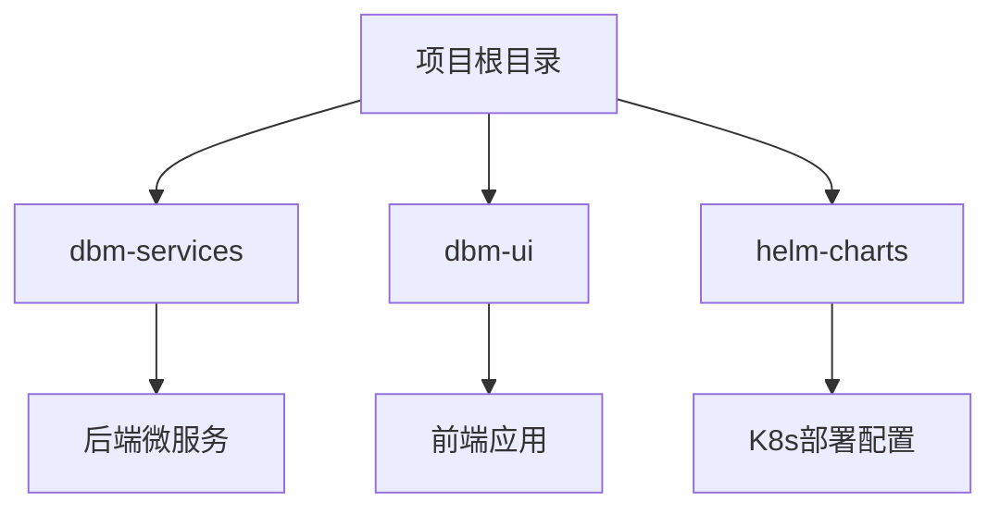
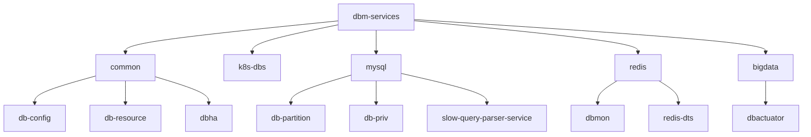
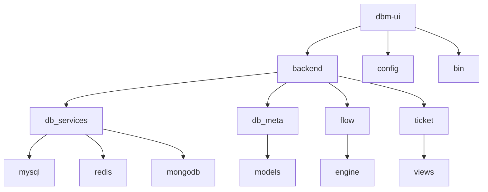
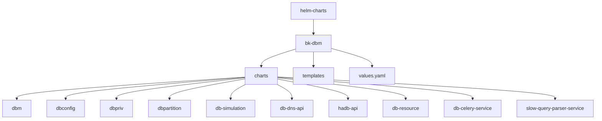
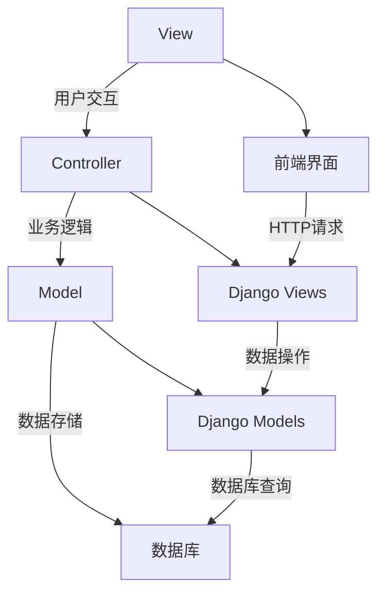

# 目录结构详解

<cite>
**本文档引用的文件**   
- [readme.md](file://readme.md)
- [dbm-ui/manage.py](file://dbm-ui/manage.py)
- [dbm-services/go.work](file://dbm-services/go.work)
- [dbm-ui/config/default.py](file://dbm-ui/config/default.py)
- [helm-charts/bk-dbm/Chart.yaml](file://helm-charts/bk-dbm/Chart.yaml)
- [dbm-services/k8s-dbs/cmd/server.go](file://dbm-services/k8s-dbs/cmd/server.go)
- [dbm-ui/backend/db_meta/models/__init__.py](file://dbm-ui/backend/db_meta/models/__init__.py)
- [dbm-ui/backend/db_services/mysql/urls.py](file://dbm-ui/backend/db_services/mysql/urls.py)
- [dbm-services/common/dbha/ha-module/ha.yaml](file://dbm-services/common/dbha/ha-module/ha.yaml)
</cite>

## 目录结构

- [引言](#引言)
- [项目总体结构](#项目总体结构)
- [dbm-services 目录分析](#dbm-services-目录分析)
- [dbm-ui 目录分析](#dbm-ui-目录分析)
- [helm-charts 目录分析](#helm-charts-目录分析)
- [核心功能模块与目录映射](#核心功能模块与目录映射)
- [项目架构与MVC模式](#项目架构与mvc模式)
- [新贡献者导航指南](#新贡献者导航指南)
- [结论](#结论)

## 引言

蓝鲸数据库管理平台（BlueKing-DBM）是一个集成了多种数据库组件全生命周期管理的综合性平台。本文档旨在深入解析项目的目录结构，帮助开发者和新贡献者快速理解项目架构，定位关键代码，提高开发效率。

**Section sources**
- [readme.md](file://readme.md)

## 项目总体结构

项目根目录包含三个主要部分：`dbm-services`（后端微服务）、`dbm-ui`（前端应用）和`helm-charts`（Kubernetes部署配置）。这种分层架构清晰地分离了业务逻辑、用户界面和基础设施配置。

**Diagram sources**
- [readme.md](file://readme.md)

**Section sources**
- [readme.md](file://readme.md)

## dbm-services 目录分析

`dbm-services`目录存放了所有后端微服务，采用Go语言开发，每个子目录代表一个独立的服务或工具集。

### 核心服务组件

- **common**: 存放公共组件和服务，如`db-config`（数据库配置服务）、`db-resource`（资源管理服务）、`dbha`（高可用服务）等。
- **k8s-dbs**: 基于Kubernetes的数据库服务核心，提供API服务器和控制器。
- **mysql**: MySQL相关服务，包括`db-partition`（分区管理）、`db-priv`（权限管理）、`slow-query-parser-service`（慢查询解析）等。
- **redis**: Redis相关服务，包括`dbmon`（监控）和`redis-dts`（数据传输服务）。
- **bigdata**: 大数据组件服务，如HDFS、Kafka、ES等。
- **db-tools/dbactuator**: 各数据库的自动化执行工具，支持多种数据库的部署、变更和维护操作。

**Diagram sources**
- [dbm-services/go.work](file://dbm-services/go.work)
- [readme.md](file://readme.md)

**Section sources**
- [dbm-services/go.work](file://dbm-services/go.work)
- [readme.md](file://readme.md)

## dbm-ui 目录分析

`dbm-ui`目录存放前端应用，采用Django框架构建，实现了MVC架构模式。

### 前端架构组件

- **backend**: Django后端应用，包含核心业务逻辑。
  - **db_services**: 各数据库服务的API接口，如`mysql`、`redis`、`mongodb`等。
  - **db_meta**: 数据库元数据管理，存储集群、实例、机器等核心模型。
  - **flow**: 工作流引擎，管理数据库操作的审批和执行流程。
  - **ticket**: 工单系统，处理用户提交的数据库服务请求。
- **config**: 配置文件，包含不同环境的设置。
- **bin**: 脚本工具，用于构建、部署和管理应用。
- **helm-charts**: Helm图表，用于Kubernetes部署。

**Diagram sources**
- [dbm-ui/manage.py](file://dbm-ui/manage.py)
- [dbm-ui/config/default.py](file://dbm-ui/config/default.py)

**Section sources**
- [dbm-ui/manage.py](file://dbm-ui/manage.py)
- [dbm-ui/config/default.py](file://dbm-ui/config/default.py)

## helm-charts 目录分析

`helm-charts`目录存放Kubernetes部署配置，使用Helm图表管理复杂的部署流程。

### Helm图表结构

- **bk-dbm**: 主Helm图表，依赖多个子图表。
  - **charts**: 子图表目录，包含`dbm`、`dbconfig`、`dbpriv`等服务的独立图表。
  - **templates**: Kubernetes资源模板，如Deployment、Service、ConfigMap等。
  - **values.yaml**: 默认配置值文件。

**Diagram sources**
- [helm-charts/bk-dbm/Chart.yaml](file://helm-charts/bk-dbm/Chart.yaml)

**Section sources**
- [helm-charts/bk-dbm/Chart.yaml](file://helm-charts/bk-dbm/Chart.yaml)

## 核心功能模块与目录映射

项目功能模块与目录结构紧密对应，体现了清晰的设计理念。

### 数据库管理功能

| 功能模块 | 对应目录 | 说明 |
|---------|---------|------|
| 数据库配置管理 | `dbm-services/common/db-config` | 提供数据库个性化配置服务 |
| 高可用切换 | `dbm-services/common/dbha` | 实现数据库高可用切换管理 |
| 域名管理 | `dbm-services/common/db-dns` | 提供域名解析管理服务 |
| 权限管理 | `dbm-services/mysql/db-priv` | 管理MySQL数据库权限 |
| 分区管理 | `dbm-services/mysql/db-partition` | 管理MySQL数据库分区 |

### 监控与可观测性

| 功能模块 | 对应目录 | 说明 |
|---------|---------|------|
| 全方位监控 | `dbm-ui/backend/db_monitor` | 提供数据库监控告警能力 |
| 慢查询分析 | `dbm-services/mysql/slow-query-parser-service` | 解析和分析慢查询日志 |
| 性能监控 | `dbm-ui/backend/bk_dataview` | 集成Grafana进行可视化监控 |

**Section sources**
- [readme.md](file://readme.md)
- [dbm-ui/backend/db_meta/models/__init__.py](file://dbm-ui/backend/db_meta/models/__init__.py)

## 项目架构与MVC模式

项目采用典型的MVC（Model-View-Controller）架构模式，各层职责分明。

### MVC架构实现

- **Model层**: 位于`dbm-ui/backend/db_meta/models`，定义了`Cluster`、`StorageInstance`、`Machine`等核心数据模型。
- **View层**: 位于`dbm-ui/backend/db_services/*/views`，处理用户请求并返回响应。
- **Controller层**: 由Django框架自动处理，协调Model和View之间的交互。

**Diagram sources**
- [dbm-ui/backend/db_meta/models/__init__.py](file://dbm-ui/backend/db_meta/models/__init__.py)
- [dbm-ui/backend/db_services/mysql/urls.py](file://dbm-ui/backend/db_services/mysql/urls.py)

**Section sources**
- [dbm-ui/backend/db_meta/models/__init__.py](file://dbm-ui/backend/db_meta/models/__init__.py)
- [dbm-ui/backend/db_services/mysql/urls.py](file://dbm-ui/backend/db_services/mysql/urls.py)

## 新贡献者导航指南

为帮助新贡献者快速上手，以下是关键代码的定位指南。

### 快速定位路径

1. **启动入口**:
   - 后端: `dbm-ui/manage.py`
   - 前端: `dbm-ui/backend/urls.py` (路由配置)

2. **核心服务**:
   - MySQL权限管理: `dbm-services/mysql/db-priv`
   - Redis监控: `dbm-services/redis/dbmon`
   - 高可用服务: `dbm-services/common/dbha`

3. **API接口**:
   - MySQL服务API: `dbm-ui/backend/db_services/mysql/urls.py`
   - 通用配置API: `dbm-ui/backend/components/dbconfig/`

4. **部署配置**:
   - Helm图表: `helm-charts/bk-dbm/Chart.yaml`
   - 环境配置: `dbm-ui/config/`

### 开发建议

- 修改业务逻辑时，优先在`dbm-ui/backend/db_services`中查找对应服务。
- 添加新功能时，参考现有服务的结构和模式。
- 调试问题时，查看`dbm-services`中的日志配置和监控设置。

**Section sources**
- [dbm-ui/manage.py](file://dbm-ui/manage.py)
- [dbm-ui/backend/urls.py](file://dbm-ui/backend/urls.py)
- [helm-charts/bk-dbm/Chart.yaml](file://helm-charts/bk-dbm/Chart.yaml)

## 结论

蓝鲸数据库管理平台通过清晰的目录结构和模块化设计，实现了对多种数据库组件的高效管理。`dbm-services`、`dbm-ui`和`helm-charts`三大目录分别负责业务逻辑、用户界面和基础设施配置，形成了完整的开发生命周期。新贡献者可以通过本指南快速理解项目架构，定位关键代码，为平台的持续发展贡献力量。

**Section sources**
- [readme.md](file://readme.md)