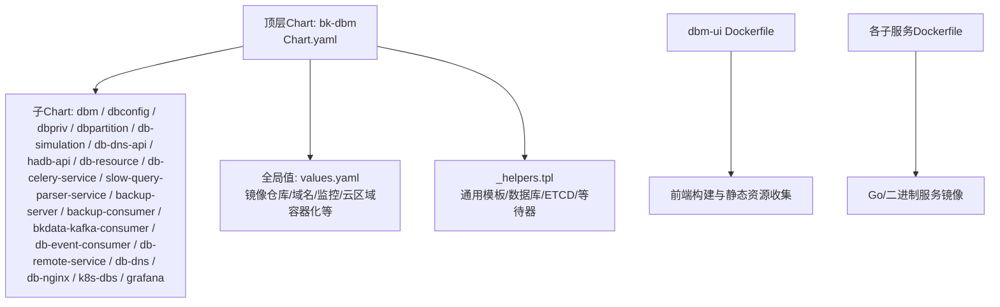
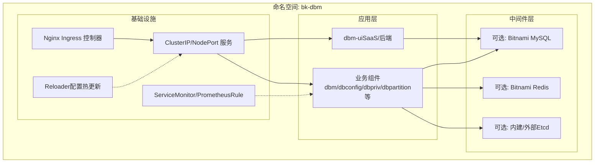
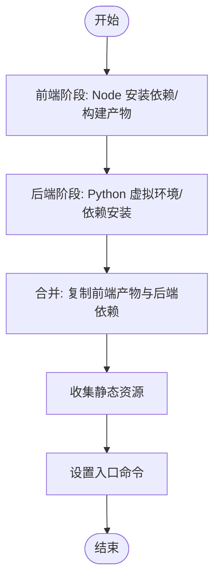
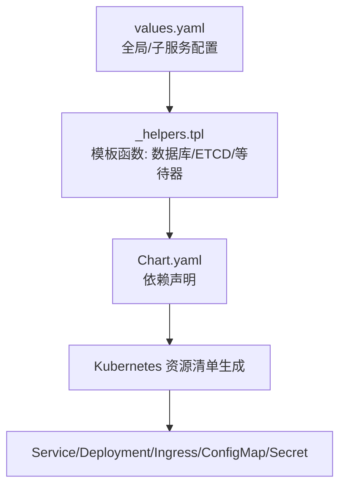
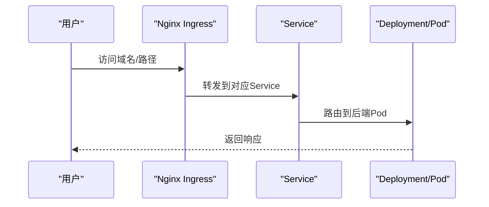
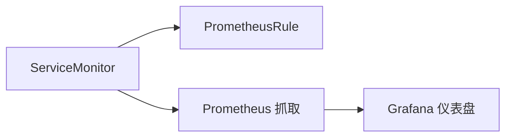

# 容器化与Kubernetes

<cite>
**本文引用的文件**
- [Chart.yaml](file://helm-charts/bk-dbm/Chart.yaml)
- [values.yaml](file://helm-charts/bk-dbm/values.yaml)
- [bkpkg.yaml](file://helm-charts/bk-dbm/bkpkg.yaml)
- [_helpers.tpl](file://helm-charts/bk-dbm/templates/_helpers.tpl)
- [Dockerfile（dbm-ui）](file://dbm-ui/Dockerfile)
- [Dockerfile（db-config）](file://dbm-services/common/db-config/Dockerfile)
- [Dockerfile（db-event-consumer）](file://dbm-services/common/db-event-consumer/Dockerfile)
- [Dockerfile（db-priv）](file://dbm-services/mysql/db-priv/Dockerfile)
- [Dockerfile（db-simulation）](file://dbm-services/mysql/db-simulation/Dockerfile)
- [ingress.yaml（db-nginx）](file://helm-charts/bk-dbm/charts/db-nginx/templates/ingress.yaml)
- [ingress.yaml（grafana）](file://helm-charts/bk-dbm/charts/grafana/templates/ingress.yaml)
- [ingress.yaml（db-simulation）](file://helm-charts/bk-dbm/charts/db-simulation/templates/ingress.yaml)
- [ingress.yaml（db-remote-service）](file://helm-charts/bk-dbm/charts/db-remote-service/templates/ingress.yaml)
- [ingress.yaml（backup-consumer）](file://helm-charts/bk-dbm/charts/backup-consumer/templates/ingress.yaml)
- [ingress.yaml（db-event-consumer）](file://helm-charts/bk-dbm/charts/db-event-consumer/templates/ingress.yaml)
- [ingress.yaml（db-celery-service）](file://helm-charts/bk-dbm/charts/db-celery-service/templates/ingress.yaml)
- [ingress.yaml（slow-query-parser-service）](file://helm-charts/bk-dbm/charts/slow-query-parser-service/templates/ingress.yaml)
- [ingress.yaml（bkdata-kafka-consumer）](file://helm-charts/bk-dbm/charts/bkdata-kafka-consumer/templates/ingress.yaml)
- [servicemonitor.yaml（grafana）](file://helm-charts/bk-dbm/charts/grafana/templates/servicemonitor.yaml)
- [prometheusrules.yaml（grafana）](file://helm-charts/bk-dbm/charts/grafana/templates/prometheusrules.yaml)
- [_affinities.tpl（grafana charts）](file://helm-charts/bk-dbm/charts/grafana/charts/common/templates/_affinities.tpl)
- [_affinities.tpl（k8s-dbs charts）](file://helm-charts/bk-dbm/charts/k8s-dbs/charts/common/templates/_affinities.tpl)
- [values.yaml（backup-server）](file://helm-charts/bk-dbm/charts/backup-server/values.yaml)
- [values.yaml（hadb-api）](file://helm-charts/bk-dbm/charts/hadb-api/values.yaml)
- [values.yaml（backup-consumer）](file://helm-charts/bk-dbm/charts/backup-consumer/values.yaml)
- [values.yaml（bkdata-kafka-consumer）](file://helm-charts/bk-dbm/charts/bkdata-kafka-consumer/values.yaml)
- [values.yaml（db-event-consumer）](file://helm-charts/bk-dbm/charts/db-event-consumer/values.yaml)
</cite>

## 目录
1. [简介](#简介)
2. [项目结构](#项目结构)
3. [核心组件](#核心组件)
4. [架构总览](#架构总览)
5. [详细组件分析](#详细组件分析)
6. [依赖关系分析](#依赖关系分析)
7. [性能考虑](#性能考虑)
8. [故障排查指南](#故障排查指南)
9. [结论](#结论)
10. [附录](#附录)

## 简介
本文件面向DBM（数据库管理）系统的容器化与Kubernetes部署，系统性阐述Docker镜像构建、Helm Chart配置与Kubernetes资源配置，覆盖服务部署、持久化存储、网络策略与安全策略、自动扩缩容、滚动更新与蓝绿部署、命名空间管理、资源配额与节点亲和性、Ingress与Service Mesh集成以及监控配置。内容基于仓库中现有的Helm Chart与各子模块的Dockerfile进行归纳总结，并通过图示帮助读者快速建立整体认知。

## 项目结构
DBM采用“顶层Helm Chart + 多子Chart”的分层结构，统一编排后端服务、中间件与周边组件；前端与后端在单个镜像中打包，便于一次性部署与发布。

图表来源
- [Chart.yaml:1-108](file://helm-charts/bk-dbm/Chart.yaml#L1-L108)
- [values.yaml:1-792](file://helm-charts/bk-dbm/values.yaml#L1-L792)
- [_helpers.tpl:1-139](file://helm-charts/bk-dbm/templates/_helpers.tpl#L1-L139)
- [Dockerfile（dbm-ui）:1-102](file://dbm-ui/Dockerfile#L1-L102)
- [Dockerfile（db-config）:1-11](file://dbm-services/common/db-config/Dockerfile#L1-L11)
- [Dockerfile（db-event-consumer）:1-8](file://dbm-services/common/db-event-consumer/Dockerfile#L1-L8)
- [Dockerfile（db-priv）:1-13](file://dbm-services/mysql/db-priv/Dockerfile#L1-L13)
- [Dockerfile（db-simulation）:1-11](file://dbm-services/mysql/db-simulation/Dockerfile#L1-L11)

章节来源
- [Chart.yaml:1-108](file://helm-charts/bk-dbm/Chart.yaml#L1-L108)
- [values.yaml:1-792](file://helm-charts/bk-dbm/values.yaml#L1-L792)
- [_helpers.tpl:1-139](file://helm-charts/bk-dbm/templates/_helpers.tpl#L1-L139)
- [Dockerfile（dbm-ui）:1-102](file://dbm-ui/Dockerfile#L1-L102)
- [Dockerfile（db-config）:1-11](file://dbm-services/common/db-config/Dockerfile#L1-L11)
- [Dockerfile（db-event-consumer）:1-8](file://dbm-services/common/db-event-consumer/Dockerfile#L1-L8)
- [Dockerfile（db-priv）:1-13](file://dbm-services/mysql/db-priv/Dockerfile#L1-L13)
- [Dockerfile（db-simulation）:1-11](file://dbm-services/mysql/db-simulation/Dockerfile#L1-L11)

## 核心组件
- 顶层Chart与依赖：顶层Chart声明了对Bitnami MySQL/Redis/Etcd以及Stakater Reloader、本地grafana等子Chart的依赖，并通过条件开关控制启用范围。
- 全局配置：values.yaml集中定义镜像仓库、域名、监控、云区域容器化、等待器镜像等全局参数。
- 服务编排：dbm、dbconfig、dbpriv、dbpartition、db-simulation、db-dns-api、hadb-api、db-resource、db-celery-service、slow-query-parser-service、backup-server、backup-consumer、bkdata-kafka-consumer、db-event-consumer、db-remote-service、db-dns、db-nginx、k8s-dbs等子Chart按需启用。
- 辅助模板：_helpers.tpl提供通用名称、标签、数据库/ETCD连接信息、k8s-wait-for等待器等模板函数，统一编排顺序与依赖注入。

章节来源
- [Chart.yaml:1-108](file://helm-charts/bk-dbm/Chart.yaml#L1-L108)
- [values.yaml:1-792](file://helm-charts/bk-dbm/values.yaml#L1-L792)
- [_helpers.tpl:65-139](file://helm-charts/bk-dbm/templates/_helpers.tpl#L65-L139)

## 架构总览
DBM在Kubernetes中的部署以Helm Chart为核心，结合Ingress暴露服务，通过ServiceMonitor/PrometheusRule对接监控，利用Reloader实现配置热更新，借助等待器确保依赖服务就绪。

图表来源
- [Chart.yaml:1-108](file://helm-charts/bk-dbm/Chart.yaml#L1-L108)
- [values.yaml:135-178](file://helm-charts/bk-dbm/values.yaml#L135-L178)
- [values.yaml:602-610](file://helm-charts/bk-dbm/values.yaml#L602-L610)
- [servicemonitor.yaml（grafana）:1-27](file://helm-charts/bk-dbm/charts/grafana/templates/servicemonitor.yaml#L1-L27)
- [prometheusrules.yaml（grafana）:1-24](file://helm-charts/bk-dbm/charts/grafana/templates/prometheusrules.yaml#L1-L24)

## 详细组件分析

### Docker镜像构建
- dbm-ui镜像：多阶段构建，前端使用Node，后端使用Python，最终合并静态资源与运行时依赖，支持静态文件收集与入口命令。
- 各子服务镜像：db-config、db-event-consumer、db-priv、db-simulation等均采用精简基础镜像，拷贝二进制或脚本并设置入口命令。

图表来源
- [Dockerfile（dbm-ui）:12-102](file://dbm-ui/Dockerfile#L12-L102)

章节来源
- [Dockerfile（dbm-ui）:1-102](file://dbm-ui/Dockerfile#L1-L102)
- [Dockerfile（db-config）:1-11](file://dbm-services/common/db-config/Dockerfile#L1-L11)
- [Dockerfile（db-event-consumer）:1-8](file://dbm-services/common/db-event-consumer/Dockerfile#L1-L8)
- [Dockerfile（db-priv）:1-13](file://dbm-services/mysql/db-priv/Dockerfile#L1-L13)
- [Dockerfile（db-simulation）:1-11](file://dbm-services/mysql/db-simulation/Dockerfile#L1-L11)

### Helm Chart配置与Kubernetes资源配置
- 顶层Chart：声明依赖、版本与应用版本，控制子Chart启停。
- 全局值：镜像仓库、域名、监控开关、云区域容器化、等待器镜像与拉取策略等。
- 子Chart值：每个子服务均有独立values，包含镜像、环境变量、Ingress、资源请求/限制、HPA、节点选择、容忍度、亲和性等。

图表来源
- [Chart.yaml:1-108](file://helm-charts/bk-dbm/Chart.yaml#L1-L108)
- [values.yaml:1-792](file://helm-charts/bk-dbm/values.yaml#L1-L792)
- [_helpers.tpl:1-139](file://helm-charts/bk-dbm/templates/_helpers.tpl#L1-L139)

章节来源
- [Chart.yaml:1-108](file://helm-charts/bk-dbm/Chart.yaml#L1-L108)
- [values.yaml:1-792](file://helm-charts/bk-dbm/values.yaml#L1-L792)
- [_helpers.tpl:1-139](file://helm-charts/bk-dbm/templates/_helpers.tpl#L1-L139)

### 服务部署与Ingress配置
- Ingress：db-nginx、grafana、db-simulation、db-remote-service、backup-consumer、db-event-consumer、db-celery-service、slow-query-parser-service、bkdata-kafka-consumer等子Chart均提供Ingress模板，支持不同版本API与注解。
- 主机名与路径：values中定义了多个Ingress主机名与路径，便于多域名接入。
- TLS：Ingress模板支持TLS配置，可按需启用。

图表来源
- [ingress.yaml（db-nginx）:1-40](file://helm-charts/bk-dbm/charts/db-nginx/templates/ingress.yaml#L1-L40)
- [ingress.yaml（grafana）:53-66](file://helm-charts/bk-dbm/charts/grafana/templates/ingress.yaml#L53-L66)
- [ingress.yaml（db-simulation）:34-61](file://helm-charts/bk-dbm/charts/db-simulation/templates/ingress.yaml#L34-L61)
- [ingress.yaml（db-remote-service）:34-61](file://helm-charts/bk-dbm/charts/db-remote-service/templates/ingress.yaml#L34-L61)
- [ingress.yaml（backup-consumer）:34-61](file://helm-charts/bk-dbm/charts/backup-consumer/templates/ingress.yaml#L34-L61)
- [ingress.yaml（db-event-consumer）:34-61](file://helm-charts/bk-dbm/charts/db-event-consumer/templates/ingress.yaml#L34-L61)
- [ingress.yaml（db-celery-service）:34-61](file://helm-charts/bk-dbm/charts/db-celery-service/templates/ingress.yaml#L34-L61)
- [ingress.yaml（slow-query-parser-service）:34-61](file://helm-charts/bk-dbm/charts/slow-query-parser-service/templates/ingress.yaml#L34-L61)
- [ingress.yaml（bkdata-kafka-consumer）:34-61](file://helm-charts/bk-dbm/charts/bkdata-kafka-consumer/templates/ingress.yaml#L34-L61)

章节来源
- [values.yaml:135-178](file://helm-charts/bk-dbm/values.yaml#L135-L178)

### 持久化存储
- MySQL：Bitnami MySQL提供持久化配置，可通过values设置StorageClass与大小。
- Redis：可配置持久化大小与资源限制。
- Grafana：默认不启用持久化，可按需开启。
- 其他组件：如备份服务器等，可在各自values中配置持久化与存储参数。

章节来源
- [values.yaml:612-691](file://helm-charts/bk-dbm/values.yaml#L612-L691)
- [values.yaml:340-359](file://helm-charts/bk-dbm/values.yaml#L340-L359)

### 网络策略与安全策略
- Ingress注解：通过注解配置代理体大小、真实IP等，满足安全与性能需求。
- TLS：Ingress模板支持TLS，可结合证书管理器或自签名证书。
- ServiceAccount：dbm服务定义了独立的ServiceAccount，便于RBAC授权。
- RBAC：建议在集群层面为各组件创建对应的Role/ClusterRole与Binding，限定最小权限。

章节来源
- [values.yaml:135-178](file://helm-charts/bk-dbm/values.yaml#L135-L178)
- [values.yaml:102-108](file://helm-charts/bk-dbm/values.yaml#L102-L108)

### 自动扩缩容（HPA）
- 子Chart的values中普遍提供autoscaling字段，默认关闭，可按需启用并设置CPU/内存阈值与副本范围。
- 建议针对高并发组件（如db-celery-service、bkdata-kafka-consumer、db-event-consumer）启用HPA。

章节来源
- [values.yaml（backup-server）:66-77](file://helm-charts/bk-dbm/charts/backup-server/values.yaml#L66-L77)
- [values.yaml（hadb-api）:72-78](file://helm-charts/bk-dbm/charts/hadb-api/values.yaml#L72-L78)
- [values.yaml（backup-consumer）:72-78](file://helm-charts/bk-dbm/charts/backup-consumer/values.yaml#L72-L78)
- [values.yaml（bkdata-kafka-consumer）:72-78](file://helm-charts/bk-dbm/charts/bkdata-kafka-consumer/values.yaml#L72-L78)
- [values.yaml（db-event-consumer）:72-78](file://helm-charts/bk-dbm/charts/db-event-consumer/values.yaml#L72-L78)

### 滚动更新与蓝绿部署
- 滚动更新：Kubernetes原生Deployment支持RollingUpdate策略，建议在values中设置合适的maxUnavailable与maxSurge。
- 蓝绿部署：可通过两套Deployment+双Service的方式实现，或结合Istio/ASM进行流量切换（见Service Mesh集成）。

[本节为通用实践说明，不直接分析具体文件]

### 命名空间管理、资源配额与节点亲和性
- 命名空间：建议将dbm-ui与各子服务置于同一命名空间，便于统一管理。
- 资源配额：可在命名空间上设置ResourceQuota与LimitRange，约束总体资源占用。
- 节点亲和性：通过affinity与tolerations限制Pod调度到特定节点或容忍污点。
- Pod亲和性：可利用软/硬亲和规则提升同组件Pod的分布质量。

章节来源
- [_affinities.tpl（grafana charts）:1-77](file://helm-charts/bk-dbm/charts/grafana/charts/common/templates/_affinities.tpl#L1-L77)
- [_affinities.tpl（k8s-dbs charts）:1-77](file://helm-charts/bk-dbm/charts/k8s-dbs/charts/common/templates/_affinities.tpl#L1-L77)

### Service Mesh集成
- 可在现有Ingress与Service基础上引入Istio/ASM，通过VirtualService/destinationRule实现灰度、金丝雀与蓝绿发布。
- 建议为高可用与可观测性开启mTLS与Telemetry。

[本节为概念性说明，不直接分析具体文件]

### 监控配置
- ServiceMonitor：grafana子Chart提供ServiceMonitor模板，用于Prometheus抓取指标。
- PrometheusRule：可定义告警规则，结合Grafana仪表盘展示。
- 监控平台：values中提供监控平台URL与令牌，便于统一接入。

图表来源
- [servicemonitor.yaml（grafana）:1-27](file://helm-charts/bk-dbm/charts/grafana/templates/servicemonitor.yaml#L1-L27)
- [prometheusrules.yaml（grafana）:1-24](file://helm-charts/bk-dbm/charts/grafana/templates/prometheusrules.yaml#L1-L24)
- [values.yaml:59-67](file://helm-charts/bk-dbm/values.yaml#L59-L67)

章节来源
- [servicemonitor.yaml（grafana）:1-27](file://helm-charts/bk-dbm/charts/grafana/templates/servicemonitor.yaml#L1-L27)
- [prometheusrules.yaml（grafana）:1-24](file://helm-charts/bk-dbm/charts/grafana/templates/prometheusrules.yaml#L1-L24)
- [values.yaml:59-67](file://helm-charts/bk-dbm/values.yaml#L59-L67)

## 依赖关系分析
顶层Chart对多个子Chart存在条件依赖，且通过全局值控制启用范围；子Chart内部也存在对Bitnami组件（MySQL/Redis/Etcd）与Reloader的依赖。

```mermaid
graph TB
Root["bk-dbm Chart"] --> DBM["dbm"]
Root --> DBCFG["dbconfig"]
Root --> DBPRIV["dbpriv"]
Root --> DBPART["dbpartition"]
Root --> DBSIM["db-simulation"]
Root --> DBDNSAPI["db-dns-api"]
Root --> HADB["hadb-api"]
Root --> DBRES["db-resource"]
Root --> CELERY["db-celery-service"]
Root --> SLOW["slow-query-parser-service"]
Root --> BACKUP["backup-server"]
Root --> BKCNS["bkdata-kafka-consumer"]
Root --> EVTCNS["db-event-consumer"]
Root --> REMOTE["db-remote-service"]
Root --> DNS["db-dns"]
Root --> NGINX["db-nginx"]
Root --> K8SDBS["k8s-dbs"]
Root --> GRAFANA["grafana"]
Root --> MYSQL["bitnami/mysql"]
Root --> REDIS["bitnami/redis"]
Root --> ETCD["bitnami/etcd"]
Root --> RELOADER["stakater/reloader"]
```

图表来源
- [Chart.yaml:2-102](file://helm-charts/bk-dbm/Chart.yaml#L2-L102)

章节来源
- [Chart.yaml:1-108](file://helm-charts/bk-dbm/Chart.yaml#L1-L108)

## 性能考虑
- 资源请求/限制：为各组件设置合理的requests/limits，避免资源争抢。
- HPA：针对高并发组件启用HPA，结合CPU/内存阈值动态扩容。
- Ingress优化：合理设置代理体大小与超时，减少大文件传输失败。
- 存储：MySQL/Redis持久化应使用高性能StorageClass，并预留足够容量。
- 镜像：使用多阶段构建减少镜像体积，缩短拉取时间。

[本节提供通用指导，不直接分析具体文件]

## 故障排查指南
- 依赖等待：通过k8s-wait-for等待器确保依赖服务就绪，避免启动顺序问题。
- 配置热更新：使用Reloader监听ConfigMap/Secret变更，触发滚动更新。
- Ingress异常：检查Ingress注解与API版本兼容性，确认TLS与主机名配置。
- 监控缺失：确认ServiceMonitor是否启用，Prometheus是否正确抓取指标。

章节来源
- [_helpers.tpl:124-139](file://helm-charts/bk-dbm/templates/_helpers.tpl#L124-L139)
- [values.yaml:602-610](file://helm-charts/bk-dbm/values.yaml#L602-L610)

## 结论
DBM的容器化与Kubernetes部署以Helm Chart为核心，结合多阶段镜像构建、完善的Ingress与监控配置、以及可选的中间件与Reloader，实现了高可用、可扩展、可观测的数据库管理平台。通过合理的资源规划、节点亲和性与HPA策略，可进一步提升系统稳定性与弹性。

## 附录
- 包依赖：bkpkg.yaml定义了与网关、监控、日志、GSE、作业平台、配置平台等的依赖关系，便于统一交付与升级。

章节来源
- [bkpkg.yaml:1-28](file://helm-charts/bk-dbm/bkpkg.yaml#L1-L28)