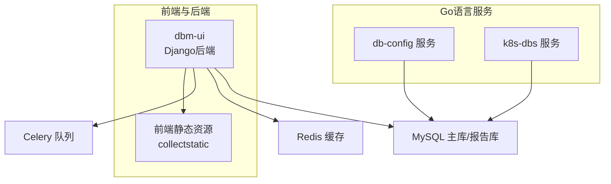
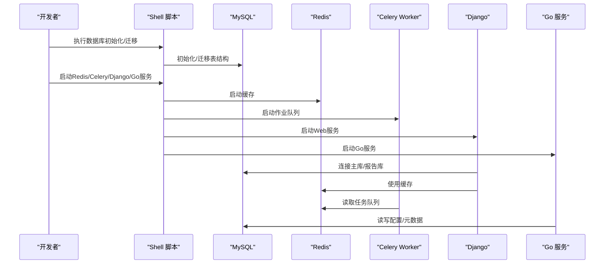
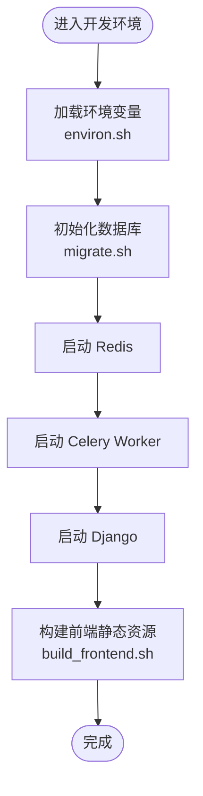
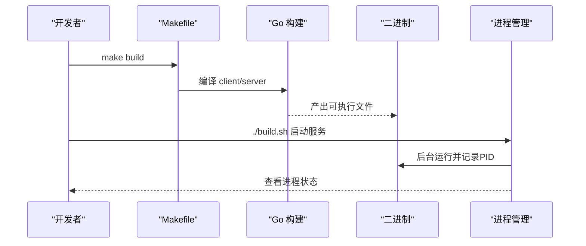
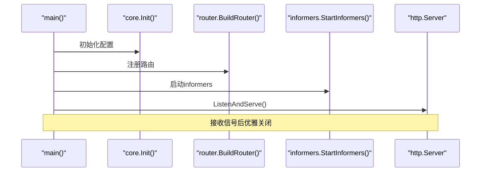
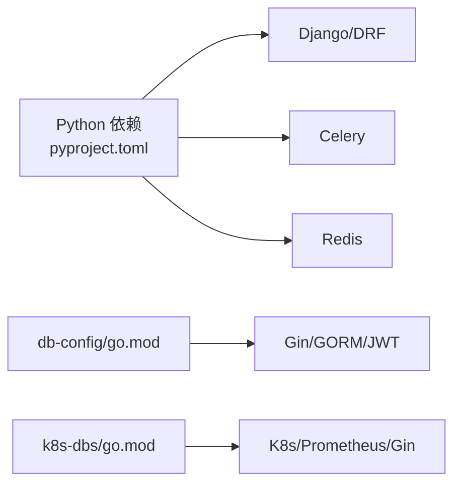

# 本地开发部署

<cite>
**本文引用的文件**
- [readme.md](file://readme.md)
- [dbm-ui/pyproject.toml](file://dbm-ui/pyproject.toml)
- [dbm-ui/config/default.py](file://dbm-ui/config/default.py)
- [dbm-ui/config/dev.py](file://dbm-ui/config/dev.py)
- [dbm-ui/manage.py](file://dbm-ui/manage.py)
- [dbm-ui/bin/environ.sh](file://dbm-ui/bin/environ.sh)
- [dbm-ui/bin/manage.sh](file://dbm-ui/bin/manage.sh)
- [dbm-ui/bin/migrate.sh](file://dbm-ui/bin/migrate.sh)
- [dbm-ui/bin/makemigrations.sh](file://dbm-ui/bin/makemigrations.sh)
- [dbm-ui/bin/build_frontend.sh](file://dbm-ui/bin/build_frontend.sh)
- [dbm-ui/bin/celery.sh](file://dbm-ui/bin/celery.sh)
- [dbm-services/common/db-config/go.mod](file://dbm-services/common/db-config/go.mod)
- [dbm-services/common/db-config/Makefile](file://dbm-services/common/db-config/Makefile)
- [dbm-services/common/db-config/build.sh](file://dbm-services/common/db-config/build.sh)
- [dbm-services/k8s-dbs/go.mod](file://dbm-services/k8s-dbs/go.mod)
- [dbm-services/k8s-dbs/cmd/server.go](file://dbm-services/k8s-dbs/cmd/server.go)
</cite>

## 目录
1. [简介](#简介)
2. [项目结构](#项目结构)
3. [核心组件](#核心组件)
4. [架构总览](#架构总览)
5. [详细组件分析](#详细组件分析)
6. [依赖分析](#依赖分析)
7. [性能考虑](#性能考虑)
8. [故障排查指南](#故障排查指南)
9. [结论](#结论)
10. [附录](#附录)

## 简介
本指南面向DBM本地开发与部署，覆盖Python/Django后端、Go语言服务、数据库初始化、Redis缓存、消息队列（Celery）与前端构建的完整流程。内容基于仓库中的配置与脚本，帮助你在本地快速搭建可运行的开发环境。

## 项目结构
DBM采用前后端分离与多语言混合架构：
- 前端与后端：dbm-ui 提供Django后端与前端静态资源聚合
- Go语言服务：dbm-services 下包含多个独立Go子项目，如db-config、k8s-dbs等
- 数据库：MySQL主从与报告统计库分库
- 缓存与消息：Redis缓存、Celery任务队列

图表来源
- [dbm-ui/config/default.py:231-286](file://dbm-ui/config/default.py#L231-L286)
- [dbm-ui/config/default.py:293-309](file://dbm-ui/config/default.py#L293-L309)
- [dbm-services/common/db-config/go.mod:1-114](file://dbm-services/common/db-config/go.mod#L1-L114)
- [dbm-services/k8s-dbs/go.mod:1-260](file://dbm-services/k8s-dbs/go.mod#L1-L260)

章节来源
- [readme.md:23-25](file://readme.md#L23-L25)

## 核心组件
- Django后端：负责API、权限、审计、任务调度、静态资源托管
- Celery：异步任务与定时任务
- Redis：缓存与会话存储
- MySQL：主库与报告库
- Go服务：db-config、k8s-dbs等独立服务
- 前端：打包后的静态资源由Django托管

章节来源
- [dbm-ui/config/default.py:78-149](file://dbm-ui/config/default.py#L78-L149)
- [dbm-ui/config/default.py:293-309](file://dbm-ui/config/default.py#L293-L309)
- [dbm-ui/config/default.py:470-482](file://dbm-ui/config/default.py#L470-L482)
- [dbm-ui/pyproject.toml:8-89](file://dbm-ui/pyproject.toml#L8-L89)

## 架构总览
下图展示本地开发环境的启动顺序与组件交互：

图表来源
- [dbm-ui/bin/migrate.sh:1-5](file://dbm-ui/bin/migrate.sh#L1-L5)
- [dbm-ui/bin/celery.sh:1-8](file://dbm-ui/bin/celery.sh#L1-L8)
- [dbm-services/common/db-config/build.sh:10-18](file://dbm-services/common/db-config/build.sh#L10-L18)
- [dbm-services/k8s-dbs/cmd/server.go:53-77](file://dbm-services/k8s-dbs/cmd/server.go#L53-L77)

## 详细组件分析

### Python/Django 后端
- 环境与依赖
  - Python版本与依赖由Poetry管理，包含Django、DRF、Celery、Redis、跨域、调试工具等
  - 生产与开发配置分离，开发模式下允许跨域、调试工具等
- 启动方式
  - 通过manage.py或封装脚本启动
  - 支持收集静态资源与迁移命令
- 数据库与缓存
  - 主库与报告库双库配置，连接池参数可调
  - Redis缓存与JSON序列化器
- 消息队列
  - Celery Broker由环境变量配置，时区与调度器设置明确

图表来源
- [dbm-ui/bin/environ.sh:1-12](file://dbm-ui/bin/environ.sh#L1-L12)
- [dbm-ui/bin/migrate.sh:1-5](file://dbm-ui/bin/migrate.sh#L1-L5)
- [dbm-ui/bin/build_frontend.sh:1-16](file://dbm-ui/bin/build_frontend.sh#L1-L16)
- [dbm-ui/bin/celery.sh:1-8](file://dbm-ui/bin/celery.sh#L1-L8)

章节来源
- [dbm-ui/pyproject.toml:8-89](file://dbm-ui/pyproject.toml#L8-L89)
- [dbm-ui/config/default.py:231-286](file://dbm-ui/config/default.py#L231-L286)
- [dbm-ui/config/default.py:293-309](file://dbm-ui/config/default.py#L293-L309)
- [dbm-ui/config/default.py:470-482](file://dbm-ui/config/default.py#L470-L482)
- [dbm-ui/config/dev.py:14-77](file://dbm-ui/config/dev.py#L14-L77)
- [dbm-ui/manage.py:10-27](file://dbm-ui/manage.py#L10-L27)
- [dbm-ui/bin/environ.sh:1-12](file://dbm-ui/bin/environ.sh#L1-L12)
- [dbm-ui/bin/migrate.sh:1-5](file://dbm-ui/bin/migrate.sh#L1-L5)
- [dbm-ui/bin/makemigrations.sh:1-4](file://dbm-ui/bin/makemigrations.sh#L1-L4)
- [dbm-ui/bin/build_frontend.sh:1-16](file://dbm-ui/bin/build_frontend.sh#L1-L16)
- [dbm-ui/bin/celery.sh:1-8](file://dbm-ui/bin/celery.sh#L1-L8)

### Go语言服务（db-config）
- 依赖与模块
  - 使用Go 1.24，依赖Gin、GORM、JWT、OpenTelemetry等
- 构建与运行
  - Makefile提供client/server构建目标，支持发布镜像
  - build.sh执行单元测试、生成文档、编译并以后台进程方式启动服务
- 配置要点
  - 通过环境变量注入版本与Git Hash
  - 服务监听地址与端口可在二进制中配置（依据构建产物）

图表来源
- [dbm-services/common/db-config/Makefile:1-58](file://dbm-services/common/db-config/Makefile#L1-L58)
- [dbm-services/common/db-config/build.sh:1-18](file://dbm-services/common/db-config/build.sh#L1-L18)
- [dbm-services/common/db-config/go.mod:1-114](file://dbm-services/common/db-config/go.mod#L1-L114)

章节来源
- [dbm-services/common/db-config/go.mod:1-114](file://dbm-services/common/db-config/go.mod#L1-L114)
- [dbm-services/common/db-config/Makefile:1-58](file://dbm-services/common/db-config/Makefile#L1-L58)
- [dbm-services/common/db-config/build.sh:1-18](file://dbm-services/common/db-config/build.sh#L1-L18)

### Go语言服务（k8s-dbs）
- 依赖与模块
  - 使用Go 1.24.2，集成Kubernetes客户端、Prometheus、Gin等
- 启动流程
  - main函数初始化核心配置、注册中间件、构建路由、启动informers、监听HTTP并优雅关闭

图表来源
- [dbm-services/k8s-dbs/cmd/server.go:53-77](file://dbm-services/k8s-dbs/cmd/server.go#L53-L77)

章节来源
- [dbm-services/k8s-dbs/go.mod:1-260](file://dbm-services/k8s-dbs/go.mod#L1-L260)
- [dbm-services/k8s-dbs/cmd/server.go:1-110](file://dbm-services/k8s-dbs/cmd/server.go#L1-L110)

## 依赖分析
- Python/Django
  - 依赖集中在pyproject.toml，包括Django、DRF、Celery、Redis、跨域、调试工具、对象存储等
  - 生产配置在default.py中集中管理，开发配置在dev.py中覆盖
- Go服务
  - db-config与k8s-dbs各自维护go.mod，声明第三方依赖
  - Makefile统一构建流程，build.sh负责本地快速启动

图表来源
- [dbm-ui/pyproject.toml:8-89](file://dbm-ui/pyproject.toml#L8-L89)
- [dbm-ui/config/default.py:470-482](file://dbm-ui/config/default.py#L470-L482)
- [dbm-services/common/db-config/go.mod:1-114](file://dbm-services/common/db-config/go.mod#L1-L114)
- [dbm-services/k8s-dbs/go.mod:1-260](file://dbm-services/k8s-dbs/go.mod#L1-L260)

章节来源
- [dbm-ui/pyproject.toml:8-89](file://dbm-ui/pyproject.toml#L8-L89)
- [dbm-ui/config/default.py:470-482](file://dbm-ui/config/default.py#L470-L482)
- [dbm-services/common/db-config/go.mod:1-114](file://dbm-services/common/db-config/go.mod#L1-L114)
- [dbm-services/k8s-dbs/go.mod:1-260](file://dbm-services/k8s-dbs/go.mod#L1-L260)

## 性能考虑
- 数据库连接池
  - 默认池大小与溢出参数可在配置中调整，避免高并发下的连接争用
- 缓存策略
  - Redis序列化与最大条目数限制，注意热点键与内存占用
- 异步任务
  - Celery队列分区与并发度需结合业务负载评估
- 前端构建
  - 增大Node内存以提升构建速度，避免频繁清理缓存

## 故障排查指南
- 数据库无法连接
  - 检查环境变量与数据库配置，确认主机、端口、账号、密码正确
  - 使用migrate脚本执行迁移，确保表结构存在
- Redis未启动或连接失败
  - 确认Redis服务可用，检查连接串与序列化器配置
- Celery任务无响应
  - 检查Broker配置与队列名称，确认Worker已启动
- 前端静态资源缺失
  - 执行前端构建脚本并重新收集静态资源
- Go服务启动失败
  - 查看构建日志与进程PID文件，确认二进制可执行与端口未被占用

章节来源
- [dbm-ui/bin/environ.sh:1-12](file://dbm-ui/bin/environ.sh#L1-L12)
- [dbm-ui/bin/migrate.sh:1-5](file://dbm-ui/bin/migrate.sh#L1-L5)
- [dbm-ui/bin/build_frontend.sh:1-16](file://dbm-ui/bin/build_frontend.sh#L1-L16)
- [dbm-ui/bin/celery.sh:1-8](file://dbm-ui/bin/celery.sh#L1-L8)
- [dbm-services/common/db-config/build.sh:1-18](file://dbm-services/common/db-config/build.sh#L1-L18)

## 结论
通过本指南，你可以完成DBM本地开发环境的准备与启动：安装Python与Go依赖、初始化数据库与Redis、启动Django与Celery、构建前端静态资源，并运行db-config与k8s-dbs等Go服务。遇到问题时，可依据故障排查章节逐项定位。

## 附录
- 开发环境变量示例
  - 应用ID、Token、日志目录、数据库库名、Redis连接串、Broker URL等
- 常用命令
  - 迁移：./bin/migrate.sh
  - 前端构建：./bin/build_frontend.sh
  - Celery：./bin/celery.sh
  - Go服务：make build && ./build.sh

章节来源
- [dbm-ui/bin/environ.sh:1-12](file://dbm-ui/bin/environ.sh#L1-L12)
- [dbm-ui/bin/migrate.sh:1-5](file://dbm-ui/bin/migrate.sh#L1-L5)
- [dbm-ui/bin/build_frontend.sh:1-16](file://dbm-ui/bin/build_frontend.sh#L1-L16)
- [dbm-ui/bin/celery.sh:1-8](file://dbm-ui/bin/celery.sh#L1-L8)
- [dbm-services/common/db-config/Makefile:1-58](file://dbm-services/common/db-config/Makefile#L1-L58)
- [dbm-services/common/db-config/build.sh:1-18](file://dbm-services/common/db-config/build.sh#L1-L18)