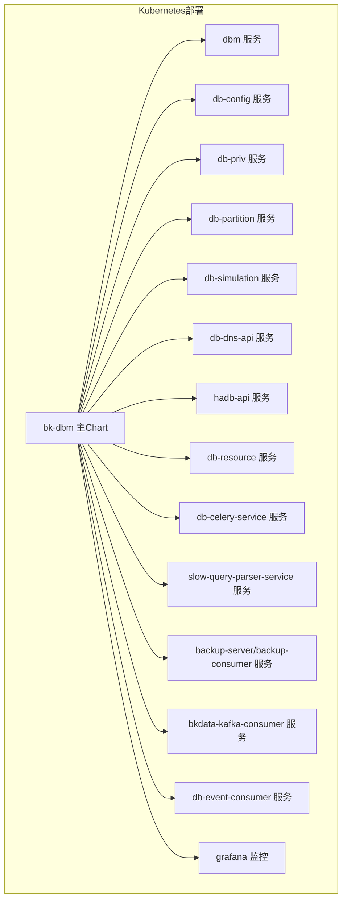
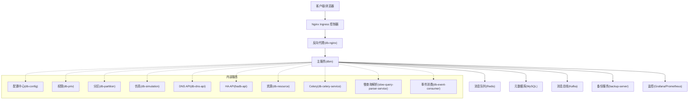
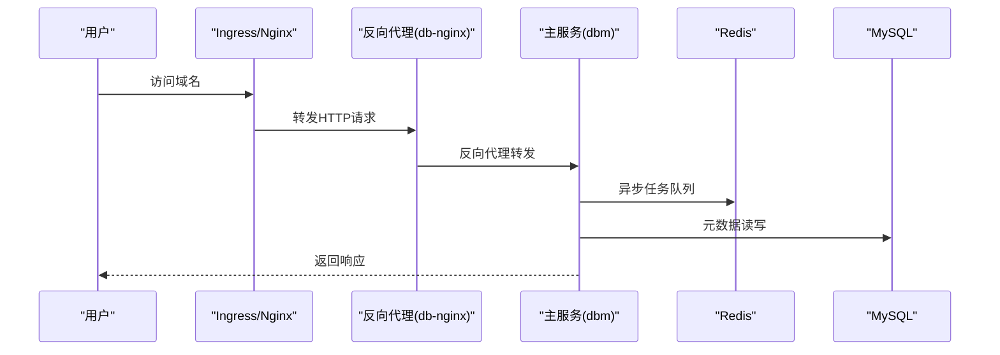
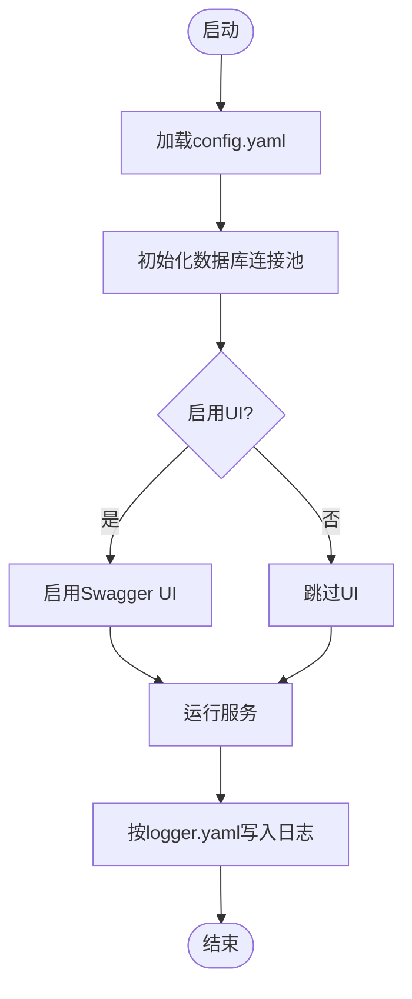
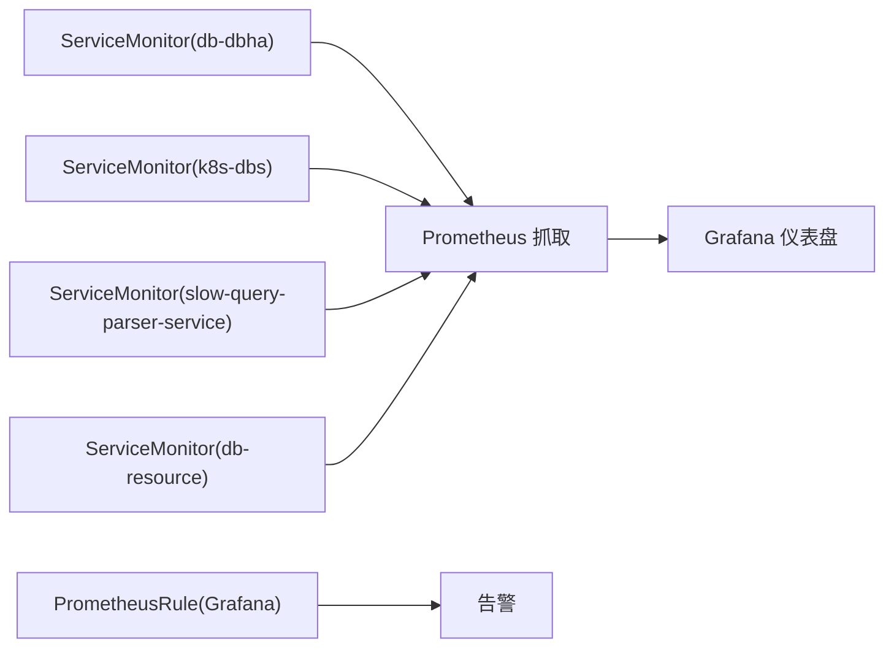
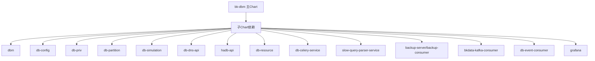

# 生产环境部署

<cite>
**本文档引用的文件**
- [Chart.yaml](file://helm-charts/bk-dbm/Chart.yaml)
- [values.yaml](file://helm-charts/bk-dbm/values.yaml)
- [deployment.yaml](file://helm-charts/bk-dbm/charts/db-simulation/templates/deployment.yaml)
- [deployment.yaml](file://helm-charts/bk-dbm/charts/db-celery-service/templates/deployment.yaml)
- [deployment.yaml](file://helm-charts/bk-dbm/charts/db-nginx/templates/deployment.yaml)
- [deployment.yaml](file://helm-charts/bk-dbm/charts/dbconfig/templates/deployment.yaml)
- [deployment.yaml](file://helm-charts/bk-dbm/charts/db-resource/templates/deployment.yaml)
- [servicemonitor.yaml](file://helm-charts/bk-dbm/charts/k8s-dbs/templates/servicemonitor.yaml)
- [servicemonitor.yaml](file://helm-charts/bk-dbm/charts/db-dbha/templates/servicemonitor.yaml)
- [servicemonitor.yaml](file://helm-charts/bk-dbm/charts/slow-query-parser-service/templates/servicemonitor.yaml)
- [servicemonitor.yaml](file://helm-charts/bk-dbm/charts/db-resource/templates/servicemonitor.yaml)
- [prometheusrules.yaml](file://helm-charts/bk-dbm/charts/grafana/templates/prometheusrules.yaml)
- [config.yaml](file://dbm-services/common/db-config/conf/config.yaml)
- [logger.yaml](file://dbm-services/common/db-config/conf/logger.yaml)
- [Dockerfile](file://dbm-ui/Dockerfile)
- [default.py](file://dbm-ui/config/default.py)
</cite>

## 目录
1. [简介](#简介)
2. [项目结构](#项目结构)
3. [核心组件](#核心组件)
4. [架构概览](#架构概览)
5. [详细组件分析](#详细组件分析)
6. [依赖关系分析](#依赖关系分析)
7. [性能考虑](#性能考虑)
8. [故障排查指南](#故障排查指南)
9. [结论](#结论)
10. [附录](#附录)

## 简介
本指南面向DBM在生产环境的部署与运维，覆盖硬件要求、软件依赖、网络配置、容器化与Kubernetes集群部署、传统服务器部署、负载均衡与SSL配置、反向代理、数据库集群与缓存/消息队列配置、部署检查清单、健康检查与故障转移策略等内容。DBM采用多模块微服务架构，通过Helm Chart统一编排，支持MySQL、Redis、大数据栈等数据库组件的全生命周期管理。

## 项目结构
DBM项目采用分层与按功能域划分的组织方式：
- helm-charts：Kubernetes部署的Helm Chart，包含主Chart与各子服务Chart
- dbm-services：后端服务模块，涵盖数据库工具、配置中心、HA、监控等
- dbm-ui：前端与后端聚合，提供Web界面与API服务
- docs：文档资源
- 其他根目录文件：CI/CD、构建脚本与README

图表来源
- [Chart.yaml:2-102](file://helm-charts/bk-dbm/Chart.yaml#L2-L102)

章节来源
- [Chart.yaml:1-108](file://helm-charts/bk-dbm/Chart.yaml#L1-L108)

## 核心组件
- 主服务（dbm）：提供SaaS与后端API、Celery工作流与定时任务
- 配置中心（db-config）：集中式配置管理与加密
- 权限与资源（db-priv、db-resource）
- 分区与仿真（db-partition、db-simulation）
- DNS与HA（db-dns-api、hadb-api、db-dbha）
- 监控与日志（grafana、ServiceMonitor、PrometheusRule）
- 备份与事件（backup-server、backup-consumer、bkdata-kafka-consumer、db-event-consumer）

章节来源
- [values.yaml:77-194](file://helm-charts/bk-dbm/values.yaml#L77-L194)
- [Chart.yaml:27-86](file://helm-charts/bk-dbm/Chart.yaml#L27-L86)

## 架构概览
DBM生产部署采用Kubernetes原生编排，结合Helm Chart实现服务发现、弹性伸缩、滚动更新与健康检查。外部流量通过Ingress进入，内部服务通过ClusterIP暴露，数据库与缓存通过外部实例或内置Chart提供。

图表来源
- [values.yaml:135-177](file://helm-charts/bk-dbm/values.yaml#L135-L177)
- [values.yaml:612-792](file://helm-charts/bk-dbm/values.yaml#L612-L792)

## 详细组件分析

### 1) 主服务（dbm）与SaaS/API
- Ingress配置：支持主站、后端API与公网域名，启用代理头与请求体大小限制
- 服务类型：ClusterIP，端口80
- 探针：就绪探针默认参数，支持自定义初始延迟、周期、超时
- 环境变量：包含Broker URL、各子服务网关域名、运行模式等
- 资源：可配置副本数、gunicorn工作进程、请求上限与抖动

图表来源
- [values.yaml:135-177](file://helm-charts/bk-dbm/values.yaml#L135-L177)
- [deployment.yaml:36-56](file://helm-charts/bk-dbm/charts/db-nginx/templates/deployment.yaml#L36-L56)

章节来源
- [values.yaml:109-134](file://helm-charts/bk-dbm/values.yaml#L109-L134)
- [deployment.yaml:36-56](file://helm-charts/bk-dbm/charts/db-nginx/templates/deployment.yaml#L36-L56)

### 2) 配置中心（db-config）
- 配置文件：监听地址、数据库连接、连接池、Swagger开关、迁移配置
- 日志配置：输出路径、格式、级别、轮转参数
- 部署：挂载ConfigMap，包含config.yaml与logger.yaml

图表来源
- [config.yaml:1-26](file://dbm-services/common/db-config/conf/config.yaml#L1-L26)
- [logger.yaml:1-18](file://dbm-services/common/db-config/conf/logger.yaml#L1-L18)
- [deployment.yaml:28-42](file://helm-charts/bk-dbm/charts/dbconfig/templates/deployment.yaml#L28-L42)

章节来源
- [config.yaml:1-26](file://dbm-services/common/db-config/conf/config.yaml#L1-L26)
- [logger.yaml:1-18](file://dbm-services/common/db-config/conf/logger.yaml#L1-L18)
- [deployment.yaml:28-42](file://helm-charts/bk-dbm/charts/dbconfig/templates/deployment.yaml#L28-L42)

### 3) Celery异步服务（db-celery-service）
- 部署：支持副本数、资源限制、就绪探针、ConfigMap挂载
- 用途：处理耗时任务、定时任务与流水线

章节来源
- [deployment.yaml:64-95](file://helm-charts/bk-dbm/charts/db-celery-service/templates/deployment.yaml#L64-L95)

### 4) 仿真服务（db-simulation）
- 部署：就绪探针、资源与ConfigMap挂载
- 用途：数据库操作仿真执行

章节来源
- [deployment.yaml:67-96](file://helm-charts/bk-dbm/charts/db-simulation/templates/deployment.yaml#L67-L96)

### 5) 反向代理（db-nginx）
- 部署：资源、环境变量、NodeSelector/亲和性/容忍度
- 用途：统一入口与静态资源代理

章节来源
- [deployment.yaml:36-56](file://helm-charts/bk-dbm/charts/db-nginx/templates/deployment.yaml#L36-L56)

### 6) 数据库与缓存外部依赖
- MySQL：通过Bitnami Chart或外部实例提供
- Redis：通过Bitnami Chart或外部实例提供
- 外部实例：在values中配置用户名、密码、主机、端口、数据库名

章节来源
- [values.yaml:612-792](file://helm-charts/bk-dbm/values.yaml#L612-L792)

### 7) 监控与告警
- ServiceMonitor：为多个服务暴露/metrics端点
- PrometheusRule：定义告警规则
- Grafana：内置监控面板与数据源

图表来源
- [servicemonitor.yaml:1-21](file://helm-charts/bk-dbm/charts/db-dbha/templates/servicemonitor.yaml#L1-L21)
- [servicemonitor.yaml:1-28](file://helm-charts/bk-dbm/charts/k8s-dbs/templates/servicemonitor.yaml#L1-L28)
- [servicemonitor.yaml:1-21](file://helm-charts/bk-dbm/charts/slow-query-parser-service/templates/servicemonitor.yaml#L1-L21)
- [servicemonitor.yaml:1-21](file://helm-charts/bk-dbm/charts/db-resource/templates/servicemonitor.yaml#L1-L21)
- [prometheusrules.yaml:1-24](file://helm-charts/bk-dbm/charts/grafana/templates/prometheusrules.yaml#L1-L24)

## 依赖关系分析
- Chart依赖：主Chart依赖多个子Chart，包括dbm、db-config、db-priv、db-partition、db-simulation、db-dns-api、hadb-api、db-resource、db-celery-service、slow-query-parser-service、backup-server、backup-consumer、bkdata-kafka-consumer、db-event-consumer、grafana等
- 内部依赖：dbm依赖Redis作为消息队列、MySQL作为元数据库；部分服务通过外部实例或内置Chart提供

图表来源
- [Chart.yaml:2-102](file://helm-charts/bk-dbm/Chart.yaml#L2-L102)

章节来源
- [Chart.yaml:1-108](file://helm-charts/bk-dbm/Chart.yaml#L1-L108)

## 性能考虑
- 资源配额：为各服务设置requests/limits，避免资源争抢
- 横向扩展：通过HPA根据CPU/Memory自动扩缩容（部分服务已内置HPA模板）
- 连接池：后端数据库连接池参数可调（最大空闲、最大打开、生命周期）
- 缓存：Redis用于消息队列与会话缓存，建议独立部署并开启持久化
- 存储：MySQL持久化卷容量与IOPS满足业务峰值

章节来源
- [deployment.yaml:1-28](file://helm-charts/bk-dbm/charts/db-resource/templates/hpa.yaml#L1-L28)
- [default.py:252-280](file://dbm-ui/config/default.py#L252-L280)

## 故障排查指南
- 健康检查失败
  - 检查就绪探针参数（初始延迟、周期、超时）
  - 查看Pod日志与容器状态
- 数据库连接异常
  - 校验外部MySQL实例连通性与凭据
  - 检查连接池参数与最大连接数
- 消息队列不可用
  - 校验Redis实例可达性与密码
  - 查看Celery Worker日志
- 监控告警
  - 检查ServiceMonitor是否正确抓取/metrics
  - 校验PrometheusRule规则与Grafana数据源

章节来源
- [deployment.yaml:67-96](file://helm-charts/bk-dbm/charts/db-simulation/templates/deployment.yaml#L67-L96)
- [deployment.yaml:64-95](file://helm-charts/bk-dbm/charts/db-celery-service/templates/deployment.yaml#L64-L95)
- [servicemonitor.yaml:1-21](file://helm-charts/bk-dbm/charts/db-dbha/templates/servicemonitor.yaml#L1-L21)
- [default.py:252-280](file://dbm-ui/config/default.py#L252-L280)

## 结论
DBM生产部署以Kubernetes为核心，通过Helm Chart实现标准化、可重复的发布流程。建议在生产环境中启用Ingress TLS、ServiceMonitor与告警规则，合理规划资源与存储，并对数据库、缓存与消息队列进行独立高可用部署，确保系统的稳定性与可维护性。

## 附录

### A. 硬件与软件要求
- 硬件
  - CPU：建议每核心≥2GHz，内存≥4GB起步，根据业务规模扩容
  - 存储：SSD优先，MySQL数据卷IOPS≥1000
- 软件
  - Kubernetes：1.20+
  - 容器运行时：Docker/CRI-O
  - Helm：3.x
  - Ingress Controller：Nginx
  - 监控：Prometheus/Grafana

### B. 网络配置
- Ingress域名：主站、后端API、公网域名三套
- 代理头：X-Forwarded-For、X-Real-IP
- 请求体大小：1024m
- TLS：建议在Ingress层启用HTTPS

章节来源
- [values.yaml:135-177](file://helm-charts/bk-dbm/values.yaml#L135-L177)

### C. Docker容器化部署要点
- 前端构建：Node.js 24.15.0，yarn安装依赖，构建产物静态文件
- 后端构建：Python 3.11.10，Poetry导出requirements，虚拟环境隔离
- 运行时：安装必要系统包，收集静态文件，ENTRYPOINT指向应用目录

章节来源
- [Dockerfile:1-102](file://dbm-ui/Dockerfile#L1-L102)

### D. Kubernetes集群部署步骤
- 准备命名空间与Secret
- 部署外部依赖（MySQL、Redis、Kafka）
- 使用Helm安装bk-dbm主Chart
- 验证Ingress、Service、Deployment状态
- 配置ServiceMonitor与告警规则

章节来源
- [Chart.yaml:1-108](file://helm-charts/bk-dbm/Chart.yaml#L1-L108)
- [values.yaml:1-792](file://helm-charts/bk-dbm/values.yaml#L1-L792)

### E. 传统服务器部署要点
- 使用Docker Compose或PM2管理进程
- 将外部依赖（MySQL、Redis、Kafka）部署在独立主机
- 配置Nginx反向代理与SSL证书
- 设置系统服务（systemd）与开机自启

### F. 负载均衡与SSL
- 负载均衡：Nginx Ingress或云厂商CLB
- SSL：Ingress TLS或边缘TLS终止
- 证书：建议使用Let's Encrypt或企业CA

章节来源
- [values.yaml:135-177](file://helm-charts/bk-dbm/values.yaml#L135-L177)

### G. 数据库集群与缓存/消息队列
- MySQL：推荐主从复制或Galera集群
- Redis：哨兵或集群模式，持久化开启
- Kafka：多副本与分区，消费者组管理

章节来源
- [values.yaml:612-792](file://helm-charts/bk-dbm/values.yaml#L612-L792)

### H. 部署检查清单
- [ ] 集群节点准备与网络连通
- [ ] 外部依赖部署与连通性测试
- [ ] Helm Chart参数校验
- [ ] Ingress与TLS配置
- [ ] ServiceMonitor与告警规则
- [ ] 资源配额与HPA
- [ ] 健康检查与探针参数
- [ ] 备份与恢复演练

### I. 健康检查与故障转移
- 就绪/存活探针：合理设置初始延迟与超时
- 故障转移：数据库主从切换、Redis哨兵切换、Kafka副本重平衡
- 监控告警：CPU、内存、磁盘、连接数、队列长度

章节来源
- [deployment.yaml:67-96](file://helm-charts/bk-dbm/charts/db-simulation/templates/deployment.yaml#L67-L96)
- [deployment.yaml:64-95](file://helm-charts/bk-dbm/charts/db-celery-service/templates/deployment.yaml#L64-L95)
- [servicemonitor.yaml:1-21](file://helm-charts/bk-dbm/charts/db-dbha/templates/servicemonitor.yaml#L1-L21)