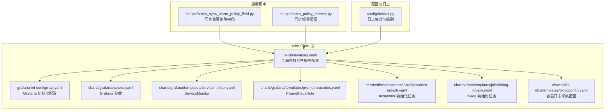
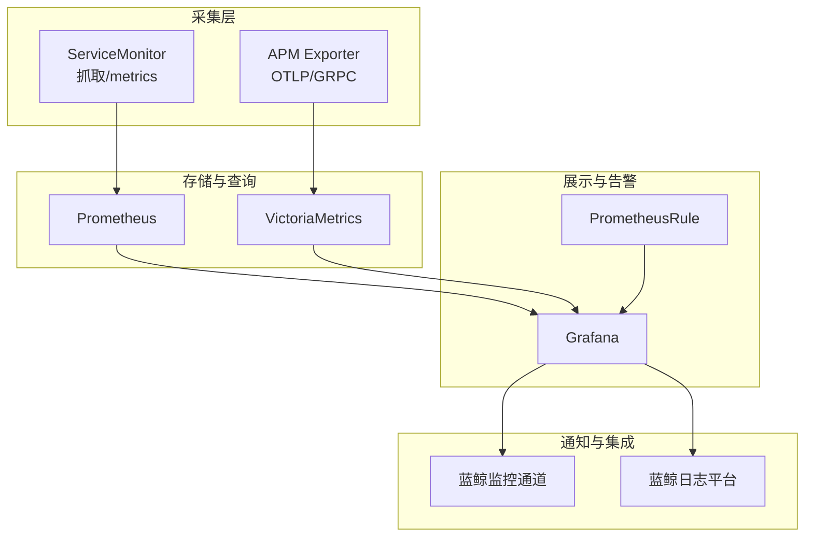
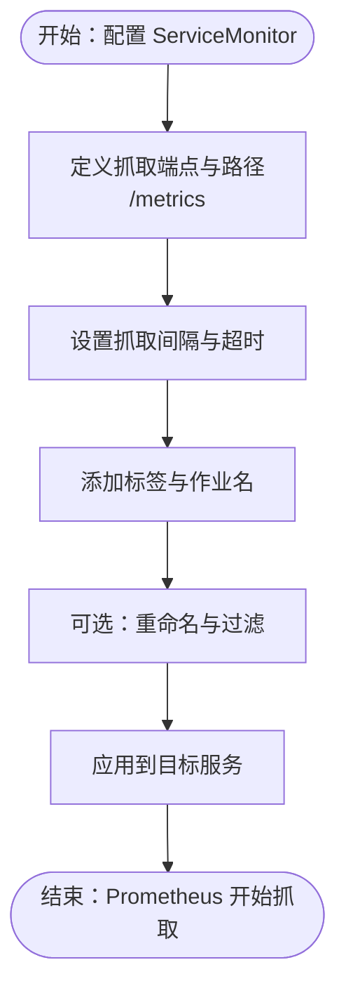
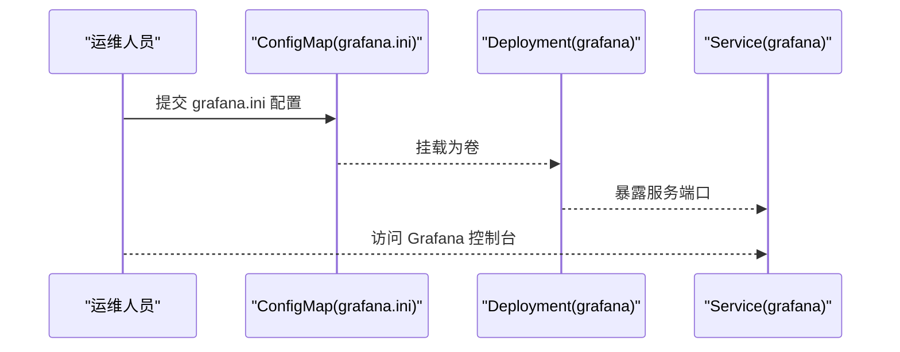
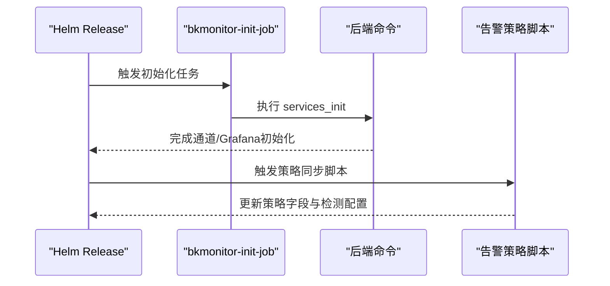
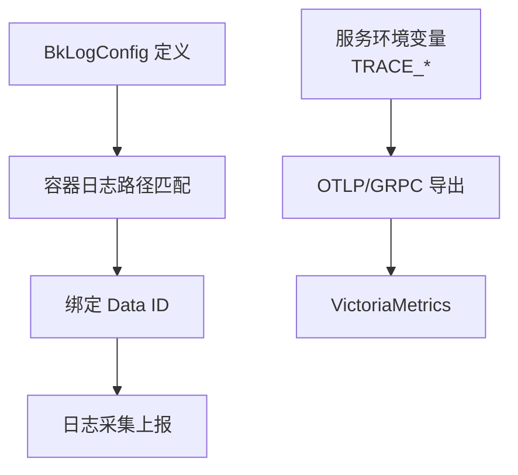
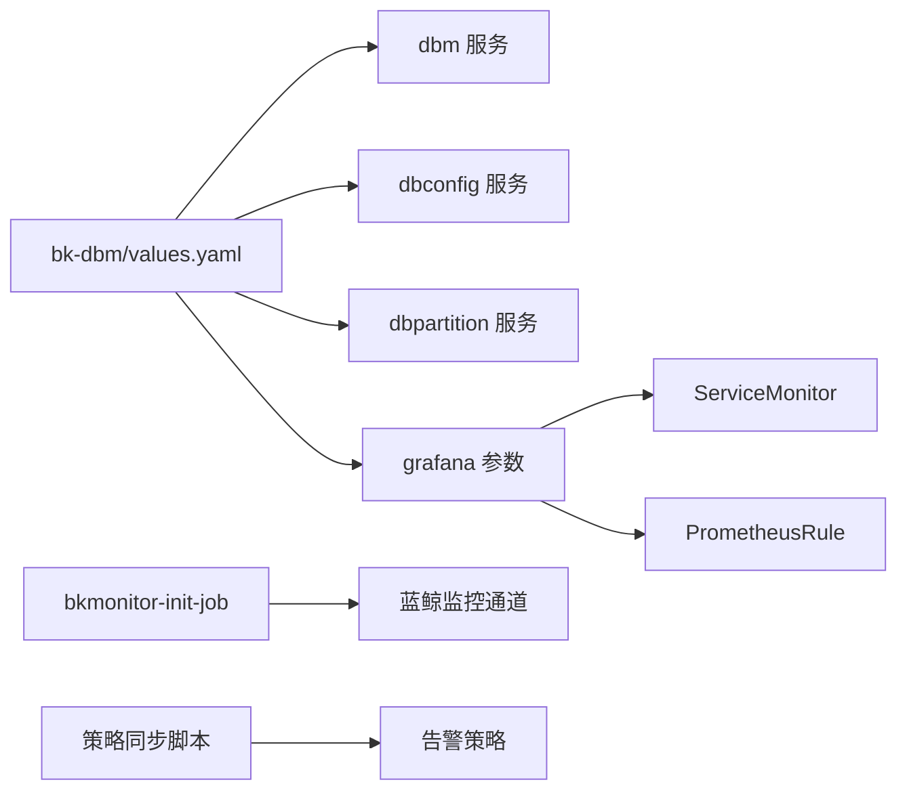

# 监控告警配置

<cite>
**本文引用的文件**
- [values.yaml](file://helm-charts/bk-dbm/values.yaml)
- [grafana-ini-configmap.yaml](file://helm-charts/bk-dbm/templates/configmaps/grafana-ini-configmap.yaml)
- [bkmonitor-init-job.yaml](file://helm-charts/bk-dbm/charts/dbm/templates/jobs/bkmonitor-init-job.yaml)
- [bklog-init-job.yaml](file://helm-charts/bk-dbm/charts/dbm/templates/jobs/bklog-init-job.yaml)
- [bklogconfig.yaml](file://helm-charts/bk-dbm/charts/k8s-dbs/templates/bklogconfig.yaml)
- [values.yaml](file://helm-charts/bk-dbm/charts/grafana/values.yaml)
- [servicemonitor.yaml](file://helm-charts/bk-dbm/charts/grafana/templates/servicemonitor.yaml)
- [deployment.yaml](file://helm-charts/bk-dbm/charts/grafana/templates/deployment.yaml)
- [prometheusrules.yaml](file://helm-charts/bk-dbm/charts/grafana/templates/prometheusrules.yaml)
- [batch_sync_alarm_policy_field.py](file://dbm-ui/scripts/batch_sync_alarm_policy_field.py)
- [batch_policy_detects.py](file://dbm-ui/scripts/batch_policy_detects.py)
- [default.py](file://dbm-ui/config/default.py)
</cite>

## 目录
1. [简介](#简介)
2. [项目结构](#项目结构)
3. [核心组件](#核心组件)
4. [架构总览](#架构总览)
5. [详细组件分析](#详细组件分析)
6. [依赖关系分析](#依赖关系分析)
7. [性能考虑](#性能考虑)
8. [故障排查指南](#故障排查指南)
9. [结论](#结论)
10. [附录](#附录)

## 简介
本指南面向DBM（蓝鲸数据库管理）平台的监控与告警配置，涵盖Prometheus指标采集、Grafana仪表板与告警规则、告警通知渠道、静默与升级策略、APM链路监控、日志聚合与分布式追踪、监控数据保留策略以及告警去噪与性能优化建议。文档基于仓库中的Helm Chart与后端脚本进行梳理，帮助读者快速完成从指标采集到告警闭环的全链路配置。

## 项目结构
DBM监控体系由以下部分组成：
- Helm Chart层：定义服务、Grafana、ServiceMonitor、PrometheusRule等资源模板与参数
- 后端脚本：负责初始化蓝鲸监控通道、同步告警策略字段、批量处理检测配置
- 配置文件：Grafana ini、日志采集配置、全局参数等

**图表来源**
- [values.yaml:1-792](file://helm-charts/bk-dbm/values.yaml#L1-L792)
- [grafana-ini-configmap.yaml:1-68](file://helm-charts/bk-dbm/templates/configmaps/grafana-ini-configmap.yaml#L1-L68)
- [values.yaml:1-800](file://helm-charts/bk-dbm/charts/grafana/values.yaml#L1-L800)
- [servicemonitor.yaml:25-50](file://helm-charts/bk-dbm/charts/grafana/templates/servicemonitor.yaml#L25-L50)
- [prometheusrules.yaml:1-24](file://helm-charts/bk-dbm/charts/grafana/templates/prometheusrules.yaml#L1-L24)
- [bkmonitor-init-job.yaml:1-34](file://helm-charts/bk-dbm/charts/dbm/templates/jobs/bkmonitor-init-job.yaml#L1-L34)
- [bklog-init-job.yaml:1-33](file://helm-charts/bk-dbm/charts/dbm/templates/jobs/bklog-init-job.yaml#L1-L33)
- [bklogconfig.yaml:1-61](file://helm-charts/bk-dbm/charts/k8s-dbs/templates/bklogconfig.yaml#L1-L61)
- [batch_sync_alarm_policy_field.py:57-146](file://dbm-ui/scripts/batch_sync_alarm_policy_field.py#L57-L146)
- [batch_policy_detects.py:32-46](file://dbm-ui/scripts/batch_policy_detects.py#L32-L46)
- [default.py:490-557](file://dbm-ui/config/default.py#L490-L557)

**章节来源**
- [values.yaml:1-792](file://helm-charts/bk-dbm/values.yaml#L1-L792)
- [grafana-ini-configmap.yaml:1-68](file://helm-charts/bk-dbm/templates/configmaps/grafana-ini-configmap.yaml#L1-L68)
- [values.yaml:1-800](file://helm-charts/bk-dbm/charts/grafana/values.yaml#L1-L800)
- [servicemonitor.yaml:25-50](file://helm-charts/bk-dbm/charts/grafana/templates/servicemonitor.yaml#L25-L50)
- [prometheusrules.yaml:1-24](file://helm-charts/bk-dbm/charts/grafana/templates/prometheusrules.yaml#L1-L24)
- [bkmonitor-init-job.yaml:1-34](file://helm-charts/bk-dbm/charts/dbm/templates/jobs/bkmonitor-init-job.yaml#L1-L34)
- [bklog-init-job.yaml:1-33](file://helm-charts/bk-dbm/charts/dbm/templates/jobs/bklog-init-job.yaml#L1-L33)
- [bklogconfig.yaml:1-61](file://helm-charts/bk-dbm/charts/k8s-dbs/templates/bklogconfig.yaml#L1-L61)
- [batch_sync_alarm_policy_field.py:57-146](file://dbm-ui/scripts/batch_sync_alarm_policy_field.py#L57-L146)
- [batch_policy_detects.py:32-46](file://dbm-ui/scripts/batch_policy_detects.py#L32-L46)
- [default.py:490-557](file://dbm-ui/config/default.py#L490-L557)

## 核心组件
- Prometheus 指标采集
  - 通过ServiceMonitor对目标服务暴露的/metrics路径进行抓取，支持自定义抓取间隔、超时、重命名与标签策略
- Grafana 仪表板与告警
  - Grafana通过ConfigMap注入ini配置，启用代理登录、禁用Explore与告警等安全与功能开关；PrometheusRule可按需下发
- 告警策略与通知
  - 后端脚本负责初始化蓝鲸监控通道与Grafana，同时批量同步告警策略字段与检测配置，确保策略一致性
- 日志与APM
  - 支持容器日志采集（BkLogConfig），以及APM链路监控（OpenTelemetry gRPC）参数配置

**章节来源**
- [values.yaml:273-338](file://helm-charts/bk-dbm/values.yaml#L273-L338)
- [values.yaml:714-798](file://helm-charts/bk-dbm/charts/grafana/values.yaml#L714-L798)
- [grafana-ini-configmap.yaml:17-67](file://helm-charts/bk-dbm/templates/configmaps/grafana-ini-configmap.yaml#L17-L67)
- [bkmonitor-init-job.yaml:24-28](file://helm-charts/bk-dbm/charts/dbm/templates/jobs/bkmonitor-init-job.yaml#L24-L28)
- [bklogconfig.yaml:1-61](file://helm-charts/bk-dbm/charts/k8s-dbs/templates/bklogconfig.yaml#L1-L61)

## 架构总览
DBM监控架构围绕“指标采集—可视化—告警—通知—日志/APM”的闭环展开，Helm Chart负责资源编排，后端脚本负责策略与初始化，Grafana承载仪表板与告警规则，蓝鲸监控提供统一的告警通道与通知能力。

**图表来源**
- [servicemonitor.yaml:25-50](file://helm-charts/bk-dbm/charts/grafana/templates/servicemonitor.yaml#L25-L50)
- [values.yaml:273-338](file://helm-charts/bk-dbm/values.yaml#L273-L338)
- [values.yaml:714-798](file://helm-charts/bk-dbm/charts/grafana/values.yaml#L714-L798)
- [prometheusrules.yaml:1-24](file://helm-charts/bk-dbm/charts/grafana/templates/prometheusrules.yaml#L1-L24)
- [bkmonitor-init-job.yaml:24-28](file://helm-charts/bk-dbm/charts/dbm/templates/jobs/bkmonitor-init-job.yaml#L24-L28)

## 详细组件分析

### Prometheus 指标采集
- 抓取配置
  - 通过ServiceMonitor定义抓取端点、路径、间隔、超时、标签与重命名策略
  - 可选择性地添加额外标签、作业名等
- 适用范围
  - Grafana自身、各业务服务（如dbm、dbconfig、dbpartition等）

**图表来源**
- [servicemonitor.yaml:25-50](file://helm-charts/bk-dbm/charts/grafana/templates/servicemonitor.yaml#L25-L50)
- [values.yaml:714-798](file://helm-charts/bk-dbm/charts/grafana/values.yaml#L714-L798)

**章节来源**
- [servicemonitor.yaml:25-50](file://helm-charts/bk-dbm/charts/grafana/templates/servicemonitor.yaml#L25-L50)
- [values.yaml:714-798](file://helm-charts/bk-dbm/charts/grafana/values.yaml#L714-L798)

### Grafana 仪表板与告警规则
- Grafana配置
  - 通过ConfigMap注入grafana.ini，启用代理登录、禁用Explore与告警、设置数据库连接等
- 告警规则
  - 可通过PrometheusRule模板下发规则组，支持命名空间、标签与规则列表

**图表来源**
- [grafana-ini-configmap.yaml:17-67](file://helm-charts/bk-dbm/templates/configmaps/grafana-ini-configmap.yaml#L17-L67)
- [deployment.yaml:273-325](file://helm-charts/bk-dbm/charts/grafana/templates/deployment.yaml#L273-L325)
- [service.yaml:43-57](file://helm-charts/bk-dbm/charts/grafana/templates/service.yaml#L43-L57)

**章节来源**
- [grafana-ini-configmap.yaml:17-67](file://helm-charts/bk-dbm/templates/configmaps/grafana-ini-configmap.yaml#L17-L67)
- [deployment.yaml:273-325](file://helm-charts/bk-dbm/charts/grafana/templates/deployment.yaml#L273-L325)
- [service.yaml:43-57](file://helm-charts/bk-dbm/charts/grafana/templates/service.yaml#L43-L57)
- [prometheusrules.yaml:1-24](file://helm-charts/bk-dbm/charts/grafana/templates/prometheusrules.yaml#L1-L24)

### 告警策略与通知初始化
- 初始化任务
  - 通过Job调用后端命令，初始化蓝鲸监控告警通道、通知渠道与Grafana
- 策略同步
  - 批量脚本负责同步告警策略字段（如检测配置、无数据配置、通知配置等），保证策略一致性

**图表来源**
- [bkmonitor-init-job.yaml:24-28](file://helm-charts/bk-dbm/charts/dbm/templates/jobs/bkmonitor-init-job.yaml#L24-L28)
- [batch_sync_alarm_policy_field.py:57-146](file://dbm-ui/scripts/batch_sync_alarm_policy_field.py#L57-L146)
- [batch_policy_detects.py:32-46](file://dbm-ui/scripts/batch_policy_detects.py#L32-L46)

**章节来源**
- [bkmonitor-init-job.yaml:1-34](file://helm-charts/bk-dbm/charts/dbm/templates/jobs/bkmonitor-init-job.yaml#L1-L34)
- [batch_sync_alarm_policy_field.py:57-146](file://dbm-ui/scripts/batch_sync_alarm_policy_field.py#L57-L146)
- [batch_policy_detects.py:32-46](file://dbm-ui/scripts/batch_policy_detects.py#L32-L46)

### 日志采集与APM链路监控
- 日志采集
  - 通过BkLogConfig定义容器日志采集规则，支持多个Data ID与路径匹配
- APM链路监控
  - 各服务可通过环境变量启用OpenTelemetry gRPC导出（trace host/port/type/token/data_id等）

**图表来源**
- [bklogconfig.yaml:1-61](file://helm-charts/bk-dbm/charts/k8s-dbs/templates/bklogconfig.yaml#L1-L61)
- [values.yaml:273-338](file://helm-charts/bk-dbm/values.yaml#L273-L338)

**章节来源**
- [bklogconfig.yaml:1-61](file://helm-charts/bk-dbm/charts/k8s-dbs/templates/bklogconfig.yaml#L1-L61)
- [values.yaml:273-338](file://helm-charts/bk-dbm/values.yaml#L273-L338)

## 依赖关系分析
- Helm Chart 与各服务
  - 全局参数影响各子服务（如dbm、dbconfig、dbpartition等）的APM与日志配置
- Grafana 与监控
  - Grafana通过ServiceMonitor与Prometheus对接；通过PrometheusRule下发告警规则
- 后端脚本与策略
  - 初始化任务与策略同步脚本共同维护告警策略一致性

**图表来源**
- [values.yaml:273-338](file://helm-charts/bk-dbm/values.yaml#L273-L338)
- [values.yaml:714-798](file://helm-charts/bk-dbm/charts/grafana/values.yaml#L714-L798)
- [bkmonitor-init-job.yaml:24-28](file://helm-charts/bk-dbm/charts/dbm/templates/jobs/bkmonitor-init-job.yaml#L24-L28)
- [batch_sync_alarm_policy_field.py:57-146](file://dbm-ui/scripts/batch_sync_alarm_policy_field.py#L57-L146)

**章节来源**
- [values.yaml:273-338](file://helm-charts/bk-dbm/values.yaml#L273-L338)
- [values.yaml:714-798](file://helm-charts/bk-dbm/charts/grafana/values.yaml#L714-L798)
- [bkmonitor-init-job.yaml:1-34](file://helm-charts/bk-dbm/charts/dbm/templates/jobs/bkmonitor-init-job.yaml#L1-L34)
- [batch_sync_alarm_policy_field.py:57-146](file://dbm-ui/scripts/batch_sync_alarm_policy_field.py#L57-L146)

## 性能考虑
- 抓取频率与超时
  - 合理设置ServiceMonitor的抓取间隔与超时，避免过度拉取导致Prometheus压力
- 标签与重命名
  - 使用重命名与标签过滤减少无关指标进入存储，降低查询成本
- Grafana 资源
  - 为Grafana设置合理的CPU/内存请求与限制，避免高并发下的资源争抢
- 日志与APM
  - 控制日志采集粒度与Data ID数量，避免日志风暴；APM导出端口与令牌应严格管理

[本节为通用指导，不直接分析具体文件]

## 故障排查指南
- Grafana 登录与权限
  - 若无法登录或权限异常，检查grafana.ini中的代理登录与用户策略配置
- 告警未生效
  - 确认PrometheusRule已正确下发且命名空间匹配；检查ServiceMonitor是否正确抓取
- 初始化失败
  - 查看bkmonitor-init-job与bklog-init-job的日志，确认后端命令执行结果
- 日志采集异常
  - 检查BkLogConfig的Data ID、路径匹配与命名空间标签是否正确

**章节来源**
- [grafana-ini-configmap.yaml:17-67](file://helm-charts/bk-dbm/templates/configmaps/grafana-ini-configmap.yaml#L17-L67)
- [prometheusrules.yaml:1-24](file://helm-charts/bk-dbm/charts/grafana/templates/prometheusrules.yaml#L1-L24)
- [servicemonitor.yaml:25-50](file://helm-charts/bk-dbm/charts/grafana/templates/servicemonitor.yaml#L25-L50)
- [bkmonitor-init-job.yaml:1-34](file://helm-charts/bk-dbm/charts/dbm/templates/jobs/bkmonitor-init-job.yaml#L1-L34)
- [bklogconfig.yaml:1-61](file://helm-charts/bk-dbm/charts/k8s-dbs/templates/bklogconfig.yaml#L1-L61)

## 结论
通过Helm Chart与后端脚本的协同，DBM实现了从指标采集、仪表板展示、告警规则到通知渠道的完整闭环。结合日志与APM链路监控，可进一步完善可观测性。建议在生产环境中合理设置抓取策略、告警规则与通知策略，并持续优化日志与APM导出配置以提升整体性能与稳定性。

[本节为总结性内容，不直接分析具体文件]

## 附录

### Prometheus 指标采集配置要点
- 抓取端点与路径：/metrics
- 抓取间隔与超时：根据服务负载与查询复杂度调整
- 标签与作业名：便于区分服务与实例
- 重命名与过滤：减少无关指标进入存储

**章节来源**
- [servicemonitor.yaml:25-50](file://helm-charts/bk-dbm/charts/grafana/templates/servicemonitor.yaml#L25-L50)
- [values.yaml:714-798](file://helm-charts/bk-dbm/charts/grafana/values.yaml#L714-L798)

### Grafana 仪表板与告警规则配置要点
- grafana.ini：代理登录、禁用Explore与告警、数据库连接等
- PrometheusRule：命名空间、标签与规则组

**章节来源**
- [grafana-ini-configmap.yaml:17-67](file://helm-charts/bk-dbm/templates/configmaps/grafana-ini-configmap.yaml#L17-L67)
- [prometheusrules.yaml:1-24](file://helm-charts/bk-dbm/charts/grafana/templates/prometheusrules.yaml#L1-L24)

### 告警策略与通知初始化要点
- 初始化任务：services_init 蓝鲸监控通道、通知渠道与Grafana
- 策略同步：批量更新检测配置、无数据配置与通知配置

**章节来源**
- [bkmonitor-init-job.yaml:24-28](file://helm-charts/bk-dbm/charts/dbm/templates/jobs/bkmonitor-init-job.yaml#L24-L28)
- [batch_sync_alarm_policy_field.py:57-146](file://dbm-ui/scripts/batch_sync_alarm_policy_field.py#L57-L146)
- [batch_policy_detects.py:32-46](file://dbm-ui/scripts/batch_policy_detects.py#L32-L46)

### 日志与APM链路监控配置要点
- BkLogConfig：容器日志路径、Data ID、命名空间标签
- APM：服务环境变量中的TRACE_HOST/PORT/TOKEN/DATA_ID等

**章节来源**
- [bklogconfig.yaml:1-61](file://helm-charts/bk-dbm/charts/k8s-dbs/templates/bklogconfig.yaml#L1-L61)
- [values.yaml:273-338](file://helm-charts/bk-dbm/values.yaml#L273-L338)

### 监控数据保留策略与告警去噪建议
- 数据保留策略
  - 依据Prometheus/VictoriaMetrics的存储容量与查询需求，设置合理的保留期与压缩策略
- 告警去噪
  - 使用静默规则与告警抑制，避免重复与噪音告警
  - 合理设置告警级别与收敛窗口，减少误报与抖动

[本节为通用指导，不直接分析具体文件]