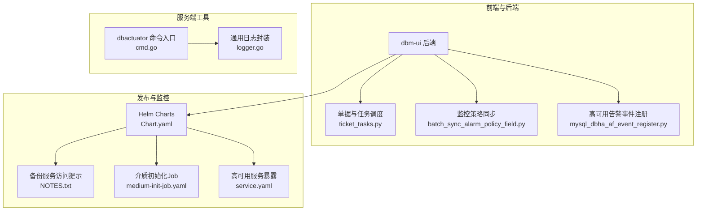
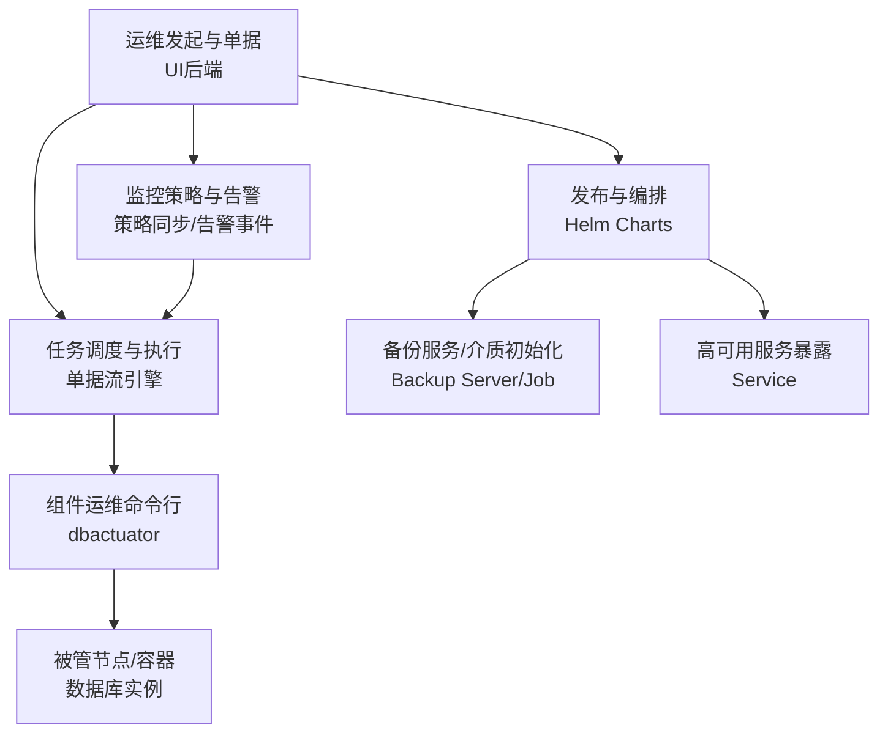
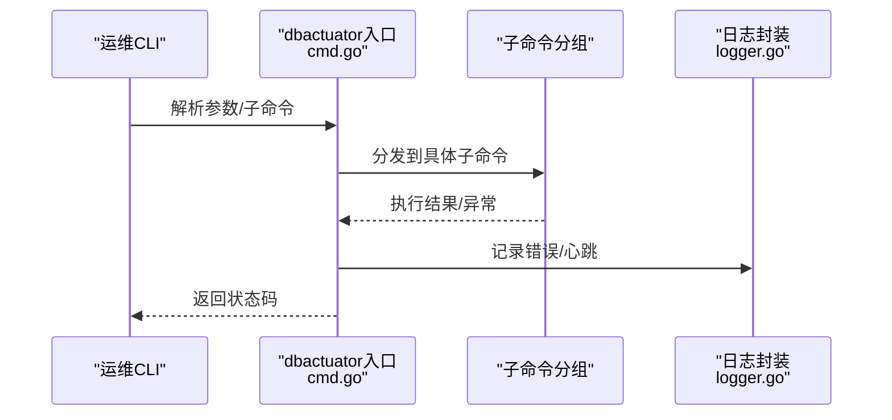
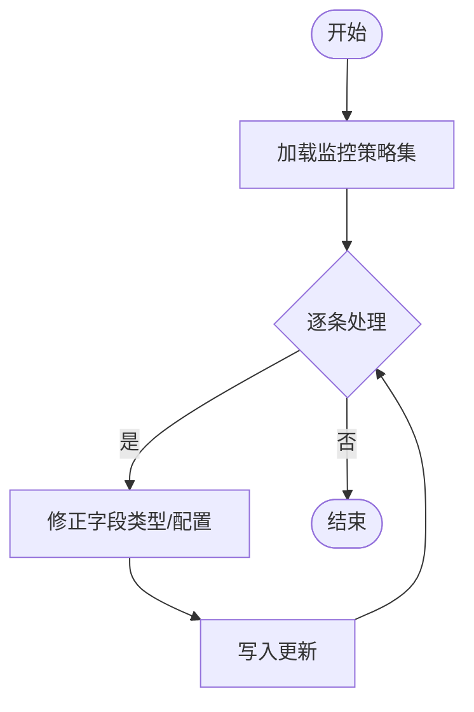
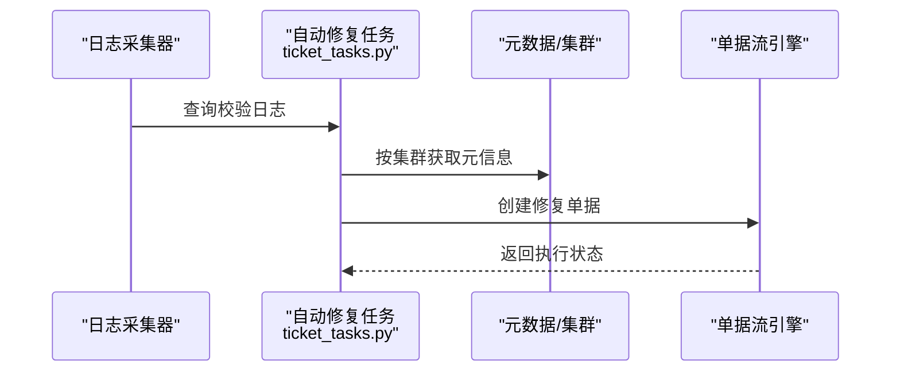
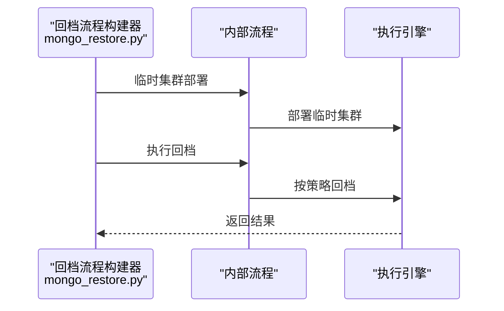
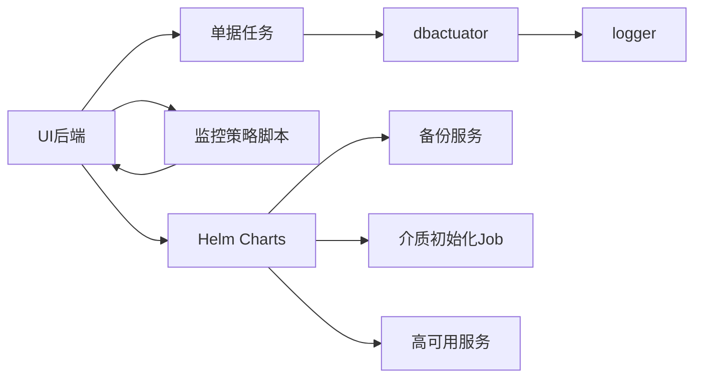

# 维护与故障排除

<cite>
**本文引用的文件**
- [cmd.go](file://dbm-services/bigdata/db-tools/dbactuator/cmd/cmd.go)
- [logger.go](file://dbm-services/common/go-pubpkg/logger/logger.go)
- [default.py](file://dbm-ui/config/default.py)
- [ticket_tasks.py](file://dbm-ui/backend/ticket/tasks/ticket_tasks.py)
- [mysql_dbha_af_event_register.py](file://dbm-ui/backend/ticket/builders/mysql/dbha_autofix/mysql_dbha_af_event_register.py)
- [mongo_restore.py](file://dbm-ui/backend/ticket/builders/mongodb/mongo_restore.py)
- [full_backup.py](file://dbm-ui/backend/ticket/builders/tendbcluster/full_backup.py)
- [batch_sync_alarm_policy_field.py](file://dbm-ui/scripts/batch_sync_alarm_policy_field.py)
- [Chart.yaml](file://helm-charts/bk-dbm/Chart.yaml)
- [NOTES.txt](file://helm-charts/bk-dbm/charts/backup-server/templates/NOTES.txt)
- [medium-init-job.yaml](file://helm-charts/bk-dbm/charts/dbm/templates/jobs/medium-init-job.yaml)
- [service.yaml](file://helm-charts/bk-dbm/charts/db-dbha/templates/service.yaml)
- [upgrade.sh](file://dbm-ui/scripts/ci/upgrade.sh)
- [readme.md](file://readme.md)
</cite>

## 目录
1. [简介](#简介)
2. [项目结构](#项目结构)
3. [核心组件](#核心组件)
4. [架构总览](#架构总览)
5. [详细组件分析](#详细组件分析)
6. [依赖分析](#依赖分析)
7. [性能考量](#性能考量)
8. [故障排除指南](#故障排除指南)
9. [结论](#结论)
10. [附录](#附录)

## 简介
本指南面向DBM（蓝鲸数据库管理）的运维与故障排除场景，聚焦日常维护、定期检查、预防性维护、日志分析、错误诊断、性能瓶颈定位、常见故障快速恢复、备份与恢复策略、灾难恢复演练、系统升级与回滚、应急响应流程、变更管理与运维最佳实践。文档以仓库现有实现为依据，结合UI后端、服务端工具、日志配置、监控与告警脚本、Helm发布配置等，形成可操作的维护手册。

## 项目结构
DBM由前后端与多语言服务组成，前端UI后端负责单据流、监控策略、事件与告警对接；服务端工具（dbactuator）提供各类数据库组件的安装、配置、巡检、回档等命令行能力；Helm Charts用于Kubernetes编排与发布；日志与监控配置贯穿各模块。

**图表来源**
- [cmd.go:58-185](file://dbm-services/bigdata/db-tools/dbactuator/cmd/cmd.go#L58-L185)
- [logger.go:107-154](file://dbm-services/common/go-pubpkg/logger/logger.go#L107-L154)
- [ticket_tasks.py:93-118](file://dbm-ui/backend/ticket/tasks/ticket_tasks.py#L93-L118)
- [batch_sync_alarm_policy_field.py:57-146](file://dbm-ui/scripts/batch_sync_alarm_policy_field.py#L57-L146)
- [mysql_dbha_af_event_register.py:89-109](file://dbm-ui/backend/ticket/builders/mysql/dbha_autofix/mysql_dbha_af_event_register.py#L89-L109)
- [Chart.yaml:45-86](file://helm-charts/bk-dbm/Chart.yaml#L45-L86)
- [NOTES.txt:1-22](file://helm-charts/bk-dbm/charts/backup-server/templates/NOTES.txt#L1-L22)
- [medium-init-job.yaml:33-42](file://helm-charts/bk-dbm/charts/dbm/templates/jobs/medium-init-job.yaml#L33-L42)
- [service.yaml:1-17](file://helm-charts/bk-dbm/charts/db-dbha/templates/service.yaml#L1-L17)

**章节来源**
- [readme.md:16-35](file://readme.md#L16-L35)
- [Chart.yaml:45-86](file://helm-charts/bk-dbm/Chart.yaml#L45-L86)

## 核心组件
- dbactuator：统一的数据库运维命令行工具，提供系统初始化、定时任务清理、下载、各大数据组件（ES/Kafka/Pulsar/InfluxDB/HDFS/Doris/VM）操作等子命令分组，内置心跳输出与日志记录。
- 通用日志封装：基于zap的Logger封装，提供结构化日志输出、标签化日志、本地日志输出与同步接口。
- 单据与任务调度：基于日志采集与校验结果自动生成修复单据，驱动运维闭环。
- 监控策略同步脚本：批量修正监控策略字段类型，确保策略在不同层级正确生效。
- 高可用告警事件注册：将外部告警维度转换为内部单据参数，触发自动化修复流程。
- Helm发布与备份服务：定义子组件版本与依赖，提供备份服务访问指引与介质初始化作业。

**章节来源**
- [cmd.go:75-185](file://dbm-services/bigdata/db-tools/dbactuator/cmd/cmd.go#L75-L185)
- [logger.go:25-94](file://dbm-services/common/go-pubpkg/logger/logger.go#L25-L94)
- [ticket_tasks.py:93-118](file://dbm-ui/backend/ticket/tasks/ticket_tasks.py#L93-L118)
- [batch_sync_alarm_policy_field.py:57-146](file://dbm-ui/scripts/batch_sync_alarm_policy_field.py#L57-L146)
- [mysql_dbha_af_event_register.py:89-109](file://dbm-ui/backend/ticket/builders/mysql/dbha_autofix/mysql_dbha_af_event_register.py#L89-L109)
- [Chart.yaml:45-86](file://helm-charts/bk-dbm/Chart.yaml#L45-L86)

## 架构总览
DBM的维护与故障排除涉及“前端/后端”、“服务端工具”、“发布与监控”三大层面协同：

**图表来源**
- [cmd.go:75-185](file://dbm-services/bigdata/db-tools/dbactuator/cmd/cmd.go#L75-L185)
- [ticket_tasks.py:93-118](file://dbm-ui/backend/ticket/tasks/ticket_tasks.py#L93-L118)
- [batch_sync_alarm_policy_field.py:57-146](file://dbm-ui/scripts/batch_sync_alarm_policy_field.py#L57-L146)
- [Chart.yaml:45-86](file://helm-charts/bk-dbm/Chart.yaml#L45-L86)
- [NOTES.txt:1-22](file://helm-charts/bk-dbm/charts/backup-server/templates/NOTES.txt#L1-L22)
- [medium-init-job.yaml:33-42](file://helm-charts/bk-dbm/charts/dbm/templates/jobs/medium-init-job.yaml#L33-L42)
- [service.yaml:1-17](file://helm-charts/bk-dbm/charts/db-dbha/templates/service.yaml#L1-L17)

## 详细组件分析

### 组件A：dbactuator 命令行工具
- 功能要点
  - 子命令分组：系统初始化、定时任务、通用下载、ES/Kafka/Pulsar/InfluxDB/HDFS/VM/Doris等组件操作。
  - 全局参数：payload、uid/root_id/node_id/version_id、回滚开关、帮助开关等。
  - 心跳输出：周期性标准输出心跳，便于远端执行监控。
  - 日志：统一使用日志封装，捕获panic并记录堆栈。
- 维护建议
  - 使用“回滚”模式进行高风险操作前的预演与验证。
  - 结合“show-payload”查看参数说明，减少误配。
  - 关注心跳输出，确保远端执行稳定。

**图表来源**
- [cmd.go:58-185](file://dbm-services/bigdata/db-tools/dbactuator/cmd/cmd.go#L58-L185)
- [logger.go:33-94](file://dbm-services/common/go-pubpkg/logger/logger.go#L33-L94)

**章节来源**
- [cmd.go:75-185](file://dbm-services/bigdata/db-tools/dbactuator/cmd/cmd.go#L75-L185)
- [logger.go:107-154](file://dbm-services/common/go-pubpkg/logger/logger.go#L107-L154)

### 组件B：日志与监控
- 日志
  - 结构化输出、标签化日志、本地日志输出、同步接口，便于集中收集与检索。
  - 建议：生产环境统一使用JSON格式，配合日志采集器进行聚合。
- 监控策略
  - 脚本批量修正策略字段类型与通知配置，确保策略在平台/子域/内建场景下一致性。
  - 建议：定期巡检策略字段，避免阈值/窗口等数值型字段字符串化导致策略失效。

**图表来源**
- [batch_sync_alarm_policy_field.py:57-146](file://dbm-ui/scripts/batch_sync_alarm_policy_field.py#L57-L146)

**章节来源**
- [logger.go:25-94](file://dbm-services/common/go-pubpkg/logger/logger.go#L25-L94)
- [batch_sync_alarm_policy_field.py:57-146](file://dbm-ui/scripts/batch_sync_alarm_policy_field.py#L57-L146)

### 组件C：单据与任务调度（自动修复）
- 自动修复流程
  - 从日志采集器读取校验结果，按集群聚合，过滤一致日志，对异常集群生成修复单据。
  - 与高可用告警联动，将外部告警维度映射为内部单据参数，触发自动化修复。
- 维护建议
  - 定期核对日志采集器配置与索引，保证数据完整性与时效性。
  - 对修复单据进行复盘，优化阈值与重试策略。

**图表来源**
- [ticket_tasks.py:93-118](file://dbm-ui/backend/ticket/tasks/ticket_tasks.py#L93-L118)

**章节来源**
- [ticket_tasks.py:93-118](file://dbm-ui/backend/ticket/tasks/ticket_tasks.py#L93-L118)
- [mysql_dbha_af_event_register.py:89-109](file://dbm-ui/backend/ticket/builders/mysql/dbha_autofix/mysql_dbha_af_event_register.py#L89-L109)

### 组件D：备份与恢复（以MongoDB为例）
- 流程
  - 临时集群部署 → 执行回档。
  - 支持手动重试，便于人工干预与确认。
- 维护建议
  - 回档前先进行快照或备份，回档后验证数据一致性。
  - 明确回档范围（库/表/时间点），避免误操作。

**图表来源**
- [mongo_restore.py:259-281](file://dbm-ui/backend/ticket/builders/mongodb/mongo_restore.py#L259-L281)

**章节来源**
- [mongo_restore.py:259-281](file://dbm-ui/backend/ticket/builders/mongodb/mongo_restore.py#L259-L281)

### 组件E：备份位置与状态校验（以TenDB为例）
- 校验要点
  - 备份位置合法性（主/从/远程/管理节点）。
  - 针对不同位置的前置条件（实例状态/角色）。
  - 库表选择器校验。
- 维护建议
  - 在执行备份前，先校验集群状态与实例角色，避免在非预期状态下执行备份。
  - 对spider管理节点备份，需确保对应实例处于运行态。

**章节来源**
- [full_backup.py:128-161](file://dbm-ui/backend/ticket/builders/tendbcluster/full_backup.py#L128-L161)

### 组件F：Helm发布与备份服务
- 发布要点
  - Chart定义子组件版本与依赖，便于统一升级与回滚。
  - 备份服务访问提示，便于定位服务地址。
  - 介质初始化Job，确保安装介质准备就绪。
  - 高可用服务暴露，便于外部访问。
- 维护建议
  - 升级前先执行dry-run，核对变更范围。
  - 回滚时锁定版本，避免自动升级覆盖。

**章节来源**
- [Chart.yaml:45-86](file://helm-charts/bk-dbm/Chart.yaml#L45-L86)
- [NOTES.txt:1-22](file://helm-charts/bk-dbm/charts/backup-server/templates/NOTES.txt#L1-L22)
- [medium-init-job.yaml:33-42](file://helm-charts/bk-dbm/charts/dbm/templates/jobs/medium-init-job.yaml#L33-L42)
- [service.yaml:1-17](file://helm-charts/bk-dbm/charts/db-dbha/templates/service.yaml#L1-L17)

## 依赖分析
- 组件耦合
  - dbactuator通过子命令分组解耦各组件运维逻辑，日志封装独立于具体子命令。
  - UI后端通过单据流与监控脚本连接运维执行与告警系统。
  - Helm Charts将子组件版本与依赖集中管理，降低升级复杂度。
- 外部依赖
  - 日志采集器、监控系统、Kubernetes API、对象存储（备份）等。

**图表来源**
- [cmd.go:75-185](file://dbm-services/bigdata/db-tools/dbactuator/cmd/cmd.go#L75-L185)
- [logger.go:107-154](file://dbm-services/common/go-pubpkg/logger/logger.go#L107-L154)
- [ticket_tasks.py:93-118](file://dbm-ui/backend/ticket/tasks/ticket_tasks.py#L93-L118)
- [batch_sync_alarm_policy_field.py:57-146](file://dbm-ui/scripts/batch_sync_alarm_policy_field.py#L57-L146)
- [Chart.yaml:45-86](file://helm-charts/bk-dbm/Chart.yaml#L45-L86)

## 性能考量
- 日志输出
  - 生产环境建议使用JSON格式与结构化字段，减少解析成本。
  - 控制日志级别，避免过多DEBUG/INFO噪声影响I/O。
- 任务调度
  - 对高频校验任务设置合理的时间窗口与去重策略，避免重复执行。
- 备份与回档
  - 评估网络与磁盘IO对备份/回档的影响，尽量避开业务高峰期。
  - 对大库/大表采用增量或并行策略，缩短窗口。

## 故障排除指南

### 日志分析方法
- 日志格式
  - 使用结构化日志，包含请求ID、时间戳、调用栈等关键字段，便于关联排查。
- 采集与检索
  - 通过日志采集器聚合，结合时间窗口与关键词检索，快速定位异常。
- 建议
  - 对关键路径增加标签化日志，区分普通日志与AI分析日志。

**章节来源**
- [logger.go:25-94](file://dbm-services/common/go-pubpkg/logger/logger.go#L25-L94)
- [default.py:490-557](file://dbm-ui/config/default.py#L490-L557)

### 错误诊断流程
- 常见错误类型
  - 参数校验失败：检查payload、备份位置、实例状态等。
  - 执行失败：查看单据流错误码与堆栈，必要时启用回滚模式重试。
  - 监控策略异常：使用策略同步脚本批量修正字段类型。
- 诊断步骤
  - 采集日志 → 定位错误码 → 核对前置条件 → 执行回滚/重试 → 复盘优化。

**章节来源**
- [ticket_tasks.py:93-118](file://dbm-ui/backend/ticket/tasks/ticket_tasks.py#L93-L118)
- [batch_sync_alarm_policy_field.py:57-146](file://dbm-ui/scripts/batch_sync_alarm_policy_field.py#L57-L146)
- [full_backup.py:128-161](file://dbm-ui/backend/ticket/builders/tendbcluster/full_backup.py#L128-L161)

### 性能瓶颈定位
- 备份/回档慢
  - 检查磁盘IO、网络带宽、并发度；对大对象采用分片/并行。
- 单据执行卡顿
  - 查看心跳输出是否正常，确认子命令执行状态。
- 监控策略抖动
  - 校正阈值、窗口与通知配置，避免频繁告警。

**章节来源**
- [cmd.go:192-206](file://dbm-services/bigdata/db-tools/dbactuator/cmd/cmd.go#L192-L206)
- [batch_sync_alarm_policy_field.py:57-146](file://dbm-ui/scripts/batch_sync_alarm_policy_field.py#L57-L146)

### 常见故障快速恢复
- MongoDB回档
  - 通过临时集群部署与回档执行两步流程，支持手动重试。
- TenDB备份位置校验失败
  - 根据校验规则修正备份位置与实例状态，确保spider管理节点可用。
- 高可用告警触发
  - 将外部告警维度映射为内部单据参数，自动修复。

**章节来源**
- [mongo_restore.py:259-281](file://dbm-ui/backend/ticket/builders/mongodb/mongo_restore.py#L259-L281)
- [full_backup.py:128-161](file://dbm-ui/backend/ticket/builders/tendbcluster/full_backup.py#L128-L161)
- [mysql_dbha_af_event_register.py:89-109](file://dbm-ui/backend/ticket/builders/mysql/dbha_autofix/mysql_dbha_af_event_register.py#L89-L109)

### 数据备份与恢复策略
- 备份策略
  - 明确备份位置（主/从/spider管理节点），校验前置条件。
  - 对关键库表进行选择性备份，避免全量带来的窗口压力。
- 恢复策略
  - 回档前先验证备份有效性，回档后进行一致性校验。
  - 使用临时集群进行回档演练，降低对线上影响。

**章节来源**
- [full_backup.py:128-161](file://dbm-ui/backend/ticket/builders/tendbcluster/full_backup.py#L128-L161)
- [mongo_restore.py:259-281](file://dbm-ui/backend/ticket/builders/mongodb/mongo_restore.py#L259-L281)

### 灾难恢复演练
- 演练内容
  - 介质初始化作业、备份服务连通性测试、高可用服务切换验证。
- 建议
  - 制定演练计划与回退预案，演练后形成复盘报告。

**章节来源**
- [medium-init-job.yaml:33-42](file://helm-charts/bk-dbm/charts/dbm/templates/jobs/medium-init-job.yaml#L33-L42)
- [NOTES.txt:1-22](file://helm-charts/bk-dbm/charts/backup-server/templates/NOTES.txt#L1-L22)
- [service.yaml:1-17](file://helm-charts/bk-dbm/charts/db-dbha/templates/service.yaml#L1-L17)

### 系统升级流程、版本兼容性检查与回滚机制
- 升级流程
  - 使用CI脚本对指定模块进行升级，同步helmfile并检查Pod状态。
- 版本兼容性
  - 通过Chart定义的子组件版本与依赖，确保各模块版本匹配。
- 回滚机制
  - 回滚时锁定版本，避免自动升级覆盖；必要时降级到上一个稳定版本。

**章节来源**
- [upgrade.sh:98-119](file://dbm-ui/scripts/ci/upgrade.sh#L98-L119)
- [Chart.yaml:45-86](file://helm-charts/bk-dbm/Chart.yaml#L45-L86)

### 应急响应流程、变更管理与运维最佳实践
- 应急响应
  - 快速定位日志与错误码，启用回滚/重试，必要时隔离问题节点。
- 变更管理
  - 升级前进行dry-run与影响评估，变更窗口内执行，事后复盘。
- 最佳实践
  - 结构化日志、标签化日志、策略字段一致性、备份演练常态化。

**章节来源**
- [cmd.go:58-185](file://dbm-services/bigdata/db-tools/dbactuator/cmd/cmd.go#L58-L185)
- [logger.go:25-94](file://dbm-services/common/go-pubpkg/logger/logger.go#L25-L94)
- [ticket_tasks.py:93-118](file://dbm-ui/backend/ticket/tasks/ticket_tasks.py#L93-L118)
- [batch_sync_alarm_policy_field.py:57-146](file://dbm-ui/scripts/batch_sync_alarm_policy_field.py#L57-L146)

## 结论
本指南基于DBM现有实现，梳理了维护与故障排除的关键流程与工具：dbactuator命令行工具、统一日志封装、单据与任务调度、监控策略同步、Helm发布与备份服务等。建议在日常运维中坚持“结构化日志、策略一致性、备份演练、变更受控”的原则，结合自动修复与告警联动，提升系统的稳定性与可维护性。

## 附录
- 项目特性概览与支持渠道参见项目README。

**章节来源**
- [readme.md:16-35](file://readme.md#L16-L35)