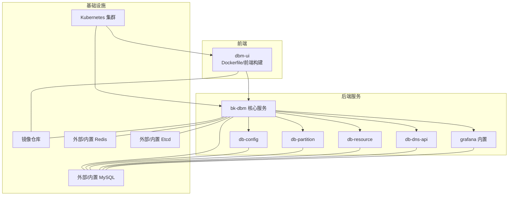
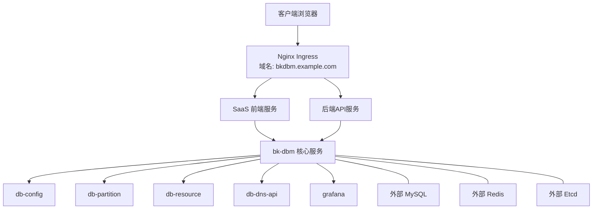
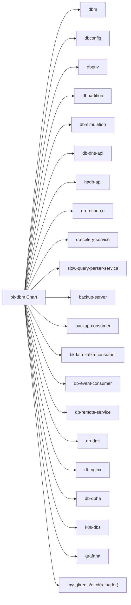

# 部署与运维

<cite>
**本文引用的文件**
- [readme.md](file://readme.md)
- [build.yml](file://build.yml)
- [Chart.yaml](file://helm-charts/bk-dbm/Chart.yaml)
- [values.yaml](file://helm-charts/bk-dbm/values.yaml)
- [config.yaml](file://dbm-services/common/db-config/conf/config.yaml)
- [logger.yaml](file://dbm-services/common/db-config/conf/logger.yaml)
- [default.py](file://dbm-ui/config/default.py)
- [Dockerfile](file://dbm-ui/Dockerfile)
</cite>

## 目录
1. [简介](#简介)
2. [项目结构](#项目结构)
3. [核心组件](#核心组件)
4. [架构总览](#架构总览)
5. [详细组件分析](#详细组件分析)
6. [依赖分析](#依赖分析)
7. [性能考虑](#性能考虑)
8. [故障排查指南](#故障排查指南)
9. [结论](#结论)
10. [附录](#附录)

## 简介
本指南面向DBM（数据库管理）平台的部署与运维，覆盖本地开发、生产环境、Kubernetes与容器化部署，提供配置项说明、环境要求、监控告警、日志管理、性能调优、故障排除、备份恢复与灾难恢复、自动化部署与CI/CD、安全与权限管理等。内容基于仓库中的Helm Chart、配置样例、Dockerfile与构建脚本整理而成，帮助读者快速落地并稳定运行DBM。

## 项目结构
DBM由前端UI与后端服务组成，后端包含多模块微服务（如db-config、db-partition、db-resource等），并通过Helm Chart统一打包发布；同时提供容器镜像构建与CI流水线配置。

图表来源
- [Chart.yaml:1-108](file://helm-charts/bk-dbm/Chart.yaml#L1-L108)
- [values.yaml:1-792](file://helm-charts/bk-dbm/values.yaml#L1-L792)

章节来源
- [readme.md:1-54](file://readme.md#L1-L54)
- [Chart.yaml:1-108](file://helm-charts/bk-dbm/Chart.yaml#L1-L108)
- [values.yaml:1-792](file://helm-charts/bk-dbm/values.yaml#L1-L792)

## 核心组件
- 前端UI（dbm-ui）
  - 使用多阶段Dockerfile构建，包含Node.js前端构建与Python后端打包，最终生成包含静态资源的镜像。
  - 镜像入口为应用根目录，支持收集静态资源并以配置prod运行。
- 后端核心（bk-dbm）
  - 通过Helm Chart统一管理，包含多个子Chart（db-config、db-partition、db-resource、db-dns-api、grafana等）。
  - 提供服务发现、Ingress暴露、环境变量注入、日志与APM配置等。
- 数据库与中间件
  - 支持外部数据库与内置Bitnami组件（MySQL、Redis、Etcd），通过values.yaml集中配置。
- 日志与监控
  - 各服务提供日志配置与APM开关，grafana作为内置数据可视化组件。

章节来源
- [Dockerfile:1-102](file://dbm-ui/Dockerfile#L1-L102)
- [Chart.yaml:1-108](file://helm-charts/bk-dbm/Chart.yaml#L1-L108)
- [values.yaml:1-792](file://helm-charts/bk-dbm/values.yaml#L1-L792)

## 架构总览
DBM采用“前端容器 + 多后端微服务 + 统一Helm发布”的架构。前端通过Ingress暴露，后端服务通过命名空间内的Service通信，数据库与消息队列可选择内置或外部部署。

图表来源
- [values.yaml:135-177](file://helm-charts/bk-dbm/values.yaml#L135-L177)
- [values.yaml:196-242](file://helm-charts/bk-dbm/values.yaml#L196-L242)
- [values.yaml:340-360](file://helm-charts/bk-dbm/values.yaml#L340-L360)

## 详细组件分析

### 前端UI（dbm-ui）部署
- 容器镜像构建
  - 多阶段构建：Node.js阶段安装依赖并打包前端；Python阶段安装后端依赖；最终合并静态资源与后端。
  - 支持通过环境变量APP_ID/APP_TOKEN定制应用标识。
- 静态资源与入口
  - 构建完成后收集静态资源，容器入口为应用根目录。
- 部署建议
  - 建议配合Helm Chart中的saas与backendApi服务，通过Ingress暴露域名。
  - 若使用内置grafana，注意其镜像与持久化配置。

章节来源
- [Dockerfile:1-102](file://dbm-ui/Dockerfile#L1-L102)
- [values.yaml:179-195](file://helm-charts/bk-dbm/values.yaml#L179-L195)
- [values.yaml:340-360](file://helm-charts/bk-dbm/values.yaml#L340-L360)

### db-config（配置中心服务）
- 配置要点
  - HTTP监听地址、数据库连接、连接池参数、Swagger开关、加密密钥前缀、迁移开关与源。
- 日志配置
  - 输出文件、格式、级别、轮转大小与保留策略。
- 部署建议
  - 与外部数据库或内置MySQL对接，确保连接参数正确。
  - 生产环境建议开启迁移并配置合适的连接池。

章节来源
- [config.yaml:1-26](file://dbm-services/common/db-config/conf/config.yaml#L1-L26)
- [logger.yaml:1-18](file://dbm-services/common/db-config/conf/logger.yaml#L1-L18)

### db-partition（分区与变更服务）
- 关键环境变量
  - 工具参数（pt工具系列）、远程服务地址、监听地址、日志级别、APM开关。
- 部署建议
  - 与db-remote-service联动时，确保服务地址一致。
  - 调整定时任务与锁等待超时以适配业务负载。

章节来源
- [values.yaml:285-318](file://helm-charts/bk-dbm/values.yaml#L285-L318)

### db-resource（资源管理服务）
- 关键环境变量
  - 云厂商接入参数（secretId/secretKey/yuntiAddr等）。
- 部署建议
  - 仅在需要云资源对接时启用，避免不必要的依赖。

章节来源
- [values.yaml:430-455](file://helm-charts/bk-dbm/values.yaml#L430-L455)

### db-dns-api（域名解析API）
- 配置要点
  - APM开关与服务监控。
- 部署建议
  - 与db-dns服务配合，确保域名解析链路可用。

章节来源
- [values.yaml:360-371](file://helm-charts/bk-dbm/values.yaml#L360-L371)

### grafana（内置仪表盘）
- 配置要点
  - 镜像仓库与标签、管理员账号密码、持久化开关、额外环境变量。
- 部署建议
  - 生产环境建议开启持久化与只读管理员密码。

章节来源
- [values.yaml:340-360](file://helm-charts/bk-dbm/values.yaml#L340-L360)

### 数据库与中间件（外部/内置）
- 外部数据库
  - 通过externalDatabase集中配置各业务库的用户名、密码、主机、端口与库名。
- 内置Bitnami组件
  - MySQL/Redis/Etcd可按需启用，提供默认配置与持久化。
- 部署建议
  - 生产优先使用外部高可用数据库与消息队列；测试环境可启用内置组件以简化部署。

章节来源
- [values.yaml:712-792](file://helm-charts/bk-dbm/values.yaml#L712-L792)
- [values.yaml:611-671](file://helm-charts/bk-dbm/values.yaml#L611-L671)
- [values.yaml:672-691](file://helm-charts/bk-dbm/values.yaml#L672-L691)
- [values.yaml:692-705](file://helm-charts/bk-dbm/values.yaml#L692-L705)

### 监控与日志（APM、日志采集、Grafana）
- APM与Trace
  - 各服务可通过TRACE_*开关启用OpenTelemetry导出。
- 日志采集
  - 支持bkLogConfig与标准输出/文件输出，便于对接蓝鲸日志平台。
- Grafana
  - 内置镜像与配置，可直接启用并挂载持久化。

章节来源
- [values.yaml:244-265](file://helm-charts/bk-dbm/values.yaml#L244-L265)
- [values.yaml:266-283](file://helm-charts/bk-dbm/values.yaml#L266-L283)
- [values.yaml:340-360](file://helm-charts/bk-dbm/values.yaml#L340-L360)

## 依赖分析
Helm Chart将多个子Chart组合为统一发布包，依赖关系如下：

图表来源
- [Chart.yaml:1-108](file://helm-charts/bk-dbm/Chart.yaml#L1-L108)

章节来源
- [Chart.yaml:1-108](file://helm-charts/bk-dbm/Chart.yaml#L1-L108)

## 性能考虑
- 数据库连接池
  - Django数据库连接池参数可在配置中调整POOL_SIZE与MAX_OVERFLOW，以适配并发与资源限制。
- 日志轮转
  - db-config的日志轮转大小与保留天数可按磁盘容量与审计要求调整。
- APM与Trace
  - 生产环境建议按需开启Trace，避免过多span影响性能。
- 前端构建内存
  - Dockerfile中设置了NODE_OPTIONS以提升前端构建稳定性。

章节来源
- [default.py:244-286](file://dbm-ui/config/default.py#L244-L286)
- [logger.yaml:1-18](file://dbm-services/common/db-config/conf/logger.yaml#L1-L18)
- [Dockerfile:16-17](file://dbm-ui/Dockerfile#L16-L17)

## 故障排查指南
- 前端无法访问
  - 检查Ingress域名与TLS配置，确认host与paths正确。
- 服务启动失败
  - 查看容器日志与容器健康检查状态；核对环境变量与数据库连接参数。
- 数据库连接异常
  - 检查externalDatabase配置是否与实际数据库一致；确认网络连通与防火墙策略。
- 日志不输出或过大
  - 检查日志输出路径与轮转配置；必要时开启bkLogConfig对接日志平台。
- Celery任务堆积
  - 检查Broker连接、Worker副本数与任务队列负载；调整并发与重试策略。

章节来源
- [values.yaml:135-177](file://helm-charts/bk-dbm/values.yaml#L135-L177)
- [values.yaml:712-792](file://helm-charts/bk-dbm/values.yaml#L712-L792)
- [logger.yaml:1-18](file://dbm-services/common/db-config/conf/logger.yaml#L1-L18)
- [default.py:470-484](file://dbm-ui/config/default.py#L470-L484)

## 结论
通过Helm Chart与容器化部署，DBM实现了前后端一体化、多服务协同与基础设施即代码的运维模式。结合完善的监控、日志与APM配置，可满足生产环境的稳定性与可观测性需求。建议在生产中优先使用外部高可用数据库与消息队列，并按需启用内置组件以降低运维复杂度。

## 附录

### 本地开发部署（概览）
- 前端
  - 使用Dockerfile构建镜像，运行时收集静态资源并以prod配置启动。
- 后端
  - 通过Helm Chart在本地Kubernetes中部署，启用所需子服务与Ingress。
- 数据库
  - 可选择外部数据库或启用内置MySQL/Redis/Etcd。

章节来源
- [Dockerfile:1-102](file://dbm-ui/Dockerfile#L1-L102)
- [Chart.yaml:1-108](file://helm-charts/bk-dbm/Chart.yaml#L1-L108)
- [values.yaml:611-705](file://helm-charts/bk-dbm/values.yaml#L611-L705)

### 生产环境部署（概览）
- 镜像与仓库
  - 使用私有镜像仓库，配置imagePullSecrets与registry。
- Ingress与域名
  - 配置SaaS、后端API与公网域名，启用TLS与代理头。
- 数据库与中间件
  - 使用外部高可用MySQL/Redis/Etcd，按需启用内置组件。
- 监控与日志
  - 开启APM与日志采集，配置Grafana与告警策略。

章节来源
- [values.yaml:4-15](file://helm-charts/bk-dbm/values.yaml#L4-L15)
- [values.yaml:135-177](file://helm-charts/bk-dbm/values.yaml#L135-L177)
- [values.yaml:712-792](file://helm-charts/bk-dbm/values.yaml#L712-L792)
- [values.yaml:340-360](file://helm-charts/bk-dbm/values.yaml#L340-L360)

### Kubernetes部署（Helm）
- 安装命令示例
  - 使用helm install -n <namespace> <release-name> -f values.yaml ./helm-charts/bk-dbm
- 常用参数
  - 全局镜像仓库、域名与协议、服务类型、Ingress注解、数据库与中间件启用开关。
- 升级与回滚
  - 使用helm upgrade/rollback管理版本迭代。

章节来源
- [Chart.yaml:1-108](file://helm-charts/bk-dbm/Chart.yaml#L1-L108)
- [values.yaml:1-792](file://helm-charts/bk-dbm/values.yaml#L1-L792)

### 容器化配置
- 前端镜像
  - 多阶段构建，前端产物与后端依赖分离，最终合并静态资源。
- 环境变量
  - 通过values.yaml注入各服务环境变量，如brokerUrl、db连接参数、APM开关等。

章节来源
- [Dockerfile:1-102](file://dbm-ui/Dockerfile#L1-L102)
- [values.yaml:113-134](file://helm-charts/bk-dbm/values.yaml#L113-L134)

### 监控告警配置
- APM
  - 各服务通过TRACE_*开关启用OpenTelemetry导出。
- Grafana
  - 内置镜像与配置，可直接启用并挂载持久化。
- 日志采集
  - 支持标准输出/文件输出与bkLogConfig对接。

章节来源
- [values.yaml:244-265](file://helm-charts/bk-dbm/values.yaml#L244-L265)
- [values.yaml:340-360](file://helm-charts/bk-dbm/values.yaml#L340-L360)

### 日志管理
- db-config日志
  - 输出文件、格式、级别、轮转大小与保留天数。
- Django日志
  - 通过default.py中的get_logging_config定义格式与处理器。

章节来源
- [logger.yaml:1-18](file://dbm-services/common/db-config/conf/logger.yaml#L1-L18)
- [default.py:489-541](file://dbm-ui/config/default.py#L489-L541)

### 性能调优
- 数据库连接池
  - 调整POOL_SIZE与MAX_OVERFLOW以适配并发。
- 前端构建内存
  - NODE_OPTIONS提升构建稳定性。
- APM与Trace
  - 按需开启，避免过多span影响性能。

章节来源
- [default.py:244-286](file://dbm-ui/config/default.py#L244-L286)
- [Dockerfile:16-17](file://dbm-ui/Dockerfile#L16-L17)

### 故障排除方法
- 常见问题定位
  - Ingress域名与证书、数据库连接参数、日志输出路径、Celery Broker与Worker状态。
- 快速恢复
  - 重启Pod、回滚至上一个稳定版本、检查网络与存储卷。

章节来源
- [values.yaml:135-177](file://helm-charts/bk-dbm/values.yaml#L135-L177)
- [values.yaml:712-792](file://helm-charts/bk-dbm/values.yaml#L712-L792)
- [logger.yaml:1-18](file://dbm-services/common/db-config/conf/logger.yaml#L1-L18)
- [default.py:470-484](file://dbm-ui/config/default.py#L470-L484)

### 备份恢复与灾难恢复
- 备份策略
  - 建议对数据库与配置中心进行定期快照；对静态资源与日志进行归档。
- 恢复流程
  - 优先恢复数据库，再恢复配置中心与应用；验证服务连通性与数据一致性。
- 灾难恢复
  - 准备跨可用区/跨地域的灾备方案，定期演练恢复流程。

[本节为通用运维建议，无需特定文件引用]

### 自动化部署与CI/CD
- CI流水线
  - 使用build.yml定义流水线阶段与容器镜像，支持多语言代码质量扫描。
- 镜像构建
  - 前端与后端多阶段构建，减少镜像体积与构建时间。
- 发布策略
  - 通过Helm Chart进行灰度发布与回滚，结合Ingress与Service实现流量切换。

章节来源
- [build.yml:1-29](file://build.yml#L1-L29)
- [Dockerfile:1-102](file://dbm-ui/Dockerfile#L1-L102)

### 安全配置与权限管理
- 网关与鉴权
  - 通过API网关与IAM进行权限控制，配置BK_APIGW_*与BK_IAM_*相关参数。
- 加密与密钥
  - db-config支持加密密钥前缀；Django侧支持对称/非对称加密配置。
- Cookie与会话
  - 配置会话Cookie域名与CSRF Cookie域名，确保跨域安全。

章节来源
- [values.yaml:68-74](file://helm-charts/bk-dbm/values.yaml#L68-L74)
- [values.yaml:54-59](file://helm-charts/bk-dbm/values.yaml#L54-L59)
- [config.yaml:20-22](file://dbm-services/common/db-config/conf/config.yaml#L20-L22)
- [default.py:324-338](file://dbm-ui/config/default.py#L324-L338)
- [default.py:432-440](file://dbm-ui/config/default.py#L432-L440)