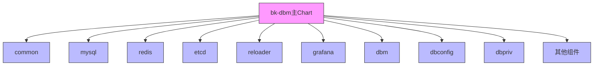
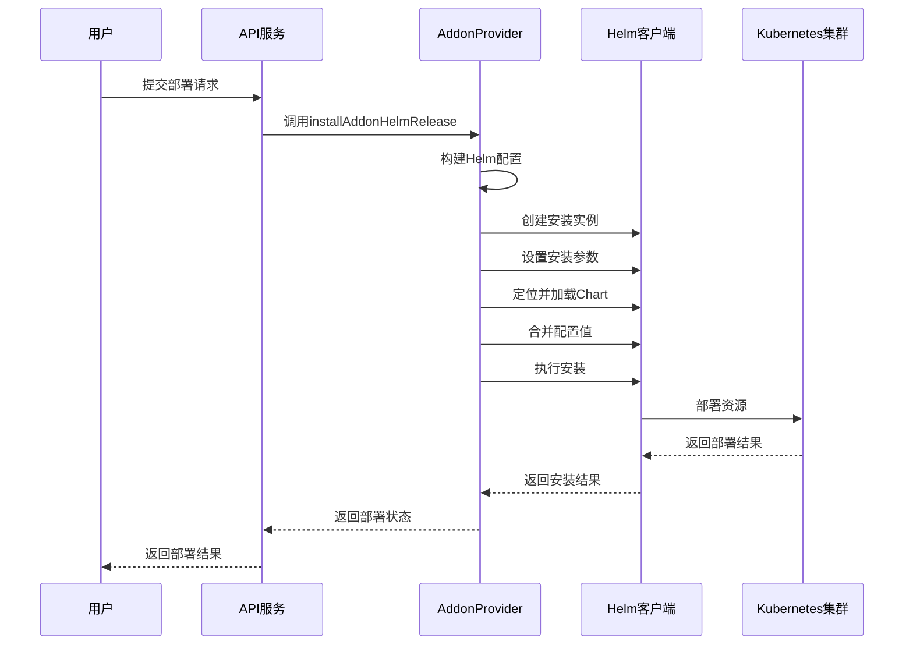

# K8s部署

<cite>
**本文档中引用的文件**  
- [Chart.yaml](file://helm-charts/bk-dbm/Chart.yaml)
- [values.yaml](file://helm-charts/bk-dbm/values.yaml)
- [Chart.lock](file://helm-charts/bk-dbm/Chart.lock)
- [dbm/Chart.yaml](file://helm-charts/bk-dbm/charts/dbm/Chart.yaml)
- [dbm/values.yaml](file://helm-charts/bk-dbm/charts/dbm/values.yaml)
- [_helpers.tpl](file://helm-charts/bk-dbm/templates/_helpers.tpl)
- [NOTES.txt](file://helm-charts/bk-dbm/templates/NOTES.txt)
- [README.md](file://helm-charts/README.md)
- [readme.md](file://readme.md)
- [k8s_util.go](file://dbm-services/k8s-dbs/common/util/k8s_util.go)
- [cluster_provider.go](file://dbm-services/k8s-dbs/core/provider/cluster_provider.go)
- [addon_provider.go](file://dbm-services/k8s-dbs/core/provider/addon_provider.go)
</cite>

## 目录
1. [简介](#简介)
2. [Helm Chart结构分析](#helm-chart结构分析)
3. [Chart.yaml详解](#chartyaml详解)
4. [values.yaml配置详解](#valuesyaml配置详解)
5. [部署命令与最佳实践](#部署命令与最佳实践)
6. [自动化部署与升级流程](#自动化部署与升级流程)
7. [部署后验证步骤](#部署后验证步骤)
8. [常见问题排查指南](#常见问题排查指南)

## 简介

蓝鲸数据库管理平台（blueking-dbm）是一个集成了MySQL、Redis、ES、Kafka、HDFS等多种数据库组件全生命周期管理的平台。该平台提供了海量集群的批量管理能力，以及相应DB组件的集群管理工具箱，并配套DB个性化配置、高可用切换、域名管理等服务。通过Helm Charts可以方便地在Kubernetes环境中部署和管理该平台。

本文档详细介绍了如何使用helm-charts/bk-dbm/下的Helm Charts部署blueking-dbm平台，包括Chart.yaml的结构和作用，values.yaml中各项配置参数的含义和可选值，以及完整的部署命令示例和最佳实践。

**Section sources**
- [readme.md](file://readme.md)

## Helm Chart结构分析

blueking-dbm的Helm Chart采用子Chart（subchart）模式进行管理，主Chart位于helm-charts/bk-dbm/目录下，包含多个子Chart，每个子Chart负责部署平台的一个组件。这种模块化的设计使得各个组件可以独立更新和维护。

主Chart的目录结构包含：
- charts/：存放所有子Chart
- templates/：存放主Chart的模板文件
- Chart.yaml：主Chart的元数据文件
- values.yaml：主Chart的默认配置值
- Chart.lock：锁定依赖版本

每个子Chart都有自己的Chart.yaml和values.yaml文件，用于定义该组件的元数据和默认配置。主Chart通过dependencies字段引用这些子Chart，并可以在values.yaml中覆盖子Chart的默认配置。

**Section sources**
- [README.md](file://helm-charts/README.md)
- [Chart.yaml](file://helm-charts/bk-dbm/Chart.yaml)

## Chart.yaml详解

Chart.yaml文件定义了Helm Chart的基本信息和依赖关系。对于blueking-dbm主Chart，其关键字段包括：

- apiVersion: v2，表示使用Helm 3的API版本
- name: bk-dbm，Chart的名称
- version: 1.5.0-alpha.78，Chart的版本号
- appVersion: 1.5.0-alpha.78，应用的版本号
- type: application，表示这是一个应用Chart

Chart.yaml中的dependencies字段定义了该Chart所依赖的所有子Chart，包括：
- bitnami提供的common、mysql、redis、etcd等通用组件
- stakater提供的reloader用于自动重启Pod
- 各个平台组件如dbm、dbconfig、dbpriv等

每个依赖项都指定了名称、版本和仓库地址。条件依赖（condition）字段用于控制某些组件是否启用，例如mysql.enabled控制MySQL组件的部署。



**Diagram sources**
- [Chart.yaml](file://helm-charts/bk-dbm/Chart.yaml)
- [Chart.lock](file://helm-charts/bk-dbm/Chart.lock)

**Section sources**
- [Chart.yaml](file://helm-charts/bk-dbm/Chart.yaml)

## values.yaml配置详解

values.yaml文件包含了blueking-dbm平台的所有可配置参数，主要分为以下几个部分：

### 全局配置（global）

全局配置影响整个平台的行为：
- imageRegistry：镜像仓库地址
- storageClass：存储类名称
- bkDomain：蓝鲸主域名
- k8sWaitFor：k8s等待工具的配置
- cloudContainer：是否为云区域容器化部署

### 平台组件配置

每个平台组件都有独立的配置块，常见的配置项包括：

#### 服务暴露方式
通过ingress配置控制服务的暴露方式：
```yaml
ingress:
  enabled: true
  className: ""
  hostname: "bkdbm.example.com"
  paths:
    - path: /
      pathType: ImplementationSpecific
```

#### 资源限制
通过resources字段配置Pod的资源请求和限制：
```yaml
resources:
  limits:
    cpu: 1000m
    memory: 1024Mi
  requests:
    cpu: 200m
    memory: 256Mi
```

#### 副本数量
通过replicaCount字段控制副本数量：
```yaml
saas:
  api:
    replicaCount: 1
  backendApi:
    replicaCount: 1
```

### 外部依赖配置

配置外部依赖如数据库、Redis等：
- externalDatabase：外部MySQL数据库配置
- externalRedis：外部Redis配置
- externalEtcd：外部Etcd配置

### 特殊组件配置

某些组件有特殊的配置需求，如：
- db-simulation：模拟执行Pod的资源限额配置
- backup-server：备份服务器的HDFS和COS配置
- bkdata-kafka-consumer：Kafka消费者的资源和数据ID配置

这些配置项允许用户根据实际环境需求灵活调整平台的各项参数，确保平台能够稳定高效地运行。

**Section sources**
- [values.yaml](file://helm-charts/bk-dbm/values.yaml)

## 部署命令与最佳实践

### 基本部署命令

部署blueking-dbm平台的基本命令如下：

```bash
# 添加依赖仓库
helm repo add bitnami https://charts.bitnami.com/bitnami
helm repo add stakater-charts https://stakater.github.io/stakater-charts

# 更新依赖
helm dependency update helm-charts/bk-dbm

# 部署平台
helm install bk-dbm helm-charts/bk-dbm \
  --namespace dbm \
  --create-namespace \
  -f helm-charts/bk-dbm/values.yaml
```

### 升级命令

升级已部署的平台实例：

```bash
# 升级平台
helm upgrade bk-dbm helm-charts/bk-dbm \
  --namespace dbm \
  -f helm-charts/bk-dbm/values.yaml
```

### 最佳实践

1. **使用独立命名空间**：为blueking-dbm创建独立的命名空间，便于资源隔离和管理。
2. **配置持久化存储**：确保数据库等有状态组件配置了合适的持久化存储。
3. **资源规划**：根据预期负载合理配置CPU和内存资源，避免资源不足或浪费。
4. **启用监控**：配置Prometheus和Grafana监控，实时掌握平台运行状态。
5. **定期备份**：定期备份重要数据，包括数据库和配置。
6. **使用Chart.lock**：在生产环境中使用Chart.lock文件锁定依赖版本，确保部署一致性。

通过遵循这些最佳实践，可以确保blueking-dbm平台的稳定性和可靠性。

**Section sources**
- [README.md](file://helm-charts/README.md)
- [values.yaml](file://helm-charts/bk-dbm/values.yaml)

## 自动化部署与升级流程

blueking-dbm平台提供了通过scripts目录下的脚本进行自动化部署和升级的流程。这些脚本主要位于dbm-services/k8s-dbs组件中，利用Helm Go SDK实现自动化操作。

### 核心自动化组件

自动化部署的核心是k8s_util.go中的K8sClient结构体，它封装了Kubernetes和Helm客户端，提供了以下关键功能：
- NewK8sClient：创建Kubernetes客户端实例
- BuildHelmConfig：构建Helm配置
- ConvertCPUToCores：CPU资源转换
- ConvertMemoryToGB：内存资源转换

### 部署流程实现

cluster_provider.go中的installAddonHelmRelease函数实现了自动化部署的核心逻辑：
1. 构建Helm action配置
2. 创建安装实例
3. 设置安装参数（发布名称、命名空间、版本等）
4. 定位并加载Chart
5. 合并动态值
6. 执行安装



**Diagram sources**
- [k8s_util.go](file://dbm-services/k8s-dbs/common/util/k8s_util.go)
- [cluster_provider.go](file://dbm-services/k8s-dbs/core/provider/cluster_provider.go)
- [addon_provider.go](file://dbm-services/k8s-dbs/core/provider/addon_provider.go)

**Section sources**
- [k8s_util.go](file://dbm-services/k8s-dbs/common/util/k8s_util.go)
- [cluster_provider.go](file://dbm-services/k8s-dbs/core/provider/cluster_provider.go)

## 部署后验证步骤

部署完成后，需要进行一系列验证步骤确保平台正常运行：

### 1. 检查Pod状态

```bash
# 查看所有Pod状态
kubectl get pods -n dbm

# 检查Pod是否全部Running
kubectl get pods -n dbm -o wide
```

所有Pod应该处于Running状态，没有CrashLoopBackOff或Error状态。

### 2. 检查服务状态

```bash
# 查看服务
kubectl get svc -n dbm

# 查看Ingress
kubectl get ingress -n dbm
```

确保所有服务和Ingress都已正确创建。

### 3. 验证平台功能

1. **访问Web界面**：通过Ingress配置的域名访问平台Web界面，确认可以正常登录。
2. **检查API服务**：调用平台API接口，验证后端服务正常。
3. **验证数据库连接**：确认平台能够连接到配置的数据库。
4. **检查监控系统**：验证Grafana监控面板是否正常显示数据。

### 4. 运行健康检查

```bash
# 使用helm status检查发布状态
helm status bk-dbm -n dbm

# 查看所有资源
helm get all bk-dbm -n dbm
```

### 5. 验证自动化功能

1. **测试部署新组件**：尝试通过平台界面部署一个新的数据库实例。
2. **测试升级功能**：尝试升级一个已部署的组件。
3. **测试备份恢复**：执行一次备份和恢复操作，验证数据完整性。

通过这些验证步骤，可以确保blueking-dbm平台已正确部署并可以正常使用。

**Section sources**
- [NOTES.txt](file://helm-charts/bk-dbm/templates/NOTES.txt)

## 常见问题排查指南

### 1. Pod无法启动

**症状**：Pod处于CrashLoopBackOff或Error状态。

**排查步骤**：
```bash
# 查看Pod详细信息
kubectl describe pod <pod-name> -n dbm

# 查看Pod日志
kubectl logs <pod-name> -n dbm

# 如果有initContainer，查看initContainer日志
kubectl logs <pod-name> -c <init-container-name> -n dbm
```

**常见原因**：
- 配置错误：检查values.yaml中的配置是否正确
- 资源不足：检查节点是否有足够的CPU和内存
- 镜像拉取失败：检查镜像仓库地址和凭据
- 依赖服务未就绪：使用initContainers等待依赖服务

### 2. 服务无法访问

**症状**：无法通过Ingress或Service访问服务。

**排查步骤**：
```bash
# 检查Service
kubectl get svc -n dbm

# 检查Endpoints
kubectl get endpoints -n dbm

# 检查Ingress
kubectl get ingress -n dbm

# 检查网络策略
kubectl get networkpolicy -n dbm
```

**常见原因**：
- Ingress配置错误：检查hostname和path配置
- Service选择器不匹配：检查Service的selector是否与Pod的label匹配
- 网络策略阻止：检查是否有网络策略阻止流量

### 3. 数据库连接失败

**症状**：平台无法连接到数据库。

**排查步骤**：
```bash
# 检查数据库Pod状态
kubectl get pods -n dbm | grep mysql

# 测试数据库连接
kubectl exec -it <db-pod> -n dbm -- mysql -u<user> -p<password> -h<host>
```

**常见原因**：
- 数据库未初始化：检查initContainer是否成功执行
- 认证信息错误：检查values.yaml中的数据库用户名和密码
- 网络不通：检查服务发现和网络策略

### 4. Helm操作失败

**症状**：helm install或helm upgrade命令失败。

**排查步骤**：
```bash
# 查看发布状态
helm status <release-name> -n dbm

# 查看历史版本
helm history <release-name> -n dbm

# 回滚到上一版本
helm rollback <release-name> -n dbm
```

**常见原因**：
- Chart版本不匹配：检查Chart.lock中的版本
- 值文件格式错误：验证values.yaml的YAML格式
- 权限不足：检查ServiceAccount权限

通过系统性地排查这些问题，可以快速定位和解决部署过程中遇到的各种问题。

**Section sources**
- [NOTES.txt](file://helm-charts/bk-dbm/templates/NOTES.txt)
- [values.yaml](file://helm-charts/bk-dbm/values.yaml)