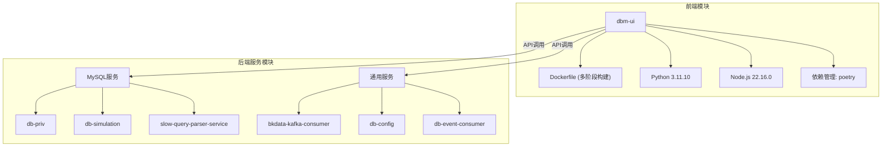
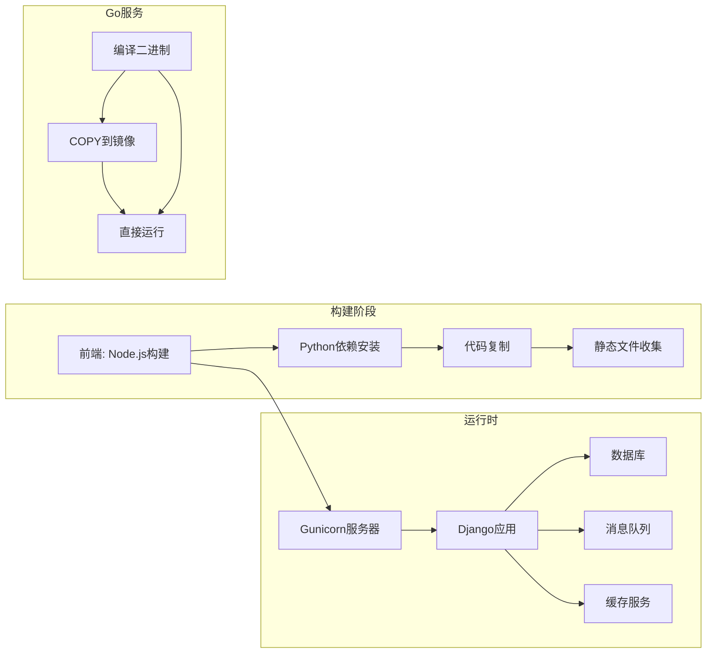
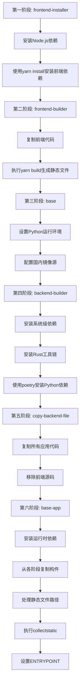
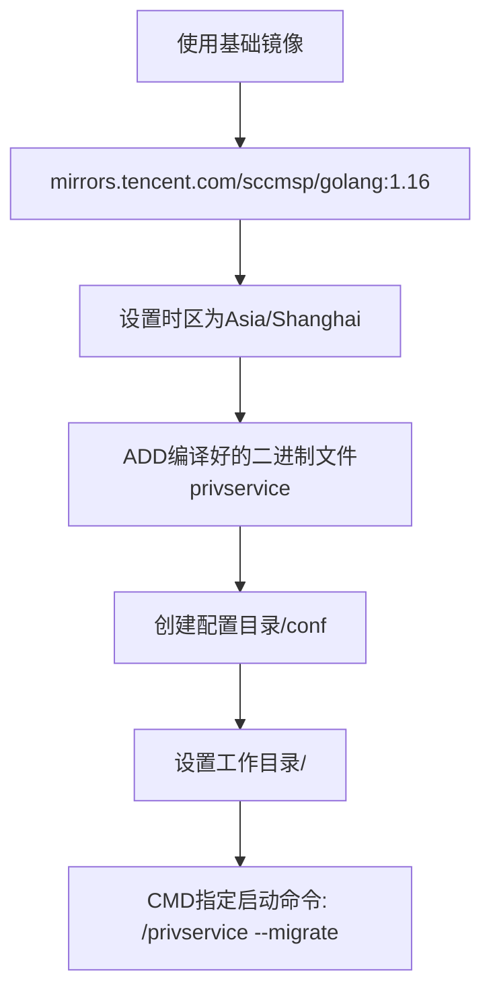
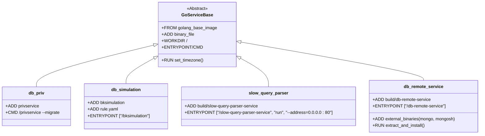
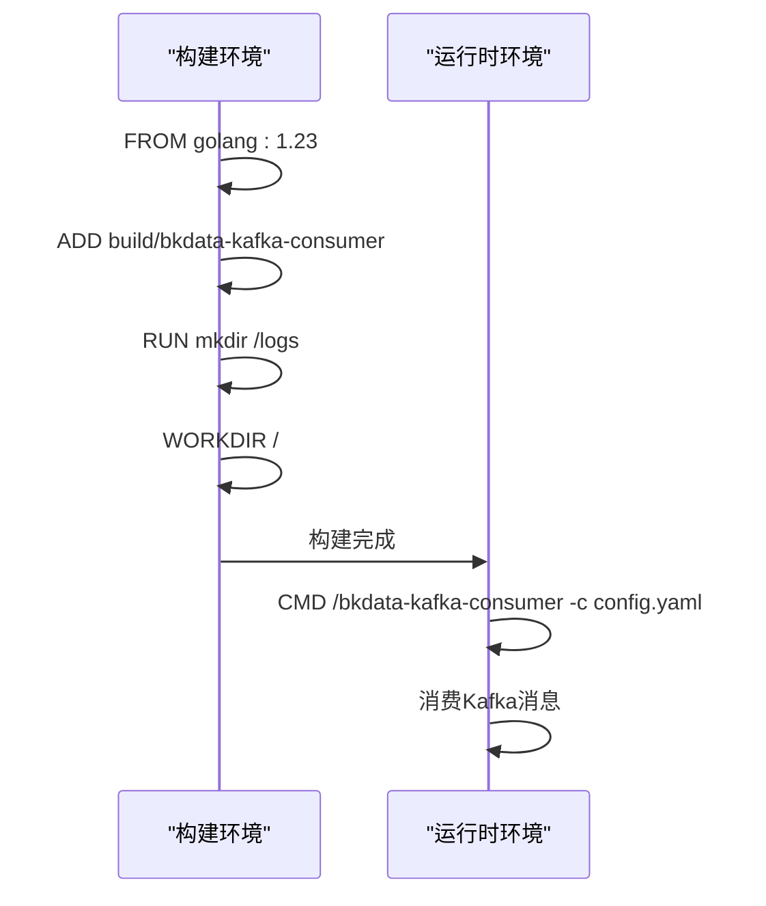
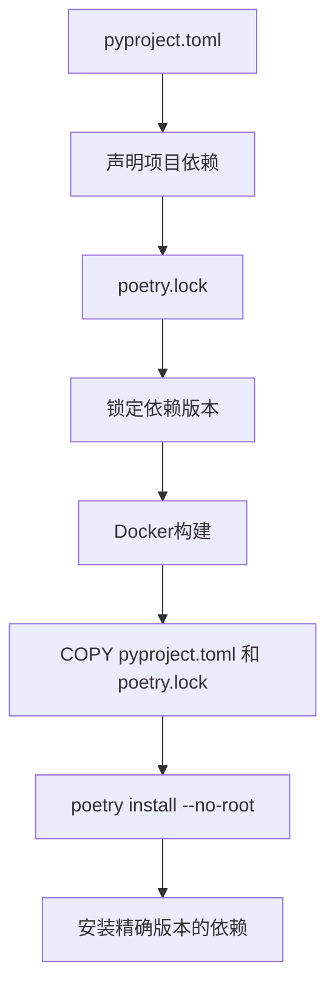

# 容器化

<cite>
**本文档引用的文件**
- [dbm-ui/Dockerfile](file://dbm-ui/Dockerfile)
- [dbm-ui/pyproject.toml](file://dbm-ui/pyproject.toml)
- [dbm-ui/manage.py](file://dbm-ui/manage.py)
- [dbm-ui/config/prod.py](file://dbm-ui/config/prod.py)
- [dbm-ui/etc/gunicorn.py](file://dbm-ui/etc/gunicorn.py)
- [dbm-ui/bin/build_frontend.sh](file://dbm-ui/bin/build_frontend.sh)
- [dbm-services/mysql/db-priv/Dockerfile](file://dbm-services/mysql/db-priv/Dockerfile)
- [dbm-services/mysql/db-simulation/Dockerfile](file://dbm-services/mysql/db-simulation/Dockerfile)
- [dbm-services/mysql/db-remote-service/Dockerfile](file://dbm-services/mysql/db-remote-service/Dockerfile)
- [dbm-services/mysql/slow-query-parser-service/Dockerfile](file://dbm-services/mysql/slow-query-parser-service/Dockerfile)
- [dbm-services/common/bkdata-kafka-consumer/Dockerfile](file://dbm-services/common/bkdata-kafka-consumer/Dockerfile)
- [dbm-services/common/db-config/Dockerfile](file://dbm-services/common/db-config/Dockerfile)
- [dbm-services/common/db-event-consumer/Dockerfile](file://dbm-services/common/db-event-consumer/Dockerfile)
</cite>

## 目录
1. [简介](#简介)
2. [项目结构](#项目结构)
3. [核心组件](#核心组件)
4. [架构概述](#架构概述)
5. [详细组件分析](#详细组件分析)
6. [依赖分析](#依赖分析)
7. [性能考虑](#性能考虑)
8. [故障排除指南](#故障排除指南)
9. [结论](#结论)

## 简介
本文档详细说明了blueking-dbm各组件的Docker镜像构建过程，重点分析了`dbm-ui`和`dbm-services/mysql/db-priv`两个关键组件的容器化实现。文档涵盖了Dockerfile中的每一层指令及其目的，包括基础镜像选择、依赖安装、代码复制、端口暴露和启动命令。同时，文档化了Go和Python应用的容器化最佳实践，如多阶段构建、最小化镜像大小、安全配置等，并说明如何根据`go.mod`和`requirements.txt`（在本项目中为`pyproject.toml`）管理依赖，确保构建的可重现性。

## 项目结构
blueking-dbm项目采用分层架构，主要分为前端UI和后端服务两大模块。前端UI位于`dbm-ui`目录，采用Python Django框架构建，包含前端静态资源和后端API服务。后端服务位于`dbm-services`目录，按数据库类型（如MySQL、MongoDB、Redis等）组织，每个服务组件都有独立的Dockerfile用于容器化部署。

**Diagram sources**
- [dbm-ui/Dockerfile](file://dbm-ui/Dockerfile)
- [dbm-services/mysql/db-priv/Dockerfile](file://dbm-services/mysql/db-priv/Dockerfile)
- [dbm-services/common/bkdata-kafka-consumer/Dockerfile](file://dbm-services/common/bkdata-kafka-consumer/Dockerfile)

**Section sources**
- [dbm-ui/Dockerfile](file://dbm-ui/Dockerfile)
- [dbm-services/mysql/db-priv/Dockerfile](file://dbm-services/mysql/db-priv/Dockerfile)

## 核心组件
blueking-dbm的核心组件包括前端UI服务和多个后端微服务。前端UI服务（`dbm-ui`）是一个基于Python Django的全栈应用，负责提供用户界面和API网关功能。后端微服务按数据库类型和功能划分，如`db-priv`负责MySQL权限管理，`db-simulation`负责SQL模拟执行，`slow-query-parser-service`负责慢查询解析等。这些组件通过Docker容器化部署，实现了服务的解耦和独立伸缩。

**Section sources**
- [dbm-ui/Dockerfile](file://dbm-ui/Dockerfile)
- [dbm-services/mysql/db-priv/Dockerfile](file://dbm-services/mysql/db-priv/Dockerfile)
- [dbm-services/mysql/db-simulation/Dockerfile](file://dbm-services/mysql/db-simulation/Dockerfile)

## 架构概述
blueking-dbm采用微服务架构，通过Docker容器化技术实现各组件的独立部署和管理。前端UI服务采用多阶段Docker构建，分别处理前端静态资源构建和后端Python应用打包。后端Go语言服务采用更简洁的构建流程，直接将编译好的二进制文件打包到轻量级基础镜像中。所有服务通过环境变量和配置文件进行配置，确保了部署的一致性和可重现性。

**Diagram sources**
- [dbm-ui/Dockerfile](file://dbm-ui/Dockerfile)
- [dbm-services/mysql/db-priv/Dockerfile](file://dbm-services/mysql/db-priv/Dockerfile)

## 详细组件分析

### dbm-ui组件分析
`dbm-ui`组件的Docker构建过程采用了多阶段构建策略，有效分离了构建环境和运行环境，显著减小了最终镜像的大小。

#### 多阶段构建流程

**Diagram sources**
- [dbm-ui/Dockerfile](file://dbm-ui/Dockerfile)

#### 构建指令详解
- **基础镜像**: 使用`node:22.16.0-slim`作为前端构建基础，`python:3.11.10-slim`作为后端运行基础，选择slim版本以减小镜像体积。
- **依赖管理**: 前端使用`yarn`，后端使用`poetry`，均配置了腾讯云镜像源以加速下载。
- **虚拟环境**: 创建Python虚拟环境`/venv`，并将`PATH`指向虚拟环境的bin目录，确保使用正确的Python解释器。
- **多阶段复制**: 使用`COPY --from=stage_name`语法从不同构建阶段复制所需文件，如前端构建产物、Python依赖包等。
- **静态文件处理**: 特别处理`monacoeditorwork`目录的路径问题，并执行`collectstatic`命令收集Django静态文件。

**Section sources**
- [dbm-ui/Dockerfile](file://dbm-ui/Dockerfile)
- [dbm-ui/pyproject.toml](file://dbm-ui/pyproject.toml)
- [dbm-ui/bin/build_frontend.sh](file://dbm-ui/bin/build_frontend.sh)

### db-priv组件分析
`db-priv`是MySQL权限管理服务，采用Go语言编写，其Docker构建过程相对简单直接。

#### 构建流程

**Diagram sources**
- [dbm-services/mysql/db-priv/Dockerfile](file://dbm-services/mysql/db-priv/Dockerfile)

#### 构建指令详解
- **基础镜像**: 使用腾讯内部的Go语言基础镜像，版本为1.16，确保与开发环境一致。
- **时区配置**: 通过符号链接和文件写入的方式，将容器时区设置为中国标准时间。
- **文件添加**: 使用`ADD`指令将预编译的Go二进制文件`privservice`添加到镜像根目录。
- **配置目录**: 创建`/conf`目录用于存放服务配置文件。
- **启动命令**: 使用`CMD`指令指定容器启动时执行的命令，包含数据库迁移参数。

**Section sources**
- [dbm-services/mysql/db-priv/Dockerfile](file://dbm-services/mysql/db-priv/Dockerfile)

### 其他Go服务组件分析
通过对`db-simulation`、`db-remote-service`等其他Go服务的Dockerfile分析，可以总结出blueking-dbm中Go服务容器化的通用模式。

#### 通用模式

**Diagram sources**
- [dbm-services/mysql/db-priv/Dockerfile](file://dbm-services/mysql/db-priv/Dockerfile)
- [dbm-services/mysql/db-simulation/Dockerfile](file://dbm-services/mysql/db-simulation/Dockerfile)
- [dbm-services/mysql/slow-query-parser-service/Dockerfile](file://dbm-services/mysql/slow-query-parser-service/Dockerfile)
- [dbm-services/mysql/db-remote-service/Dockerfile](file://dbm-services/mysql/db-remote-service/Dockerfile)

#### 模式特点
- **基础镜像**: 大部分服务使用标准的`golang`镜像或腾讯内部镜像。
- **二进制部署**: 所有服务都将预编译的二进制文件直接`ADD`到镜像中，不包含源码和构建工具。
- **配置文件**: 配置文件（如`rule.yaml`）与二进制文件一同添加到镜像中。
- **外部依赖**: 如`db-remote-service`需要MongoDB客户端工具，通过`ADD`下载并解压安装。
- **入口点**: 使用`ENTRYPOINT`或`CMD`指定启动命令，部分服务通过参数配置监听地址等。

**Section sources**
- [dbm-services/mysql/db-simulation/Dockerfile](file://dbm-services/mysql/db-simulation/Dockerfile)
- [dbm-services/mysql/slow-query-parser-service/Dockerfile](file://dbm-services/mysql/slow-query-parser-service/Dockerfile)
- [dbm-services/mysql/db-remote-service/Dockerfile](file://dbm-services/mysql/db-remote-service/Dockerfile)

### 通用服务组件分析
`dbm-services/common`目录下的服务展示了另一种容器化模式，这些服务通常作为基础设施组件运行。

#### Kafka消费者服务

**Diagram sources**
- [dbm-services/common/bkdata-kafka-consumer/Dockerfile](file://dbm-services/common/bkdata-kafka-consumer/Dockerfile)
- [dbm-services/common/db-event-consumer/Dockerfile](file://dbm-services/common/db-event-consumer/Dockerfile)

#### 特点分析
- **最新Go版本**: 使用较新的Go 1.23版本作为基础镜像。
- **日志目录**: 创建`/logs`目录用于存放运行日志。
- **配置驱动**: 通过`-c config.yaml`参数指定配置文件，实现配置与代码分离。
- **简单直接**: 构建过程极其简洁，只有几个核心指令，体现了Go服务容器化的最佳实践。

**Section sources**
- [dbm-services/common/bkdata-kafka-consumer/Dockerfile](file://dbm-services/common/bkdata-kafka-consumer/Dockerfile)
- [dbm-services/common/db-config/Dockerfile](file://dbm-services/common/db-config/Dockerfile)

## 依赖分析
blueking-dbm项目通过不同的依赖管理机制确保构建的可重现性。

### Python依赖管理

**Diagram sources**
- [dbm-ui/pyproject.toml](file://dbm-ui/pyproject.toml)

#### 依赖文件
- **pyproject.toml**: 声明了所有Python依赖及其版本范围，如`Django = "4.2.23"`。
- **poetry.lock**: 由`poetry`生成，锁定所有依赖的精确版本，确保每次构建的一致性。
- **镜像源配置**: 在Dockerfile中配置腾讯云PyPI镜像源，加速依赖下载。

**Section sources**
- [dbm-ui/pyproject.toml](file://dbm-ui/pyproject.toml)
- [dbm-ui/Dockerfile](file://dbm-ui/Dockerfile)

### Go依赖管理
Go服务的依赖管理主要通过编译过程完成，Dockerfile中不直接体现依赖管理。

#### 依赖管理特点
- **编译时依赖**: Go依赖在编译阶段解决，生成的二进制文件包含所有依赖。
- **go.mod/go.sum**: 虽然项目中存在这些文件，但Docker构建时不使用，因为二进制文件已预编译。
- **构建分离**: 源码编译和容器构建分离，提高了构建效率和安全性。

**Section sources**
- [dbm-services/mysql/db-priv/go.mod](file://dbm-services/mysql/db-priv/go.mod)

## 性能考虑
blueking-dbm的容器化设计充分考虑了性能和资源利用效率。

### 镜像大小优化
- **多阶段构建**: `dbm-ui`使用多阶段构建，将构建工具和依赖与运行时环境分离，显著减小最终镜像大小。
- **Slim基础镜像**: 选择`-slim`版本的基础镜像，减少不必要的系统包。
- **清理缓存**: 在安装系统包后立即清理`apt`缓存，减少镜像层大小。
- **二进制部署**: Go服务直接部署编译好的二进制文件，避免在容器内编译，减少镜像复杂度。

### 运行时性能
- **Gunicorn配置**: 使用`gevent`工作类和合理的worker数量配置，提高Python应用的并发处理能力。
- **内存限制**: 通过`NODE_OPTIONS="--max_old_space_size=4096"`限制Node.js进程内存使用。
- **连接池**: Python应用使用数据库连接池，减少数据库连接开销。

## 故障排除指南
### 常见构建问题
- **依赖下载失败**: 检查镜像源配置，确保使用正确的国内镜像源。
- **时区不正确**: 确认Dockerfile中正确设置了`Asia/Shanghai`时区。
- **静态文件缺失**: 检查`collectstatic`命令是否成功执行，确认前端构建产物已正确复制。

### 运行时问题
- **端口冲突**: 确认服务监听的端口未被占用，Go服务通常通过环境变量配置端口。
- **配置文件缺失**: 确保`/conf`目录下存在必要的配置文件。
- **权限问题**: 检查容器内文件权限，特别是日志目录的写入权限。

**Section sources**
- [dbm-ui/Dockerfile](file://dbm-ui/Dockerfile)
- [dbm-services/mysql/db-priv/Dockerfile](file://dbm-services/mysql/db-priv/Dockerfile)

## 结论
blueking-dbm项目的容器化设计体现了现代化微服务架构的最佳实践。对于Python应用（如`dbm-ui`），采用多阶段构建策略，有效分离了构建环境和运行环境，通过`poetry`进行精确的依赖管理，确保了构建的可重现性。对于Go应用（如`db-priv`），采用直接部署预编译二进制文件的方式，简化了构建流程，提高了部署效率。所有服务都注重镜像大小优化和运行时性能，通过合理的配置和最佳实践，实现了高效、可靠的容器化部署。这种混合的容器化策略既满足了复杂全栈应用的需求，又保持了轻量级微服务的简洁性，为系统的可维护性和可扩展性奠定了坚实基础。