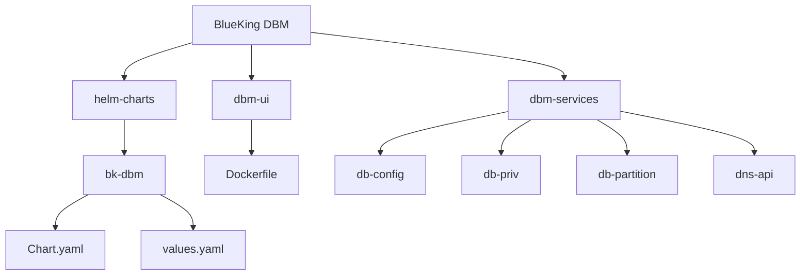
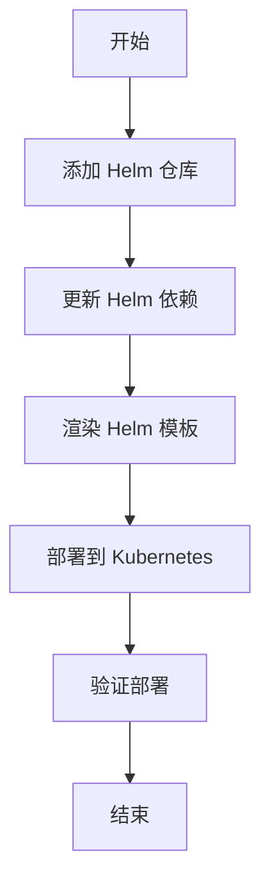
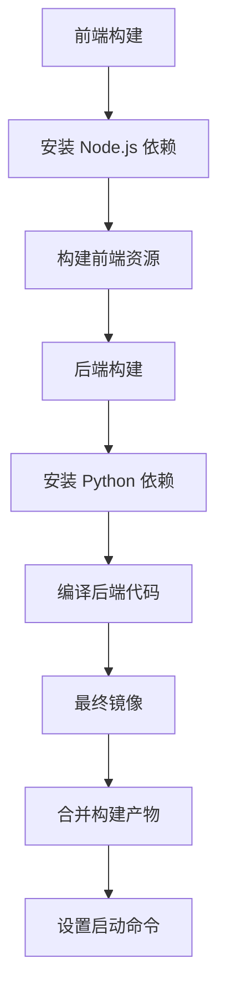

# 部署配置

<cite>
**本文档引用的文件**  
- [values.yaml](file://helm-charts/bk-dbm/values.yaml)
- [Chart.yaml](file://helm-charts/bk-dbm/Chart.yaml)
- [README.md](file://helm-charts/README.md)
- [Dockerfile](file://dbm-ui/Dockerfile)
- [db-config/Dockerfile](file://dbm-services/common/db-config/Dockerfile)
- [db-priv/Dockerfile](file://dbm-services/mysql/db-priv/Dockerfile)
- [db-partition/Dockerfile](file://dbm-services/mysql/db-partition/Dockerfile)
- [dns-api/Dockerfile](file://dbm-services/common/db-dns/dns-api/Dockerfile)
- [build.yml](file://build.yml)
</cite>

## 目录
1. [项目结构](#项目结构)
2. [Helm Charts 部署流程](#helm-charts-部署流程)
3. [values.yaml 配置说明](#valuesyaml-配置说明)
4. [Docker 镜像构建与管理](#docker-镜像构建与管理)
5. 环境配置差异
6. 部署脚本与自动化
7. 最佳实践

## 项目结构

BlueKing DBM 项目的部署配置主要集中在 `helm-charts/bk-dbm` 目录下，使用 Helm Chart 进行 Kubernetes 上的部署管理。项目包含多个微服务组件，每个组件都有独立的 Dockerfile 用于构建镜像。

**图示来源**  
- [helm-charts/bk-dbm](file://helm-charts/bk-dbm)
- [dbm-ui](file://dbm-ui)
- [dbm-services](file://dbm-services)

**本节来源**  
- [helm-charts](file://helm-charts)
- [dbm-ui](file://dbm-ui)
- [dbm-services](file://dbm-services)

## Helm Charts 部署流程

BlueKing DBM 使用 Helm Charts 进行 Kubernetes 部署，采用子 Chart 模式管理。主 Chart 位于 `helm-charts/bk-dbm` 目录下，通过 `Chart.yaml` 定义了所有依赖的子 Chart。

部署流程如下：

1. 添加依赖的 Helm 仓库
2. 更新 Helm 依赖
3. 渲染 Helm 模板
4. 部署到 Kubernetes 集群

**图示来源**  
- [helm-charts/README.md](file://helm-charts/README.md)
- [helm-charts/bk-dbm/Chart.yaml](file://helm-charts/bk-dbm/Chart.yaml)

**本节来源**  
- [helm-charts/README.md](file://helm-charts/README.md)
- [helm-charts/bk-dbm/Chart.yaml](file://helm-charts/bk-dbm/Chart.yaml)

## values.yaml 配置说明

`values.yaml` 文件是 Helm Chart 的核心配置文件，定义了所有可配置的参数。文件结构分为多个部分，每个部分对应不同的服务或功能。

### 全局配置 (global)

全局配置包含所有服务共享的配置项：

- `imageRegistry`: 镜像仓库地址
- `imagePullSecrets`: 镜像拉取密钥
- `storageClass`: 存储类
- `bkDomain`: 蓝鲸主域名
- `k8sWaitFor`: Kubernetes 等待工具配置

### 服务配置

每个服务都有独立的配置段，如 `dbm`, `dbconfig`, `dbpriv` 等。配置项包括：

- `enabled`: 是否启用该服务
- `image`: 镜像配置
- `envs`: 环境变量
- `service`: 服务配置
- `ingress`: Ingress 配置

### 数据库配置

数据库配置分为内部和外部两种模式：

- 内部数据库：使用 Bitnami 提供的 MySQL、Redis 等 Chart
- 外部数据库：配置连接信息，使用现有数据库实例

**本节来源**  
- [helm-charts/bk-dbm/values.yaml](file://helm-charts/bk-dbm/values.yaml)

## Docker 镜像构建与管理

BlueKing DBM 的各个服务组件都有独立的 Dockerfile，用于构建 Docker 镜像。不同服务根据其技术栈选择不同的基础镜像。

### 基础镜像选择

- Go 服务：使用 `golang:1.19` 或特定版本的腾讯镜像
- Python 服务：使用 `python:3.11.10-slim`
- 前端服务：使用 `node:22.16.0-slim`
- 特殊服务：使用 `centos:7` 等特定基础镜像

### 构建流程

Docker 镜像构建采用多阶段构建策略，以减小最终镜像大小：

1. 前端构建阶段：安装依赖并构建前端资源
2. 后端构建阶段：安装依赖并编译后端代码
3. 最终阶段：合并构建产物，创建运行时镜像

**图示来源**  
- [dbm-ui/Dockerfile](file://dbm-ui/Dockerfile)
- [dbm-services/common/db-config/Dockerfile](file://dbm-services/common/db-config/Dockerfile)
- [dbm-services/mysql/db-priv/Dockerfile](file://dbm-services/mysql/db-priv/Dockerfile)
- [dbm-services/mysql/db-partition/Dockerfile](file://dbm-services/mysql/db-partition/Dockerfile)
- [dbm-services/common/db-dns/dns-api/Dockerfile](file://dbm-services/common/db-dns/dns-api/Dockerfile)

**本节来源**  
- [dbm-ui/Dockerfile](file://dbm-ui/Dockerfile)
- [dbm-services/common/db-config/Dockerfile](file://dbm-services/common/db-config/Dockerfile)
- [dbm-services/mysql/db-priv/Dockerfile](file://dbm-services/mysql/db-priv/Dockerfile)
- [dbm-services/mysql/db-partition/Dockerfile](file://dbm-services/mysql/db-partition/Dockerfile)
- [dbm-services/common/db-dns/dns-api/Dockerfile](file://dbm-services/common/db-dns/dns-api/Dockerfile)