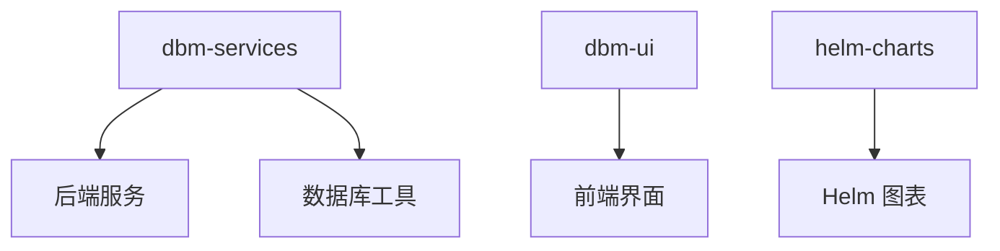
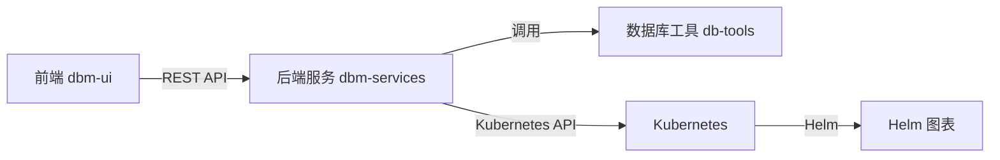
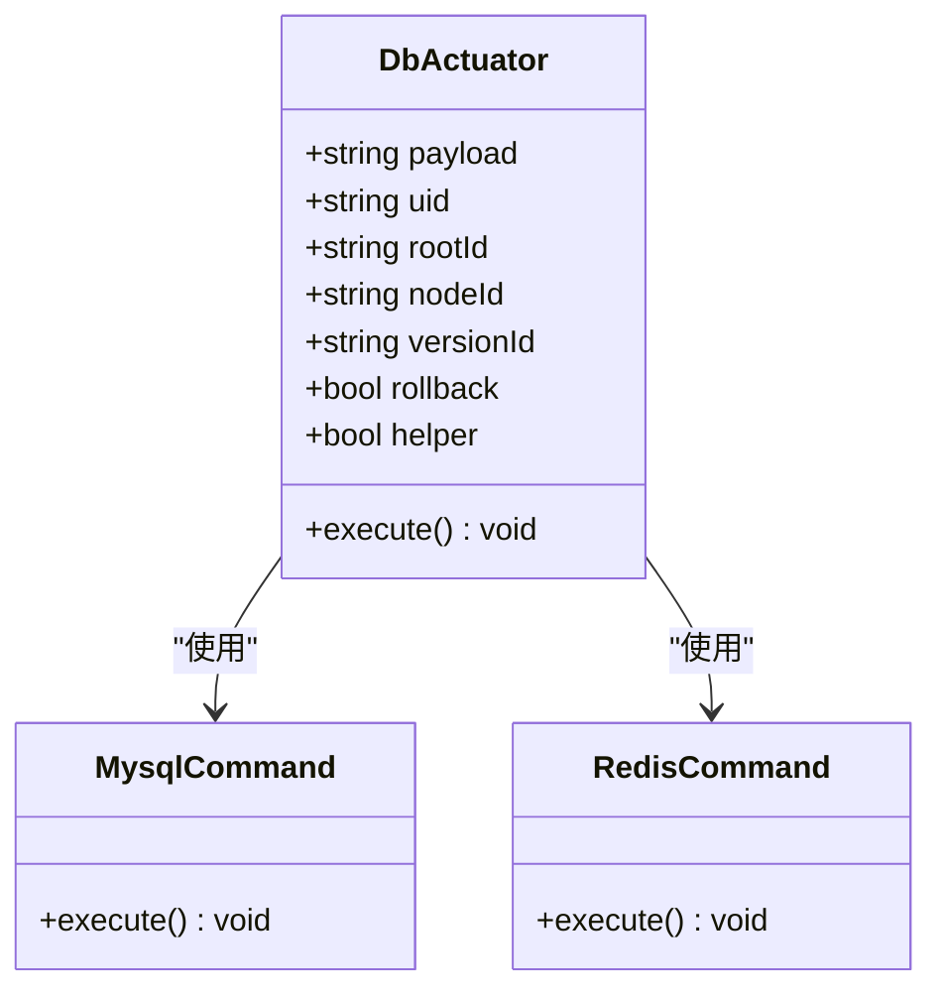
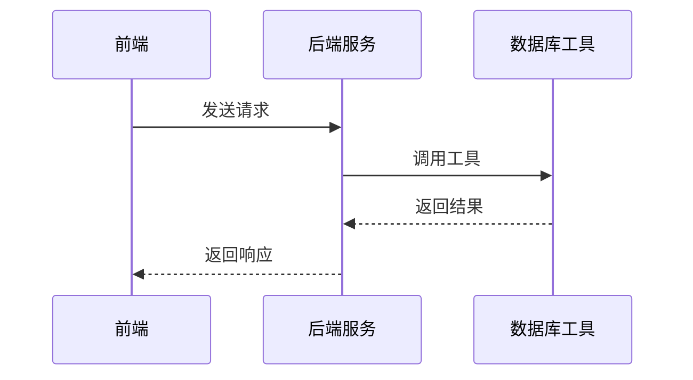
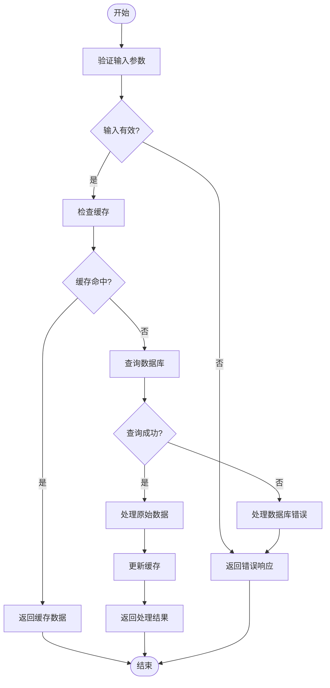
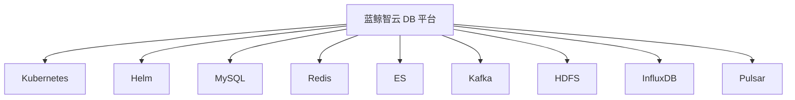

# 项目概述

<cite>
**本文档中引用的文件**  
- [readme.md](file://readme.md)
- [readme_en.md](file://readme_en.md)
- [DBM_README.md](file://dbm-ui/DBM_README.md)
- [go.work](file://dbm-services/go.work)
- [server.go](file://dbm-services/k8s-dbs/cmd/server.go)
- [main.go](file://dbm-services/redis/db-tools/dbactuator/main.go)
- [main.go](file://dbm-services/mongodb/db-tools/dbactuator/main.go)
- [bkconfigsvr/main.go](file://dbm-services/common/db-config/cmd/bkconfigsvr/main.go)
- [cmd.go](file://dbm-services/mysql/db-tools/dbactuator/cmd/cmd.go)
- [cmd.go](file://dbm-services/sqlserver/db-tools/dbactuator/cmd/cmd.go)
- [Chart.yaml](file://helm-charts/bk-dbm/Chart.yaml)
- [manage.py](file://dbm-ui/manage.py)
</cite>

## 目录
1. [简介](#简介)
2. [项目结构](#项目结构)
3. [核心组件](#核心组件)
4. [架构概览](#架构概览)
5. [详细组件分析](#详细组件分析)
6. [依赖分析](#依赖分析)
7. [性能考虑](#性能考虑)
8. [故障排除指南](#故障排除指南)
9. [结论](#结论)

## 简介
蓝鲸智云 DB 平台（blueking-dbm）是一个统一的数据库管控平台，旨在为多种数据库（包括 MySQL、Oracle、SQL Server、Redis、MongoDB 等）提供全生命周期管理。该平台集成了自动化运维、配置管理、权限控制、监控告警和备份恢复等主要功能，支持海量集群的批量管理能力。平台采用微服务架构设计，前端（dbm-ui）、后端服务（dbm-services）和数据库工具（db-tools）之间有明确的职责划分和紧密的协作关系。此外，平台还与 Kubernetes 和 Helm 集成，支持容器化部署和管理。

## 项目结构
蓝鲸智云 DB 平台的项目结构清晰，主要分为以下几个部分：
- `dbm-services/`: 后端服务，包含多个数据库组件的管理服务和工具。
- `dbm-ui/`: 前端界面，提供用户交互和管理功能。
- `helm-charts/`: Helm 图表，用于 Kubernetes 部署。

**图源**
- [readme.md](file://readme.md)

**章节源**
- [readme.md](file://readme.md)

## 核心组件
蓝鲸智云 DB 平台的核心组件包括：
- **dbm-services**: 提供 MySQL、Redis、ES、Kafka、HDFS、InfluxDB、Pulsar 等多种数据库组件的全生命周期管理服务。
- **dbm-ui**: 提供用户界面，支持数据库管理员、运维和开发人员轻松完成数据库管理工作。
- **db-tools**: 包含各种数据库工具，如 dbactuator、dbmon 等，用于执行具体的数据库操作。

**章节源**
- [readme.md](file://readme.md)
- [readme_en.md](file://readme_en.md)

## 架构概览
蓝鲸智云 DB 平台采用微服务架构设计，各组件之间通过 API 进行通信。前端（dbm-ui）通过 REST API 与后端服务（dbm-services）交互，后端服务再调用数据库工具（db-tools）执行具体的操作。平台还与 Kubernetes 和 Helm 集成，支持容器化部署和管理。

**图源**
- [readme.md](file://readme.md)
- [Chart.yaml](file://helm-charts/bk-dbm/Chart.yaml)

**章节源**
- [readme.md](file://readme.md)
- [Chart.yaml](file://helm-charts/bk-dbm/Chart.yaml)

## 详细组件分析
### dbm-services 分析
`dbm-services` 是后端服务的核心，包含多个子模块，每个子模块负责管理一种或多种数据库组件。例如，`mysql/db-tools/dbactuator` 负责 MySQL 的安装和管理，`redis/db-tools/dbactuator` 负责 Redis 的安装和管理。

#### 对象导向组件

**图源**
- [cmd.go](file://dbm-services/mysql/db-tools/dbactuator/cmd/cmd.go)
- [cmd.go](file://dbm-services/redis/db-tools/dbactuator/cmd/cmd.go)

#### API/服务组件

**图源**
- [server.go](file://dbm-services/k8s-dbs/cmd/server.go)
- [bkconfigsvr/main.go](file://dbm-services/common/db-config/cmd/bkconfigsvr/main.go)

#### 复杂逻辑组件

**图源**
- [bkconfigsvr/main.go](file://dbm-services/common/db-config/cmd/bkconfigsvr/main.go)

**章节源**
- [cmd.go](file://dbm-services/mysql/db-tools/dbactuator/cmd/cmd.go)
- [cmd.go](file://dbm-services/redis/db-tools/dbactuator/cmd/cmd.go)
- [bkconfigsvr/main.go](file://dbm-services/common/db-config/cmd/bkconfigsvr/main.go)

### dbm-ui 分析
`dbm-ui` 是前端界面，提供用户交互和管理功能。它通过 REST API 与后端服务（dbm-services）进行通信，支持数据库管理员、运维和开发人员轻松完成数据库管理工作。

**章节源**
- [DBM_README.md](file://dbm-ui/DBM_README.md)
- [manage.py](file://dbm-ui/manage.py)

## 依赖分析
蓝鲸智云 DB 平台的依赖关系复杂，主要依赖于 Kubernetes 和 Helm 进行容器化部署和管理。此外，平台还依赖于多种数据库组件和工具，如 MySQL、Redis、ES、Kafka、HDFS、InfluxDB、Pulsar 等。

**图源**
- [Chart.yaml](file://helm-charts/bk-dbm/Chart.yaml)

**章节源**
- [Chart.yaml](file://helm-charts/bk-dbm/Chart.yaml)

## 性能考虑
蓝鲸智云 DB 平台在设计时充分考虑了性能问题，采用了多种优化措施，如缓存机制、异步处理和负载均衡。平台还支持大规模集群的批量管理，能够高效地处理大量并发请求。

## 故障排除指南
在使用蓝鲸智云 DB 平台时，可能会遇到一些常见问题，如连接失败、权限不足等。建议首先检查网络连接和配置文件，确保所有依赖服务正常运行。如果问题仍然存在，可以查看日志文件以获取更多信息。

**章节源**
- [DBM_README.md](file://dbm-ui/DBM_README.md)

## 结论
蓝鲸智云 DB 平台是一个功能强大、易于使用的数据库管控平台，适用于多种数据库的全生命周期管理。通过微服务架构设计和与 Kubernetes、Helm 的集成，平台能够高效、安全地管理大规模数据库集群。无论是初学者还是经验丰富的开发者，都能从中受益。