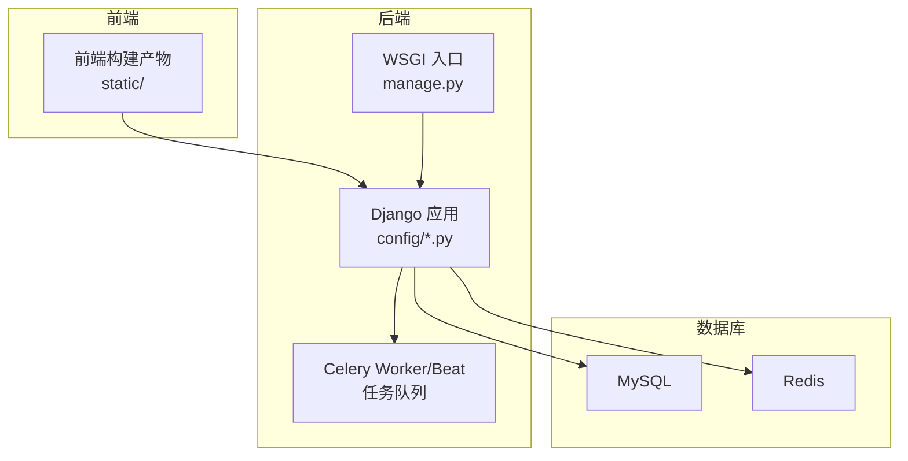
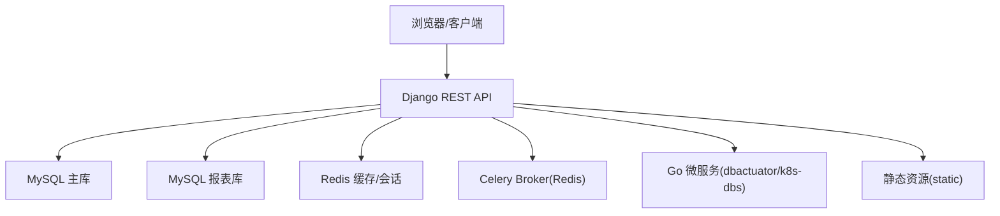
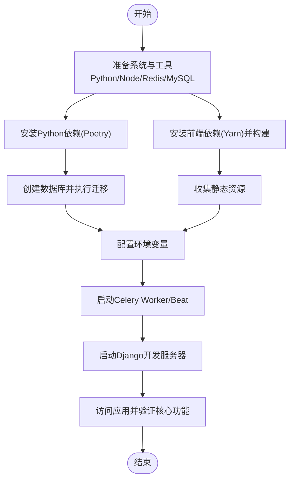
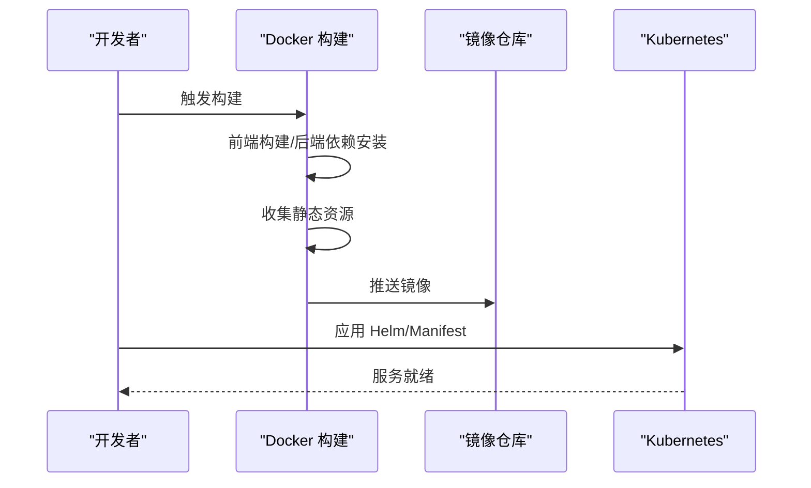
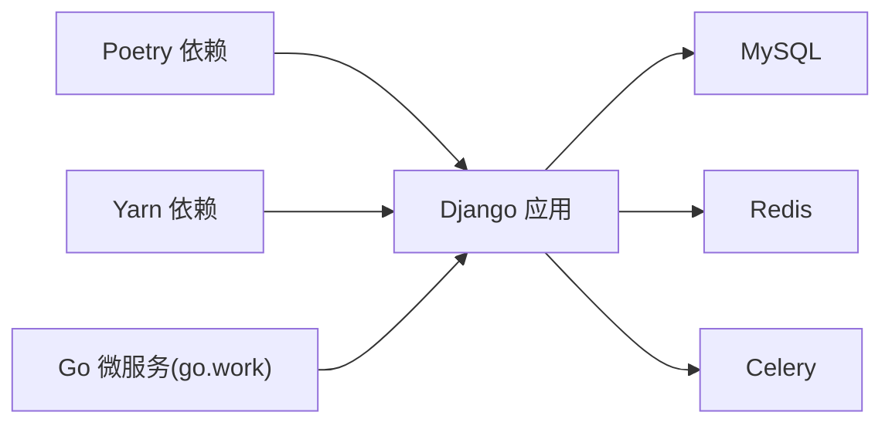

# 快速开始

<cite>
**本文引用的文件**
- [readme.md](file://readme.md)
- [DBM_README.md](file://dbm-ui/DBM_README.md)
- [pyproject.toml](file://dbm-ui/pyproject.toml)
- [Dockerfile](file://dbm-ui/Dockerfile)
- [manage.py](file://dbm-ui/manage.py)
- [default.py](file://dbm-ui/config/default.py)
- [dev.py](file://dbm-ui/config/dev.py)
- [prod.py](file://dbm-ui/config/prod.py)
- [stag.py](file://dbm-ui/config/stag.py)
- [build_frontend.sh](file://dbm-ui/bin/build_frontend.sh)
- [go.work](file://dbm-services/go.work)
- [build.yml](file://build.yml)
</cite>

## 目录
1. [简介](#简介)
2. [项目结构](#项目结构)
3. [核心组件](#核心组件)
4. [架构总览](#架构总览)
5. [详细组件分析](#详细组件分析)
6. [依赖分析](#依赖分析)
7. [性能考虑](#性能考虑)
8. [故障排查指南](#故障排查指南)
9. [结论](#结论)
10. [附录](#附录)

## 简介
DBM（数据库管理平台）是一个面向多数据库类型的全生命周期管理平台，覆盖 MySQL、Redis、ES、Kafka、HDFS、InfluxDB、Pulsar、Oracle、SQLServer、MongoDB、Riak 等组件，提供集群管理、配置下发、高可用切换、域名管理、监控与可观测等能力。本快速开始指南旨在帮助新用户在本地快速搭建开发环境、完成依赖安装、启动服务并验证核心功能，同时给出不同环境（本地开发、测试、生产）的部署差异与注意事项。

## 项目结构
DBM 采用前后端分离架构：
- 前端与后端服务位于 dbm-ui 目录，使用 Django 作为后端框架，Poetry 管理 Python 依赖，前端通过 Yarn 构建并打包至后端静态资源目录。
- 后端服务包含多个 Go 微服务模块（dbm-services），涵盖各类数据库工具与组件（如 dbactuator、db-config、db-resource、dbha、k8s-dbs 等），通过 go.work 组织为多模块工作区。
- 提供 Dockerfile 与 Helm Charts，便于容器化与 K8s 部署。

图表来源
- [Dockerfile:1-102](file://dbm-ui/Dockerfile#L1-L102)
- [manage.py:10-28](file://dbm-ui/manage.py#L10-L28)
- [default.py:227-286](file://dbm-ui/config/default.py#L227-L286)

章节来源
- [readme.md:1-54](file://readme.md#L1-L54)
- [DBM_README.md:72-230](file://dbm-ui/DBM_README.md#L72-L230)
- [go.work:1-47](file://dbm-services/go.work#L1-L47)

## 核心组件
- 后端 Django 应用：负责 API、权限、流程编排、文件存储、缓存、任务队列等。
- Celery：负责异步任务与周期性任务调度。
- 数据库：MySQL（主库与报表库分库路由）、Redis（缓存与会话）。
- 前端：通过 Yarn 构建，产物拷贝到后端 static 目录，由 Django 收集静态资源。
- Go 微服务：dbactuator、db-config、db-resource、dbha、k8s-dbs 等，提供具体数据库组件的工具与能力。

章节来源
- [default.py:118-149](file://dbm-ui/config/default.py#L118-L149)
- [default.py:227-286](file://dbm-ui/config/default.py#L227-L286)
- [default.py:293-309](file://dbm-ui/config/default.py#L293-L309)
- [default.py:470-484](file://dbm-ui/config/default.py#L470-L484)
- [pyproject.toml:8-89](file://dbm-ui/pyproject.toml#L8-L89)
- [go.work:1-47](file://dbm-services/go.work#L1-L47)

## 架构总览
DBM 的部署形态通常包含以下组件：
- Web 层：Django 提供 REST API 与页面服务。
- 任务层：Celery Worker/Beat 执行流程与周期任务。
- 存储层：MySQL（主库与报表库）、Redis。
- 工具层：Go 微服务（dbactuator 等）通过 HTTP/内部协议与后端交互。
- 静态资源：前端构建产物由 Django 收集并提供。

图表来源
- [default.py:227-286](file://dbm-ui/config/default.py#L227-L286)
- [default.py:293-309](file://dbm-ui/config/default.py#L293-L309)
- [default.py:470-484](file://dbm-ui/config/default.py#L470-L484)
- [Dockerfile:97-99](file://dbm-ui/Dockerfile#L97-L99)

## 详细组件分析

### 本地开发环境（macOS/Linux）
- 系统与工具
  - Python：版本要求为 >=3.11.10 且 <3.12，建议使用 pyenv 切换。
  - Node.js：推荐 v22.x，用于前端构建。
  - Redis：本地安装并启动，端口默认 6379。
  - MySQL：本地安装并启动，端口默认 3306。
- 依赖安装
  - 使用 Poetry 安装 Python 依赖。
  - 前端依赖通过 Yarn 安装并构建，产物拷贝到后端 static 目录。
- 数据库准备
  - 在 MySQL 中创建数据库：bk_dbm 与 bk_dbm_report。
  - 执行数据库迁移（含报表库迁移）。
- 环境变量
  - 设置 DJANGO_SETTINGS_MODULE 为 config.dev 或 config.prod。
  - 配置蓝鲸相关 API 域名、制品库凭据、IAM、登录等环境变量。
- 启动服务
  - 启动 Celery Worker/Beat。
  - 启动 Django 开发服务器。
  - 访问 http://appdev.{BK_PAAS_HOST}:8000/。

图表来源
- [DBM_README.md:74-230](file://dbm-ui/DBM_README.md#L74-L230)
- [build_frontend.sh:1-16](file://dbm-ui/bin/build_frontend.sh#L1-L16)
- [manage.py:10-28](file://dbm-ui/manage.py#L10-L28)

章节来源
- [DBM_README.md:72-230](file://dbm-ui/DBM_README.md#L72-L230)
- [pyproject.toml:8-89](file://dbm-ui/pyproject.toml#L8-L89)
- [default.py:227-286](file://dbm-ui/config/default.py#L227-L286)
- [dev.py:14-77](file://dbm-ui/config/dev.py#L14-L77)
- [prod.py:14-20](file://dbm-ui/config/prod.py#L14-L20)
- [build_frontend.sh:1-16](file://dbm-ui/bin/build_frontend.sh#L1-L16)
- [manage.py:10-28](file://dbm-ui/manage.py#L10-L28)

### 测试环境（Staging）
- 配置要点
  - 使用 config.stag，开启跨域与性能分析中间件。
  - 日志级别 INFO，便于问题定位。
- 与开发环境差异
  - 关闭 CSRF 校验中间件（开发便利），但测试环境仍需谨慎评估安全策略。
  - 可开启性能分析中间件辅助诊断。

章节来源
- [stag.py:13-27](file://dbm-ui/config/stag.py#L13-L27)
- [default.py:158-197](file://dbm-ui/config/default.py#L158-L197)

### 生产环境（Production）
- 配置要点
  - 使用 config.prod，关闭 DEBUG，严格 CORS 白名单。
  - 日志集中输出到 BK_LOG_DIR 下。
- 与开发/测试环境差异
  - 严格的跨域与安全配置。
  - 生产日志级别与输出路径标准化。
  - 建议使用 Gunicorn/WSGI 方式部署，配合 Nginx 反向代理。

章节来源
- [prod.py:14-20](file://dbm-ui/config/prod.py#L14-L20)
- [default.py:56-76](file://dbm-ui/config/default.py#L56-L76)
- [default.py:543-546](file://dbm-ui/config/default.py#L543-L546)

### 容器化与 Helm 部署（通用）
- Docker 构建
  - 多阶段构建：前端构建、后端依赖安装、最终运行镜像。
  - 收集静态资源并设置入口。
- Helm Charts
  - 提供 K8s 部署模板与 values.yaml，便于在集群中一键部署。

图表来源
- [Dockerfile:1-102](file://dbm-ui/Dockerfile#L1-L102)
- [build.yml:1-29](file://build.yml#L1-L29)

章节来源
- [Dockerfile:1-102](file://dbm-ui/Dockerfile#L1-L102)
- [build.yml:1-29](file://build.yml#L1-L29)

## 依赖分析
- Python 依赖
  - 使用 Poetry 管理，核心框架为 Django 4.2.x，REST 框架、Celery、API 网关、审计、加密、对象存储等。
- 前端依赖
  - Node/Yarn 用于构建，产出静态资源。
- Go 微服务
  - 通过 go.work 组织多模块，包含 dbactuator、db-config、db-resource、dbha、k8s-dbs 等。

图表来源
- [pyproject.toml:8-89](file://dbm-ui/pyproject.toml#L8-L89)
- [go.work:1-47](file://dbm-services/go.work#L1-L47)
- [default.py:227-286](file://dbm-ui/config/default.py#L227-L286)
- [default.py:293-309](file://dbm-ui/config/default.py#L293-L309)
- [default.py:470-484](file://dbm-ui/config/default.py#L470-L484)

章节来源
- [pyproject.toml:8-89](file://dbm-ui/pyproject.toml#L8-L89)
- [go.work:1-47](file://dbm-services/go.work#L1-L47)

## 性能考虑
- 数据库连接池
  - 使用连接池后端，合理设置池大小与回收周期，避免连接泄漏。
- 日志级别
  - 生产环境建议 INFO 或更高，避免过多 DEBUG 日志影响性能。
- 前端构建内存
  - 前端构建时可设置 NODE_OPTIONS 提升内存上限，减少 OOM 风险。
- Celery 并发
  - 根据 CPU 与任务特性调整并发数与队列，避免阻塞。

章节来源
- [default.py:227-286](file://dbm-ui/config/default.py#L227-L286)
- [default.py:470-484](file://dbm-ui/config/default.py#L470-L484)
- [build_frontend.sh:6-8](file://dbm-ui/bin/build_frontend.sh#L6-L8)

## 故障排查指南
- 依赖安装失败（Python/Poetry）
  - 确认 Python 版本在 3.11.10~3.12 之间；使用 pyenv 切换版本。
  - 清理缓存后重试安装。
- 前端构建失败
  - 检查 Node 版本是否符合要求；清理 node_modules/yarn.lock 后重新安装。
  - 构建后需执行收集静态资源命令。
- 数据库迁移失败
  - 确认数据库已创建并授权；先迁移默认库，再迁移报表库。
- 认证与跨域问题
  - 开发环境可临时关闭 CSRF 校验；生产环境必须严格配置白名单。
- Celery 无法连接队列
  - 检查 BROKER_URL 与 Redis 连通性；确认队列名称与并发配置正确。
- Docker 构建异常
  - 检查网络镜像源与缓存清理；确认多阶段构建顺序与依赖安装。

章节来源
- [DBM_README.md:72-230](file://dbm-ui/DBM_README.md#L72-L230)
- [dev.py:22-25](file://dbm-ui/config/dev.py#L22-L25)
- [prod.py:19-20](file://dbm-ui/config/prod.py#L19-L20)
- [default.py:470-484](file://dbm-ui/config/default.py#L470-L484)
- [Dockerfile:1-102](file://dbm-ui/Dockerfile#L1-L102)

## 结论
通过本快速开始指南，您可以在本地完成 DBM 的开发环境搭建，安装依赖、准备数据库、配置环境变量并启动服务。随后可根据实际需求选择测试或生产环境的部署策略，并结合容器化与 Helm Charts 实现规模化部署。遇到问题时，可依据故障排查指南逐项定位与解决。

## 附录
- 常用命令摘要
  - 安装 Python 依赖：poetry install
  - 安装前端依赖并构建：yarn install && yarn build
  - 收集静态资源：python manage.py collectstatic --settings=config.prod --noinput
  - 数据库迁移：python manage.py migrate；python manage.py migrate db_report --database=report_db
  - 启动 Celery：celery -A config.prod worker -c 20 -P threads -Q er_execute,er_schedule,celery -l info
  - 启动 Django：python manage.py runserver appdev.{BK_PAAS_HOST}:8000
- 环境变量（示例）
  - DJANGO_SETTINGS_MODULE、BK_LOG_DIR、BK_COMPONENT_API_URL、APP_TOKEN、DBA_APP_BK_BIZ_ID、DBCONFIG_APIGW_DOMAIN、BKREPO_*、BK_IAM_*、BKPAAS_*、BKLOG_* 等。

章节来源
- [DBM_README.md:112-230](file://dbm-ui/DBM_README.md#L112-L230)
- [default.py:311-334](file://dbm-ui/config/default.py#L311-L334)
- [default.py:554-562](file://dbm-ui/config/default.py#L554-L562)