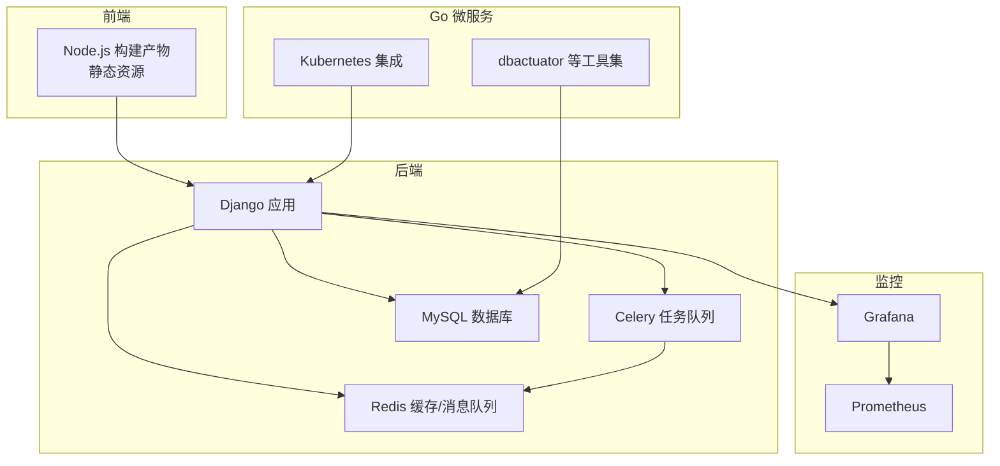
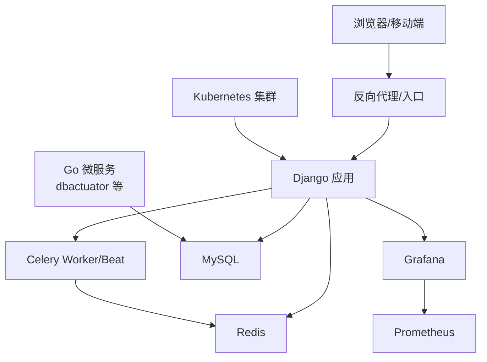
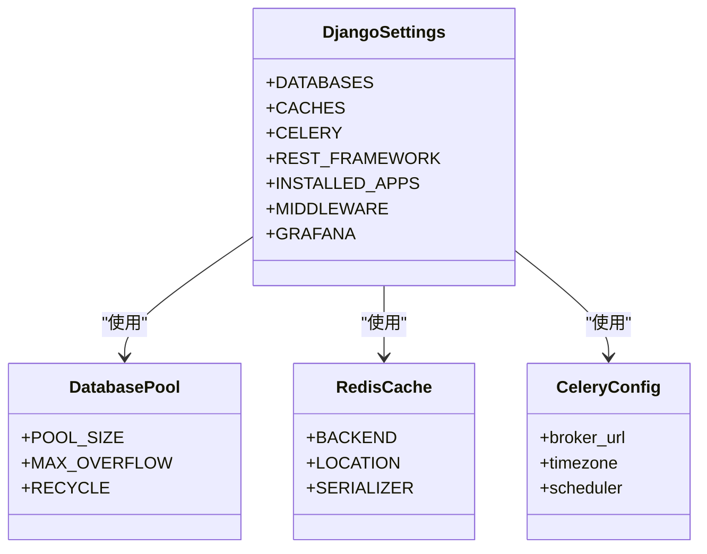
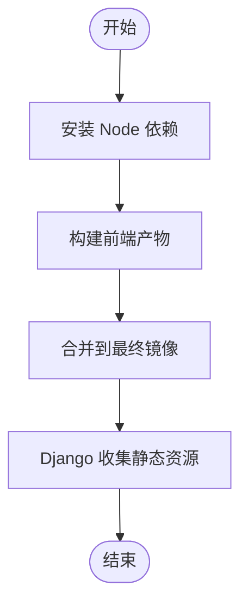
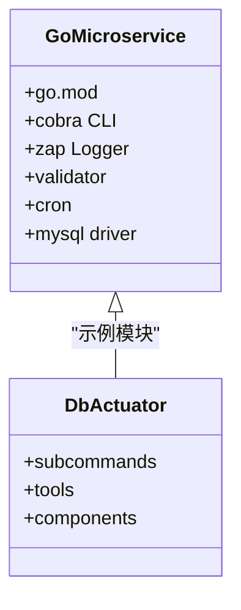
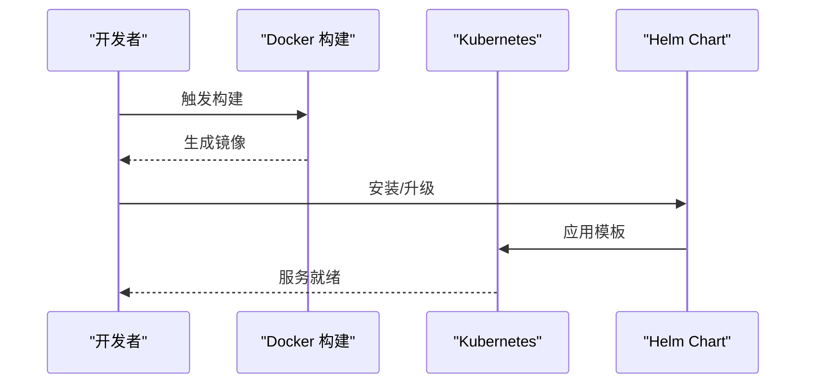
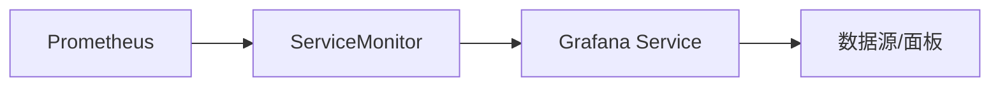
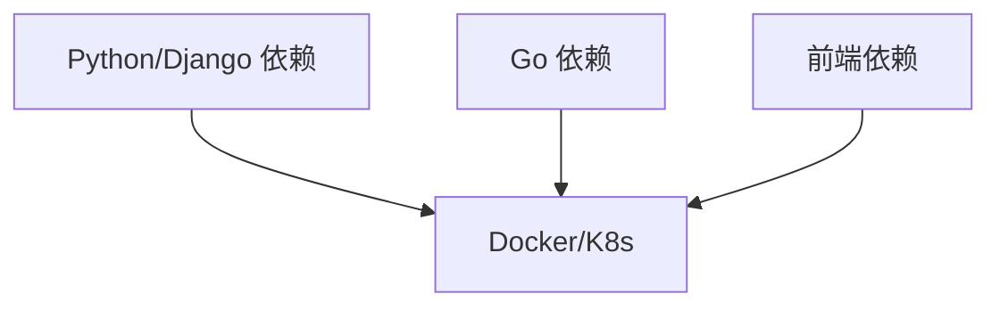

# 技术栈介绍

<cite>
**本文档引用的文件**
- [readme.md](file://readme.md)
- [readme_en.md](file://readme_en.md)
- [pyproject.toml](file://dbm-ui/pyproject.toml)
- [manage.py](file://dbm-ui/manage.py)
- [Dockerfile](file://dbm-ui/Dockerfile)
- [go.work](file://dbm-services/go.work)
- [dbactuator/go.mod](file://dbm-services/bigdata/db-tools/dbactuator/go.mod)
- [values.yaml](file://helm-charts/bk-dbm/values.yaml)
- [default.py](file://dbm-ui/config/default.py)
- [dev.py](file://dbm-ui/config/dev.py)
- [ci.py](file://dbm-ui/config/ci.py)
- [conf.py](file://dbm-ui/blueking/component/conf.py)
- [grafana/templates/servicemonitor.yaml](file://helm-charts/bk-dbm/charts/grafana/templates/servicemonitor.yaml)
- [grafana/README.md](file://helm-charts/bk-dbm/charts/grafana/README.md)
</cite>

## 目录
1. [简介](#简介)
2. [项目结构](#项目结构)
3. [核心组件](#核心组件)
4. [架构总览](#架构总览)
5. [详细组件分析](#详细组件分析)
6. [依赖分析](#依赖分析)
7. [性能考虑](#性能考虑)
8. [故障排查指南](#故障排查指南)
9. [结论](#结论)
10. [附录](#附录)

## 简介
DBM（数据库管理平台）是一个面向多数据库组件的全生命周期管理平台，支持 MySQL、Redis、ES、Kafka、HDFS、InfluxDB、Pulsar、MongoDB、SQLserver 等多种数据库与大数据组件。平台提供集群部署、扩容缩容、变更、监控等能力，并配套权限管理、域名解析、配置管理等公共服务，同时具备完善的可观测性与告警能力。

- 平台特性涵盖：全组件服务、工具箱、公共管理、交互式执行、安全权限、可观测性等。
- 支持在蓝鲸 PaaS 生态中运行，集成网关、权限中心、监控、通知等组件。

章节来源
- [readme.md:1-54](file://readme.md#L1-L54)
- [readme_en.md:1-29](file://readme_en.md#L1-L29)

## 项目结构
DBM 采用前后端分离与多模块 Go 微服务结合的组织方式：
- 后端（Python/Django）：统一的 Web 服务、任务调度、权限与网关对接、监控与告警集成。
- 前端（Node.js）：构建产物静态资源，由后端统一托管。
- 服务端（Go 微服务）：针对各数据库组件的工具链与运维操作（如部署、监控、备份等）。
- 容器化与编排：通过 Helm Chart 将服务打包部署至 Kubernetes。
- 监控与可视化：集成 Grafana 与 Prometheus，提供指标采集与仪表盘。

图表来源
- [Dockerfile:1-102](file://dbm-ui/Dockerfile#L1-L102)
- [values.yaml:1-792](file://helm-charts/bk-dbm/values.yaml#L1-L792)
- [default.py:227-286](file://dbm-ui/config/default.py#L227-L286)

章节来源
- [Dockerfile:1-102](file://dbm-ui/Dockerfile#L1-L102)
- [values.yaml:1-792](file://helm-charts/bk-dbm/values.yaml#L1-L792)

## 核心组件
- 后端技术栈（Python/Django）
  - Python 版本：3.11.x（Poetry 管理）
  - 框架：Django 4.2.x，Django REST Framework
  - 数据库：MySQL（连接池），支持多库路由
  - 缓存：Redis（Django-Redis）
  - 异步任务：Celery + Celery Beat
  - 网关与权限：蓝鲸 API 网关、IAM 权限中心
  - 监控与追踪：OpenTelemetry（OTLP/Jaeger 导出）
  - 日志与静态资源：Whitenoise、pyinstrument 性能分析
- 前端技术栈（Node.js）
  - Node.js 版本：24.15.0（镜像内置）
  - 构建工具：Yarn（国内镜像源）
  - 静态资源：构建后产物由后端收集并托管
- Go 微服务技术栈
  - Go 版本：1.24.x（go.work 指定）
  - 工具链：cobra（命令行框架）、zap（日志）、validator（校验）、cron（定时）
  - 数据库驱动：go-sql-driver/mysql
- 容器化与编排
  - Docker 镜像：多阶段构建，前端与后端合并镜像
  - Kubernetes：Helm Chart 统一打包，支持 Ingress、Service、持久化等
  - 外部依赖：MySQL、Redis、Etcd（可选外部部署）
- 监控与可视化
  - Grafana：内置镜像与配置，支持数据源与面板
  - Prometheus：通过 ServiceMonitor 采集指标

章节来源
- [pyproject.toml:1-133](file://dbm-ui/pyproject.toml#L1-L133)
- [default.py:227-310](file://dbm-ui/config/default.py#L227-L310)
- [go.work:1-47](file://dbm-services/go.work#L1-L47)
- [dbactuator/go.mod:1-65](file://dbm-services/bigdata/db-tools/dbactuator/go.mod#L1-L65)
- [Dockerfile:1-102](file://dbm-ui/Dockerfile#L1-L102)
- [values.yaml:1-792](file://helm-charts/bk-dbm/values.yaml#L1-L792)

## 架构总览
DBM 的整体架构围绕“前端 + Django 后端 + Go 微服务 + Kubernetes + 监控”的组合展开。前端通过 Django 提供的 API 与各微服务交互；Django 通过 Celery 执行异步任务；Redis 作为缓存与消息中间件；MySQL 存放业务与报表数据；Grafana 展示监控指标，Prometheus 采集指标。

图表来源
- [values.yaml:109-177](file://helm-charts/bk-dbm/values.yaml#L109-L177)
- [default.py:227-310](file://dbm-ui/config/default.py#L227-L310)
- [grafana/templates/servicemonitor.yaml:1-50](file://helm-charts/bk-dbm/charts/grafana/templates/servicemonitor.yaml#L1-L50)

## 详细组件分析

### 后端（Django）组件
- 数据库与连接池
  - 使用连接池扩展 dj_db_conn_pool，支持多库（default/report/stats）与池参数配置。
  - 数据库路由：报表与统计库通过自定义路由器分发。
- 缓存与会话
  - Redis 作为默认缓存后端，序列化器与最大条目配置。
  - 登录缓存使用数据库缓存表。
- 任务与队列
  - Celery Beat 使用数据库调度器，Broker 使用 Redis。
  - 时区与 UTC 设置，支持定时任务。
- 监控与追踪
  - OpenTelemetry 可按需启用，支持 DB API 访问追踪。
- 静态资源与白名单
  - Whitenoise 提供静态托管，CORS 与 CSRF 配置满足跨域需求。
- 蓝鲸生态集成
  - API 网关、IAM、通知、审计、对象存储等组件集成。

图表来源
- [default.py:227-310](file://dbm-ui/config/default.py#L227-L310)
- [default.py:447-477](file://dbm-ui/config/default.py#L447-L477)

章节来源
- [default.py:227-310](file://dbm-ui/config/default.py#L227-L310)
- [default.py:447-477](file://dbm-ui/config/default.py#L447-L477)

### 前端（Node.js）组件
- Node.js 版本：24.15.0，使用 Yarn 安装依赖与构建。
- 多阶段 Docker 构建：先安装前端依赖，再构建产物，最后合并到最终镜像。
- 静态资源：构建后产物复制到后端 static 目录，统一由 Django 收集与托管。

图表来源
- [Dockerfile:12-17](file://dbm-ui/Dockerfile#L12-L17)
- [Dockerfile:88-99](file://dbm-ui/Dockerfile#L88-L99)

章节来源
- [Dockerfile:1-102](file://dbm-ui/Dockerfile#L1-L102)

### Go 微服务组件
- Go 版本：1.24.x（go.work 指定），工具链包含 cobra、zap、validator、cron 等。
- 数据库驱动：go-sql-driver/mysql，适配 MySQL 操作。
- 模块组织：以 dbactuator 为代表的服务模块，提供子命令与工具集。

图表来源
- [go.work:1-47](file://dbm-services/go.work#L1-L47)
- [dbactuator/go.mod:1-65](file://dbm-services/bigdata/db-tools/dbactuator/go.mod#L1-L65)

章节来源
- [go.work:1-47](file://dbm-services/go.work#L1-L47)
- [dbactuator/go.mod:1-65](file://dbm-services/bigdata/db-tools/dbactuator/go.mod#L1-L65)

### 容器化与编排（Docker/Kubernetes）
- Docker 镜像
  - 多阶段构建：前端安装与构建、后端依赖安装、最终镜像合并。
  - 运行时依赖：gettext、curl、vim、MySQL 客户端等。
- Kubernetes 部署
  - Helm Chart：统一打包，支持 Ingress、Service、ServiceMonitor、持久化等。
  - 外部依赖：MySQL、Redis、Etcd 可配置为外部实例。
  - 蓝鲸生态：API 网关、权限中心、监控、制品库等域名与 Token 配置。

图表来源
- [Dockerfile:1-102](file://dbm-ui/Dockerfile#L1-L102)
- [values.yaml:109-177](file://helm-charts/bk-dbm/values.yaml#L109-L177)

章节来源
- [Dockerfile:1-102](file://dbm-ui/Dockerfile#L1-L102)
- [values.yaml:1-792](file://helm-charts/bk-dbm/values.yaml#L1-L792)

### 监控与可视化（Prometheus/Grafana）
- Grafana
  - 使用 Bitnami 镜像，内置数据源与面板，支持配置注入。
  - 通过 ServiceMonitor 暴露指标端点。
- Prometheus
  - 通过 ServiceMonitor 采集 Grafana 指标，支持命名空间选择与标签重写。

图表来源
- [grafana/templates/servicemonitor.yaml:1-50](file://helm-charts/bk-dbm/charts/grafana/templates/servicemonitor.yaml#L1-L50)
- [grafana/README.md:1-433](file://helm-charts/bk-dbm/charts/grafana/README.md#L1-L433)

章节来源
- [grafana/templates/servicemonitor.yaml:1-50](file://helm-charts/bk-dbm/charts/grafana/templates/servicemonitor.yaml#L1-L50)
- [grafana/README.md:1-433](file://helm-charts/bk-dbm/charts/grafana/README.md#L1-L433)

## 依赖分析
- Python/Django 依赖
  - 核心：Django 4.2.x、djangorestframework、django-celery-beat、django-redis、PyMySQL、gunicorn、whitenoise 等。
  - 蓝鲸生态：apigw-manager、bk-iam、bk-audit、bk-notice、bk-monitor-report 等。
  - 开发工具：pytest、black、isort、flake8 等。
- Go 依赖
  - cobra、zap、validator、cron、go-sql-driver/mysql 等。
- 前端依赖
  - Node.js 24.15.0、Yarn、构建工具链。
- 容器与编排
  - Docker 多阶段构建、Helm Chart、Kubernetes 资源清单。

图表来源
- [pyproject.toml:1-133](file://dbm-ui/pyproject.toml#L1-L133)
- [go.work:1-47](file://dbm-services/go.work#L1-L47)
- [Dockerfile:1-102](file://dbm-ui/Dockerfile#L1-L102)

章节来源
- [pyproject.toml:1-133](file://dbm-ui/pyproject.toml#L1-L133)
- [go.work:1-47](file://dbm-services/go.work#L1-L47)

## 性能考虑
- 连接池与超时
  - MySQL 连接池参数（POOL_SIZE、MAX_OVERFLOW、RECYCLE）直接影响吞吐与稳定性。
- 异步任务
  - Celery Worker 数量与队列策略应结合业务峰值调整。
- 缓存命中
  - Redis 缓存键设计与序列化器选择影响读写性能。
- 静态资源
  - Whitenoise 与压缩静态文件存储提升前端加载速度。
- 监控开销
  - OpenTelemetry 与 DB API 访问追踪会增加 Span 数量，建议按需开启。

章节来源
- [default.py:244-284](file://dbm-ui/config/default.py#L244-L284)
- [default.py:479-483](file://dbm-ui/config/default.py#L479-L483)
- [default.py:303-307](file://dbm-ui/config/default.py#L303-L307)

## 故障排查指南
- 数据库连接问题
  - 检查 DATABASES 配置与连接池参数，确认主机、端口、用户名、密码正确。
  - 关注连接池回收周期与溢出上限。
- 缓存不可用
  - 检查 Redis 地址与序列化器配置，确认网络连通性。
- 任务队列异常
  - 检查 Celery Broker URL、时区与调度器配置，确认 Worker 正常运行。
- 蓝鲸组件集成
  - 核对 API 网关域名、权限中心地址、通知与审计配置。
- 日志与性能
  - 使用 pyinstrument 分析热点接口，结合 OpenTelemetry 追踪定位慢调用。

章节来源
- [default.py:227-310](file://dbm-ui/config/default.py#L227-L310)
- [dev.py:27-39](file://dbm-ui/config/dev.py#L27-L39)
- [ci.py:36-71](file://dbm-ui/config/ci.py#L36-L71)
- [conf.py:15-27](file://dbm-ui/blueking/component/conf.py#L15-L27)

## 结论
DBM 技术栈围绕“Django + Go 微服务 + Kubernetes + 监控”形成完整闭环，既满足多数据库组件的全生命周期管理需求，又具备良好的可观测性与可扩展性。通过 Helm Chart 实现标准化部署，结合蓝鲸生态组件实现统一鉴权、网关与通知能力。建议在生产环境中合理配置连接池、缓存与任务队列参数，并按需启用监控与追踪，确保系统稳定与可观测。

## 附录
- 学习路径与参考资料
  - Django 官方文档与 REST Framework 文档
  - Celery 官方文档与数据库调度器使用
  - OpenTelemetry Python SDK 与导出器配置
  - Helm 官方文档与 Bitnami Grafana Chart
  - Kubernetes Ingress、Service、ServiceMonitor 使用
  - Node.js 与 Yarn 官方文档
  - Go cobra、zap、validator、cron 使用指南
  - 蓝鲸 PaaS、API 网关、IAM、监控等生态组件文档