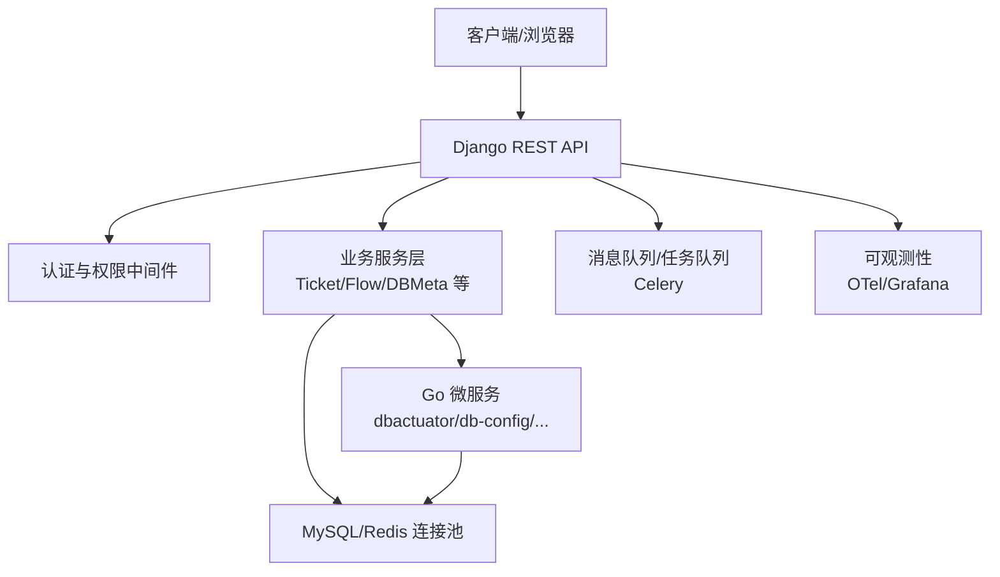
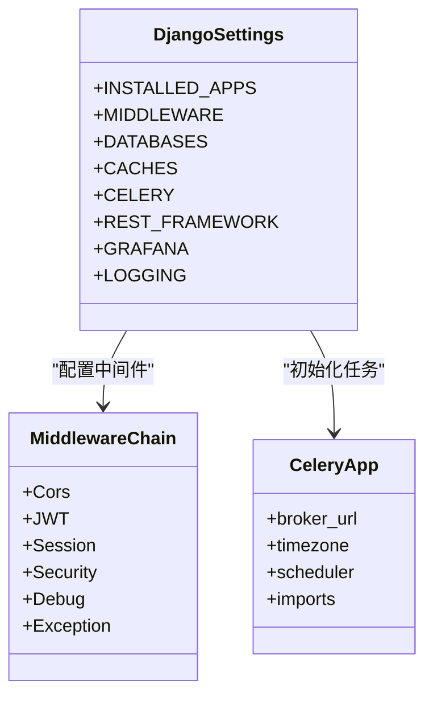
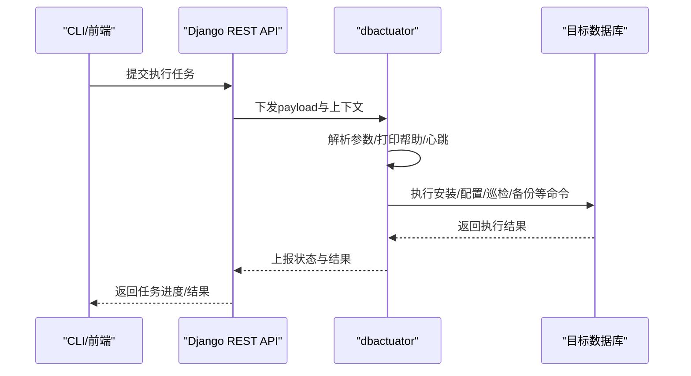
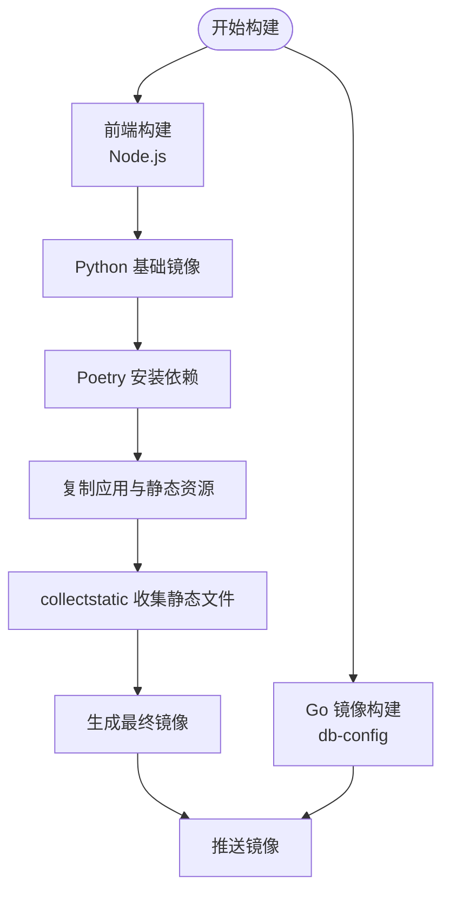
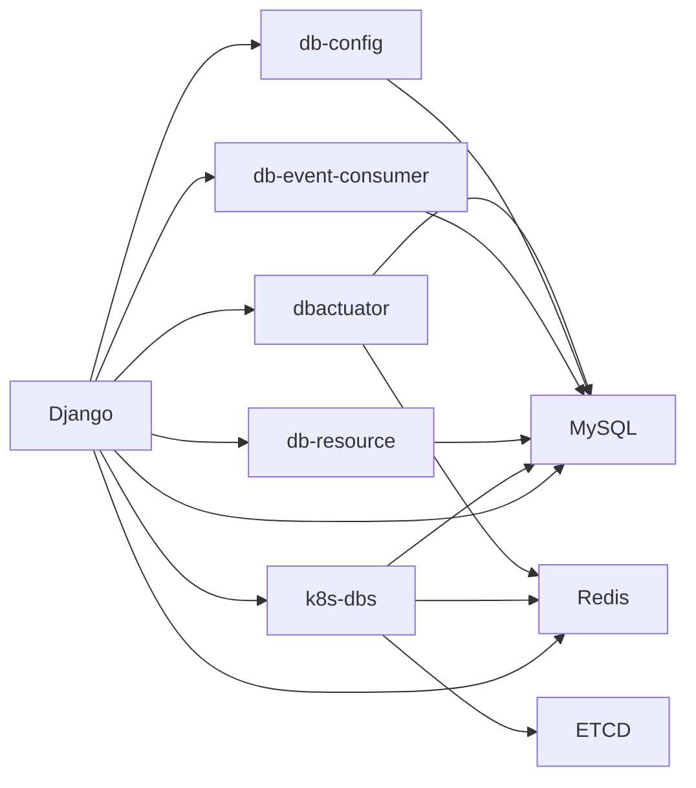

# 架构概览

<cite>
**本文引用的文件**
- [readme.md](file://readme.md)
- [DBM_README.md](file://dbm-ui/DBM_README.md)
- [go.work](file://dbm-services/go.work)
- [pyproject.toml](file://dbm-ui/pyproject.toml)
- [Chart.yaml](file://helm-charts/bk-dbm/Chart.yaml)
- [manage.py](file://dbm-ui/manage.py)
- [asgi.py](file://dbm-ui/backend/asgi.py)
- [default.py](file://dbm-ui/config/default.py)
- [cmd.go](file://dbm-services/bigdata/db-tools/dbactuator/cmd/cmd.go)
- [config.yaml](file://dbm-services/common/db-config/conf/config.yaml)
- [Dockerfile（UI）](file://dbm-ui/Dockerfile)
- [Dockerfile（db-config）](file://dbm-services/common/db-config/Dockerfile)
</cite>

## 目录
1. [引言](#引言)
2. [项目结构](#项目结构)
3. [核心组件](#核心组件)
4. [架构总览](#架构总览)
5. [详细组件分析](#详细组件分析)
6. [依赖分析](#依赖分析)
7. [性能考虑](#性能考虑)
8. [故障排查指南](#故障排查指南)
9. [结论](#结论)
10. [附录](#附录)

## 引言
本文件面向DBM（数据库管理）项目的架构概览与设计说明，重点阐述其微服务化、前后端分离、容器化与可观测性架构，以及Go语言服务层、Python/Django Web层、数据库层、消息队列层等技术栈的选择与职责划分。DBM旨在为多数据库组件（MySQL、Redis、ES、Kafka、HDFS、InfluxDB、Pulsar、Oracle、SQLServer、MongoDB、Riak等）提供全生命周期管理与批量运维能力，强调高可用、可扩展与可维护。

## 项目结构
DBM采用多模块工作区（Go Work）组织服务，前端与后端分离，配合Helm Chart进行统一编排与发布。整体结构分为三层：
- 前端与Web层：Django后端 + Celery任务 + 前端静态资源构建
- 服务层：Go微服务（dbactuator、db-config、db-event-consumer、db-resource、k8s-dbs等）
- 基础设施：MySQL、Redis、Etcd、Grafana、Kafka消费者等（通过Helm Chart或容器镜像）

```mermaid
graph TB
subgraph "前端与Web层"
FE["前端静态资源<br/>Node.js 构建产物"]
DJ["Django 应用<br/>REST API + 中间件"]
CEL["Celery 任务队列<br/>执行流程与周期任务"]
end
subgraph "服务层Go 微服务"
ACT["dbactuator<br/>数据库侧命令执行器"]
CFG["db-config<br/>配置中心服务"]
EV["db-event-consumer<br/>事件消费服务"]
RES["db-resource<br/>资源管理服务"]
K8S["k8s-dbs<br/>Kubernetes 数据库编排"]
end
subgraph "基础设施"
MYSQL["MySQL"]
REDIS["Redis"]
ETCD["Etcd"]
GRAF["Grafana"]
KAFKA["Kafka 消费者"]
end
FE --> DJ
DJ <- --> CEL
DJ --> ACT
DJ --> CFG
DJ --> EV
DJ --> RES
DJ --> K8S
ACT --> MYSQL
ACT --> REDIS
ACT --> KAFKA
CFG --> MYSQL
EV --> MYSQL
RES --> MYSQL
K8S --> MYSQL
K8S --> REDIS
K8S --> ETCD
GRAF --> MYSQL
```

图表来源
- [Chart.yaml:1-108](file://helm-charts/bk-dbm/Chart.yaml#L1-L108)
- [go.work:1-47](file://dbm-services/go.work#L1-L47)
- [Dockerfile（UI）:1-102](file://dbm-ui/Dockerfile#L1-L102)
- [Dockerfile（db-config）:1-11](file://dbm-services/common/db-config/Dockerfile#L1-L11)

章节来源
- [readme.md:1-54](file://readme.md#L1-L54)
- [DBM_README.md:72-230](file://dbm-ui/DBM_README.md#L72-L230)
- [go.work:1-47](file://dbm-services/go.work#L1-L47)
- [Chart.yaml:1-108](file://helm-charts/bk-dbm/Chart.yaml#L1-L108)

## 核心组件
- Django后端与REST API：提供统一接口、权限与审计、跨域与缓存、数据库连接池、Celery任务调度、OpenTelemetry链路追踪、Grafana代理等。
- Go微服务：
  - dbactuator：面向数据库侧的命令行工具集合，支持多种数据库的安装、配置、巡检、备份等操作。
  - db-config：配置中心服务，提供HTTP接口、数据库连接配置、迁移与加密等能力。
  - db-event-consumer：事件消费服务，对接外部事件流。
  - db-resource：资源管理服务，支撑资源申请与释放。
  - k8s-dbs：Kubernetes场景下的数据库编排与元数据管理。
- 基础设施与编排：Helm Chart统一编排MySQL、Redis、Etcd、Grafana、dbm子服务等；Dockerfile分别构建前端与后端镜像。

章节来源
- [default.py:78-149](file://dbm-ui/config/default.py#L78-L149)
- [default.py:227-286](file://dbm-ui/config/default.py#L227-L286)
- [default.py:470-484](file://dbm-ui/config/default.py#L470-L484)
- [cmd.go:1-207](file://dbm-services/bigdata/db-tools/dbactuator/cmd/cmd.go#L1-L207)
- [config.yaml:1-26](file://dbm-services/common/db-config/conf/config.yaml#L1-L26)
- [Dockerfile（UI）:1-102](file://dbm-ui/Dockerfile#L1-L102)
- [Dockerfile（db-config）:1-11](file://dbm-services/common/db-config/Dockerfile#L1-L11)

## 架构总览
DBM采用“前端与Web层 + 微服务层 + 基础设施”的分层架构：
- 前后端分离：前端通过Django REST API与后端交互，后端通过Celery异步执行复杂流程。
- 微服务化：dbactuator、db-config、db-event-consumer、db-resource、k8s-dbs等以独立Go服务提供能力。
- 容器化与编排：Helm Chart统一管理各子服务与依赖，Dockerfile负责镜像构建。
- 可观测性：OpenTelemetry链路追踪、Grafana可视化、日志聚合与告警。



图表来源
- [default.py:158-193](file://dbm-ui/config/default.py#L158-L193)
- [default.py:227-286](file://dbm-ui/config/default.py#L227-L286)
- [default.py:470-484](file://dbm-ui/config/default.py#L470-L484)
- [Chart.yaml:27-102](file://helm-charts/bk-dbm/Chart.yaml#L27-L102)

章节来源
- [default.py:158-193](file://dbm-ui/config/default.py#L158-L193)
- [default.py:227-286](file://dbm-ui/config/default.py#L227-L286)
- [default.py:470-484](file://dbm-ui/config/default.py#L470-L484)
- [Chart.yaml:1-108](file://helm-charts/bk-dbm/Chart.yaml#L1-L108)

## 详细组件分析

### Django后端与Web层
- 应用与中间件：Django应用列表包含REST Framework、Celery Beat、调试工具、国际化、API网关、审计、权限等模块；中间件链路覆盖跨域、认证、会话、安全、调试与异常处理。
- 数据库与缓存：多数据库路由（report_db/stats_db），连接池配置，Redis缓存与序列化策略。
- 任务与队列：Celery配置、Broker URL、时区与调度器；周期任务通过数据库调度器管理。
- 可观测性：OpenTelemetry链路追踪开关、Grafana代理配置、日志格式与过滤器。
- 部署入口：manage.py设置生产配置，asgi.py统一入口。



图表来源
- [default.py:78-149](file://dbm-ui/config/default.py#L78-L149)
- [default.py:158-193](file://dbm-ui/config/default.py#L158-L193)
- [default.py:227-286](file://dbm-ui/config/default.py#L227-L286)
- [default.py:470-484](file://dbm-ui/config/default.py#L470-L484)

章节来源
- [default.py:78-149](file://dbm-ui/config/default.py#L78-L149)
- [default.py:158-193](file://dbm-ui/config/default.py#L158-L193)
- [default.py:227-286](file://dbm-ui/config/default.py#L227-L286)
- [default.py:470-484](file://dbm-ui/config/default.py#L470-L484)
- [manage.py:10-23](file://dbm-ui/manage.py#L10-L23)
- [asgi.py:12-18](file://dbm-ui/backend/asgi.py#L12-L18)

### Go微服务层
- dbactuator：基于Cobra命令框架，提供系统初始化、定时任务、通用下载、各类数据库命令组（ES/Kafka/Pulsar/InfluxDB/HDFS/VM/Doris等），支持心跳输出与回滚。
- db-config：提供HTTP监听、数据库连接配置、连接池参数、Swagger UI、迁移与加密配置。
- 其他微服务：db-event-consumer、db-resource、k8s-dbs等在go.work中统一管理，Helm Chart中作为子Chart被编排。



图表来源
- [cmd.go:58-185](file://dbm-services/bigdata/db-tools/dbactuator/cmd/cmd.go#L58-L185)
- [cmd.go:192-207](file://dbm-services/bigdata/db-tools/dbactuator/cmd/cmd.go#L192-L207)

章节来源
- [cmd.go:1-207](file://dbm-services/bigdata/db-tools/dbactuator/cmd/cmd.go#L1-L207)
- [config.yaml:1-26](file://dbm-services/common/db-config/conf/config.yaml#L1-L26)
- [go.work:1-47](file://dbm-services/go.work#L1-L47)

### 容器化与编排
- 前端镜像：Node.js构建静态资源，Python基础镜像复制依赖与静态文件，最终通过collectstatic收集静态资源。
- 后端镜像：Python 3.11.10，Poetry导出requirements，安装依赖，复制应用与前端产物。
- db-config镜像：Go基础镜像，拷贝配置与二进制，启动服务。
- Helm Chart：声明MySQL、Redis、Etcd、Grafana、dbm子服务等依赖，按条件启用各子Chart。



图表来源
- [Dockerfile（UI）:1-102](file://dbm-ui/Dockerfile#L1-L102)
- [Dockerfile（db-config）:1-11](file://dbm-services/common/db-config/Dockerfile#L1-L11)
- [Chart.yaml:1-108](file://helm-charts/bk-dbm/Chart.yaml#L1-L108)

章节来源
- [Dockerfile（UI）:1-102](file://dbm-ui/Dockerfile#L1-L102)
- [Dockerfile（db-config）:1-11](file://dbm-services/common/db-config/Dockerfile#L1-L11)
- [Chart.yaml:1-108](file://helm-charts/bk-dbm/Chart.yaml#L1-L108)

## 依赖分析
- 技术栈依赖：
  - Python/Django：REST Framework、Celery、Celery Beat、OpenTelemetry、Gunicorn、Whitenoise、Django-Redis、PyMySQL、Requests、drf-yasg、django-cors-headers等。
  - Go：Cobra命令框架、日志、Swagger注解等。
  - 基础设施：MySQL、Redis、Etcd、Grafana、Kafka消费者等。
- 组件耦合：
  - Django后端通过API与Go微服务交互，任务通过Celery异步执行，数据库连接池与缓存贯穿前后端。
  - Helm Chart将子服务与依赖统一编排，避免重复配置与版本漂移。



图表来源
- [pyproject.toml:8-94](file://dbm-ui/pyproject.toml#L8-L94)
- [go.work:1-47](file://dbm-services/go.work#L1-L47)
- [Chart.yaml:1-108](file://helm-charts/bk-dbm/Chart.yaml#L1-L108)

章节来源
- [pyproject.toml:1-133](file://dbm-ui/pyproject.toml#L1-L133)
- [go.work:1-47](file://dbm-services/go.work#L1-L47)
- [Chart.yaml:1-108](file://helm-charts/bk-dbm/Chart.yaml#L1-L108)

## 性能考虑
- 数据库连接池：Django后端使用连接池后端与池参数，减少连接开销与抖动。
- 缓存策略：Redis缓存与序列化器提升读写性能，结合Grafana可视化监控。
- 异步任务：Celery队列与调度器分离，周期任务与执行任务解耦。
- 静态资源：Whitenoise压缩与清单存储，减少静态资源传输成本。
- 链路追踪：OpenTelemetry按需开启，避免过度采样导致的性能损耗。

## 故障排查指南
- 日志与追踪：统一日志格式与过滤器，便于定位请求ID与堆栈；OTel链路追踪辅助定位慢调用。
- 中间件异常：JWT、会话、安全、异常等中间件链路，结合调试工具与跨域配置排查。
- 数据库与缓存：检查连接池参数、超时与回收策略；确认Redis序列化与连接工厂配置。
- 任务队列：核对Broker URL与时区，验证调度器与导入模块是否正确加载。

章节来源
- [default.py:489-540](file://dbm-ui/config/default.py#L489-L540)
- [default.py:158-193](file://dbm-ui/config/default.py#L158-L193)
- [default.py:227-286](file://dbm-ui/config/default.py#L227-L286)
- [default.py:470-484](file://dbm-ui/config/default.py#L470-L484)

## 结论
DBM通过“前后端分离 + 微服务化 + 容器化 + 可观测性”的架构设计，实现了对多数据库组件的全生命周期管理与批量运维。Go微服务承担数据库侧操作与配置管理，Django后端提供统一API、权限与任务编排，Helm Chart与Dockerfile保障可重复部署与升级。该架构在高可用、可扩展与可维护方面具备良好基础，适合大规模数据库运维场景。

## 附录
- 本地部署要点：前端Node.js版本、Python 3.11.10、Poetry依赖安装、MySQL/Redis准备、Django迁移与collectstatic、Celery Worker与Beat启动、环境变量配置等。
- Helm Chart依赖：MySQL、Redis、Etcd、Grafana、dbm子服务等，按条件启用与版本约束。

章节来源
- [DBM_README.md:72-230](file://dbm-ui/DBM_README.md#L72-L230)
- [Chart.yaml:1-108](file://helm-charts/bk-dbm/Chart.yaml#L1-L108)