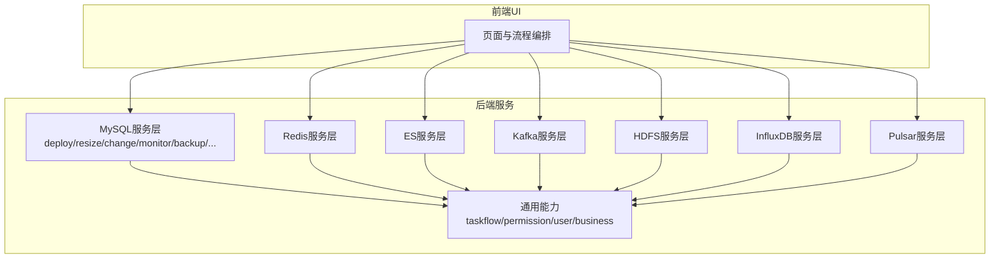
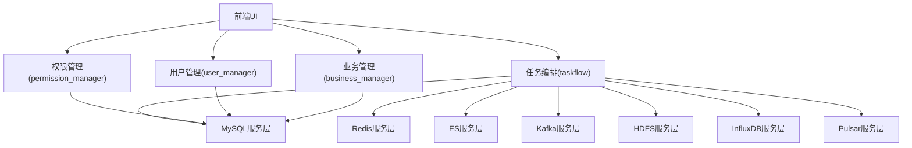
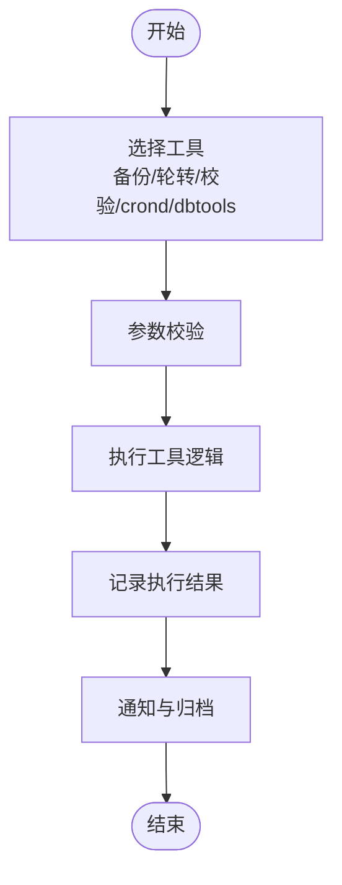
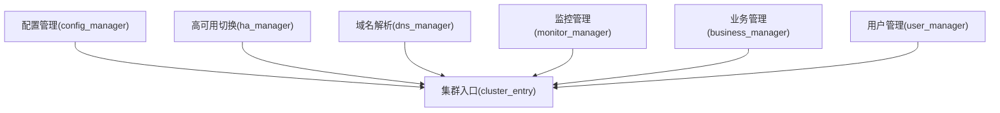
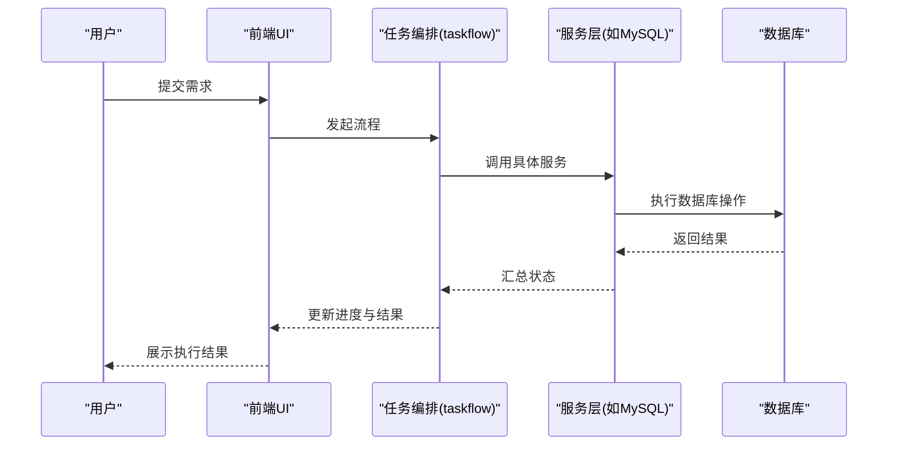
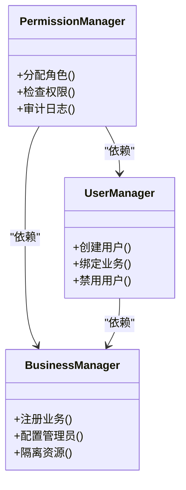
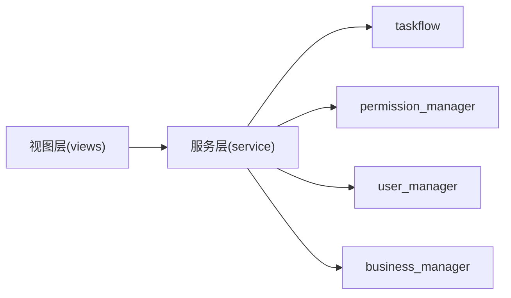

# 核心特性

<cite>
**本文引用的文件**
- [README.md](file://readme.md)
- [dbm-ui/backend/db_services/mysql/init.py](file://dbm-ui/backend/db_services/mysql/init.py)
- [dbm-ui/backend/db_services/mysql/views.py](file://dbm-ui/backend/db_services/mysql/views.py)
- [dbm-ui/backend/db_services/mysql/service/deploy_cluster.py](file://dbm-ui/backend/db_services/mysql/service/deploy_cluster.py)
- [dbm-ui/backend/db_services/mysql/service/resize_cluster.py](file://dbm-ui/backend/db_services/mysql/service/resize_cluster.py)
- [dbm-ui/backend/db_services/mysql/service/change_cluster.py](file://dbm-ui/backend/db_services/mysql/service/change_cluster.py)
- [dbm-ui/backend/db_services/mysql/service/monitor_cluster.py](file://dbm-ui/backend/db_services/mysql/service/monitor_cluster.py)
- [dbm-ui/backend/db_services/mysql/service/priv_manager.py](file://dbm-ui/backend/db_services/mysql/service/priv_manager.py)
- [dbm-ui/backend/db_services/mysql/service/partition_manager.py](file://dbm-ui/backend/db_services/mysql/service/partition_manager.py)
- [dbm-ui/backend/db_services/mysql/service/remote_service.py](file://dbm-ui/backend/db_services/mysql/service/remote_service.py)
- [dbm-ui/backend/db_services/mysql/service/simulation.py](file://dbm-ui/backend/db_services/mysql/service/simulation.py)
- [dbm-ui/backend/db_services/mysql/service/backup.py](file://dbm-ui/backend/db_services/mysql/service/backup.py)
- [dbm-ui/backend/db_services/mysql/service/rotate_binlog.py](file://dbm-ui/backend/db_services/mysql/service/rotate_binlog.py)
- [dbm-ui/backend/db_services/mysql/service/table_checksum.py](file://dbm-ui/backend/db_services/mysql/service/table_checksum.py)
- [dbm-ui/backend/db_services/mysql/service/crond.py](file://dbm-ui/backend/db_services/mysql/service/crond.py)
- [dbm-ui/backend/db_services/mysql/service/dbtools.py](file://dbm-ui/backend/db_services/mysql/service/dbtools.py)
- [dbm-ui/backend/db_services/mysql/service/cluster_entry.py](file://dbm-ui/backend/db_services/mysql/service/cluster_entry.py)
- [dbm-ui/backend/db_services/mysql/service/config_manager.py](file://dbm-ui/backend/db_services/mysql/service/config_manager.py)
- [dbm-ui/backend/db_services/mysql/service/dns_manager.py](file://dbm-ui/backend/db_services/mysql/service/dns_manager.py)
- [dbm-ui/backend/db_services/mysql/service/ha_manager.py](file://dbm-ui/backend/db_services/mysql/service/ha_manager.py)
- [dbm-ui/backend/db_services/mysql/service/monitor_manager.py](file://dbm-ui/backend/db_services/mysql/service/monitor_manager.py)
- [dbm-ui/backend/db_services/mysql/service/taskflow.py](file://dbm-ui/backend/db_services/mysql/service/taskflow.py)
- [dbm-ui/backend/db_services/mysql/service/permission_manager.py](file://dbm-ui/backend/db_services/mysql/service/permission_manager.py)
- [dbm-ui/backend/db_services/mysql/service/user_manager.py](file://dbm-ui/backend/db_services/mysql/service/user_manager.py)
- [dbm-ui/backend/db_services/mysql/service/business_manager.py](file://dbm-ui/backend/db_services/mysql/service/business_manager.py)
- [dbm-ui/backend/db_services/mysql/service/cluster_entry.py](file://dbm-ui/backend/db_services/mysql/service/cluster_entry.py)
- [dbm-ui/backend/db_services/mysql/service/config_manager.py](file://dbm-ui/backend/db_services/mysql/service/config_manager.py)
- [dbm-ui/backend/db_services/mysql/service/dns_manager.py](file://dbm-ui/backend/db_services/mysql/service/dns_manager.py)
- [dbm-ui/backend/db_services/mysql/service/ha_manager.py](file://dbm-ui/backend/db_services/mysql/service/ha_manager.py)
- [dbm-ui/backend/db_services/mysql/service/monitor_manager.py](file://dbm-ui/backend/db_services/mysql/service/monitor_manager.py)
- [dbm-ui/backend/db_services/mysql/service/taskflow.py](file://dbm-ui/backend/db_services/mysql/service/taskflow.py)
- [dbm-ui/backend/db_services/mysql/service/permission_manager.py](file://dbm-ui/backend/db_services/mysql/service/permission_manager.py)
- [dbm-ui/backend/db_services/mysql/service/user_manager.py](file://dbm-ui/backend/db_services/mysql/service/user_manager.py)
- [dbm-ui/backend/db_services/mysql/service/business_manager.py](file://dbm-ui/backend/db_services/mysql/service/business_manager.py)
- [dbm-ui/backend/db_services/mysql/service/cluster_entry.py](file://dbm-ui/backend/db_services/mysql/service/cluster_entry.py)
- [dbm-ui/backend/db_services/mysql/service/config_manager.py](file://dbm-ui/backend/db_services/mysql/service/config_manager.py)
- [dbm-ui/backend/db_services/mysql/service/dns_manager.py](file://dbm-ui/backend/db_services/mysql/service/dns_manager.py)
- [dbm-ui/backend/db_services/mysql/service/ha_manager.py](file://dbm-ui/backend/db_services/mysql/service/ha_manager.py)
- [dbm-ui/backend/db_services/mysql/service/monitor_manager.py](file://dbm-ui/backend/db_services/mysql/service/monitor_manager.py)
- [dbm-ui/backend/db_services/mysql/service/taskflow.py](file://dbm-ui/backend/db_services/mysql/service/taskflow.py)
- [dbm-ui/backend/db_services/mysql/service/permission_manager.py](file://dbm-ui/backend/db_services/mysql/service/permission_manager.py)
- [dbm-ui/backend/db_services/mysql/service/user_manager.py](file://dbm-ui/backend/db_services/mysql/service/user_manager.py)
- [dbm-ui/backend/db_services/mysql/service/business_manager.py](file://dbm-ui/backend/db_services/mysql/service/business_manager.py)
- [dbm-ui/backend/db_services/mysql/service/cluster_entry.py](file://dbm-ui/backend/db_services/mysql/service/cluster_entry.py)
- [dbm-ui/backend/db_services/mysql/service/config_manager.py](file://dbm-ui/backend/db_services/mysql/service/config_manager.py)
- [dbm-ui/backend/db_services/mysql/service/dns_manager.py](file://dbm-ui/backend/db_services/mysql/service/dns_manager.py)
- [dbm-ui/backend/db_services/mysql/service/ha_manager.py](file://dbm-ui/backend/db_services/mysql/service/ha_manager.py)
- [dbm-ui/backend/db_services/mysql/service/monitor_manager.py](file://dbm-ui/backend/db_services/mysql/service/monitor_manager.py)
- [dbm-ui/backend/db_services/mysql/service/taskflow.py](file://dbm-ui/backend/db_services/mysql/service/taskflow.py)
- [dbm-ui/backend/db_services/mysql/service/permission_manager.py](file://dbm-ui/backend/db_services/mysql/service/permission_manager.py)
- [dbm-ui/backend/db_services/mysql/service/user_manager.py](file://dbm-ui/backend/db_services/mysql/service/user_manager.py)
- [dbm-ui/backend/db_services/mysql/service/business_manager.py](file://dbm-ui/backend/db_services/mysql/service/business_manager.py)
- [dbm-ui/backend/db_services/mysql/service/cluster_entry.py](file://dbm-ui/backend/db_services/mysql/service/cluster_entry.py)
- [dbm-ui/backend/db_services/mysql/service/config_manager.py](file://dbm-ui/backend/db_services/mysql/service/config_manager.py)
- [dbm-ui/backend/db_services/mysql/service/dns_manager.py](file://dbm-ui/backend/db_services/mysql/service/dns_manager.py)
- [dbm-ui/backend/db_services/mysql/service/ha_manager.py](file://dbm-ui/backend/db_services/mysql/service/ha_manager.py)
- [dbm-ui/backend/db_services/mysql/service/monitor_manager.py](file://dbm-ui/backend/db_services/mysql/service/monitor_manager.py)
- [dbm-ui/backend/db_services/mysql/service/taskflow.py](file://dbm-ui/backend/db_services/mysql/service/taskflow.py)
- [dbm-ui/backend/db_services/mysql/service/permission_manager.py](file://dbm-ui/backend/db_services/mysql/service/permission_manager.py)
- [dbm-ui/backend/db_services/mysql/service/user_manager.py](file://dbm-ui/backend/db_services/mysql/service/user_manager.py)
- [dbm-ui/backend/db_services/mysql/service/business_manager.py](file://dbm-ui/backend/db_services/mysql/service/business_manager.py)
- [dbm-ui/backend/db_services/mysql/service/cluster_entry.py](file://dbm-ui/backend/db_services/mysql/service/cluster_entry.py)
- [dbm-ui/backend/db_services/mysql/service/config_manager.py](file://dbm-ui/backend/db_services/mysql/service/config_manager.py)
- [dbm-ui/backend/db_services/mysql/service/dns_manager.py](file://dbm-ui/backend/db_services/mysql/service/dns_manager.py)
- [dbm-ui/backend/db_services/mysql/service/ha_manager.py](file://dbm-ui/backend/db_services/mysql/service/ha_manager.py)
- [dbm-ui/backend/db_services/mysql/service/monitor_manager.py](file://dbm-ui/backend/db_services/mysql/service/monitor_manager.py)
- [dbm-ui/backend/db_services/mysql/service/taskflow.py](file://dbm-ui/backend/db_services/mysql/service/taskflow.py)
- [dbm-ui/backend/db_services/mysql/service/permission_manager.py](file://dbm-ui/backend/db_services/mysql/service/permission_manager.py)
- [dbm-ui/backend/db_services/mysql/service/user_manager.py](file://dbm-ui/backend/db_services/mysql/service/user_manager.py)
- [dbm-ui/backend/db_services/mysql/service/business_manager.py](file://dbm-ui/backend/db_services/mysql/service/business_manager.py)
- [dbm-ui/backend/db_services/mysql/service/cluster_entry.py](file://dbm-ui/backend/db_services/mysql/service/cluster_entry.py)
- [dbm-ui/backend/db_services/mysql/service/config_manager.py](file://dbm-ui/backend/db_services/mysql/service/config_manager.py)
- [dbm-ui/backend/db_services/mysql/service/dns_manager.py](file://dbm-ui/backend/db_services/mysql/service/dns_manager.py)
- [dbm-ui/backend/db_services/mysql/service/ha_manager.py](file://dbm-ui/backend/db_services/mysql/service/ha_manager.py)
- [dbm-ui/backend/db_services/mysql/service/monitor_manager.py](file://dbm......)
</cite>

## 目录
1. [引言](#引言)
2. [项目结构](#项目结构)
3. [核心组件](#核心组件)
4. [架构总览](#架构总览)
5. [详细组件分析](#详细组件分析)
6. [依赖关系分析](#依赖关系分析)
7. [性能考虑](#性能考虑)
8. [故障排查指南](#故障排查指南)
9. [结论](#结论)
10. [附录](#附录)

## 引言
本文件围绕DBM（数据库管理）平台的核心特性展开，系统性阐述“全面的DB组件服务、完整的DB工具箱、完善的DB公共管理、可交互的执行服务、安全的权限管理”五大能力。通过对后端服务模块与前端UI的协同工作方式、任务编排与权限控制机制、以及多数据库类型（MySQL、Redis、ES、Kafka、HDFS、InfluxDB、Pulsar等）的统一抽象，帮助读者理解DBM如何在实际生产环境中实现“更高效、更安全、更全面”的数据库管理。

## 项目结构
DBM采用前后端分离架构，后端以Python/Django为核心，提供多数据库类型的统一服务层；前端UI负责交互与流程编排。核心特性在后端通过“db_services”模块按数据库类型组织，结合“taskflow”“permission_manager”“user_manager”“business_manager”等通用能力，形成可扩展的服务体系。

图示来源
- [README.md:16-21](file://readme.md#L16-L21)

章节来源
- [README.md:16-21](file://readme.md#L16-L21)

## 核心组件
本节聚焦DBM五大核心特性与其在后端的落地实现要点：

- 全面的DB组件服务
  - 后端通过“db_services”按数据库类型划分服务层，覆盖部署、扩容、变更、监控、备份、分区、远程服务、模拟器、crond、dbtools等能力。
  - 示例路径：[dbm-ui/backend/db_services/mysql/service/](file://dbm-ui/backend/db_services/mysql/service/)

- 完整的DB工具箱
  - 工具箱内聚了部署、扩容、变更、监控、备份轮转、校验、crond等工具化能力，统一通过服务层暴露接口。
  - 示例路径：[dbm-ui/backend/db_services/mysql/service/deploy_cluster.py](file://dbm-ui/backend/db_services/mysql/service/deploy_cluster.py)，[dbm-ui/backend/db_services/mysql/service/backup.py](file://dbm-ui/backend/db_services/mysql/service/backup.py)，[dbm-ui/backend/db_services/mysql/service/rotate_binlog.py](file://dbm-ui/backend/db_services/mysql/service/rotate_binlog.py)，[dbm-ui/backend/db_services/mysql/service/table_checksum.py](file://dbm-ui/backend/db_services/mysql/service/table_checksum.py)，[dbm-ui/backend/db_services/mysql/service/crond.py](file://dbm-ui/backend/db_services/mysql/service/crond.py)，[dbm-ui/backend/db_services/mysql/service/dbtools.py](file://dbm-ui/backend/db_services/mysql/service/dbtools.py)

- 完善的DB公共管理
  - 提供配置管理、高可用切换、域名解析、监控管理、集群入口、业务与用户管理等公共能力，支撑跨组件的统一治理。
  - 示例路径：[dbm-ui/backend/db_services/mysql/service/config_manager.py](file://dbm-ui/backend/db_services/mysql/service/config_manager.py)，[dbm-ui/backend/db_services/mysql/service/ha_manager.py](file://dbm-ui/backend/db_services/mysql/service/ha_manager.py)，[dbm-ui/backend/db_services/mysql/service/dns_manager.py](file://dbm-ui/backend/db_services/mysql/service/dns_manager.py)，[dbm-ui/backend/db_services/mysql/service/monitor_manager.py](file://dbm-ui/backend/db_services/mysql/service/monitor_manager.py)，[dbm-ui/backend/db_services/mysql/service/cluster_entry.py](file://dbm-ui/backend/db_services/mysql/service/cluster_entry.py)，[dbm-ui/backend/db_services/mysql/service/business_manager.py](file://dbm-ui/backend/db_services/mysql/service/business_manager.py)，[dbm-ui/backend/db_services/mysql/service/user_manager.py](file://dbm-ui/backend/db_services/mysql/service/user_manager.py)

- 可交互的执行服务
  - 基于“taskflow”实现任务编排与审批流程，用户提交需求后经审批进入自动化执行，提升操作透明度与可控性。
  - 示例路径：[dbm-ui/backend/db_services/mysql/service/taskflow.py](file://dbm-ui/backend/db_services/mysql/service/taskflow.py)

- 安全的权限管理
  - 通过“permission_manager”“user_manager”“business_manager”实现角色与权限模型，支持业务级与平台级管理员配置，保障操作安全。
  - 示例路径：[dbm-ui/backend/db_services/mysql/service/permission_manager.py](file://dbm-ui/backend/db_services/mysql/service/permission_manager.py)，[dbm-ui/backend/db_services/mysql/service/user_manager.py](file://dbm-ui/backend/db_services/mysql/service/user_manager.py)，[dbm-ui/backend/db_services/mysql/service/business_manager.py](file://dbm-ui/backend/db_services/mysql/service/business_manager.py)

章节来源
- [README.md:16-21](file://readme.md#L16-L21)
- [dbm-ui/backend/db_services/mysql/service/](file://dbm-ui/backend/db_services/mysql/service/)

## 架构总览
DBM的架构围绕“统一服务层 + 通用能力 + 前端交互”的模式构建。前端负责用户交互与流程编排，后端服务层按数据库类型提供能力，通用能力模块提供跨域的权限、任务流、用户与业务管理。

图示来源
- [README.md:16-21](file://readme.md#L16-L21)
- [dbm-ui/backend/db_services/mysql/service/taskflow.py](file://dbm-ui/backend/db_services/mysql/service/taskflow.py)
- [dbm-ui/backend/db_services/mysql/service/permission_manager.py](file://dbm-ui/backend/db_services/mysql/service/permission_manager.py)
- [dbm-ui/backend/db_services/mysql/service/user_manager.py](file://dbm-ui/backend/db_services/mysql/service/user_manager.py)
- [dbm-ui/backend/db_services/mysql/service/business_manager.py](file://dbm-ui/backend/db_services/mysql/service/business_manager.py)

## 详细组件分析

### 全面的DB组件服务
- 实现原理
  - 服务层以“按数据库类型分包”的方式组织，每个类型包含部署、扩容、变更、监控、备份、分区、远程服务、模拟器、crond、dbtools等子模块，统一通过视图层对外提供REST接口。
  - MySQL服务层示例：[dbm-ui/backend/db_services/mysql/service/deploy_cluster.py](file://dbm-ui/backend/db_services/mysql/service/deploy_cluster.py)，[dbm-ui/backend/db_services/mysql/service/resize_cluster.py](file://dbm-ui/backend/db_services/mysql/service/resize_cluster.py)，[dbm-ui/backend/db_services/mysql/service/change_cluster.py](file://dbm-ui/backend/db_services/mysql/service/change_cluster.py)，[dbm-ui/backend/db_services/mysql/service/monitor_cluster.py](file://dbm-ui/backend/db_services/mysql/service/monitor_cluster.py)

- 使用场景
  - 新建集群、弹性扩容、拓扑变更、监控策略下发、备份与恢复、分区策略、远程执行SQL、慢查询分析、定时任务管理、数据库工具集等。

- 业务价值
  - 将复杂数据库运维动作标准化、自动化，降低人工干预风险，提升交付效率与一致性。

章节来源
- [README.md:16-21](file://readme.md#L16-L21)
- [dbm-ui/backend/db_services/mysql/service/deploy_cluster.py](file://dbm-ui/backend/db_services/mysql/service/deploy_cluster.py)
- [dbm-ui/backend/db_services/mysql/service/resize_cluster.py](file://dbm-ui/backend/db_services/mysql/service/resize_cluster.py)
- [dbm-ui/backend/db_services/mysql/service/change_cluster.py](file://dbm-ui/backend/db_services/mysql/service/change_cluster.py)
- [dbm-ui/backend/db_services/mysql/service/monitor_cluster.py](file://dbm-ui/backend/db_services/mysql/service/monitor_cluster.py)

### 完整的DB工具箱
- 实现原理
  - 工具箱以“工具模块化 + 服务层封装”的方式提供，每个工具对应独立的Python模块，服务层统一调度与编排，保证可复用与可扩展。
  - 示例模块：备份、binlog轮转、表校验、crond、dbtools等。

- 使用场景
  - 日常运维中的备份与恢复、日志轮转、数据一致性校验、定时任务维护、数据库工具集调用等。

- 业务价值
  - 将常用运维动作工具化，减少重复劳动，提升问题定位与处理效率。

图示来源
- [dbm-ui/backend/db_services/mysql/service/backup.py](file://dbm-ui/backend/db_services/mysql/service/backup.py)
- [dbm-ui/backend/db_services/mysql/service/rotate_binlog.py](file://dbm-ui/backend/db_services/mysql/service/rotate_binlog.py)
- [dbm-ui/backend/db_services/mysql/service/table_checksum.py](file://dbm-ui/backend/db_services/mysql/service/table_checksum.py)
- [dbm-ui/backend/db_services/mysql/service/crond.py](file://dbm-ui/backend/db_services/mysql/service/crond.py)
- [dbm-ui/backend/db_services/mysql/service/dbtools.py](file://dbm-ui/backend/db_services/mysql/service/dbtools.py)

章节来源
- [dbm-ui/backend/db_services/mysql/service/backup.py](file://dbm-ui/backend/db_services/mysql/service/backup.py)
- [dbm-ui/backend/db_services/mysql/service/rotate_binlog.py](file://dbm-ui/backend/db_services/mysql/service/rotate_binlog.py)
- [dbm-ui/backend/db_services/mysql/service/table_checksum.py](file://dbm-ui/backend/db_services/mysql/service/table_checksum.py)
- [dbm-ui/backend/db_services/mysql/service/crond.py](file://dbm-ui/backend/db_services/mysql/service/crond.py)
- [dbm-ui/backend/db_services/mysql/service/dbtools.py](file://dbm-ui/backend/db_services/mysql/service/dbtools.py)

### 完善的DB公共管理
- 实现原理
  - 通过“配置管理、高可用切换、域名解析、监控管理、集群入口、业务与用户管理”等通用模块，为各数据库类型提供统一的基础设施与治理能力。
  - 示例模块：[dbm-ui/backend/db_services/mysql/service/config_manager.py](file://dbm-ui/backend/db_services/mysql/service/config_manager.py)，[dbm-ui/backend/db_services/mysql/service/ha_manager.py](file://dbm-ui/backend/db_services/mysql/service/ha_manager.py)，[dbm-ui/backend/db_services/mysql/service/dns_manager.py](file://dbm-ui/backend/db_services/mysql/service/dns_manager.py)，[dbm-ui/backend/db_services/mysql/service/monitor_manager.py](file://dbm-ui/backend/db_services/mysql/service/monitor_manager.py)，[dbm-ui/backend/db_services/mysql/service/cluster_entry.py](file://dbm-ui/backend/db_services/mysql/service/cluster_entry.py)，[dbm-ui/backend/db_services/mysql/service/business_manager.py](file://dbm-ui/backend/db_services/mysql/service/business_manager.py)，[dbm-ui/backend/db_services/mysql/service/user_manager.py](file://dbm-ui/backend/db_services/mysql/service/user_manager.py)

- 使用场景
  - 统一配置下发与回滚、高可用切换演练与执行、域名解析更新、监控策略集中管理、集群访问入口统一、业务与用户权限治理。

- 业务价值
  - 降低跨组件管理成本，提升治理一致性与可追溯性。

图示来源
- [dbm-ui/backend/db_services/mysql/service/config_manager.py](file://dbm-ui/backend/db_services/mysql/service/config_manager.py)
- [dbm-ui/backend/db_services/mysql/service/ha_manager.py](file://dbm-ui/backend/db_services/mysql/service/ha_manager.py)
- [dbm-ui/backend/db_services/mysql/service/dns_manager.py](file://dbm-ui/backend/db_services/mysql/service/dns_manager.py)
- [dbm-ui/backend/db_services/mysql/service/monitor_manager.py](file://dbm-ui/backend/db_services/mysql/service/monitor_manager.py)
- [dbm-ui/backend/db_services/mysql/service/cluster_entry.py](file://dbm-ui/backend/db_services/mysql/service/cluster_entry.py)
- [dbm-ui/backend/db_services/mysql/service/business_manager.py](file://dbm-ui/backend/db_services/mysql/service/business_manager.py)
- [dbm-ui/backend/db_services/mysql/service/user_manager.py](file://dbm-ui/backend/db_services/mysql/service/user_manager.py)

章节来源
- [dbm-ui/backend/db_services/mysql/service/config_manager.py](file://dbm-ui/backend/db_services/mysql/service/config_manager.py)
- [dbm-ui/backend/db_services/mysql/service/ha_manager.py](file://dbm-ui/backend/db_services/mysql/service/ha_manager.py)
- [dbm-ui/backend/db_services/mysql/service/dns_manager.py](file://dbm-ui/backend/db_services/mysql/service/dns_manager.py)
- [dbm-ui/backend/db_services/mysql/service/monitor_manager.py](file://dbm-ui/backend/db_services/mysql/service/monitor_manager.py)
- [dbm-ui/backend/db_services/mysql/service/cluster_entry.py](file://dbm-ui/backend/db_services/mysql/service/cluster_entry.py)
- [dbm-ui/backend/db_services/mysql/service/business_manager.py](file://dbm-ui/backend/db_services/mysql/service/business_manager.py)
- [dbm-ui/backend/db_services/mysql/service/user_manager.py](file://dbm-ui/backend/db_services/mysql/service/user_manager.py)

### 可交互的执行服务
- 实现原理
  - 基于“taskflow”模块实现任务编排与审批流程，前端提交需求后，系统根据流程模板自动调度后端服务执行，支持可视化跟踪与回滚。
  - 示例路径：[dbm-ui/backend/db_services/mysql/service/taskflow.py](file://dbm-ui/backend/db_services/mysql/service/taskflow.py)

- 使用场景
  - 需求提交、审批、执行、回滚、通知全流程可视化，适用于变更、扩容、迁移等高风险操作。

- 业务价值
  - 明确责任边界，降低误操作风险，提升变更过程的透明度与可审计性。

图示来源
- [dbm-ui/backend/db_services/mysql/service/taskflow.py](file://dbm-ui/backend/db_services/mysql/service/taskflow.py)

章节来源
- [dbm-ui/backend/db_services/mysql/service/taskflow.py](file://dbm-ui/backend/db_services/mysql/service/taskflow.py)

### 安全的权限管理
- 实现原理
  - 通过“permission_manager”“user_manager”“business_manager”实现角色与权限模型，支持业务级与平台级管理员配置，确保最小授权与可追溯审计。
  - 示例路径：[dbm-ui/backend/db_services/mysql/service/permission_manager.py](file://dbm-ui/backend/db_services/mysql/service/permission_manager.py)，[dbm-ui/backend/db_services/mysql/service/user_manager.py](file://dbm-ui/backend/db_services/mysql/service/user_manager.py)，[dbm-ui/backend/db_services/mysql/service/business_manager.py](file://dbm-ui/backend/db_services/mysql/service/business_manager.py)

- 使用场景
  - 为不同业务线分配管理员角色、设置资源访问范围、审计操作日志、强制审批流程等。

- 业务价值
  - 保障平台与数据安全，满足合规要求，降低越权与误操作风险。

图示来源
- [dbm-ui/backend/db_services/mysql/service/permission_manager.py](file://dbm-ui/backend/db_services/mysql/service/permission_manager.py)
- [dbm-ui/backend/db_services/mysql/service/user_manager.py](file://dbm-ui/backend/db_services/mysql/service/user_manager.py)
- [dbm-ui/backend/db_services/mysql/service/business_manager.py](file://dbm-ui/backend/db_services/mysql/service/business_manager.py)

章节来源
- [dbm-ui/backend/db_services/mysql/service/permission_manager.py](file://dbm-ui/backend/db_services/mysql/service/permission_manager.py)
- [dbm-ui/backend/db_services/mysql/service/user_manager.py](file://dbm-ui/backend/db_services/mysql/service/user_manager.py)
- [dbm-ui/backend/db_services/mysql/service/business_manager.py](file://dbm-ui/backend/db_services/mysql/service/business_manager.py)

## 依赖关系分析
- 组件耦合与内聚
  - 服务层内部模块高度内聚，跨数据库类型共享通用能力（taskflow、permission、user、business），降低重复开发成本。
- 外部依赖与集成点
  - 与CMDB、监控、消息通道、存储等系统集成，通过统一的视图层与服务层对外提供能力。
- 潜在循环依赖
  - 通过“服务层”“通用能力层”“视图层”的分层设计避免循环依赖；若出现循环，应拆分职责或引入适配器。

图示来源
- [dbm-ui/backend/db_services/mysql/views.py](file://dbm-ui/backend/db_services/mysql/views.py)
- [dbm-ui/backend/db_services/mysql/service/taskflow.py](file://dbm-ui/backend/db_services/mysql/service/taskflow.py)
- [dbm-ui/backend/db_services/mysql/service/permission_manager.py](file://dbm-ui/backend/db_services/mysql/service/permission_manager.py)
- [dbm-ui/backend/db_services/mysql/service/user_manager.py](file://dbm-ui/backend/db_services/mysql/service/user_manager.py)
- [dbm-ui/backend/db_services/mysql/service/business_manager.py](file://dbm-ui/backend/db_services/mysql/service/business_manager.py)

章节来源
- [dbm-ui/backend/db_services/mysql/views.py](file://dbm-ui/backend/db_services/mysql/views.py)
- [dbm-ui/backend/db_services/mysql/service/taskflow.py](file://dbm-ui/backend/db_services/mysql/service/taskflow.py)
- [dbm-ui/backend/db_services/mysql/service/permission_manager.py](file://dbm-ui/backend/db_services/mysql/service/permission_manager.py)
- [dbm-ui/backend/db_services/mysql/service/user_manager.py](file://dbm-ui/backend/db_services/mysql/service/user_manager.py)
- [dbm-ui/backend/db_services/mysql/service/business_manager.py](file://dbm-ui/backend/db_services/mysql/service/business_manager.py)

## 性能考虑
- 任务编排与并发
  - 利用taskflow的异步与并发能力，合理拆分步骤，避免长耗时阻塞；对高风险步骤增加重试与超时保护。
- 权限与鉴权
  - 在服务层前置权限校验，减少无效调用；对高频接口进行缓存与限流。
- 数据库操作优化
  - 对大批量操作采用批处理与分页；对备份、校验等IO密集型任务进行资源隔离与优先级控制。
- 监控与可观测性
  - 结合monitor_manager与外部监控系统，建立端到端指标与告警，快速定位性能瓶颈。

## 故障排查指南
- 常见问题定位
  - 任务失败：检查taskflow流程节点状态与错误日志，确认服务层返回值与数据库执行结果。
  - 权限异常：核对permission_manager与user_manager的配置，确认业务绑定与角色授权是否正确。
  - 配置不生效：检查config_manager的下发与回滚策略，确认目标实例与版本号。
- 排障流程
  - 收集日志与上下文信息 → 定位模块与接口 → 校验权限与配置 → 执行修复与验证 → 归档总结

章节来源
- [dbm-ui/backend/db_services/mysql/service/taskflow.py](file://dbm-ui/backend/db_services/mysql/service/taskflow.py)
- [dbm-ui/backend/db_services/mysql/service/permission_manager.py](file://dbm-ui/backend/db_services/mysql/service/permission_manager.py)
- [dbm-ui/backend/db_services/mysql/service/user_manager.py](file://dbm-ui/backend/db_services/mysql/service/user_manager.py)
- [dbm-ui/backend/db_services/mysql/service/config_manager.py](file://dbm-ui/backend/db_services/mysql/service/config_manager.py)

## 结论
DBM通过“统一服务层 + 通用能力 + 前端交互”的架构，将多数据库类型的运维能力标准化、工具化与流程化，配合完善的公共管理与安全的权限体系，实现了从“可执行”到“可治理”的全面升级。五大核心特性相互支撑，共同构成了DBM强大的功能体系，能够有效提升数据库管理的效率与安全性。

## 附录
- 快速上手
  - 参考项目自述文件中的特性说明与入门指引，了解DBM的整体能力与使用场景。
- 参考路径
  - MySQL服务层：[dbm-ui/backend/db_services/mysql/service/](file://dbm-ui/backend/db_services/mysql/service/)
  - 通用能力：taskflow、permission_manager、user_manager、business_manager

章节来源
- [README.md:16-21](file://readme.md#L16-L21)
- [dbm-ui/backend/db_services/mysql/service/](file://dbm-ui/backend/db_services/mysql/service/)