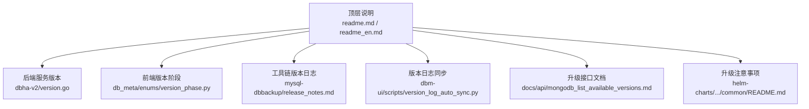
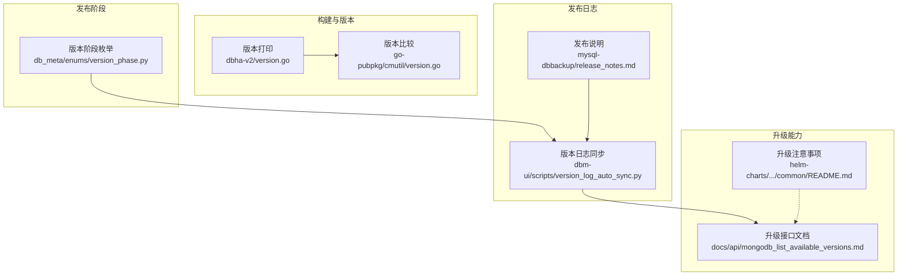
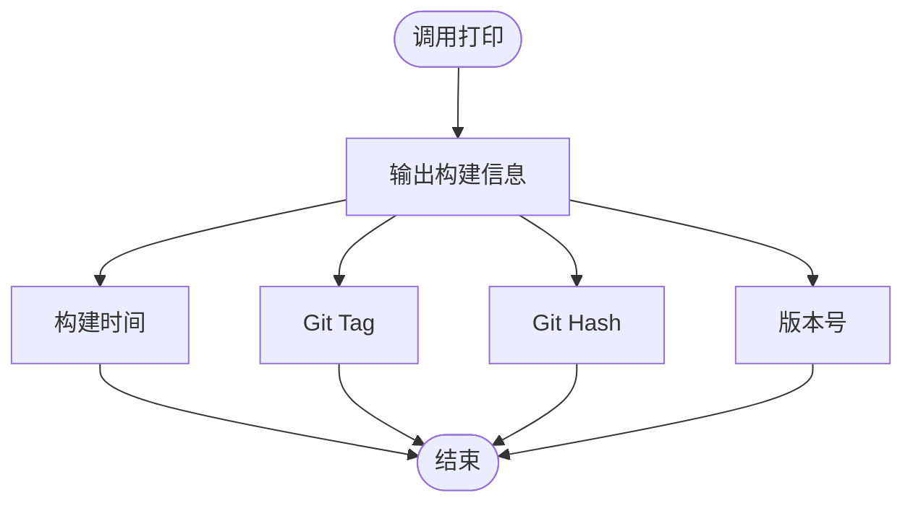
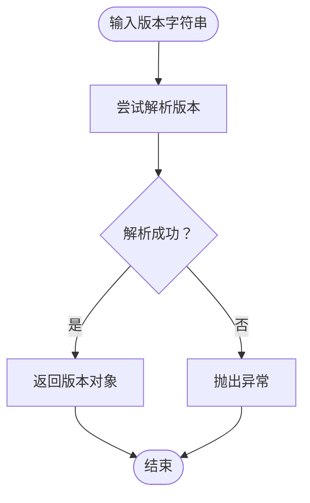
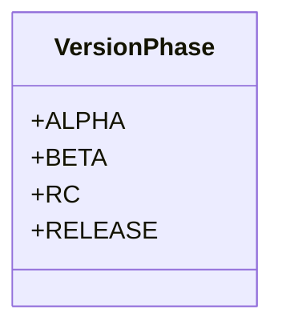
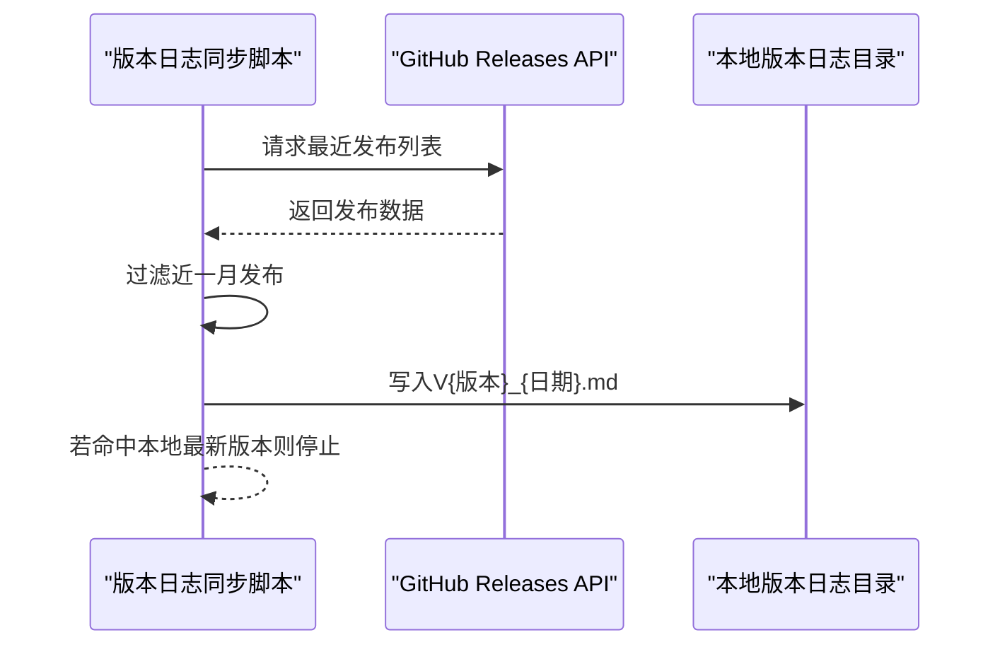
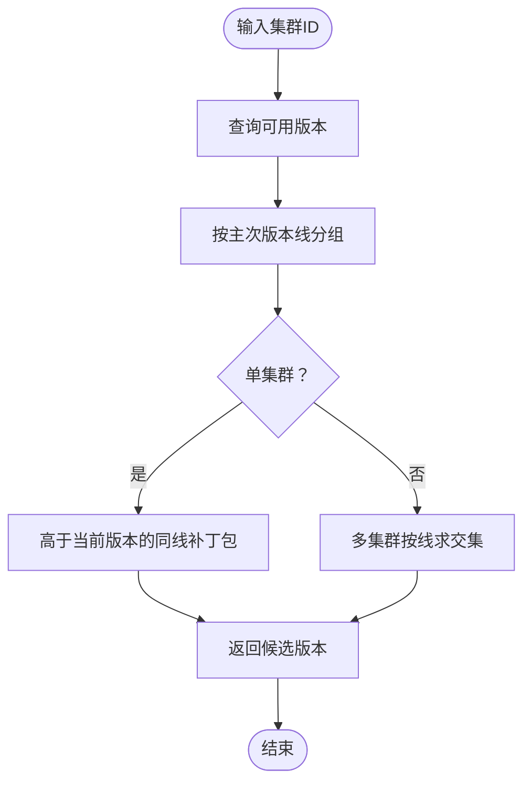
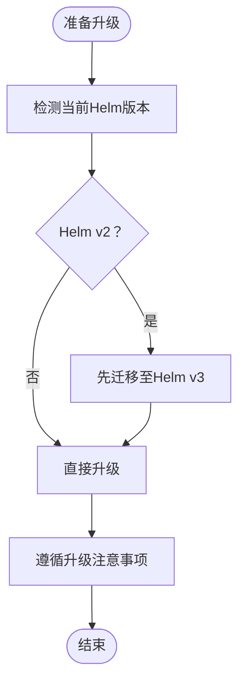
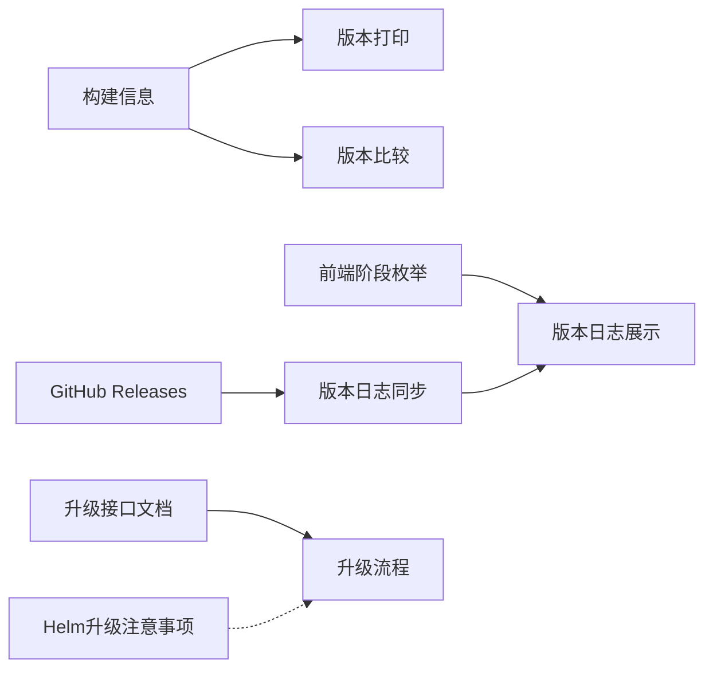

# 版本规划

<cite>
**本文引用的文件**
- [readme.md](file://readme.md)
- [readme_en.md](file://readme_en.md)
- [version.go](file://dbm-services/common/dbha-v2/pkg/version/version.go)
- [version.go](file://dbm-services/common/go-pubpkg/cmutil/version.go)
- [version_phase.py](file://dbm-ui/backend/db_meta/enums/version_phase.py)
- [release_notes.md](file://dbm-services/mysql/db-tools/mysql-dbbackup/docs/release_notes.md)
- [version_log_auto_sync.py](file://dbm-ui/scripts/version_log_auto_sync.py)
- [mongodb_list_available_versions.md](file://docs/api/mongodb_list_available_versions.md)
- [README.md](file://helm-charts/bk-dbm/charts/k8s-dbs/charts/common/README.md)
</cite>

## 目录
1. [简介](#简介)
2. [项目结构](#项目结构)
3. [核心组件](#核心组件)
4. [架构总览](#架构总览)
5. [详细组件分析](#详细组件分析)
6. [依赖关系分析](#依赖关系分析)
7. [性能考量](#性能考量)
8. [故障排查指南](#故障排查指南)
9. [结论](#结论)
10. [附录](#附录)

## 简介
本文件面向DBM（数据库管理平台）的版本规划与发布策略，结合仓库中的版本标识、阶段枚举、版本日志同步机制与升级接口文档，系统梳理DBM的历史版本回顾、当前版本特性、未来版本规划思路、版本号规则、发布周期与功能迭代计划，并提供版本升级指南与兼容性说明，帮助用户做出合理的版本选择与升级决策。

## 项目结构
DBM采用多模块工程组织，包含后端服务、前端UI、工具链与Helm Charts等。版本相关信息主要分布在以下区域：
- 顶层说明与版本入口：readme与readme_en
- 后端服务版本打印与比较：dbha-v2版本打印、go版本库封装
- 前端版本阶段枚举：db_meta枚举
- 工具链版本日志：mysql-dbbackup发布说明
- 版本日志自动同步：dbm-ui脚本
- 升级接口文档：MongoDB可升级版本查询
- 升级注意事项：Helm Charts升级说明

**图表来源**
- [readme.md:1-54](file://readme.md#L1-L54)
- [readme_en.md:1-45](file://readme_en.md#L1-L45)
- [version.go:1-43](file://dbm-services/common/dbha-v2/pkg/version/version.go#L1-L43)
- [version_phase.py:1-22](file://dbm-ui/backend/db_meta/enums/version_phase.py#L1-L22)
- [release_notes.md:1-16](file://dbm-services/mysql/db-tools/mysql-dbbackup/docs/release_notes.md#L1-L16)
- [version_log_auto_sync.py:1-48](file://dbm-ui/scripts/version_log_auto_sync.py#L1-L48)
- [mongodb_list_available_versions.md:1-14](file://docs/api/mongodb_list_available_versions.md#L1-L14)
- [README.md:318-329](file://helm-charts/bk-dbm/charts/k8s-dbs/charts/common/README.md#L318-L329)

**章节来源**
- [readme.md:1-54](file://readme.md#L1-L54)
- [readme_en.md:1-45](file://readme_en.md#L1-L45)

## 核心组件
- 版本打印与构建信息：dbha-v2提供统一的版本打印函数，输出构建时间、Git Tag、Git Hash与版本号，便于定位发布构建。
- 版本比较工具：go-pubpkg封装了版本对象创建，用于比较与排序。
- 版本阶段枚举：前端定义alpha、beta、rc、release四个阶段，用于区分发布阶段。
- 发布说明：mysql-dbbackup提供明确的版本发布说明，体现功能迭代与修复。
- 版本日志同步：dbm-ui脚本从GitHub Releases抓取近月发布内容，自动生成本地版本日志文件。
- 升级接口：MongoDB可升级版本查询接口文档，定义了升级链与返回规则。
- 升级注意事项：Helm Charts升级说明，强调Helm v2到v3迁移注意事项。

**章节来源**
- [version.go:1-43](file://dbm-services/common/dbha-v2/pkg/version/version.go#L1-L43)
- [version.go:1-16](file://dbm-services/common/go-pubpkg/cmutil/version.go#L1-L16)
- [version_phase.py:1-22](file://dbm-ui/backend/db_meta/enums/version_phase.py#L1-L22)
- [release_notes.md:1-16](file://dbm-services/mysql/db-tools/mysql-dbbackup/docs/release_notes.md#L1-L16)
- [version_log_auto_sync.py:1-48](file://dbm-ui/scripts/version_log_auto_sync.py#L1-L48)
- [mongodb_list_available_versions.md:1-14](file://docs/api/mongodb_list_available_versions.md#L1-L14)
- [README.md:318-329](file://helm-charts/bk-dbm/charts/k8s-dbs/charts/common/README.md#L318-L329)

## 架构总览
DBM版本体系由“构建信息”“发布阶段”“发布日志”“升级接口”“升级注意事项”五部分组成，形成从构建到发布的闭环。

**图表来源**
- [version.go:1-43](file://dbm-services/common/dbha-v2/pkg/version/version.go#L1-L43)
- [version.go:1-16](file://dbm-services/common/go-pubpkg/cmutil/version.go#L1-L16)
- [version_phase.py:1-22](file://dbm-ui/backend/db_meta/enums/version_phase.py#L1-L22)
- [release_notes.md:1-16](file://dbm-services/mysql/db-tools/mysql-dbbackup/docs/release_notes.md#L1-L16)
- [version_log_auto_sync.py:1-48](file://dbm-ui/scripts/version_log_auto_sync.py#L1-L48)
- [mongodb_list_available_versions.md:1-14](file://docs/api/mongodb_list_available_versions.md#L1-L14)
- [README.md:318-329](file://helm-charts/bk-dbm/charts/k8s-dbs/charts/common/README.md#L318-L329)

## 详细组件分析

### 组件A：版本打印与构建信息
- 功能概述：统一输出构建时间、Git Tag、Git Hash与版本号，便于审计与问题定位。
- 关键点：字段定义与打印格式固定，确保跨模块一致性。
- 使用场景：命令行查询、CI产物校验、问题回溯。

**图表来源**
- [version.go:36-42](file://dbm-services/common/dbha-v2/pkg/version/version.go#L36-L42)

**章节来源**
- [version.go:1-43](file://dbm-services/common/dbha-v2/pkg/version/version.go#L1-L43)

### 组件B：版本比较工具
- 功能概述：封装版本对象创建，用于比较与排序，保证版本判断的健壮性。
- 关键点：错误时抛出异常，避免不合法版本导致的逻辑错误。
- 使用场景：版本链路判断、升级前置条件校验。

**图表来源**
- [version.go:9-15](file://dbm-services/common/go-pubpkg/cmutil/version.go#L9-L15)

**章节来源**
- [version.go:1-16](file://dbm-services/common/go-pubpkg/cmutil/version.go#L1-L16)

### 组件C：版本阶段枚举
- 功能概述：定义alpha、beta、rc、release四个阶段，用于前端展示与流程控制。
- 关键点：字符串化枚举，便于国际化与序列化。
- 使用场景：版本状态展示、发布流程分支控制。

**图表来源**
- [version_phase.py:17-21](file://dbm-ui/backend/db_meta/enums/version_phase.py#L17-L21)

**章节来源**
- [version_phase.py:1-22](file://dbm-ui/backend/db_meta/enums/version_phase.py#L1-L22)

### 组件D：发布说明与版本日志同步
- 功能概述：mysql-dbbackup提供明确的版本发布说明；dbm-ui脚本从GitHub Releases抓取近月发布内容，自动生成本地版本日志文件。
- 关键点：发布时间窗口限制（近一个月）、文件命名规则（V{版本}_{日期}.md）、与本地最新版本比对以避免重复同步。
- 使用场景：快速获取最新发布内容、归档与查阅历史版本。

**图表来源**
- [version_log_auto_sync.py:24-44](file://dbm-ui/scripts/version_log_auto_sync.py#L24-L44)

**章节来源**
- [release_notes.md:1-16](file://dbm-services/mysql/db-tools/mysql-dbbackup/docs/release_notes.md#L1-L16)
- [version_log_auto_sync.py:1-48](file://dbm-ui/scripts/version_log_auto_sync.py#L1-L48)

### 组件E：升级接口与升级链
- 功能概述：MongoDB可升级版本查询接口文档定义了“主次版本线”分组、“升级链”顺序与返回规则。
- 关键点：单集群与多集群差异、按线交集策略、升级链常量位置。
- 使用场景：指导用户在平台上进行安全、合规的版本升级。

**图表来源**
- [mongodb_list_available_versions.md:7-10](file://docs/api/mongodb_list_available_versions.md#L7-L10)

**章节来源**
- [mongodb_list_available_versions.md:1-14](file://docs/api/mongodb_list_available_versions.md#L1-L14)

### 组件F：Helm升级注意事项
- 功能概述：强调Helm v2到v3迁移注意事项，避免升级过程中的兼容性问题。
- 关键点：不支持直接从Helm v2升级到此版本；需要先迁移至Helm v3。
- 使用场景：Kubernetes部署与升级时的前置检查。

**图表来源**
- [README.md:318-329](file://helm-charts/bk-dbm/charts/k8s-dbs/charts/common/README.md#L318-L329)

**章节来源**
- [README.md:318-329](file://helm-charts/bk-dbm/charts/k8s-dbs/charts/common/README.md#L318-L329)

## 依赖关系分析
- 构建信息依赖：版本打印依赖构建时注入的构建时间、Git Tag、Git Hash与版本号。
- 版本比较依赖：版本对象创建依赖外部版本库，错误处理确保稳定性。
- 发布阶段依赖：前端枚举用于统一展示与流程控制。
- 发布日志依赖：GitHub Releases API与本地文件系统。
- 升级接口依赖：平台侧升级链与版本介质配置。
- 升级注意事项依赖：Helm官方迁移文档链接。

**图表来源**
- [version.go:36-42](file://dbm-services/common/dbha-v2/pkg/version/version.go#L36-L42)
- [version.go:9-15](file://dbm-services/common/go-pubpkg/cmutil/version.go#L9-L15)
- [version_phase.py:17-21](file://dbm-ui/backend/db_meta/enums/version_phase.py#L17-L21)
- [version_log_auto_sync.py:24-44](file://dbm-ui/scripts/version_log_auto_sync.py#L24-L44)
- [mongodb_list_available_versions.md:1-14](file://docs/api/mongodb_list_available_versions.md#L1-L14)
- [README.md:318-329](file://helm-charts/bk-dbm/charts/k8s-dbs/charts/common/README.md#L318-L329)

**章节来源**
- [version.go:1-43](file://dbm-services/common/dbha-v2/pkg/version/version.go#L1-L43)
- [version.go:1-16](file://dbm-services/common/go-pubpkg/cmutil/version.go#L1-L16)
- [version_phase.py:1-22](file://dbm-ui/backend/db_meta/enums/version_phase.py#L1-L22)
- [version_log_auto_sync.py:1-48](file://dbm-ui/scripts/version_log_auto_sync.py#L1-L48)
- [mongodb_list_available_versions.md:1-14](file://docs/api/mongodb_list_available_versions.md#L1-L14)
- [README.md:318-329](file://helm-charts/bk-dbm/charts/k8s-dbs/charts/common/README.md#L318-L329)

## 性能考量
- 版本日志同步：仅同步近一月发布，减少网络与磁盘压力。
- 版本比较：版本对象创建为O(1)，比较操作取决于具体算法，但整体开销极低。
- 升级接口：按线分组与交集计算，复杂度与集群数量与版本线数量相关，建议在平台侧缓存常用结果。

## 故障排查指南
- 版本打印缺失：确认构建时是否正确注入构建时间、Git Tag、Git Hash与版本号。
- 版本比较异常：检查传入版本字符串格式，确保符合语义化版本规范。
- 发布日志未更新：检查脚本运行环境与网络访问，确认GitHub API可达且未超过配额。
- 升级失败：核对升级链顺序与版本介质，确认目标版本在平台已启用安装包中。
- Helm升级失败：严格遵循Helm v2到v3迁移步骤，避免直接升级导致的兼容性问题。

**章节来源**
- [version.go:36-42](file://dbm-services/common/dbha-v2/pkg/version/version.go#L36-L42)
- [version.go:9-15](file://dbm-services/common/go-pubpkg/cmutil/version.go#L9-L15)
- [version_log_auto_sync.py:24-44](file://dbm-ui/scripts/version_log_auto_sync.py#L24-L44)
- [mongodb_list_available_versions.md:7-10](file://docs/api/mongodb_list_available_versions.md#L7-L10)
- [README.md:318-329](file://helm-charts/bk-dbm/charts/k8s-dbs/charts/common/README.md#L318-L329)

## 结论
DBM的版本规划围绕“构建信息透明、发布阶段清晰、日志同步及时、升级路径明确、升级注意事项完备”展开。通过统一的版本打印与比较工具、前端阶段枚举、自动化版本日志同步与升级接口文档，DBM为用户提供了可追溯、可升级、可迁移的版本管理体系。建议在实际使用中结合平台升级链与Helm迁移注意事项，确保平滑升级与稳定运行。

## 附录

### 历史版本回顾
- mysql-dbbackup发布说明展示了从v1.0.0到v1.0.2的功能演进，体现了备份能力的完善与修复。

**章节来源**
- [release_notes.md:1-16](file://dbm-services/mysql/db-tools/mysql-dbbackup/docs/release_notes.md#L1-L16)

### 当前版本特性
- 顶层README显示当前发布版本为1.0.0，提供多数据库组件的全生命周期管理能力与可观测性。

**章节来源**
- [readme.md:4-4](file://readme.md#L4-L4)
- [readme_en.md:4-4](file://readme_en.md#L4-L4)

### 未来版本规划
- 建议方向：延续现有版本日志同步机制，扩展更多组件的发布说明与升级接口文档；完善版本阶段与升级链的可视化展示；加强Helm升级注意事项与迁移工具的配套文档。

### 版本号规则
- 采用语义化版本（SemVer），版本对象创建与比较依赖外部版本库，确保版本判断的准确性与一致性。

**章节来源**
- [version.go:9-15](file://dbm-services/common/go-pubpkg/cmutil/version.go#L9-L15)

### 发布周期
- 仓库未显式声明固定发布周期。版本日志同步脚本按“近一月”窗口抓取GitHub Releases，表明发布节奏较为频繁，建议关注GitHub Releases以获取最新动态。

**章节来源**
- [version_log_auto_sync.py:31-34](file://dbm-ui/scripts/version_log_auto_sync.py#L31-L34)

### 功能迭代计划
- 基于升级接口文档，MongoDB版本升级遵循“主次版本线”与“升级链”，建议在平台侧持续维护升级链与版本介质，保障用户升级体验。

**章节来源**
- [mongodb_list_available_versions.md:7-10](file://docs/api/mongodb_list_available_versions.md#L7-L10)

### 版本升级指南
- 单集群：返回高于当前完整版本的同线补丁包。
- 多集群：按线求交集，仅保留所有集群都可选的版本。
- 升级链：参考代码常量定义的主次版本顺序。

**章节来源**
- [mongodb_list_available_versions.md:7-10](file://docs/api/mongodb_list_available_versions.md#L7-L10)

### 兼容性说明
- Helm v2到v3迁移：不支持直接从Helm v2升级到新版本，需先迁移至Helm v3。
- 前端阶段：alpha、beta、rc、release四个阶段用于区分发布成熟度，建议在生产环境优先选择release版本。

**章节来源**
- [README.md:318-329](file://helm-charts/bk-dbm/charts/k8s-dbs/charts/common/README.md#L318-L329)
- [version_phase.py:17-21](file://dbm-ui/backend/db_meta/enums/version_phase.py#L17-L21)