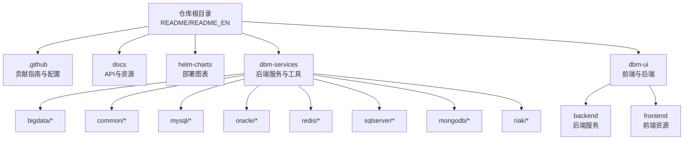
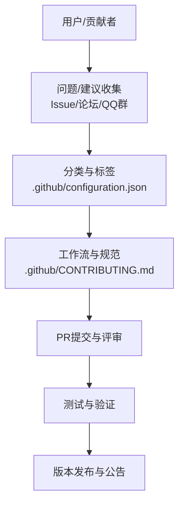
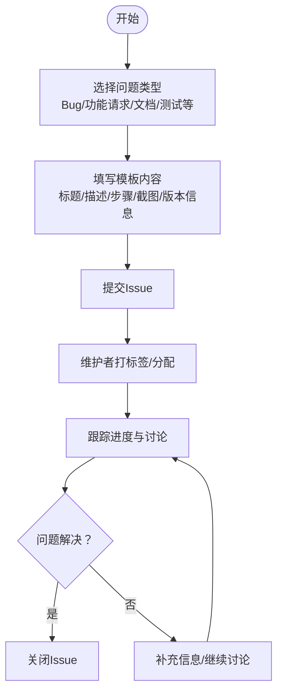
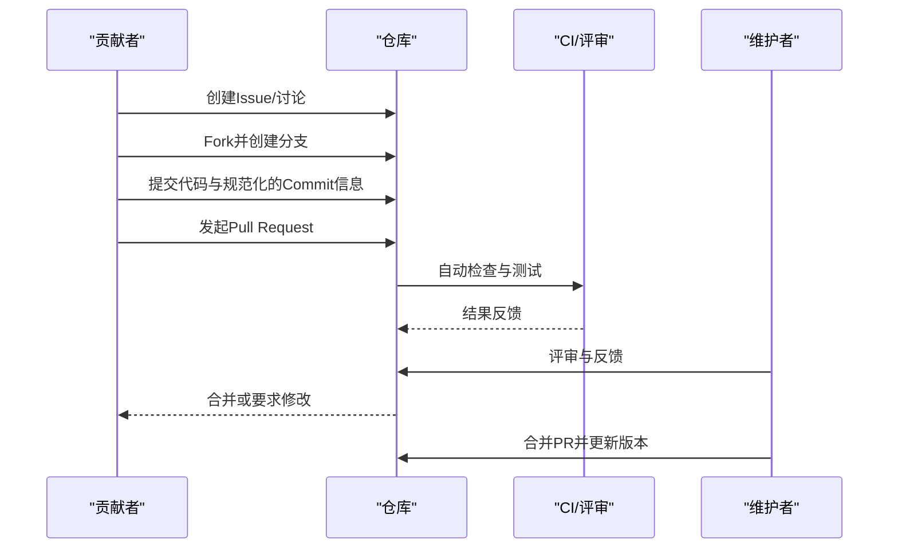
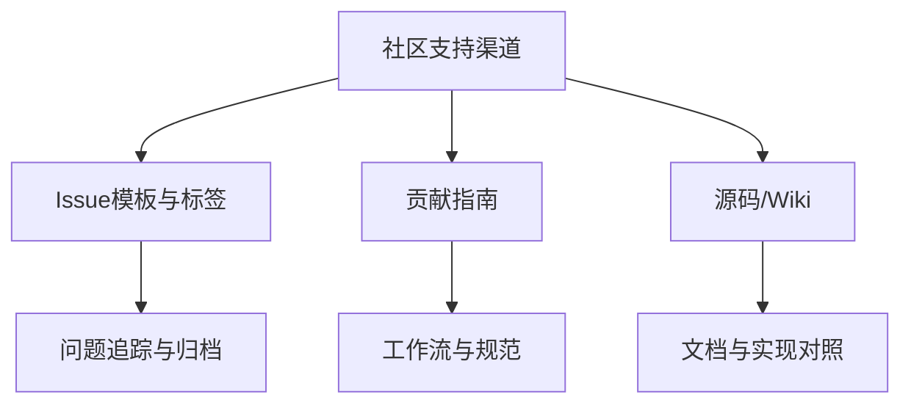

# 社区支持

<cite>
**本文引用的文件**   
- [readme.md](file://readme.md)
- [readme_en.md](file://readme_en.md)
- [.github/CONTRIBUTING.md](file://.github/CONTRIBUTING.md)
- [.github/configuration.json](file://.github/configuration.json)
- [.github/ISSUE_TEMPLATE/bug_report_zh.md](file://.github/ISSUE_TEMPLATE/bug_report_zh.md)
- [dbm-ui/DBM_README.md](file://dbm-ui/DBM_README.md)
</cite>

## 目录
1. [简介](#简介)
2. [项目结构](#项目结构)
3. [核心组件](#核心组件)
4. [架构总览](#架构总览)
5. [详细组件分析](#详细组件分析)
6. [依赖分析](#依赖分析)
7. [性能考虑](#性能考虑)
8. [故障排查指南](#故障排查指南)
9. [结论](#结论)
10. [附录](#附录)

## 简介
本文件面向DBM（蓝鲸数据库管理平台）用户与贡献者，系统梳理社区支持渠道、获取技术支持的方式、参与社区讨论与贡献代码的流程，以及问题反馈与建议提交的规范。同时介绍蓝鲸开源激励计划与贡献者指南，帮助您快速建立与DBM社区的有效联系，获得及时的技术支持与帮助。

## 项目结构
DBM是一个多模块的开源项目，包含后端服务、前端UI、各数据库工具组件与文档资源。社区支持相关内容主要分布在根目录的README与英文README中，以及GitHub组织下的贡献指南与Issue模板。

**章节来源**
- [readme.md:30-49](file://readme.md#L30-L49)
- [readme_en.md:24-45](file://readme_en.md#L24-L45)

## 核心组件
- 官方源码与文档
  - 源码仓库：提供完整源码与各模块组件，便于查阅与二次开发。
  - Wiki文档：集中展示平台特性、架构与使用说明。
- 支持与学习渠道
  - 蓝鲸论坛：官方社区讨论区，适合提问与分享经验。
  - 在线视频教程：DevOps方向的系统化教学资源。
  - QQ交流群：社区交流与问题求助的即时通道。
- 蓝鲸生态联动
  - 与蓝鲸CMDB、CI、BCS、PaaS、SOPS、JOB等产品形成生态协同，便于在蓝鲸体系内开展数据库管理与运维。

**章节来源**
- [readme.md:30-49](file://readme.md#L30-L49)
- [readme_en.md:24-45](file://readme_en.md#L24-L45)

## 架构总览
社区支持与贡献流程围绕“问题反馈—讨论—修复/改进—验证—发布”的闭环展开。贡献者通过Issue与PR参与协作，遵循统一的提交规范与标签体系，确保研效评估与版本迭代有序进行。

**图表来源**
- [.github/configuration.json:1-53](file://.github/configuration.json#L1-L53)
- [.github/CONTRIBUTING.md:1-67](file://.github/CONTRIBUTING.md#L1-L67)

**章节来源**
- [.github/configuration.json:1-53](file://.github/configuration.json#L1-L53)
- [.github/CONTRIBUTING.md:1-67](file://.github/CONTRIBUTING.md#L1-L67)

## 详细组件分析

### 获取技术支持与参与社区讨论
- 官方源码与Wiki
  - 源码：用于查阅实现细节、定位问题与验证修复方案。
  - Wiki：平台特性、架构与最佳实践的权威说明。
- 蓝鲸论坛
  - 适合发布技术问题、经验分享与版本讨论，社区专家与维护者会定期回复。
- 在线视频教程
  - DevOps方向的系统化课程，便于快速掌握平台使用与运维要点。
- QQ交流群
  - 社区交流与问题求助的即时通道，适合快速沟通与协作。

**章节来源**
- [readme.md:30-36](file://readme.md#L30-L36)
- [readme_en.md:24-29](file://readme_en.md#L24-L29)

### 问题反馈与建议提交流程
- 使用Issue模板
  - Bug反馈模板已内置，包含问题描述、重现步骤、预期现象、截图与必要信息项，便于维护者快速定位与复现。
- Issue分类与标签
  - 通过标签体系（如bug、feature、docs、test等）实现分类与追踪，便于研效评估与版本归档。
- 提交规范
  - 遵循贡献指南中的提交信息规范与流程，确保PR质量与可追溯性。

**图表来源**
- [.github/ISSUE_TEMPLATE/bug_report_zh.md:1-30](file://.github/ISSUE_TEMPLATE/bug_report_zh.md#L1-L30)
- [.github/configuration.json:1-53](file://.github/configuration.json#L1-L53)

**章节来源**
- [.github/ISSUE_TEMPLATE/bug_report_zh.md:1-30](file://.github/ISSUE_TEMPLATE/bug_report_zh.md#L1-L30)
- [.github/configuration.json:1-53](file://.github/configuration.json#L1-L53)

### 参与社区讨论与贡献代码
- 贡献指南
  - 提供Git工作流、分支策略、提交信息规范、PR创建与合并流程，确保协作高效有序。
- 代码规范与工具
  - 前端与后端均有代码规范与工具链指引，建议安装并启用pre-commit，确保提交前符合规范。
- 蓝鲸开源激励计划
  - 鼓励开发者参与与贡献，欢迎通过Issue与PR为社区贡献力量。

**图表来源**
- [.github/CONTRIBUTING.md:1-67](file://.github/CONTRIBUTING.md#L1-L67)
- [dbm-ui/DBM_README.md:1-70](file://dbm-ui/DBM_README.md#L1-L70)

**章节来源**
- [.github/CONTRIBUTING.md:1-67](file://.github/CONTRIBUTING.md#L1-L67)
- [dbm-ui/DBM_README.md:1-70](file://dbm-ui/DBM_README.md#L1-L70)

### 蓝鲸开源激励计划与贡献者指南
- 蓝鲸开源激励计划
  - 鼓励开发者参与与贡献，欢迎通过Issue与PR为社区贡献力量。
- 贡献者指南
  - 详细说明开发流程、单据类型、分支与PR规范，确保贡献过程标准化与可追踪。

**章节来源**
- [readme.md:45-49](file://readme.md#L45-L49)
- [readme_en.md:39-41](file://readme_en.md#L39-L41)
- [.github/CONTRIBUTING.md:1-67](file://.github/CONTRIBUTING.md#L1-L67)

## 依赖分析
- 社区支持渠道与贡献流程相互支撑：Issue模板与标签体系保障问题分类与追踪；贡献指南规范PR流程与提交规范；源码与Wiki提供技术支撑与知识沉淀。
- 生态联动：与蓝鲸系列产品的社区与文档形成互补，便于在蓝鲸体系内开展数据库管理与运维。

**图表来源**
- [.github/configuration.json:1-53](file://.github/configuration.json#L1-L53)
- [.github/CONTRIBUTING.md:1-67](file://.github/CONTRIBUTING.md#L1-L67)
- [readme.md:30-49](file://readme.md#L30-L49)

**章节来源**
- [.github/configuration.json:1-53](file://.github/configuration.json#L1-L53)
- [.github/CONTRIBUTING.md:1-67](file://.github/CONTRIBUTING.md#L1-L67)
- [readme.md:30-49](file://readme.md#L30-L49)

## 性能考虑
- 通过规范的Issue与PR流程，减少无效沟通与返工，提升问题解决效率。
- 使用pre-commit与统一代码规范，降低代码审查成本，缩短合并周期。
- 在蓝鲸生态内协同，借助现有工具链与平台能力，提升数据库管理与运维效率。

## 故障排查指南
- 快速定位
  - 优先查阅源码与Wiki，结合Issue模板提供的信息项（版本、环境、日志等）进行自检与复现。
- 讨论与求助
  - 在蓝鲸论坛发起讨论，或加入QQ交流群寻求帮助，提供清晰的问题描述与最小复现步骤。
- 提交与跟进
  - 按贡献指南规范提交Issue与PR，及时响应评审反馈，推动问题尽快解决。

**章节来源**
- [readme.md:30-36](file://readme.md#L30-L36)
- [.github/ISSUE_TEMPLATE/bug_report_zh.md:1-30](file://.github/ISSUE_TEMPLATE/bug_report_zh.md#L1-L30)
- [.github/CONTRIBUTING.md:1-67](file://.github/CONTRIBUTING.md#L1-L67)

## 结论
DBM社区支持体系以“问题反馈—讨论—修复/改进—验证—发布”为主线，辅以规范的贡献流程与丰富的学习资源。通过官方源码、Wiki、蓝鲸论坛、在线视频教程与QQ群等渠道，用户可以获得及时的技术支持与帮助；通过Issue与PR参与贡献，共同推动平台演进与生态繁荣。

## 附录
- 常用链接
  - 源码：[源码仓库](https://github.com/TencentBlueKing/blueking-dbm/tree/master)
  - Wiki：[平台Wiki](https://github.com/TencentBlueKing/blueking-dbm/wiki)
  - 蓝鲸论坛：[社区讨论](https://bk.tencent.com/s-mart/community)
  - 在线视频教程：[DevOps视频教程](https://bk.tencent.com/s-mart/video/)
  - QQ交流群：[社区交流群](https://jq.qq.com/?_wv=1027&k=5zk8F7G)
- 贡献与激励
  - 贡献指南：[贡献指南](file://.github/CONTRIBUTING.md)
  - 标签与分类：[配置文件](file://.github/configuration.json)
  - 开源激励计划：[腾讯开源激励计划](https://opensource.tencent.com/contribution)