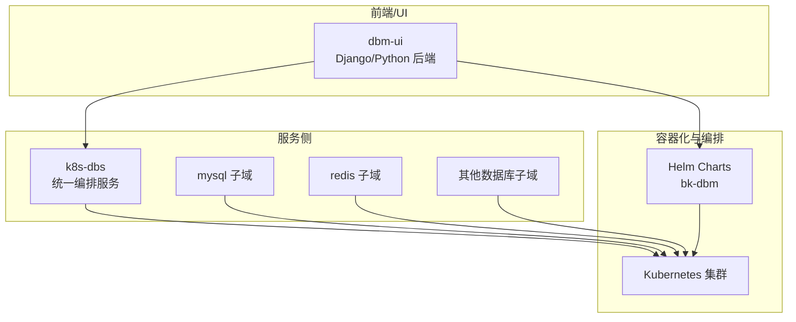
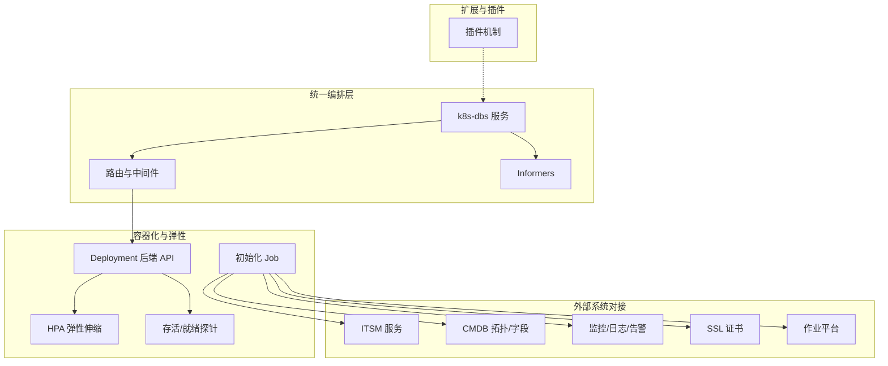
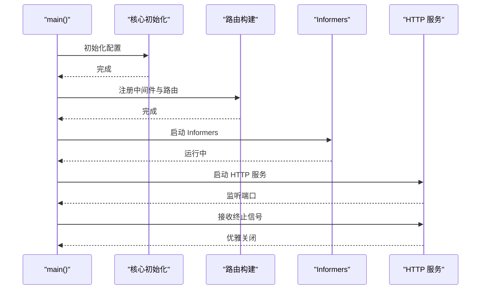
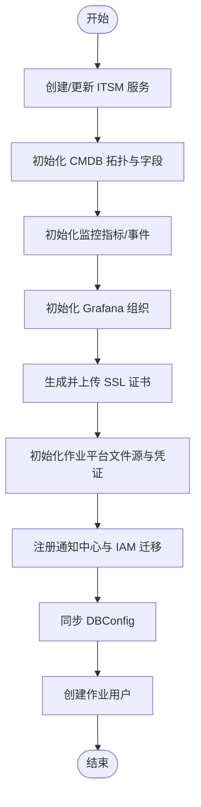
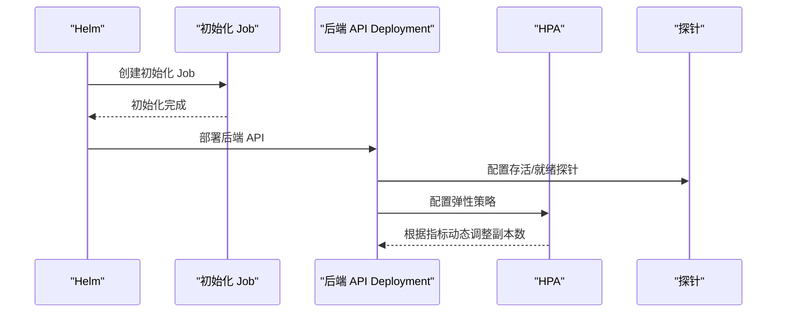
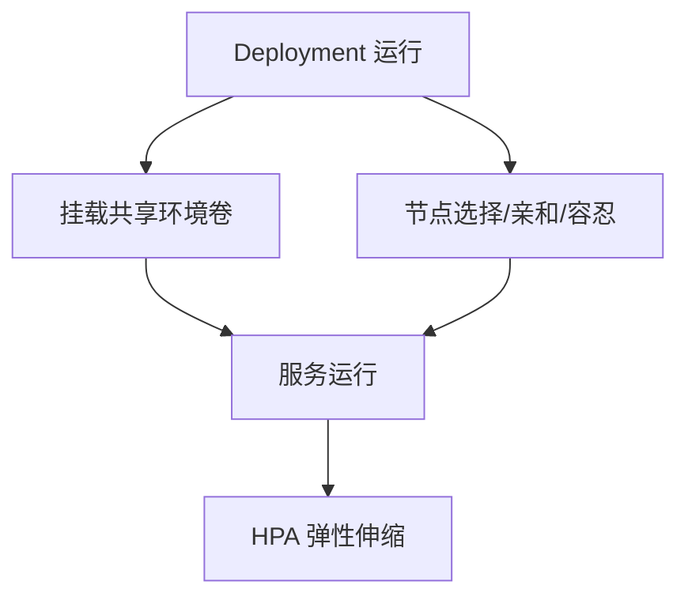
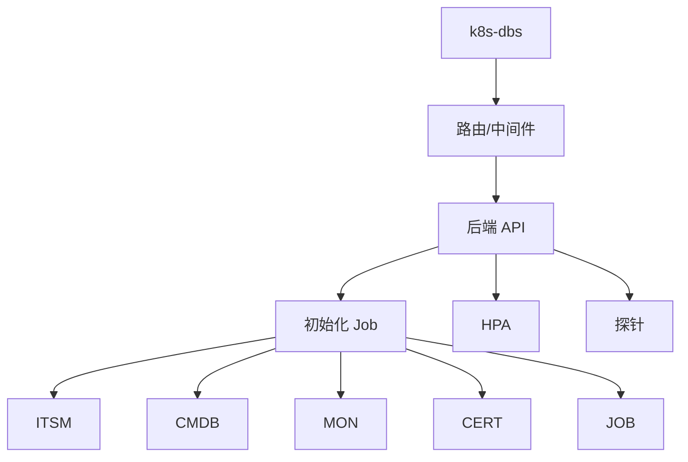

# 设计理念

<cite>
**本文引用的文件**   
- [readme.md](file://readme.md)
- [server.go](file://dbm-services/k8s-dbs/cmd/server.go)
- [services.py](file://dbm-ui/backend/dbm_init/services.py)
- [constants.py](file://dbm-ui/backend/dbm_init/constants.py)
- [backend-api.yaml](file://helm-charts/bk-dbm/charts/dbm/templates/deployments/backend-api/backend-api.yaml)
- [itsm-init-job.yaml](file://helm-charts/bk-dbm/charts/dbm/templates/jobs/itsm-init-job.yaml)
- [celery-beater.yaml](file://helm-charts/bk-dbm/charts/dbm/templates/deployments/celery/celery-beater.yaml)
- [_helpers.tpl](file://helm-charts/bk-dbm/charts/dbm/templates/_helpers.tpl)
- [deployment.yaml](file://helm-charts/bk-dbm/charts/db-remote-service/templates/deployment.yaml)
- [hpa.yaml](file://helm-charts/bk-dbm/charts/dbpartition/templates/hpa.yaml)
- [__init__.py](file://dbm-ui/backend/db_services/plugin/__init__.py)
</cite>

## 目录
1. [引言](#引言)
2. [项目结构](#项目结构)
3. [核心组件](#核心组件)
4. [架构总览](#架构总览)
5. [详细组件分析](#详细组件分析)
6. [依赖关系分析](#依赖关系分析)
7. [性能考量](#性能考量)
8. [故障排查指南](#故障排查指南)
9. [结论](#结论)
10. [附录](#附录)

## 引言
本设计理念文档围绕“数据库管理平台（DBM）”展开，系统阐述其设计哲学与核心思想，重点包括：
- 微服务架构理念：以模块化、松耦合的服务边界划分，结合容器化与 Helm 化部署，支撑多数据库组件的统一管理。
- 全生命周期管理思想：覆盖从安装部署、运行维护、变更扩容到监控告警与回收的完整生命周期闭环。
- 批量集群管理策略：通过统一的元数据与调度层，实现对海量数据库集群的批量化、标准化操作。
- 标准化、自动化与智能化：以统一接口、自动化流水线与可观测能力，降低人工干预，提升一致性与可靠性。
- 创新思路：组件化设计、插件化架构、容器化部署，兼顾易用性、安全性与可扩展性。

上述理念在项目 README 的特性描述、后端初始化服务、K8s 服务编排与 Helm Chart 中均有具体体现。

**章节来源**
- [readme.md:16-21](file://readme.md#L16-L21)

## 项目结构
DBM 采用前后端分离与多语言混合的工程组织方式：
- 前端与后端：dbm-ui 提供 Django/Python 后端与前端资源，包含数据库元数据、监控、任务流、权限与通知等子系统。
- 服务侧：dbm-services 下包含多种数据库工具与服务（如 MySQL、Redis、Kafka、HDFS、InfluxDB、Pulsar、Oracle、SQLServer 等），以及 K8s 统一编排服务（k8s-dbs）。
- Helm Charts：bk-dbm 提供统一的 K8s 部署包，内含后端 API、Celery、Grafana、数据库远程服务、分区服务等子 Chart，支持初始化作业、HPA、探针等。

**图表来源**
- [server.go:53-76](file://dbm-services/k8s-dbs/cmd/server.go#L53-L76)
- [backend-api.yaml:34-55](file://helm-charts/bk-dbm/charts/dbm/templates/deployments/backend-api/backend-api.yaml#L34-L55)

**章节来源**
- [readme.md:16-21](file://readme.md#L16-L21)

## 核心组件
- 统一编排服务（k8s-dbs）：以 Gin 为核心构建 HTTP 服务，注册中间件与路由，启动 Informers，提供统一的数据库集群管理 API。
- 初始化服务（dbm_init.services.Services）：负责 ITSM、CMDB、监控、证书、作业平台等外部能力的初始化与对接，保障平台可用性与合规性。
- Helm 编排（bk-dbm）：通过 Job 初始化外部系统，Deployment 运行后端 API，HPA 实现弹性伸缩，支持探针与资源限制。
- 插件机制（db_services.plugin）：为第三方接口与扩展能力预留插槽，便于在内部环境进行能力扩展。

**章节来源**
- [server.go:53-76](file://dbm-services/k8s-dbs/cmd/server.go#L53-L76)
- [services.py:52-114](file://dbm-ui/backend/dbm_init/services.py#L52-L114)
- [backend-api.yaml:34-55](file://helm-charts/bk-dbm/charts/dbm/templates/deployments/backend-api/backend-api.yaml#L34-L55)
- [__init__.py:12-13](file://dbm-ui/backend/db_services/plugin/__init__.py#L12-L13)

## 架构总览
DBM 的整体架构围绕“统一编排 + 多数据库子域 + Helm 化部署”的模式展开，强调标准化与自动化：
- 统一编排层：k8s-dbs 提供统一 API 与中间件，集中处理路由与 Informers，保证对多数据库组件的一致性接入。
- 外部系统对接：dbm_init.services.Services 将 ITSM、CMDB、监控、证书、作业平台等能力纳入初始化流程，形成平台级能力闭环。
- 容器化与弹性：Helm Chart 通过 Deployment、Job、HPA 等资源实现服务的弹性伸缩与健康检查；后端 API 使用 Gunicorn + gevent 提升并发处理能力。
- 扩展与插件：db_services.plugin 为第三方能力提供插槽，便于在不破坏主干的前提下进行能力扩展。

**图表来源**
- [server.go:53-76](file://dbm-services/k8s-dbs/cmd/server.go#L53-L76)
- [services.py:52-114](file://dbm-ui/backend/dbm_init/services.py#L52-L114)
- [backend-api.yaml:34-55](file://helm-charts/bk-dbm/charts/dbm/templates/deployments/backend-api/backend-api.yaml#L34-L55)
- [itsm-init-job.yaml:1-33](file://helm-charts/bk-dbm/charts/dbm/templates/jobs/itsm-init-job.yaml#L1-L33)
- [hpa.yaml:1-28](file://helm-charts/bk-dbm/charts/dbpartition/templates/hpa.yaml#L1-L28)

## 详细组件分析

### 统一编排服务（k8s-dbs）
- 设计要点：以 Gin 为 Web 框架，集中注册中间件与路由，启动 Informers，提供统一的数据库集群管理 API。
- 关键流程：初始化核心配置 → 构建路由 → 启动 Informers → 启动 HTTP 服务 → 优雅关闭。
- 优势：模块化、可扩展，便于接入不同数据库组件的差异化需求。

**图表来源**
- [server.go:53-76](file://dbm-services/k8s-dbs/cmd/server.go#L53-L76)

**章节来源**
- [server.go:53-76](file://dbm-services/k8s-dbs/cmd/server.go#L53-L76)

### 初始化服务（dbm_init.services.Services）
- 设计要点：将平台所需的关键外部能力（ITSM、CMDB、监控、证书、作业平台）纳入统一初始化流程，确保部署即可用。
- 关键流程：创建/更新 ITSM 服务 → 初始化 CMDB 拓扑与自定义字段 → 初始化监控自定义指标与事件 → 初始化 Grafana 组织 → 生成并上传 SSL 证书 → 初始化作业平台文件源与凭证 → 注册通知中心与 IAM 迁移 → 同步 DBConfig → 创建作业用户。
- 优势：减少手工配置，提升一致性与可审计性，降低部署与运维成本。

**图表来源**
- [services.py:52-114](file://dbm-ui/backend/dbm_init/services.py#L52-L114)
- [services.py:168-220](file://dbm-ui/backend/dbm_init/services.py#L168-L220)
- [services.py:222-332](file://dbm-ui/backend/dbm_init/services.py#L222-L332)
- [services.py:358-407](file://dbm-ui/backend/dbm_init/services.py#L358-L407)
- [services.py:425-477](file://dbm-ui/backend/dbm_init/services.py#L425-L477)

**章节来源**
- [services.py:52-114](file://dbm-ui/backend/dbm_init/services.py#L52-L114)
- [services.py:168-220](file://dbm-ui/backend/dbm_init/services.py#L168-L220)
- [services.py:222-332](file://dbm-ui/backend/dbm_init/services.py#L222-L332)
- [services.py:358-407](file://dbm-ui/backend/dbm_init/services.py#L358-L407)
- [services.py:425-477](file://dbm-ui/backend/dbm_init/services.py#L425-L477)
- [constants.py:12-33](file://dbm-ui/backend/dbm_init/constants.py#L12-L33)

### Helm 编排与容器化部署
- 设计要点：通过 Helm Chart 将后端 API、Celery、Grafana、数据库远程服务、分区服务等打包，统一管理镜像、资源、探针与弹性策略。
- 关键流程：使用 Job 执行初始化任务（如 ITSM 初始化），Deployment 运行后端 API（Gunicorn + gevent），HPA 根据 CPU/Memory 目标自动伸缩，探针保障健康状态。
- 优势：标准化部署、快速复制、弹性伸缩、可观测性内置。

**图表来源**
- [itsm-init-job.yaml:1-33](file://helm-charts/bk-dbm/charts/dbm/templates/jobs/itsm-init-job.yaml#L1-L33)
- [backend-api.yaml:34-55](file://helm-charts/bk-dbm/charts/dbm/templates/deployments/backend-api/backend-api.yaml#L34-L55)
- [hpa.yaml:1-28](file://helm-charts/bk-dbm/charts/dbpartition/templates/hpa.yaml#L1-L28)
- [_helpers.tpl:67-72](file://helm-charts/bk-dbm/charts/dbm/templates/_helpers.tpl#L67-L72)

**章节来源**
- [itsm-init-job.yaml:1-33](file://helm-charts/bk-dbm/charts/dbm/templates/jobs/itsm-init-job.yaml#L1-L33)
- [backend-api.yaml:34-55](file://helm-charts/bk-dbm/charts/dbm/templates/deployments/backend-api/backend-api.yaml#L34-L55)
- [hpa.yaml:1-28](file://helm-charts/bk-dbm/charts/dbpartition/templates/hpa.yaml#L1-L28)
- [_helpers.tpl:67-72](file://helm-charts/bk-dbm/charts/dbm/templates/_helpers.tpl#L67-L72)

### 数据库远程服务与弹性伸缩
- 设计要点：数据库远程服务通过 Deployment 运行，挂载共享环境卷，支持节点选择、亲和性与容忍度配置；分区服务通过 HPA 实现弹性伸缩。
- 优势：隔离环境、灵活调度、资源弹性、易于扩展。

**图表来源**
- [deployment.yaml:38-62](file://helm-charts/bk-dbm/charts/db-remote-service/templates/deployment.yaml#L38-L62)
- [hpa.yaml:1-28](file://helm-charts/bk-dbm/charts/dbpartition/templates/hpa.yaml#L1-L28)

**章节来源**
- [deployment.yaml:38-62](file://helm-charts/bk-dbm/charts/db-remote-service/templates/deployment.yaml#L38-L62)
- [hpa.yaml:1-28](file://helm-charts/bk-dbm/charts/dbpartition/templates/hpa.yaml#L1-L28)

### 插件化架构（db_services.plugin）
- 设计要点：为第三方接口与扩展能力预留插槽，便于在内部环境进行能力扩展，不影响主干逻辑。
- 优势：增强可扩展性，降低耦合，便于快速迭代与定制化。

**章节来源**
- [__init__.py:12-13](file://dbm-ui/backend/db_services/plugin/__init__.py#L12-L13)

## 依赖关系分析
- 组件耦合与内聚：k8s-dbs 通过中间件与路由实现高内聚、低耦合；初始化服务将外部系统能力解耦为独立模块，便于替换与扩展。
- 直接与间接依赖：后端 API 依赖初始化作业提供的配置与凭证；Helm Chart 通过 Job 与 Deployment 形成直接依赖链；HPA 与探针为间接依赖，保障弹性与健康。
- 外部依赖与集成点：ITSM、CMDB、监控、证书、作业平台、通知中心、IAM 等外部系统通过初始化服务进行集成。
- 潜在循环依赖：初始化服务各模块职责清晰，未见明显循环依赖迹象。

**图表来源**
- [server.go:53-76](file://dbm-services/k8s-dbs/cmd/server.go#L53-L76)
- [itsm-init-job.yaml:1-33](file://helm-charts/bk-dbm/charts/dbm/templates/jobs/itsm-init-job.yaml#L1-L33)
- [backend-api.yaml:34-55](file://helm-charts/bk-dbm/charts/dbm/templates/deployments/backend-api/backend-api.yaml#L34-L55)
- [hpa.yaml:1-28](file://helm-charts/bk-dbm/charts/dbpartition/templates/hpa.yaml#L1-L28)

**章节来源**
- [server.go:53-76](file://dbm-services/k8s-dbs/cmd/server.go#L53-L76)
- [itsm-init-job.yaml:1-33](file://helm-charts/bk-dbm/charts/dbm/templates/jobs/itsm-init-job.yaml#L1-L33)
- [backend-api.yaml:34-55](file://helm-charts/bk-dbm/charts/dbm/templates/deployments/backend-api/backend-api.yaml#L34-L55)
- [hpa.yaml:1-28](file://helm-charts/bk-dbm/charts/dbpartition/templates/hpa.yaml#L1-L28)

## 性能考量
- 并发与吞吐：后端 API 使用 Gunicorn + gevent，适合高并发请求场景，配合探针与 HPA 实现弹性伸缩。
- 资源与弹性：通过 HPA 根据 CPU/Memory 目标动态调整副本数，避免资源浪费与过载。
- 初始化效率：初始化 Job 在部署阶段一次性完成外部系统对接，减少运行期开销。
- 可观测性：内置存活/就绪探针与监控指标，便于快速定位问题。

**章节来源**
- [backend-api.yaml:34-55](file://helm-charts/bk-dbm/charts/dbm/templates/deployments/backend-api/backend-api.yaml#L34-L55)
- [hpa.yaml:1-28](file://helm-charts/bk-dbm/charts/dbpartition/templates/hpa.yaml#L1-L28)

## 故障排查指南
- 初始化失败：检查 ITSM、CMDB、监控、证书、作业平台等初始化作业的日志与返回码，确认参数与权限配置正确。
- 服务不可用：查看后端 API 的存活/就绪探针状态，确认容器健康；检查 HPA 是否触发了异常缩放。
- 部署异常：核对 Helm Values 与镜像仓库、镜像标签、资源配额、节点选择策略等配置。
- 插件问题：检查插件路径与导入逻辑，确保第三方能力与主干兼容。

**章节来源**
- [services.py:52-114](file://dbm-ui/backend/dbm_init/services.py#L52-L114)
- [backend-api.yaml:34-55](file://helm-charts/bk-dbm/charts/dbm/templates/deployments/backend-api/backend-api.yaml#L34-L55)

## 结论
DBM 的设计理念以“统一编排 + 多数据库子域 + Helm 化部署”为核心，通过标准化、自动化与智能化手段，实现数据库管理的全生命周期闭环。其微服务架构、组件化与插件化设计，既保证了易用性与安全性，又兼顾了可扩展性与可观测性。借助初始化服务与 Helm Chart，DBM 能够在复杂环境中快速落地并稳定运行，为数据库管理提供坚实的技术底座。

## 附录
- 设计理念的具体体现与实践案例：
  - 统一编排服务：通过 k8s-dbs 的中间件与路由，实现多数据库组件的统一接入与一致化管理。
  - 初始化服务：通过 ITSM、CMDB、监控、证书、作业平台等初始化作业，确保平台即开即用。
  - 容器化与弹性：通过 Helm Chart 的 Deployment、Job、HPA 与探针，实现弹性伸缩与健康保障。
  - 插件化扩展：通过 db_services.plugin 为第三方能力预留扩展点，满足定制化需求。

**章节来源**
- [readme.md:16-21](file://readme.md#L16-L21)
- [server.go:53-76](file://dbm-services/k8s-dbs/cmd/server.go#L53-L76)
- [services.py:52-114](file://dbm-ui/backend/dbm_init/services.py#L52-L114)
- [backend-api.yaml:34-55](file://helm-charts/bk-dbm/charts/dbm/templates/deployments/backend-api/backend-api.yaml#L34-L55)
- [hpa.yaml:1-28](file://helm-charts/bk-dbm/charts/dbpartition/templates/hpa.yaml#L1-L28)
- [__init__.py:12-13](file://dbm-ui/backend/db_services/plugin/__init__.py#L12-L13)