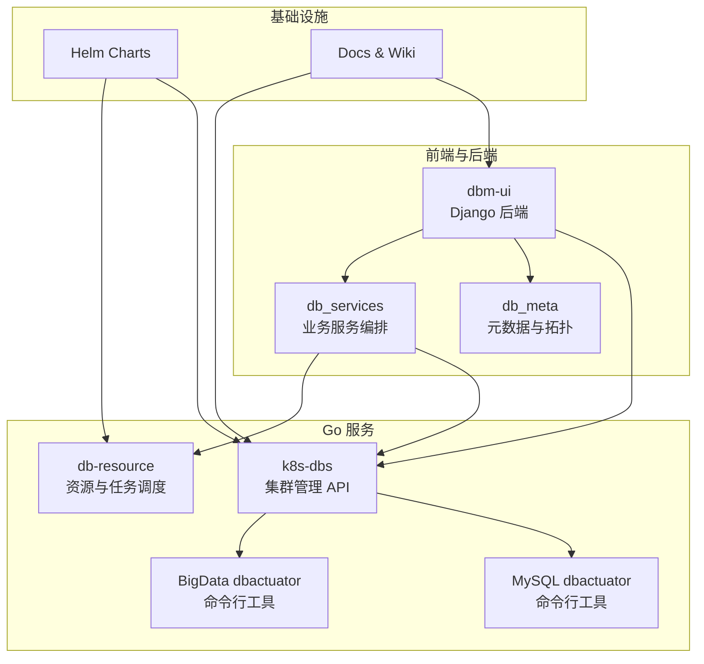
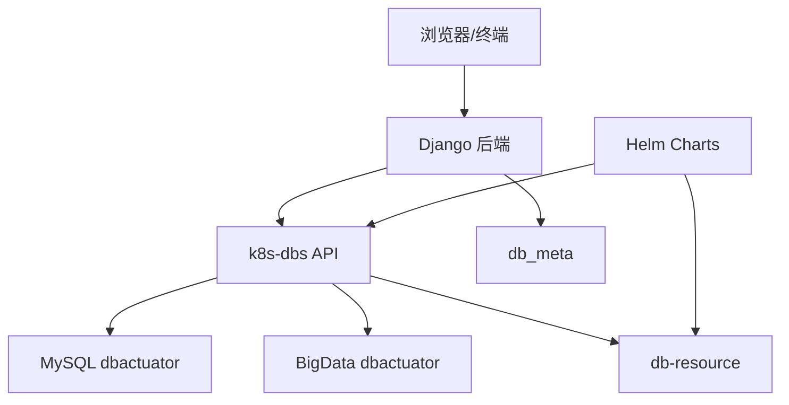
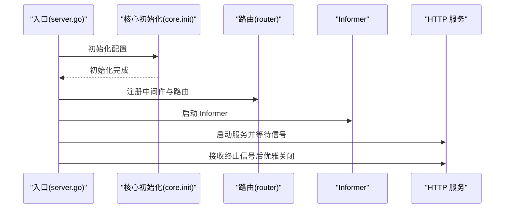
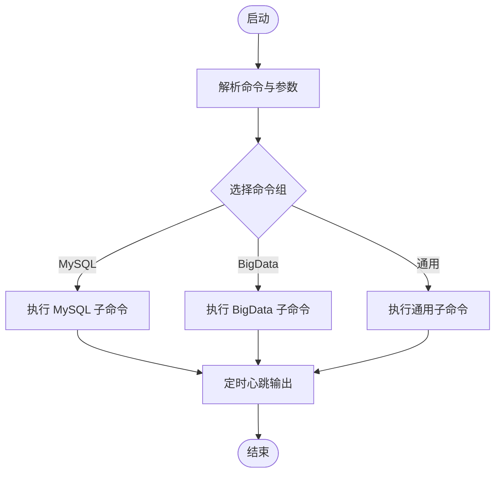
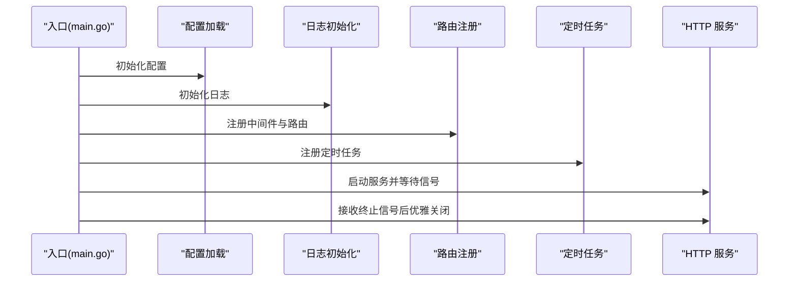
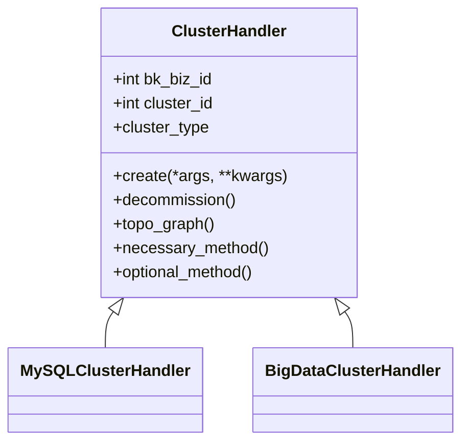
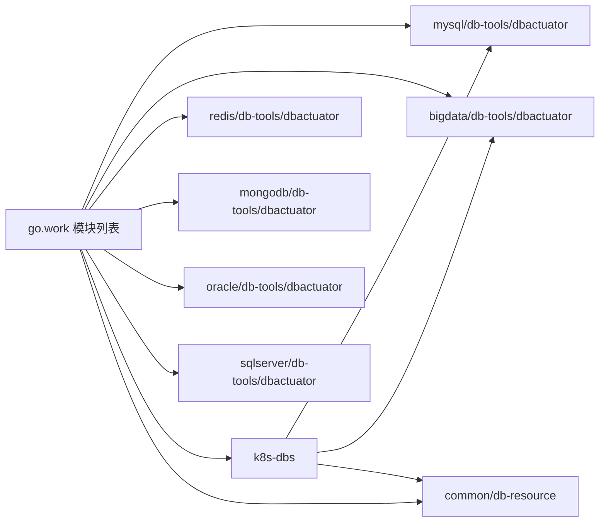

# 项目概述

<cite>
**本文档引用的文件**
- [readme.md](file://readme.md)
- [readme_en.md](file://readme_en.md)
- [go.work](file://dbm-services/go.work)
- [cmd.go（MySQL dbactuator）](file://dbm-services/mysql/db-tools/dbactuator/cmd/cmd.go)
- [cmd.go（BigData dbactuator）](file://dbm-services/bigdata/db-tools/dbactuator/cmd/cmd.go)
- [server.go（k8s-dbs）](file://dbm-services/k8s-dbs/cmd/server.go)
- [init.go（k8s-dbs core）](file://dbm-services/k8s-dbs/core/init.go)
- [main.go（db-resource）](file://dbm-services/common/db-resource/main.go)
- [readme.md（db_meta）](file://dbm-ui/backend/db_meta/readme.md)
- [DBM_README.md（dbm-ui）](file://dbm-ui/DBM_README.md)
- [NOTES.txt（bk-dbm Helm chart）](file://helm-charts/bk-dbm/templates/NOTES.txt)
- [NOTES.txt（k8s-dbs Helm chart）](file://helm-charts/bk-dbm/charts/k8s-dbs/templates/NOTES.txt)
</cite>

## 目录
1. [引言](#引言)
2. [项目结构](#项目结构)
3. [核心组件](#核心组件)
4. [架构总览](#架构总览)
5. [详细组件分析](#详细组件分析)
6. [依赖分析](#依赖分析)
7. [性能考虑](#性能考虑)
8. [故障排查指南](#故障排查指南)
9. [结论](#结论)
10. [附录](#附录)

## 引言
蓝鲸数据库管理平台（DBM）旨在为多数据库组件提供全生命周期管理能力，覆盖 MySQL、Redis、ElasticSearch（ES）、Kafka、HDFS、InfluxDB、Pulsar 等生态组件。其核心价值主张包括：
- 全生命周期管理：从部署、扩容、变更到监控与故障恢复的完整闭环
- 批量化与标准化：面向海量集群的批量管理与标准化工具链
- 可交互与可审计：清晰的任务流程与审批机制，保障操作安全与可追溯
- 权限与合规：细粒度的角色与权限配置，满足企业级安全与合规要求
- 可观测性：配套监控告警与可观测能力，降低运维复杂度

DBM 既服务于数据库管理员，也服务于运维与开发人员，帮助他们更高效、更安全、更全面地管理数据库。

章节来源
- [readme.md:1-54](file://readme.md#L1-L54)
- [readme_en.md:1-29](file://readme_en.md#L1-L29)

## 项目结构
DBM 采用多模块、多语言混合的组织方式：
- 后端服务层：Go 语言实现的各类子服务（如 dbactuator、k8s-dbs、db-resource 等）
- 前端与后端协同：Django 后端与前端资源打包的统一部署
- Helm Charts：提供一键式部署与运维支持
- 文档与 Wiki：配套安装、使用与贡献指南

图表来源
- [go.work:1-47](file://dbm-services/go.work#L1-L47)
- [server.go（k8s-dbs）:48-77](file://dbm-services/k8s-dbs/cmd/server.go#L48-L77)
- [cmd.go（MySQL dbactuator）:72-195](file://dbm-services/mysql/db-tools/dbactuator/cmd/cmd.go#L72-L195)
- [cmd.go（BigData dbactuator）:75-185](file://dbm-services/bigdata/db-tools/dbactuator/cmd/cmd.go#L75-L185)
- [main.go（db-resource）:46-109](file://dbm-services/common/db-resource/main.go#L46-L109)

章节来源
- [go.work:1-47](file://dbm-services/go.work#L1-L47)
- [DBM_README.md:72-230](file://dbm-ui/DBM_README.md#L72-L230)

## 核心组件
- k8s-dbs：集群管理与 API 服务，负责路由注册、中间件装配与 Informer 启动，提供面向集群的统一接口
- MySQL/BigData dbactuator：面向不同数据库组件的命令行执行器，统一承载安装、配置、变更、回滚等子命令分组
- db-resource：资源与任务调度服务，提供资源模型、定时任务与可观测中间件
- db_meta：元数据与拓扑管理，约束写入边界、提供集群处理器抽象与统一接口
- dbm-ui：Django 后端与前端资源，提供统一的管理界面与流程编排

章节来源
- [server.go（k8s-dbs）:48-77](file://dbm-services/k8s-dbs/cmd/server.go#L48-L77)
- [cmd.go（MySQL dbactuator）:72-195](file://dbm-services/mysql/db-tools/dbactuator/cmd/cmd.go#L72-L195)
- [cmd.go（BigData dbactuator）:75-185](file://dbm-services/bigdata/db-tools/dbactuator/cmd/cmd.go#L75-L185)
- [main.go（db-resource）:46-109](file://dbm-services/common/db-resource/main.go#L46-L109)
- [readme.md（db_meta）:3-24](file://dbm-ui/backend/db_meta/readme.md#L3-L24)

## 架构总览
DBM 的整体架构围绕“前端 UI + 后端服务 + 多语言执行器 + 资源与任务调度”的模式展开。前端通过 Django 后端与各服务交互；后端通过 k8s-dbs 提供统一 API；针对不同数据库组件，dbactuator 以子命令形式提供标准化操作；db-resource 提供资源与任务调度能力；db_meta 约束元数据写入与提供统一的集群处理器抽象。

图表来源
- [server.go（k8s-dbs）:61-67](file://dbm-services/k8s-dbs/cmd/server.go#L61-L67)
- [cmd.go（MySQL dbactuator）:74-98](file://dbm-services/mysql/db-tools/dbactuator/cmd/cmd.go#L74-L98)
- [cmd.go（BigData dbactuator）:99-167](file://dbm-services/bigdata/db-tools/dbactuator/cmd/cmd.go#L99-L167)
- [main.go（db-resource）:67-81](file://dbm-services/common/db-resource/main.go#L67-L81)

## 详细组件分析

### k8s-dbs：集群管理 API 服务
- 职责：初始化核心配置、注册中间件、构建路由、启动 Informer、提供 HTTP 服务
- 关键流程：启动顺序严格控制，先初始化配置，再注册中间件与路由，随后启动 Informer，最后监听信号优雅关闭
- 部署：通过 Helm Charts 提供一键部署与健康检查提示

图表来源
- [server.go（k8s-dbs）:53-77](file://dbm-services/k8s-dbs/cmd/server.go#L53-L77)
- [init.go（k8s-dbs core）:27-44](file://dbm-services/k8s-dbs/core/init.go#L27-L44)

章节来源
- [server.go（k8s-dbs）:48-110](file://dbm-services/k8s-dbs/cmd/server.go#L48-L110)
- [init.go（k8s-dbs core）:27-44](file://dbm-services/k8s-dbs/core/init.go#L27-L44)
- [NOTES.txt（k8s-dbs Helm chart）:1-14](file://helm-charts/bk-dbm/charts/k8s-dbs/templates/NOTES.txt#L1-L14)

### MySQL/BigData dbactuator：命令行执行器
- 职责：为不同数据库组件提供统一的命令行入口，按“组”组织子命令（如 sysinit、crontab、common、各组件命令等）
- 特性：支持 payload 参数传递、回滚标记、心跳输出、帮助输出等通用能力
- 组件分组：MySQL 包含 mysql、proxy、spider、tbinlogdumper 等；BigData 包含 es、kafka、pulsar、influxdb、hdfs、vm、doris 等

图表来源
- [cmd.go（MySQL dbactuator）:74-195](file://dbm-services/mysql/db-tools/dbactuator/cmd/cmd.go#L74-L195)
- [cmd.go（BigData dbactuator）:99-167](file://dbm-services/bigdata/db-tools/dbactuator/cmd/cmd.go#L99-L167)

章节来源
- [cmd.go（MySQL dbactuator）:72-214](file://dbm-services/mysql/db-tools/dbactuator/cmd/cmd.go#L72-L214)
- [cmd.go（BigData dbactuator）:75-207](file://dbm-services/bigdata/db-tools/dbactuator/cmd/cmd.go#L75-L207)

### db-resource：资源与任务调度
- 职责：提供资源模型、定时任务、安全头与日志中间件、APM（Trace/Metrics）中间件、健康检查端点
- 特性：支持 LLM 分析器初始化、与 CMDB/云厂商对接、定时同步主机状态与硬件信息、生成资源快照与故障检测
- 部署：通过 Helm Charts 提供一键部署与卸载提示

图表来源
- [main.go（db-resource）:112-124](file://dbm-services/common/db-resource/main.go#L112-L124)
- [main.go（db-resource）:165-222](file://dbm-services/common/db-resource/main.go#L165-L222)
- [main.go（db-resource）:73-109](file://dbm-services/common/db-resource/main.go#L73-L109)

章节来源
- [main.go（db-resource）:46-236](file://dbm-services/common/db-resource/main.go#L46-L236)
- [NOTES.txt（bk-dbm Helm chart）:1-12](file://helm-charts/bk-dbm/templates/NOTES.txt#L1-L12)

### db_meta：元数据与拓扑
- 职责：维护集群、实例、机器等元数据，为 db_service 与流程提供拓扑与操作接口；约束仅 api 层可写入 Model
- 抽象：提供 ClusterHandler 抽象类，要求实现 create、decommission、topo_graph 等“必须”方法
- 调用规范：db_service/flow 通过 ClusterHandler 方法进行集群维度操作；独立服务通过 HTTP 暴露接口并需鉴权

图表来源
- [readme.md（db_meta）:54-93](file://dbm-ui/backend/db_meta/readme.md#L54-L93)

章节来源
- [readme.md（db_meta）:3-24](file://dbm-ui/backend/db_meta/readme.md#L3-L24)
- [readme.md（db_meta）:96-103](file://dbm-ui/backend/db_meta/readme.md#L96-L103)

## 依赖分析
- 工作区聚合：go.work 明确列出所有模块，涵盖 MySQL、Redis、MongoDB、Oracle、SQLServer、BigData、公共组件等
- 服务耦合：k8s-dbs 依赖 core 初始化与路由；dbactuator 依赖子命令分组；db-resource 依赖配置、中间件与定时任务
- 外部依赖：Helm Charts 提供部署与运维支持，便于在 Kubernetes 环境中快速上线

图表来源
- [go.work:3-42](file://dbm-services/go.work#L3-L42)

章节来源
- [go.work:1-47](file://dbm-services/go.work#L1-L47)

## 性能考虑
- 执行器的心跳输出：定期输出心跳，便于长耗时任务的状态可见性与问题定位
- APM 中间件：db-resource 提供 Trace 与 Prometheus Metrics 中间件，便于性能观测与问题诊断
- 定时任务：集中管理资源状态同步、硬件信息同步与快照生成，避免重复拉取与抖动
- 优雅关闭：HTTP 服务统一处理信号，提供超时控制，确保平滑退出

章节来源
- [cmd.go（MySQL dbactuator）:202-214](file://dbm-services/mysql/db-tools/dbactuator/cmd/cmd.go#L202-L214)
- [cmd.go（BigData dbactuator）:192-207](file://dbm-services/bigdata/db-tools/dbactuator/cmd/cmd.go#L192-L207)
- [main.go（db-resource）:55-61](file://dbm-services/common/db-resource/main.go#L55-L61)
- [main.go（db-resource）:82-109](file://dbm-services/common/db-resource/main.go#L82-L109)

## 故障排查指南
- 日志与中间件：db-resource 提供安全头、请求体大小限制、日志中间件与健康检查端点，便于快速定位问题
- 定时任务：集中注册多项定时任务，若出现资源状态不同步或硬件信息缺失，优先检查定时任务执行情况
- 优雅关闭：若服务异常退出，检查信号处理与超时配置，确保服务端正确回收资源
- 前端与后端联调：dbm-ui 提供本地部署与环境变量配置指引，便于快速复现问题

章节来源
- [main.go（db-resource）:63-71](file://dbm-services/common/db-resource/main.go#L63-L71)
- [main.go（db-resource）:165-222](file://dbm-services/common/db-resource/main.go#L165-L222)
- [DBM_README.md:112-230](file://dbm-ui/DBM_README.md#L112-L230)

## 结论
DBM 通过“前端 UI + 后端服务 + 多语言执行器 + 资源与任务调度”的架构，实现了对多种数据库组件的全生命周期管理。其标准化的命令行工具、统一的 API 服务、严格的元数据写入边界与完善的可观测能力，使得数据库管理更高效、更安全、更全面。结合 Helm Charts 的一键部署与运维支持，DBM 能够快速适配企业级生产环境。

## 附录
- 开发与部署：参考 dbm-ui 的本地部署与环境变量配置，快速搭建开发与测试环境
- 社区与支持：提供源码、Wiki、论坛、视频教程与 QQ 交流群，便于获取帮助与参与贡献
- 许可证：项目基于 MIT 协议，遵循开源许可要求

章节来源
- [DBM_README.md:72-230](file://dbm-ui/DBM_README.md#L72-L230)
- [readme.md:30-54](file://readme.md#L30-L54)
- [readme_en.md:24-29](file://readme_en.md#L24-L29)