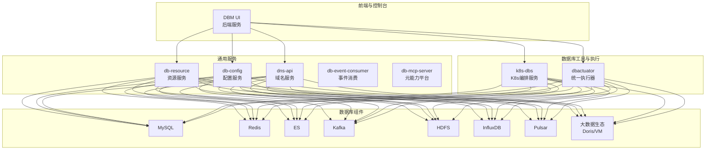
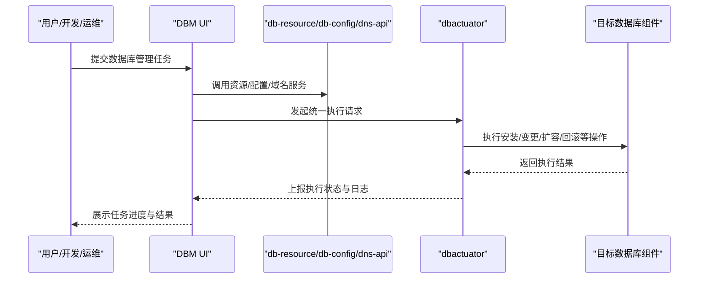
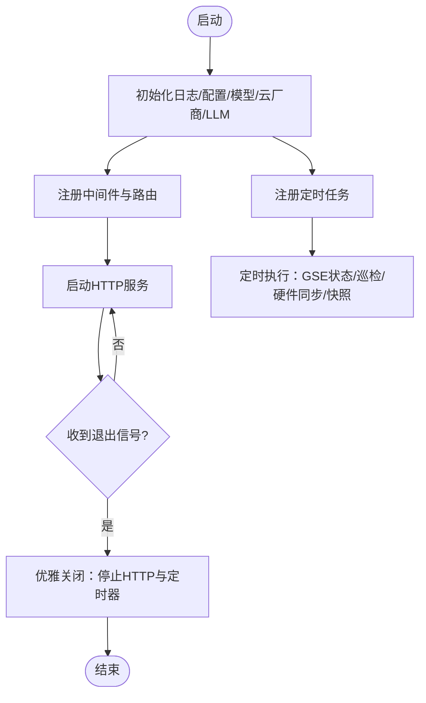
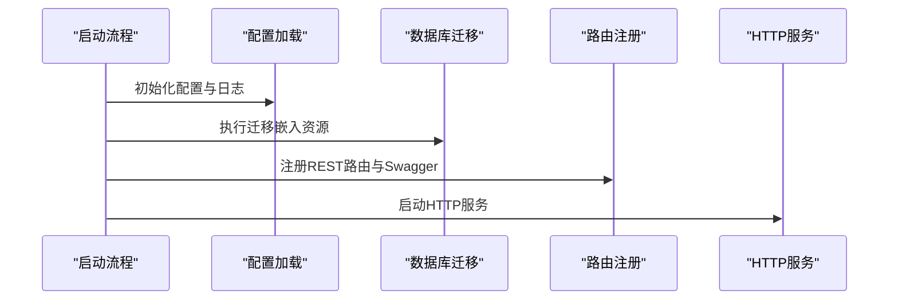
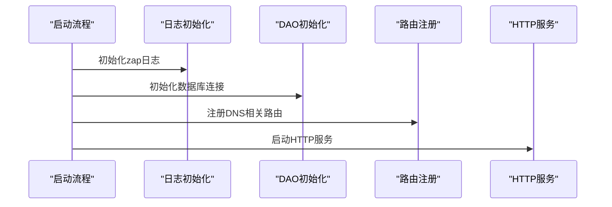
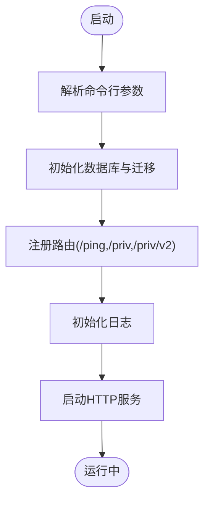
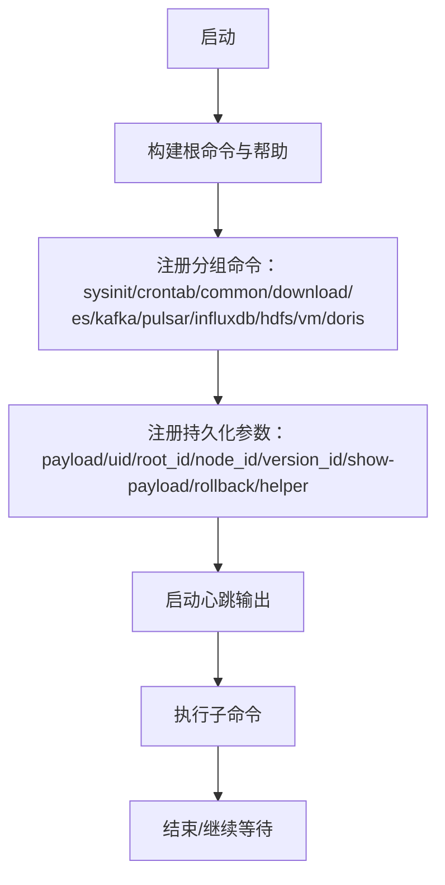
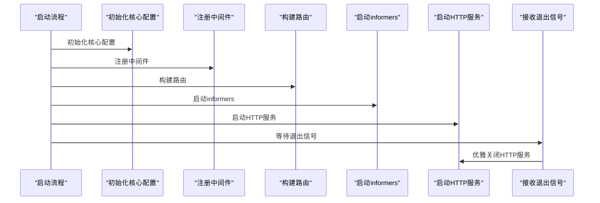
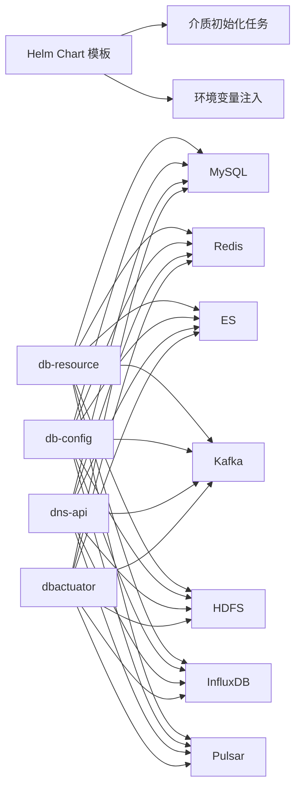

# 项目简介

<cite>
**本文引用的文件**   
- [README（中文）](file://readme.md)
- [README（英文）](file://readme_en.md)
- [DBM_README（后端）](file://dbm-ui/DBM_README.md)
- [db-resource 主程序](file://dbm-services/common/db-resource/main.go)
- [db-config 主程序](file://dbm-services/common/db-config/cmd/bkconfigsvr/main.go)
- [dns-api 主程序](file://dbm-services/common/db-dns/dns-api/cmd/bk-dnsapi/main.go)
- [MySQL 权限服务主程序](file://dbm-services/mysql/db-priv/main.go)
- [BigData dbactuator 主程序](file://dbm-services/bigdata/db-tools/dbactuator/cmd/cmd.go)
- [K8s-dbs 服务主程序](file://dbm-services/k8s-dbs/cmd/server.go)
- [Helm Chart 模板片段](file://helm-charts/bk-dbm/charts/dbm/templates/jobs/medium-init-job.yaml)
- [Helm Chart 辅助模板](file://helm-charts/bk-dbm/charts/dbm/templates/_helpers.tpl)
</cite>

## 目录
1. [引言](#引言)
2. [项目结构](#项目结构)
3. [核心组件](#核心组件)
4. [架构总览](#架构总览)
5. [详细组件分析](#详细组件分析)
6. [依赖关系分析](#依赖关系分析)
7. [性能与扩展性](#性能与扩展性)
8. [故障排查指南](#故障排查指南)
9. [结论](#结论)
10. [附录](#附录)

## 引言
蓝鲸数据库管理平台（DBM）定位于企业级数据库全生命周期管理，围绕MySQL、Redis、ES、Kafka、HDFS、InfluxDB、Pulsar等多类数据库组件，提供从部署、变更、扩容缩容到监控与故障处置的完整工具链与服务能力。DBM强调“更高效、更安全、更全面”的数据库管理体验，帮助数据库管理员、运维工程师与开发人员在统一平台上完成海量集群的批量管理与标准化运维。

- 核心定位与价值主张
  - 全生命周期管理：覆盖部署、变更、扩容、迁移、监控、故障恢复等关键环节。
  - 批量管理能力：支持海量集群的统一编排与批量执行，降低重复劳动与操作风险。
  - 工具箱与公共服务：提供各组件的集群管理工具箱、个性化配置、高可用切换、域名解析、监控告警等基础能力。
  - 安全与可观测：内置权限控制、审计与APM链路追踪，结合监控告警，提升运维稳定性与可追溯性。

- 支撑范围与组件矩阵
  - 关系型：MySQL、SQL Server
  - 缓存与搜索引擎：Redis、ES
  - 流式与消息：Kafka、Pulsar
  - 存储与时序：HDFS、InfluxDB
  - 大数据生态：Doris、VM（VictoriaMetrics）
  - 其他：MongoDB、Oracle、Riak 等

**章节来源**
- [README（中文）:1-35](file://readme.md#L1-L35)
- [README（英文）:9-16](file://readme_en.md#L9-L16)

## 项目结构
DBM采用前后端分离与多语言混合架构：
- 前端与后端：dbm-ui 提供Web控制台与后端服务，包含权限、流程、报表、监控等模块。
- 服务编排与基础设施：k8s-dbs 提供Kubernetes原生数据库编排能力。
- 通用服务：common 下的 db-resource（资源）、db-config（配置）、db-dns（域名）、db-event-consumer（事件）、db-mcp-server（元能力平台）等。
- 数据库工具与执行器：db-tools 下的 dbactuator（统一执行器），针对不同组件提供子命令与工具集。
- Helm Charts：提供一键部署与环境初始化的模板。

**图表来源**
- [db-resource 主程序:46-124](file://dbm-services/common/db-resource/main.go#L46-L124)
- [db-config 主程序:45-85](file://dbm-services/common/db-config/cmd/bkconfigsvr/main.go#L45-L85)
- [dns-api 主程序:21-49](file://dbm-services/common/db-dns/dns-api/cmd/bk-dnsapi/main.go#L21-L49)
- [MySQL 权限服务主程序:29-79](file://dbm-services/mysql/db-priv/main.go#L29-L79)
- [BigData dbactuator 主程序:58-185](file://dbm-services/bigdata/db-tools/dbactuator/cmd/cmd.go#L58-L185)
- [K8s-dbs 服务主程序:53-77](file://dbm-services/k8s-dbs/cmd/server.go#L53-L77)

**章节来源**
- [README（中文）:9-21](file://readme.md#L9-L21)
- [DBM_README（后端）:72-230](file://dbm-ui/DBM_README.md#L72-L230)

## 核心组件
- db-resource（资源服务）
  - 职责：统一资源管理、主机与硬件信息同步、GSE代理状态维护、资源快照与巡检、LLM智能分析等。
  - 特点：内置APM链路追踪与Prometheus指标，支持定时任务与优雅停机。
- db-config（配置服务）
  - 职责：集中化配置管理与下发，支持数据库组件的个性化配置。
  - 特点：支持数据库迁移、缓存加载、跨域与请求日志中间件。
- dns-api（域名服务）
  - 职责：提供域名解析与刷新能力，支撑高可用与切换场景。
  - 特点：基于Gin框架，支持OpenTelemetry链路追踪与Prometheus指标。
- db-priv（MySQL权限服务）
  - 职责：MySQL权限与账号管理，支持v1/v2接口路由。
  - 特点：支持迁移、日志与客户端初始化。
- dbactuator（统一执行器）
  - 职责：面向各数据库组件的命令行工具集，提供安装、配置、变更、回滚等操作。
  - 特点：分组命令组织（sysinit、crontab、common、es/kafka/pulsar/influxdb/hdfs/vm/doris等）。
- k8s-dbs（Kubernetes数据库编排）
  - 职责：在K8s上提供数据库集群的声明式编排与控制器。
  - 特点：注册中间件、构建路由、启动informers、优雅关闭。

**章节来源**
- [db-resource 主程序:46-124](file://dbm-services/common/db-resource/main.go#L46-L124)
- [db-config 主程序:45-85](file://dbm-services/common/db-config/cmd/bkconfigsvr/main.go#L45-L85)
- [dns-api 主程序:21-49](file://dbm-services/common/db-dns/dns-api/cmd/bk-dnsapi/main.go#L21-L49)
- [MySQL 权限服务主程序:29-79](file://dbm-services/mysql/db-priv/main.go#L29-L79)
- [BigData dbactuator 主程序:58-185](file://dbm-services/bigdata/db-tools/dbactuator/cmd/cmd.go#L58-L185)
- [K8s-dbs 服务主程序:53-77](file://dbm-services/k8s-dbs/cmd/server.go#L53-L77)

## 架构总览
DBM通过“服务编排 + 统一执行器 + 通用能力服务”的方式，形成“组件无关”的数据库管理能力。前端通过API调用通用服务与执行器，执行器再对接具体组件的安装与运维脚本，实现标准化、可审计、可回滚的数据库全生命周期管理。

**图表来源**
- [db-resource 主程序:46-124](file://dbm-services/common/db-resource/main.go#L46-L124)
- [db-config 主程序:45-85](file://dbm-services/common/db-config/cmd/bkconfigsvr/main.go#L45-L85)
- [dns-api 主程序:21-49](file://dbm-services/common/db-dns/dns-api/cmd/bk-dnsapi/main.go#L21-L49)
- [BigData dbactuator 主程序:58-185](file://dbm-services/bigdata/db-tools/dbactuator/cmd/cmd.go#L58-L185)

## 详细组件分析

### db-resource（资源服务）
- 职责与能力
  - 资源与主机管理：定期同步GSE状态、巡检资源、异步同步CMDB硬件属性、生成每日资源快照。
  - LLM智能分析：可选启用，用于长耗时任务的分析与处理。
  - APM与可观测：集成OpenTelemetry链路追踪与Prometheus指标。
- 关键流程
  - 启动：初始化日志、配置、模型、云厂商与LLM分析器；注册路由与中间件；启动HTTP服务与定时任务。
  - 优雅停机：接收信号后关闭HTTP服务与定时器。

**图表来源**
- [db-resource 主程序:46-124](file://dbm-services/common/db-resource/main.go#L46-L124)
- [db-resource 主程序:165-222](file://dbm-services/common/db-resource/main.go#L165-L222)

**章节来源**
- [db-resource 主程序:46-124](file://dbm-services/common/db-resource/main.go#L46-L124)
- [db-resource 主程序:165-222](file://dbm-services/common/db-resource/main.go#L165-L222)

### db-config（配置服务）
- 职责与能力
  - 集中式配置管理与下发，支持数据库组件的个性化配置。
  - 数据库迁移与缓存加载，提供REST路由与可选Swagger UI。
- 关键流程
  - 启动：初始化配置与日志，执行数据库迁移，注册路由与中间件，启动HTTP服务。

**图表来源**
- [db-config 主程序:45-85](file://dbm-services/common/db-config/cmd/bkconfigsvr/main.go#L45-L85)
- [db-config 主程序:103-115](file://dbm-services/common/db-config/cmd/bkconfigsvr/main.go#L103-L115)

**章节来源**
- [db-config 主程序:45-85](file://dbm-services/common/db-config/cmd/bkconfigsvr/main.go#L45-L85)
- [db-config 主程序:103-115](file://dbm-services/common/db-config/cmd/bkconfigsvr/main.go#L103-L115)

### dns-api（域名服务）
- 职责与能力
  - 提供域名解析与刷新接口，支撑高可用切换与域名管理。
- 关键流程
  - 启动：初始化日志、DAO层、注册路由组，启动HTTP服务。

**图表来源**
- [dns-api 主程序:21-49](file://dbm-services/common/db-dns/dns-api/cmd/bk-dnsapi/main.go#L21-L49)

**章节来源**
- [dns-api 主程序:21-49](file://dbm-services/common/db-dns/dns-api/cmd/bk-dnsapi/main.go#L21-L49)

### MySQL 权限服务
- 职责与能力
  - MySQL权限与账号管理，支持v1/v2接口路由。
- 关键流程
  - 启动：解析命令行参数，初始化数据库与迁移，注册路由，启动HTTP服务。

**图表来源**
- [MySQL 权限服务主程序:29-79](file://dbm-services/mysql/db-priv/main.go#L29-L79)

**章节来源**
- [MySQL 权限服务主程序:29-79](file://dbm-services/mysql/db-priv/main.go#L29-L79)

### BigData dbactuator（统一执行器）
- 职责与能力
  - 面向ES、Kafka、Pulsar、InfluxDB、HDFS、VM、Doris等组件的命令行工具集，支持安装、配置、变更、回滚等。
- 关键流程
  - 启动：构建根命令与分组命令，注册持久化参数，输出心跳，执行子命令。

**图表来源**
- [BigData dbactuator 主程序:76-185](file://dbm-services/bigdata/db-tools/dbactuator/cmd/cmd.go#L76-L185)

**章节来源**
- [BigData dbactuator 主程序:58-185](file://dbm-services/bigdata/db-tools/dbactuator/cmd/cmd.go#L58-L185)

### k8s-dbs（Kubernetes数据库编排）
- 职责与能力
  - 在Kubernetes上提供数据库集群的声明式编排与控制器，注册中间件与路由，启动informers。
- 关键流程
  - 启动：初始化核心配置，注册中间件，构建路由，启动informers，启动HTTP服务，优雅关闭。

**图表来源**
- [K8s-dbs 服务主程序:53-77](file://dbm-services/k8s-dbs/cmd/server.go#L53-L77)
- [K8s-dbs 服务主程序:80-109](file://dbm-services/k8s-dbs/cmd/server.go#L80-L109)

**章节来源**
- [K8s-dbs 服务主程序:53-77](file://dbm-services/k8s-dbs/cmd/server.go#L53-L77)
- [K8s-dbs 服务主程序:80-109](file://dbm-services/k8s-dbs/cmd/server.go#L80-L109)

## 依赖关系分析
- Helm Chart 模板展示了DBM在Kubernetes环境中的部署形态，包含介质初始化任务与环境变量注入，体现“统一介质与环境”的思想。
- 通用服务（db-resource、db-config、dns-api）为各数据库组件提供基础能力，dbactuator作为执行器对接具体组件，形成“服务编排 + 执行器”的解耦架构。

**图表来源**
- [Helm Chart 模板片段:33-42](file://helm-charts/bk-dbm/charts/dbm/templates/jobs/medium-init-job.yaml#L33-L42)
- [Helm Chart 辅助模板:67-72](file://helm-charts/bk-dbm/charts/dbm/templates/_helpers.tpl#L67-L72)

**章节来源**
- [Helm Chart 模板片段:33-42](file://helm-charts/bk-dbm/charts/dbm/templates/jobs/medium-init-job.yaml#L33-L42)
- [Helm Chart 辅助模板:67-72](file://helm-charts/bk-dbm/charts/dbm/templates/_helpers.tpl#L67-L72)

## 性能与扩展性
- 批量管理与并发
  - 通过db-resource的定时任务与db-priv的迁移机制，保障大规模资源与权限的批量处理能力。
  - db-config的数据库迁移与缓存加载，减少启动时延与查询开销。
- 可观测与诊断
  - 统一接入OpenTelemetry链路追踪与Prometheus指标，便于问题定位与容量规划。
- 部署与环境一致性
  - Helm Chart模板提供介质初始化与环境变量注入，确保部署一致性与可复现性。

[本节为通用指导，不直接分析具体文件]

## 故障排查指南
- 启动与健康检查
  - 通用服务均提供/ping或/app等健康检查端点，便于快速验证服务可用性。
- 日志与中间件
  - 通用服务普遍使用Gin中间件记录请求与日志，便于定位请求链路与异常。
- 优雅停机
  - 通用服务均支持信号接收与优雅关闭，避免强制中断导致的数据不一致。
- 配置与迁移
  - db-config与db-priv均支持数据库迁移与缓存加载，若出现异常可先检查迁移状态与日志。

**章节来源**
- [db-config 主程序:72-76](file://dbm-services/common/db-config/cmd/bkconfigsvr/main.go#L72-L76)
- [MySQL 权限服务主程序:60-65](file://dbm-services/mysql/db-priv/main.go#L60-L65)
- [db-resource 主程序:68-81](file://dbm-services/common/db-resource/main.go#L68-L81)
- [K8s-dbs 服务主程序:80-109](file://dbm-services/k8s-dbs/cmd/server.go#L80-L109)

## 结论
DBM通过“统一执行器 + 通用服务 + K8s编排”的架构，实现了对MySQL、Redis、ES、Kafka、HDFS、InfluxDB、Pulsar等多数据库组件的全生命周期管理。其批量管理能力、工具箱与公共服务、可观测与安全机制，显著提升了数据库管理的效率与可靠性，适合在企业级环境中规模化落地。

[本节为总结性内容，不直接分析具体文件]

## 附录
- 快速开始与本地部署
  - 参考DBM UI后端的本地部署说明，包含环境准备、依赖安装、数据库初始化、环境变量配置与启动流程。
- 使用场景与业务价值
  - 海量集群的批量部署与变更、高可用切换与域名管理、个性化配置下发、统一监控与告警、权限与合规管理等。

**章节来源**
- [DBM_README（后端）:72-230](file://dbm-ui/DBM_README.md#L72-L230)